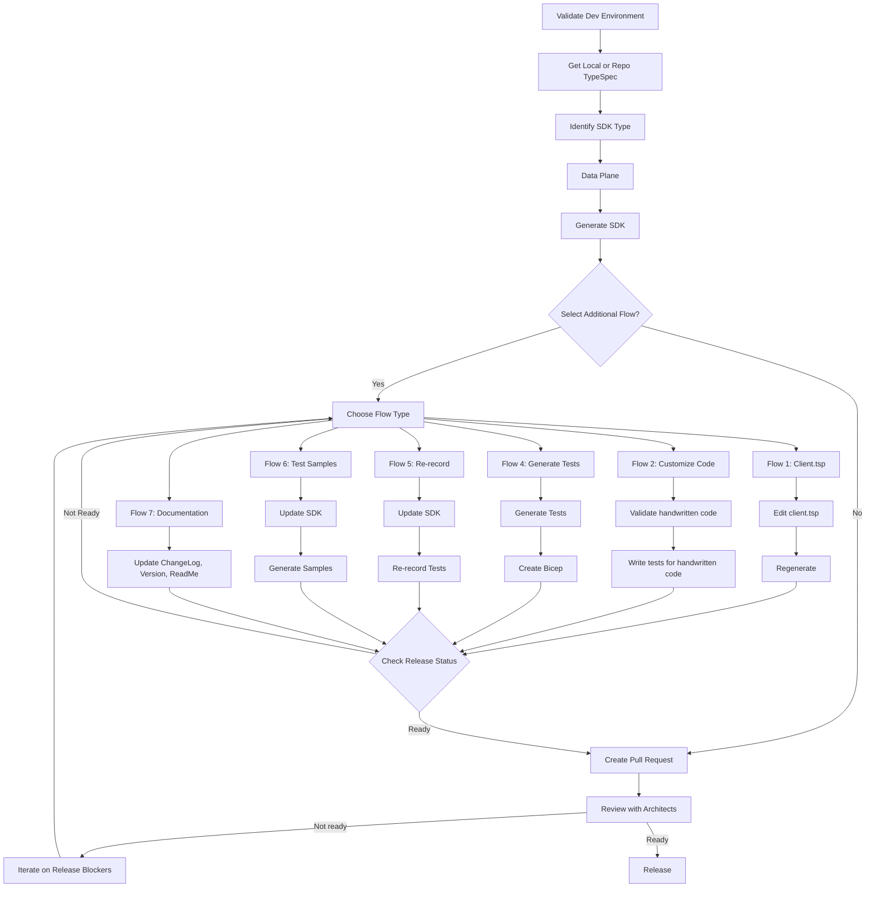

# Azure SDK for Python - Complete TypeSpec Generation Workflow

This comprehensive guide combines the interactive flow system with the complete TypeSpec SDK generation workflow for the azure-sdk-for-python repository.

## 🚀 Getting Started - Context Assessment

**PHASE 1: Determine your starting point**

Tell me about your project:
- TypeSpec project location (local path or commit hash)
- Package name and service type (Data Plane/Management)
- Current development stage (new generation, update, customization)

**I'll assess your situation and guide you through the optimal workflow.**

## ⚡ COMPLETE TYPESPEC WORKFLOW - 8 PHASES

**ESTIMATED TOTAL TIME: 10-15 minutes**
- SDK Generation: 5-6 minutes
- Static Validation: 3-5 minutes  
- Documentation & Commit: 2-4 minutes

**NOTE:** Steps are conditionally applied based on your package's readiness status. I'll help you determine which steps are needed.

### **PHASE 1: CONTEXT ASSESSMENT & PREREQUISITES**

**Action:** I'll determine your TypeSpec project setup
```
IF TypeSpec project paths exist in context:
    USE local paths to generate SDK from tspconfig.yaml
ELSE:
    ASK for tspconfig.yaml file path or commit hash
```

**Required Conditions I'll verify:**
1. GitHub CLI authenticated: `gh auth login`
2. User on feature branch (NOT main)
3. Dependencies installed: node, python, tox

### **PHASE 2: ENVIRONMENT VERIFICATION** 
*Check package readiness status before proceeding*

I'll run environment validation and install missing dependencies using MCP tools.

### **PHASE 3: SDK GENERATION**
*Check package readiness status before proceeding*

**⏱️ TIME EXPECTATION: 5-6 minutes**

I'll use azure-sdk-python-mcp generation tools:
- `init` for new packages
- `init_local` for local TypeSpec
- `update` for existing packages with version updates

### **PHASE 4: ITERATIVE FLOW SELECTION**

After initial generation, I'll guide you through additional flows as needed:

## 📋 Available Iterative Flows

### **Flow 1: TypeSpec Client Customization (client.tsp)**
**When to use:** TypeSpec-level customizations for data plane SDKs
**Triggers:** "customize TypeSpec", "edit client.tsp", "TypeSpec changes"

**Process:**
1. Edit `client.tsp` file for TypeSpec customizations
2. Regenerate SDK using tsp-client
3. Validate generated output
4. Return to flow selection

**Critical Rules:**
- Use commit hash (NOT branch name) for tspconfig.yaml URLs
- Let commands auto-create directories
- Don't grab commit hash for local repos

### **Flow 2: Python Patch File Approach (_patch.py)**
**When to use:** Python-specific modifications, custom methods, overrides
**Triggers:** "customize Python code", "add methods", "_patch.py", "handwritten code"

**Process:**
1. Validate handwritten code in `_patch.py`
2. Write comprehensive tests for custom code
3. Ensure compatibility with generated code
4. Return to flow selection

### **Flow 4: Generate & Record Tests**
**When to use:** Setting up complete test infrastructure with recordings
**Triggers:** "test generation", "create tests", "test infrastructure", "Bicep"

**Process:**
1. Generate test templates
2. Create Bicep infrastructure files if needed
3. Set up test recordings and environment variables
4. Run and validate test suites
5. Return to flow selection

### **Flow 5: Update & Re-record Tests**
**When to use:** Refreshing tests after SDK updates
**Triggers:** "update tests", "re-record", "test refresh"

**Process:**
1. Update SDK to latest version
2. Clean old recordings and re-run recording process
3. Validate new recordings
4. Return to flow selection

### **Flow 6: Update & Test Samples**
**When to use:** Ensuring samples work with SDK updates
**Triggers:** "sample updates", "test samples", "sample validation"

**Process:**
1. Update SDK dependencies in samples
2. Generate and test sample execution
3. Update documentation
4. Return to flow selection

### **Flow 7: Documentation & Release Preparation**
**When to use:** Preparing for release, updating documentation
**Triggers:** "changelog", "documentation", "release prep", "version update"

**Process:**
1. Update CHANGELOG.md with today's date
2. Verify/update package version in `_version.py`
3. Update README.md and generate API docs
4. Return to flow selection

## **PHASE 5: STATIC VALIDATION (SEQUENTIAL)**
*Check package readiness status before proceeding*

**⏱️ TIME EXPECTATION: 3-5 minutes per validation step**

I'll run each validation step when requested, fixing issues before proceeding:

```bash
# Sequential validation steps
tox -e pylint -c [path to tox.ini] --root .
tox -e mypy -c [path to tox.ini] --root .
tox -e pyright -c [path to tox.ini] --root .
tox -e verifytypes -c [path to tox.ini] --root .
tox -e sphinx -c [path to tox.ini] --root .
tox -e mindependency -c [path to tox.ini] --root .
tox -e bandit -c [path to tox.ini] --root .
tox -e black -c [path to tox.ini] --root .
tox -e samples -c [path to tox.ini] --root .
tox -e breaking -c [path to tox.ini] --root .
```

**Requirements:**
- Summary provided after each step
- Fix issues before proceeding to next validation
- Only edit files with validation errors/warnings

## **PHASE 6: COMMIT AND PUSH**

I'll help you:
1. Show changed files (excluding .github, .vscode)
2. Commit and push changes upon confirmation
3. Handle authentication if needed

## **PHASE 7: PULL REQUEST MANAGEMENT**

I'll:
1. Check for existing PR on current branch
2. Create new PR in DRAFT mode if none exists
3. Display PR summary with status and checks
4. Provide action items

## **PHASE 8: RELEASE READINESS & HANDOFF**

Final actions:
1. Run `/check-package-readiness` for python language
2. Return PR URL for review
3. Guide you to use azure-rest-api-specs agent for next steps

---

## 🎯 Flow Selection Decision Tree

**Tell me what you want to accomplish:**

- **"Generate new SDK from TypeSpec"** → Complete Workflow (Phases 1-8)
- **"Add custom method to client"** → Flow 2 (_patch.py)
- **"Modify TypeSpec definition"** → Flow 1 (client.tsp)
- **"Set up test infrastructure"** → Flow 4 (Generate Tests)
- **"Tests failing after update"** → Flow 5 (Re-record)
- **"Update samples"** → Flow 6 (Sample Updates)
- **"Prepare for release"** → Flow 7 (Documentation)
- **"Check release status"** → Phase 8 (Release Readiness)

## 🔄 Workflow Flowchart



## 🔧 Environment Setup & Prerequisites

I'll help you validate and set up your development environment:

```bash
# Install SDK tools
pip install -e tools/azure-sdk-tools

# Install TypeSpec tools (if working with TypeSpec)
npm install -g @azure-tools/typespec-client-generator-cli

# Set up development environment
python -m venv .venv
source .venv/bin/activate  # Linux/macOS
# .venv\Scripts\activate   # Windows
pip install -r dev_requirements.txt

# Authenticate GitHub CLI
gh auth login
```

## 📁 Repository Structure Navigation

```
sdk/
├── [service]/
│   ├── [package-name]/
│   │   ├── azure/[service]/[package]/
│   │   │   ├── _client.py (generated)
│   │   │   ├── _patch.py (handwritten)
│   │   │   └── ...
│   │   ├── tests/
│   │   ├── samples/
│   │   ├── tsp-location.yaml (TypeSpec config)
│   │   └── client.tsp (TypeSpec customizations)
```

## 🚨 Critical Rules & Best Practices

**Generated Code Protection:**
- ✅ Use `_patch.py` for customizations
- ❌ Never edit generated files directly

**TypeSpec Operations:**
- ✅ Use commit hash for tspconfig.yaml URLs
- ✅ Let commands auto-create directories
- ❌ Don't grab commit hash for local repos

**Development Flow:**
- ✅ Work on feature branch (NOT main)
- ✅ Sequential validation (fix each step before proceeding)
- ✅ Run package readiness checks

**Command Transparency:**
- ✅ Always show commands before execution for user visibility
- ✅ Explain the purpose of each command before running
- ✅ Use format: "Command I'm about to run: `<command>` - Purpose: <explanation>"

## � Getting Started

**Ready to begin? Tell me:**
1. Your TypeSpec project location (local path or service name)
2. What you want to accomplish
3. Your current development stage

**Example requests:**
- "Generate new SDK for azure-ai-projects service"
- "Update existing package to latest TypeSpec version"
- "Add custom authentication method to my client"
- "Fix failing tests after API update"
- "Prepare my package for release"

I'll analyze your needs and guide you through the optimal workflow with specific commands, time expectations, and validation steps.