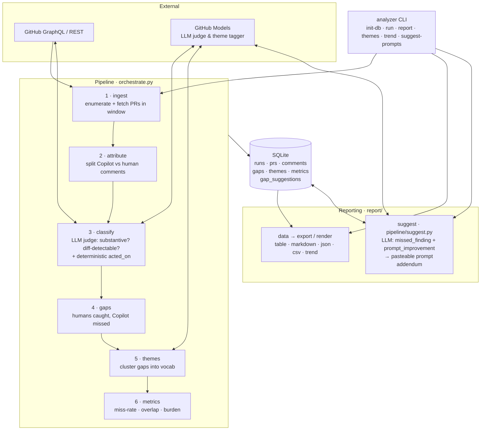

# Copilot Code-Review Effectiveness Analyzer

Periodically mines recently closed/merged PRs, separates Copilot-reviewer comments
from human comments, uses an LLM judge to find substantive, diff-detectable issues
humans caught but Copilot missed, clusters them into themes, and tracks
miss-rate / precision metrics over time.

See [`DESIGN.md`](DESIGN.md) for architecture and [`IMPLEMENTATION_PLAN.md`](IMPLEMENTATION_PLAN.md)
for the phased build plan.

## Architecture



| Stage | Module | Responsibility |
| --- | --- | --- |
| Ingest | `pipeline/ingest.py` + `github/` | Enumerate PRs in a time window and fetch normalized PR data (resilient to per-PR fetch failures). |
| Attribute | `pipeline/attribute.py` | Classify each comment as Copilot / human / other bot; detect overlap. |
| Judge | `pipeline/classify.py` + `llm/` | LLM judges whether each human comment is substantive & diff-detectable; deterministic `acted_on` linkage. |
| Gaps | `pipeline/gaps.py` | A *gap* = substantive, diff-detectable issue a human raised that Copilot missed. |
| Themes | `pipeline/themes.py` + `llm/` | LLM clusters gaps into a controlled vocabulary for trending. |
| Metrics | `pipeline/metrics.py` | Per-run miss-rate, overlap rate, acted-on rate, human burden. |
| Suggest | `pipeline/suggest.py` + `llm/suggest.py` | On-demand: turn each gap into a PR-specific `missed_finding` + generalizable `prompt_improvement`, synthesized into a pasteable prompt addendum. |
| Report | `report/` | Read-only views: table / markdown / json / csv + multi-run trend; surfaces suggestions. |

All state lives in a single SQLite file (`analyzer.db`) — the seam between the write
pipeline and read-only reporting; every model call funnels through `llm/client.py` and
every GitHub call through `github/client.py`.

## Getting started

```bash
# 1. Install (one-time) and authenticate
pip install -e .
export GITHUB_TOKEN=$(gh auth token)

# 2. Analyze the last 7 days of merged PRs (real LLM judge + theme tagging)
analyzer run --repo Azure/azure-sdk-for-python --since 7d --use-llm

# 3. Read the report
analyzer report
```

That's it. Common follow-ups:

```bash
# Bigger / different window, capped sample
analyzer run --repo Azure/azure-sdk-for-python --since 14d --max-prs 40 --use-llm

# Report in other formats (table is the default)
analyzer report --format markdown      # paste into an issue
analyzer report --format json          # machine-readable

# What did humans catch that Copilot missed? (recurring themes)
analyzer themes --min-count 2

# Turn those misses into prompt fixes you can paste into your Copilot review prompt
analyzer suggest-prompts

# Track a metric across past runs
analyzer trend --metric miss_rate

# Peek at PRs without writing anything (no LLM, no DB changes)
analyzer run --repo Azure/azure-sdk-for-python --since 7d --dry-run
```

All commands default to `--db analyzer.db` and `--run latest`; pass `--db <path>` to use
a separate database. Run `analyzer <command> --help` for every option.

## Install

```bash
pip install -e ".[dev]"
```

## Usage

```bash
analyzer init-db --db analyzer.db
analyzer run --repo owner/name --since 7d [--state merged] [--max-prs 50] [--dry-run] [--use-llm]
analyzer report [--run latest] [--format table|markdown|json]
analyzer themes [--run latest] [--min-count 2]
analyzer suggest-prompts [--run latest]
analyzer trend --metric miss_rate
```

`--use-llm` enables the real LLM judge and theme tagging via [GitHub Models]; without
it a stub judge marks every human comment substantive (useful for plumbing/tests).

### Turning misses into prompt improvements (`suggest-prompts`)

`analyzer suggest-prompts` asks the LLM to inspect every *gap* (a substantive,
diff-detectable issue a human caught that the Copilot reviewer missed) and, for each,
store two things in the `gap_suggestions` table:

- **`missed_finding`** — a PR-specific description of exactly what Copilot should have
  flagged at that line.
- **`prompt_improvement`** — a generalizable review rule that would catch this class of
  issue in the future.

It then prints a paste-ready **"Suggested review-prompt additions"** block (rules grouped
by theme, deduplicated, and annotated with the PRs that motivated them) that you can drop
straight into your Copilot review prompt. The same per-gap findings and addendum are also
surfaced by `analyzer report` (table / markdown / json), so any report view shows what was
missed and how to fix the prompt.

## Configuration

Copy `config.yaml` and adjust `repos`, `copilot_logins`, `model`, sampling, and the
theme `vocab`. Secrets come only from the environment (`GH_TOKEN` / `GITHUB_TOKEN`).

## Scheduled analysis (`.github/workflows/analyze.yml`)

A weekly workflow (plus `workflow_dispatch`) runs `analyzer run --use-llm`, renders a
markdown report, and opens/updates a single labelled summary issue (idempotent — it
edits the existing open issue rather than spamming new ones). Proposed prompt changes
are surfaced in the issue for **human approval only**; nothing edits the prompts
automatically.

**DB persistence strategy:** the SQLite DB is committed to a dedicated orphan branch
`analyzer-data` so weekly trends accumulate durably across runs, *and* uploaded as a
per-run artifact for audit. (A cache was rejected because eviction would silently break
long-term trend continuity.)

**Tokens:** `GITHUB_TOKEN` covers repo reads, issue writes, and the data-branch push.
Set the optional `ANALYZER_PAT` secret for cross-repo reads or higher GitHub Models
limits — it is preferred when present. Tokens are never echoed (no `set -x`).

[GitHub Models]: https://models.inference.ai.azure.com
