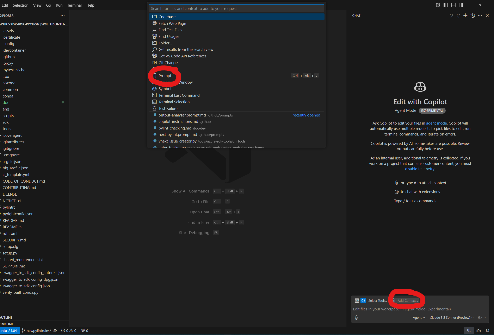
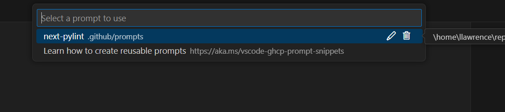
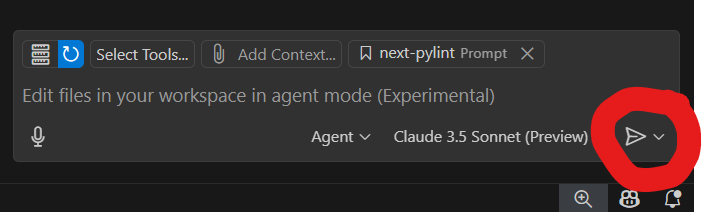

# AI Prompt Workflow

1. In Copilot **Agent** mode, click on `Add Context` and select `prompt` from the dropdown.

*Note*: Agent mode is currently only available in [VSCode Insiders](https://code.visualstudio.com/insiders/).

2. Select `next-pylint.prompt.md` or associated prompt for your task.

3. Send the prompt to the agent. Follow the instructions provided by the agent to complete the task.

