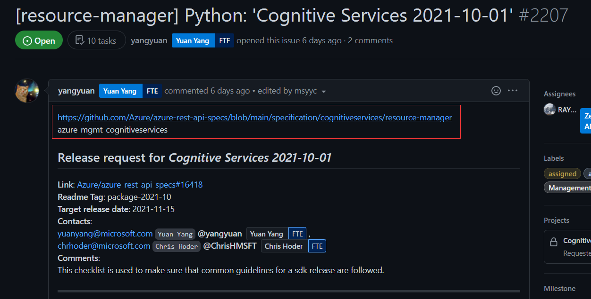
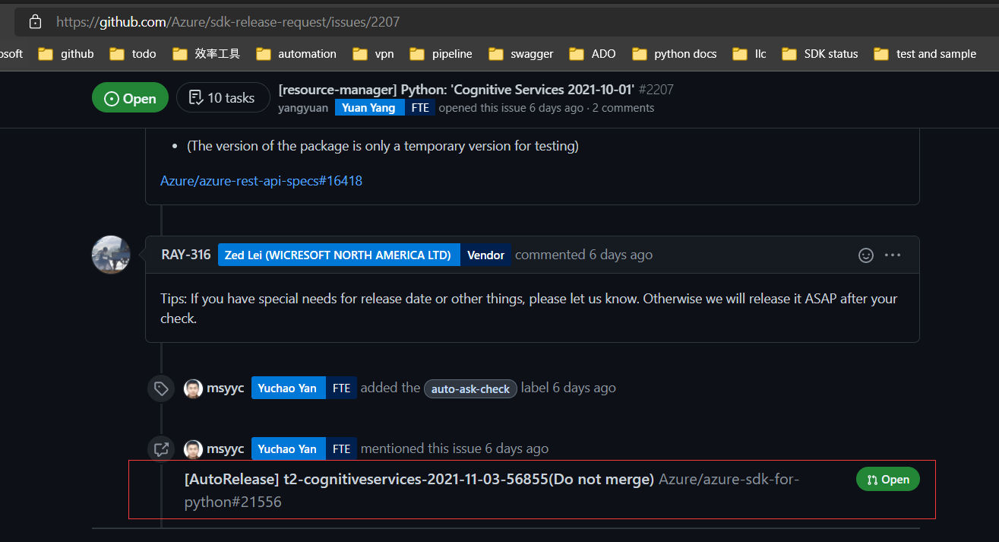
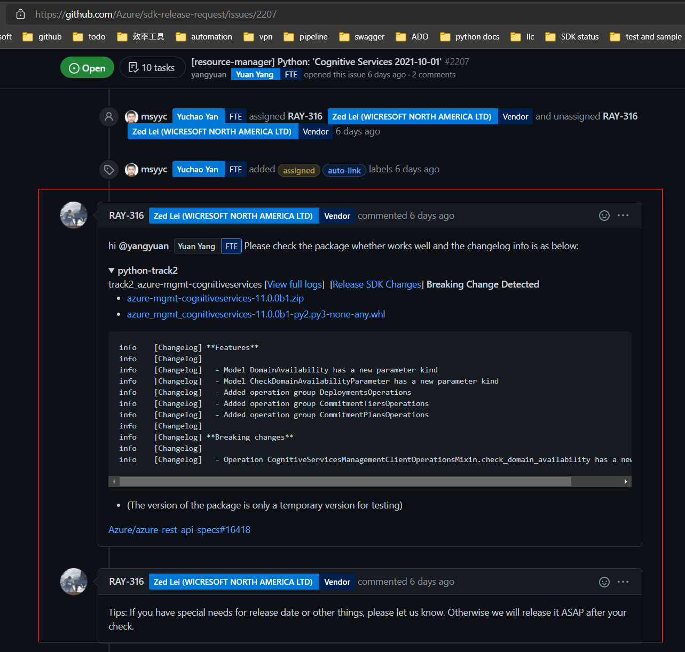
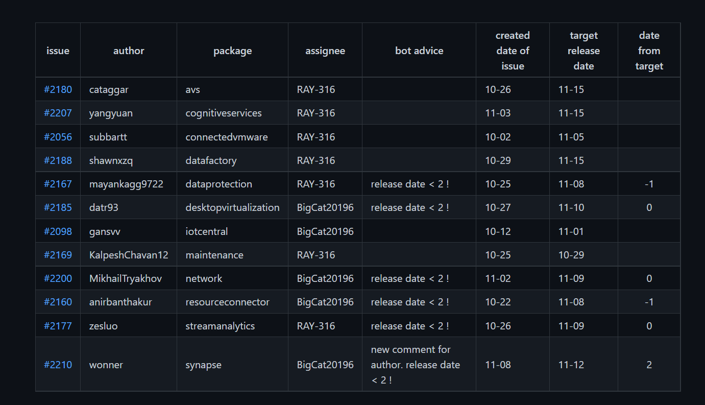
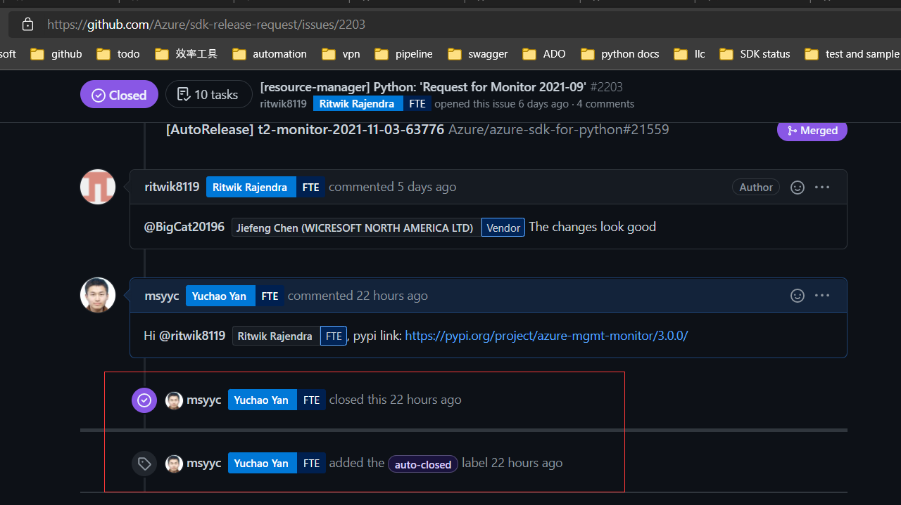
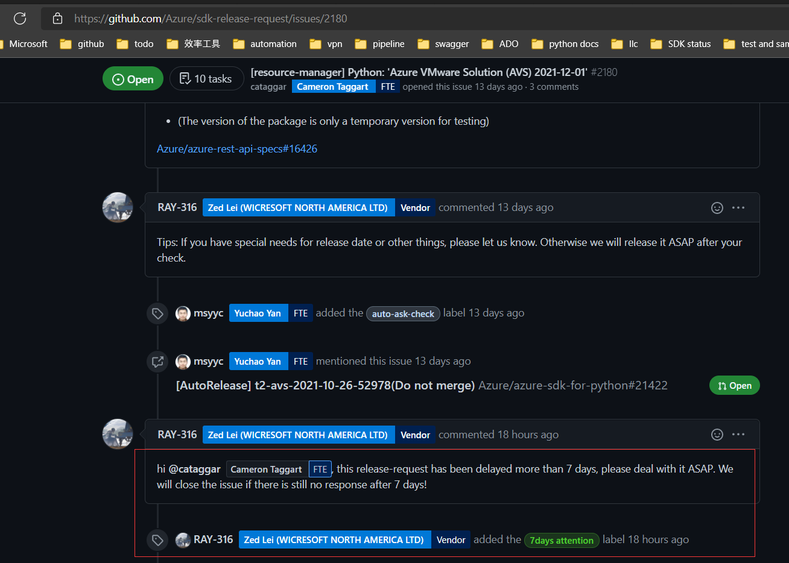

# Background

`Mgmt SDK` is generated with `autorest` according to [swagger definition](https://github.com/Azure/azure-rest-api-specs). When new content is merged into the [main repo](https://github.com/Azure/azure-rest-api-specs), they could ask for official SDK release by making release request issue in [website](). Then SDK team will receive the issue in [issue repo]() and release SDK.

# Auto-Release Project 

The project aims to help release request issue automatically for all languages including Python, Java, Javascript and Go.

By summarizing the process of SDK release, the project shall have the following functions:


1. Auto Parse 

   It will parse the issue and judge which SDK package and what content customers want to release
2. Auto Trigger

   After `Auto Parse`, project could trigger specific pipeline to generate package to test and PR to merge for SDK team.
3. Auto Reply

   Usually, SDK team will prepare private package for customers to check in case of potential problems
4. Auto Assignee

   When SDK teams have multi members to handle issues, project could assign to them averagely
5. Auto Close

   When SDK is released, project will close the issue with package link.
6. Auto Summary

   Project will handle all open issues and output tables for SDK team to query
7. Auto Bot

   Project will give corresponding advice for SDK team about what to do next or error that may happen
8. Auto Ping

   When issue owner does not respond necessary comment, project could ping owner or close issue.

The project will provide general workflow, at the same time, it permits SDK team to develop customized function.

# Code structure

The project will be deployed in ADO pipeline and run regularly to handle `open` issues. And it could also be triggered manually.

## main

It is the entrance to handle issues of different languages

```python
languages = {'Python': Python_process, 
             'Java': Java_process,
             'Js': Js_process, 
             'Go': Go_process}
def main():
    issues = collect_all_open_issues()
    for language in langauages:
        language_issues = select_language_issues(issues, language)
        languages[language](language_issues)
```


## General Class

It is the general class to provide common flow of handling issues.

```python
class IssueProcess():
    ...
    
    def run():
        self.auto_assign()
        self.auto_parse()
        self.auto_reply()
        self.auto_trigger()
        self.auto_bot()
        self.auto_close()

class General():
    ...
    
    def run():
    	for item in self.issues:
			issue = IssueProcess(item)
            issue.run()
            self.handled_issues.append(issue)
        self.auto_summary()
    
        
def general_process(issues):
    instance = General(issues, token)
    instance.run()
        
```

# Deploy

The code will be stored in [SDK repo](https://github.com/Azure/azure-sdk-for-python) and deployed in ADO pipeline. It will run regularly to handle all the open release request issues for all languages and output summary info in [file-storage]() like [python release status](). Of course, It could be also triggered manually.

# Final Effect

1. Auto Parse

   

2. Auto Trigger

   

3. Auto Reply

   

4. Auto Summary

   

5. Auto Close

   

6. Auto Ping

   

# Plan

| step | annotation                                                   | cost(days) |
| :--- | ------------------------------------------------------------ | ---------- |
| 1    | develop `Auto Parse` and `Auto Summary` for all languages    | 7          |
| 2    | develop general flow                                         | 14         |
| 3    | develop customized flow according to priority for Python     | 5          |
| 4    | develop customized flow according to priority for Go, Js, Java | 15         |


 


