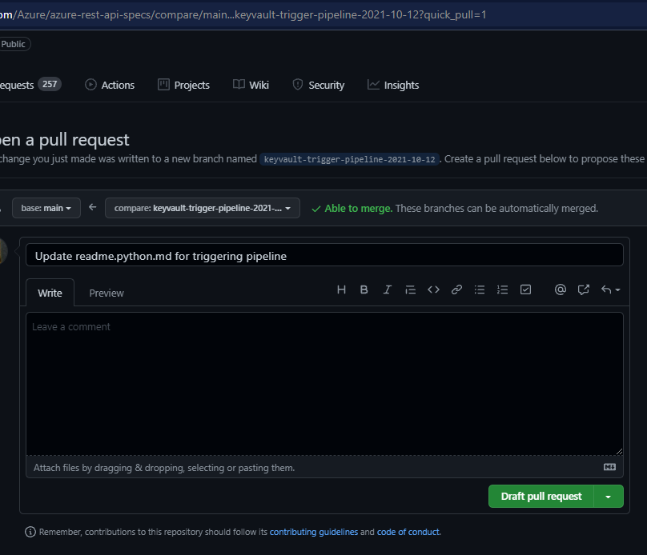
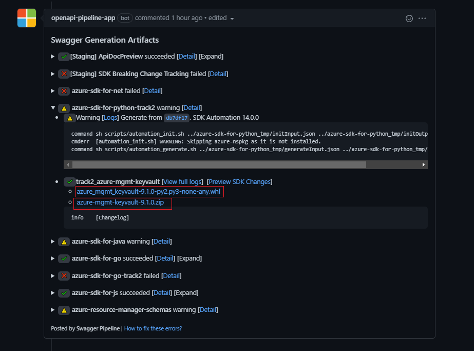

# Get the Unreleased Package

This guide is to help Python SDK users to get unreleased package.

(1) Submit a draft PR to https://github.com/Azure/azure-rest-api-specs.

(Any modification is OK, because only the pipeline needs to be triggered)

(2) Wait until swagger generation artifacts is complete.

The following figure shows the wheel and zip of the package.Click to download them.

