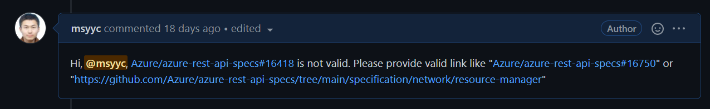

# Background(How to publish official SDK)

`Mgmt SDK` is generated with `autorest` according to [swagger definition](https://github.com/Azure/azure-rest-api-specs). So at first, service team needs to make PR to [swagger repo](https://github.com/Azure/azure-rest-api-specs), then swagger team review and merge the PR. After that, service team asks for official SDK in [Portal](https://portal.azure-devex-tools.com/tools/request-api-release). Finally SDK team will receive the issue in [issue repo](https://github.com/Azure/sdk-release-request/issues?q=is%3Aopen+is%3Aissue+label%3AManagementPlane) and release SDK. Here is the flow:


## Pain Point

For every release, there are duplicated but necessary manual work. While there are hundreds of release request for each language, which means a huge load. With the development of Azure, there will be more and more requirements for Azure SDK, which means the load will become larger and larger. If we don't take steps in advance, it may delay our release in the future and influence usage experience of customers. 

# Release Helper

## Overview

`Release Helper` aims to resolve [Pain Point](#Pain Point) for all languages including Python, Java, Javascript, Go, etc.

## Target

1. Help SDK team to reduce manual work
2. Help SDK team to achieve `One-hour shippable`

## Project Structure

`Release Helper` support multiple languages which may have difference about release flow. So it shall define common flow for languages to reference. The common flow consists of independent modules, which allow languages to define their customized module. It will be much clear to show some code here:

### main

It is the entrance to handle release request issues of different languages

```python
languages = {'Python': Python_process, 
             'Java': Java_process,
             'Js': Js_process, 
             'Go': Go_process}
def main():
    issues = collect_all_open_issues()
    for language in langauages:
        language_issues = select_language_issues(issues, language)
        languages[language](language_issues)
```


### Common Class

It is the common class to provide common flow of handling issues.

```python
class CommonIssueProcess:
    ...
    
    def run():
        self.module1()
        self.module2()
        ...

class Common:
    ...
    
    def run():
    	for item in self.issues:
            issue_process = CommonIssueProcess(item)
            issue_process.run()
        
def Common_process(issues):
    instance = Common(issues, token)
    instance.run()
        
```


### JavaClass

It is the example of customized class for language to define customized module.

```python
class JavaIssueProcess(CommonIssueProcess):
    ...
    
    # customized module
    def module1():
        # customized code
        ...

class Java(Common):
    ...
    
    def run():
    	for item in self.issues:
            issue_process = JavaIssueProcess(item)
            issue_process.run()
        
def java_process(issues):
    instance = Java(issues, token)
    instance.run()
        
```


## Module Design

Each module is independent function which could cover some manual work for SDK team. After analysis of release flow, we extract some common modules:

### Parse Module

its function is:

1. Parse link in issue to extract valid swagger definition link
2. Notice customers automatically to change link if it is invalid

Here is the example:

(original issue)


(after `Parse` if `Link` is valid)

(after `Parse` if `Link` is invalid)

### Generation Module

This module could generate SDK code and create PR automatically. Example: 


### Signoff Module

This module will generate private package and CHANGELOG for customers to check in case of potential problems. Example:


### Report Module

This module could help summarize all the open issues and provide moderate suggestion. With this module, SDK team could concentrate on some issues instead of checking every issue.


### Auto-Close Module

Once the package is released, the module will notice the customers with public package link and close the issue. Example:


### Clean module

This module can remind customers to answer some necessary questions and close inactive open issues


 ## Deploy

The code will be stored in [SDK repo](https://github.com/Azure/azure-sdk-for-python) and deployed in ADO pipeline. It will run regularly to handle all the open release request issues for all languages and output summary info in [file-storage](https://github.com/msyyc/file-storage/tree/release-issue-status) like [python release status](https://github.com/msyyc/file-storage/blob/release-issue-status/release_python_status.md). Of course, It could be also triggered manually.


