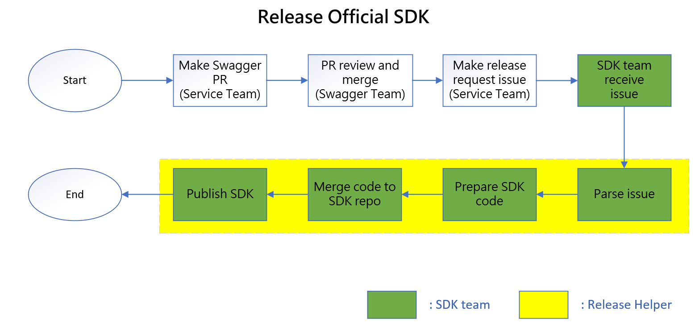
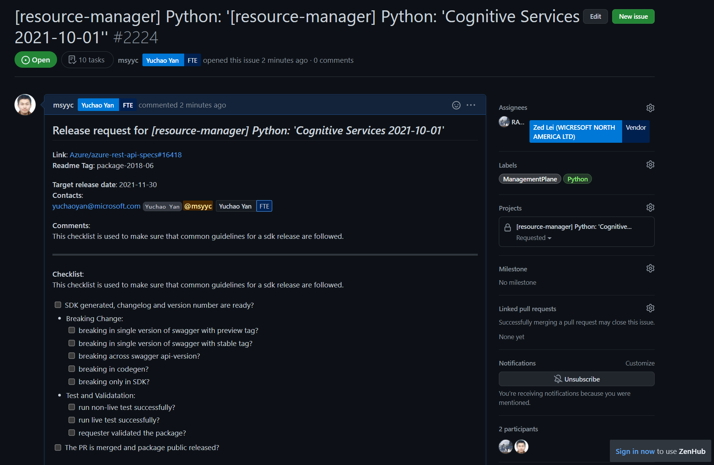
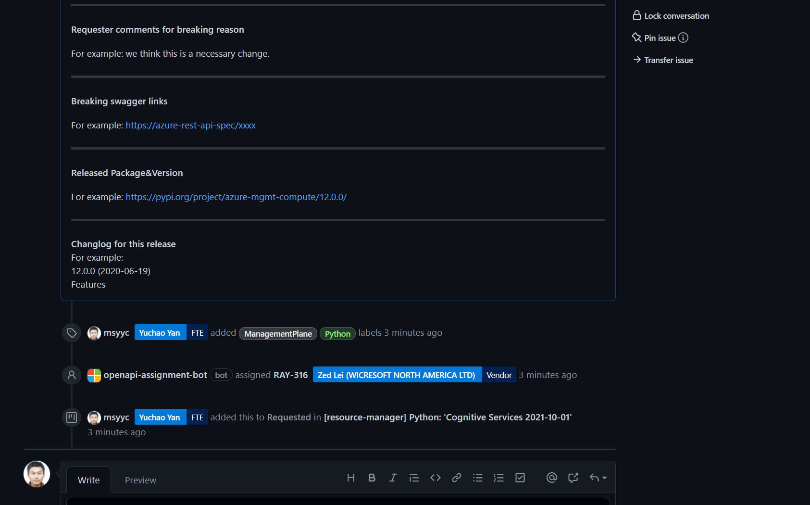
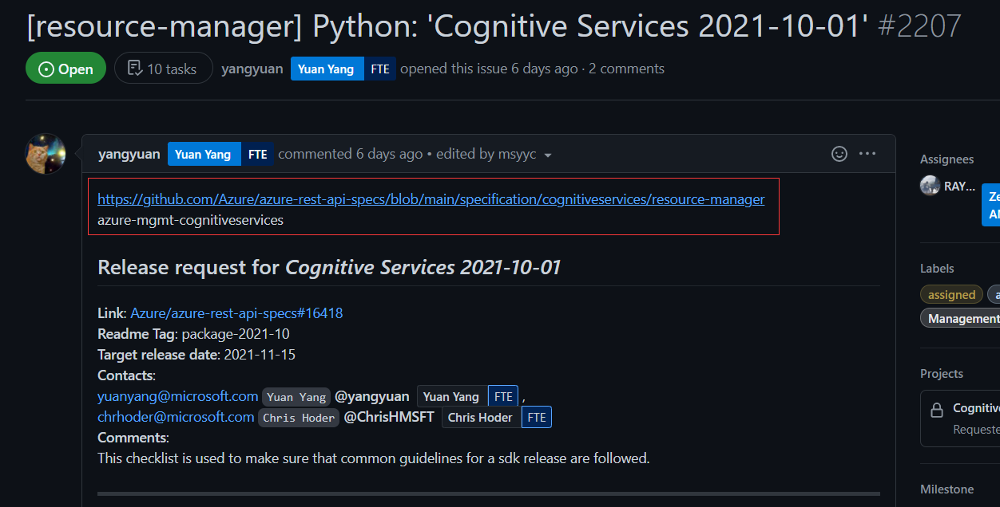
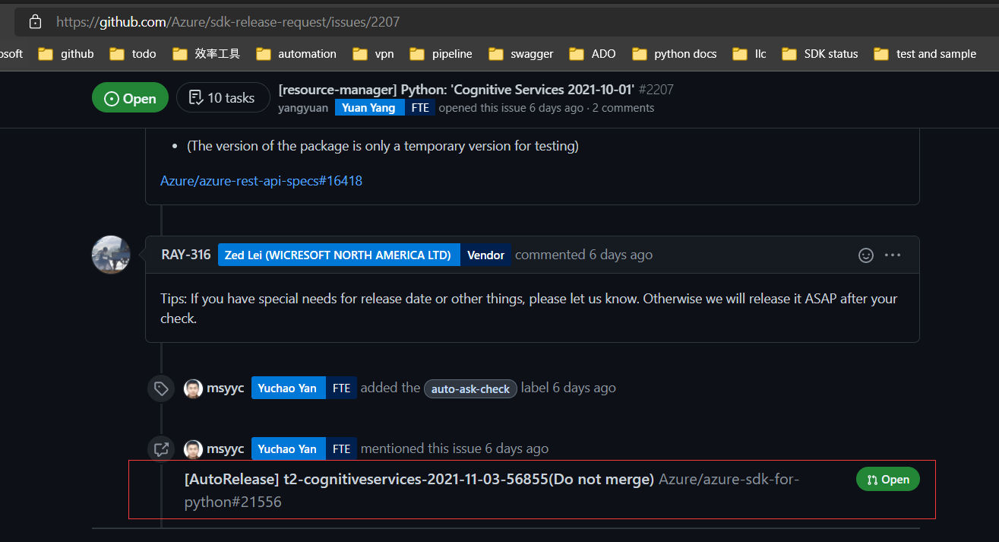
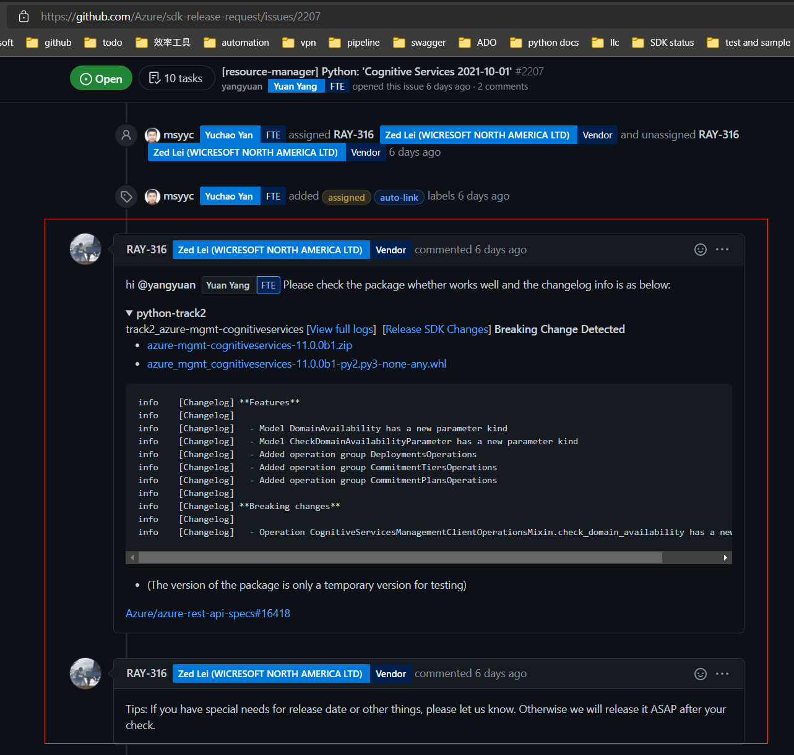
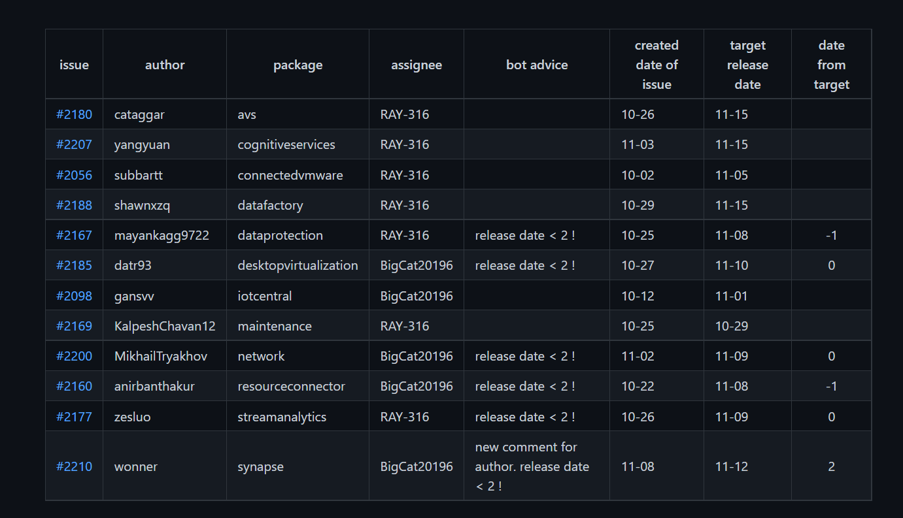
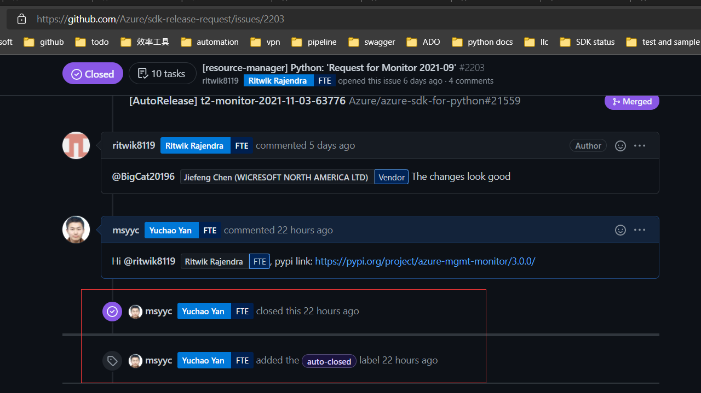
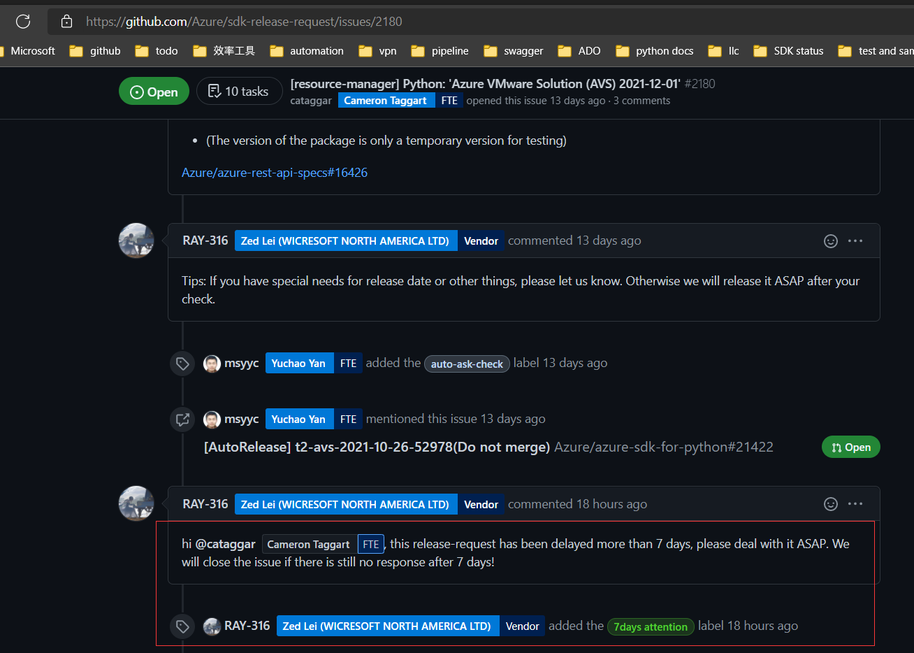

# Background(How to publish official SDK)

`Mgmt SDK` is generated with `autorest` according to [swagger definition](https://github.com/Azure/azure-rest-api-specs). So at first, service team needs to make PR to [swagger repo](https://github.com/Azure/azure-rest-api-specs), then swagger team review and merge the PR. After that, service team asks for official SDK in [Portal](https://portal.azure-devex-tools.com/tools/request-api-release). Finally SDK team will receive the issue in [issue repo](https://github.com/Azure/sdk-release-request/issues?q=is%3Aopen+is%3Aissue+label%3AManagementPlane) and release SDK. Here is the flow:



# Release Helper

The project aims to help SDK team release request issue automatically for all languages including Python, Java, Javascript, Go, etc.

By summarizing the process of SDK release, the project shall have the following functions:

1. Auto Parse 

   It will parse the issue and judge which SDK package and what content customers want to release
2. Auto Trigger

   After `Auto Parse`, project could trigger specific pipeline to generate package to test and PR to merge for SDK team.
3. Auto Reply

   Usually, SDK team will prepare private package for customers to check in case of potential problems
4. Auto Assignee

   When SDK teams have multi members to handle issues, project could assign to them averagely
5. Auto Close

   When SDK is released, project will close the issue with released package link.
6. Auto Summary

   Project will handle all open issues and output tables for SDK team to query
7. Auto Bot

   Project will provide corresponding advice for SDK team about what to do next or error that may happen
8. Auto Ping

   When issue author does not respond necessary comment, project could ping author or close it.

The project will provide general workflow, at the same time, it permits SDK team to develop customized function.

# Code structure

The project will be deployed in ADO pipeline and run regularly to handle `open` issues. And it could also be triggered manually.

## main

It is the entrance to handle issues of different languages

```python
languages = {'Python': Python_process, 
             'Java': Java_process,
             'Js': Js_process, 
             'Go': Go_process}
def main():
    issues = collect_all_open_issues()
    for language in langauages:
        language_issues = select_language_issues(issues, language)
        languages[language](language_issues)
```


## General Class

It is the general class to provide common flow of handling issues.

```python
class IssueProcess:
    ...
    
    def run():
        self.auto_assign()
        self.auto_parse()
        self.auto_reply()
        self.auto_trigger()
        self.auto_bot()
        self.auto_close()

class General:
    ...
    
    def run():
    	for item in self.issues:
            issue = IssueProcess(item)
            issue.run()
            self.handled_issues.append(issue)
        self.auto_summary()
    
        
def general_process(issues):
    instance = General(issues, token)
    instance.run()
        
```

# Deploy

The code will be stored in [SDK repo](https://github.com/Azure/azure-sdk-for-python) and deployed in ADO pipeline. It will run regularly to handle all the open release request issues for all languages and output summary info in [file-storage](https://github.com/msyyc/file-storage/tree/release-issue-status) like [python release status](https://github.com/msyyc/file-storage/blob/release-issue-status/release_python_status.md). Of course, It could be also triggered manually.

# Final Effect

Here is origin issue:





1. Auto Parse

   After `Auto Parse`, `Release Helper` extracts swagger link to indicate which service to publish.

   

2. Auto Trigger

   After `Auto Trigger`, `Release Helper` prepares SDK PR which contains corresponding content asked by service team.

   

3. Auto Reply

   After `Auto Reply`, `Release Helper` prepares private package and CHANGELOG for service team to check in case of potential problems.

   

4. Auto Summary

   After `Auto Summary`, `Release Helper` could help summarize all the issues and provide moderate suggestion.

   

5. Auto Close

   After `Auto Close`, `Release Helper` can help close the issue with released link.

   

6. Auto Ping

   `Auto Ping` will remind author to reply for some necessary questions.

   

# Vision

In the future, especially after the large-scale adoption of LLC, there will be considerable efficiency promotion for data-plan package. At that time, data-plan may have the same release flow with mgmt-plan and `Release Helper` could also work for data-plan. So the project will be designed to be extensible and flexible enough to support possible evolution.

# Plan

| step | annotation                                                   | cost(days) |
| :--- | ------------------------------------------------------------ | ---------- |
| 1    | develop `Auto Parse` for all languages                       | 7          |
| 2    | develop `Auto Summary` for all languages                     | 7          |
| 2    | develop general flow                                         | 21         |
| 3    | develop customized flow for Python                           | 5          |
| 4    | develop customized flow according to priority for Go, Js, Java | 15         |
| 5    | evolution(new feature, etc)                                  | ...        |


 


