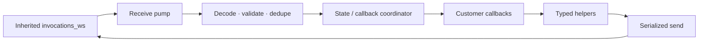

# AgentServer Typed Voice Live Bridge Submodule — Design

**Status:** Full Python SDK wire surface implemented — pending API review, bridge interoperability, and external conformance gates

**Date:** 2026-07-27

**Target:** Public Preview, 2026-08-31

**Package:** `azure-ai-agentserver-invocations`

**Namespace:** `azure.ai.agentserver.invocations.voice`

**Wire protocol:** Voice Live Bridge Protocol, exact version `1.0`

## Scope and authoritative inputs

This document designs only the Python SDK that runs inside a hosted text-agent container: its public API, wire adaptation, per-connection runtime, observability, packaging, and tests.

Authoritative inputs are:

- wire contract: `foundrysdk_specs/specs/agents/hosted_agents/voice_live_bridge/spec.md`;
- raw transport: `foundrysdk_specs/specs/agents/hosted_agents/container-spec/docs/invocations_ws-protocol-spec.md`;
- bridge lifecycle relevant to SDK cleanup: `voice-agent-orchestrator/docs/hosted_text_agent_and_voice_live_bridge.md`;
- session-resource boundary: `foundrysdk_specs/specs/agents/hosted_agents/session_lifecycle_management/spec.md`.

This document does not design Voice Live media processing, the bridge implementation, service routing, reconnect backoff, handoff routing, or Hosted Agent session CRUD. The wire specification remains authoritative for message fields and state. Voice Live owns Bridge selection and exact-version validation during call initialization; the SDK independently validates `session.start.protocol_version` as a runtime defense against stale or misrouted connections.

Current-source statements refer to the `azure-sdk-for-python` PR branch. Voice is a new, unreleased Invocations submodule with no prior public wire or Python API compatibility contract.

## 1. Decisions

| Area | Decision |
|---|---|
| Distribution | Preview submodule in `azure-ai-agentserver-invocations`; it shares the parent package version and release artifact. |
| Host | `VoiceAgentServerHost`, derived from `InvocationAgentServerHost`. |
| Route | Reuse `/invocations_ws`; no second route or required subprotocol. |
| Dependencies | Parent Invocations host and AgentServer Core only; no media dependency. |
| Public surface | Frozen inbound models, callbacks, response/item helpers, and session controls. |
| Wire models | Internal; customer code cannot construct outbound frames. |
| Version | Exact `1.0`; no negotiation or fallback to another contract. |
| Runtime | One receive pump, serialized send path, and ordered callback coordinator per connection. |
| Reconnect | Fresh runtime per WebSocket; no SDK redial or replay. |

This is a new protocol and public library surface. Protocol version `1.0` directly adopts the following contract:

| Concern | Selected `1.0` contract |
|---|---|
| Completed input turn | `user.message{item_id,content[]}` |
| Response identity | Bridge allocates `in_`; SDK allocates `r_` and emits `response.created` |
| Explicit no-reply | `response.none{in_reply_to:[...]}` |
| Output ordering | No `output_index`; wire order is item order |
| Application readiness | Envelope-only `session.ready` |
| Timeout correlation | Exactly one of `response_id` or ordered `item_ids` |
| Agent-initiated speech and self-cancel | Admission and cancellation outcomes with terminal arbitration |
| Duplicate handling | Exact duplicate ignored; changed payload under the same ID rejected |

## 2. Goals and non-goals

### Goals

1. Let agent authors implement voice turns without parsing or emitting WebSocket JSON.
2. Bind output to the correct SDK-owned response and explicit input prefix.
3. Keep receiving while customer model/tool work awaits.
4. Preserve ordering and deterministic terminal outcomes.
5. Reject invalid lifecycle operations locally.
6. Make cleanup bounded, connection-scoped, and replay-free.
7. Keep SDK-owned telemetry content-free by default.

### Non-goals

- STT, TTS, VAD, audio playback, image storage, or image fetching.
- Bridge dialing, reconnect policy, routing, or media behavior.
- Hosted Agent session creation, inspection, stop, delete, or isolation-key management.
- Customer conversation-state persistence.
- A typed wrapper for arbitrary custom WebSocket protocols.
- The unversioned baseline Voice Live integration.

## 3. Submodule and host architecture

`VoiceAgentServerHost` subclasses `InvocationAgentServerHost`, installs one internal `ws_handler`, and rejects later raw-handler registration. It may retain inherited HTTP Invocations support through `invoke_handler`.

The Invocations package supports Python 3.10+, has no Voice Live/audio/protobuf dependency, and registers one `azure-ai-agentserver-invocations/<version>` server identity segment. Voice shares the parent APIView, typing, `py.typed`, README, CHANGELOG, wheel, and sdist lifecycle.



Each accepted socket owns activation context, unresolved inputs, active/recent responses, helper futures, duplicate/tombstone maps, customer tasks, locks, and queues. No mutable protocol state is shared across connections.

### 3.1 Implementation status

| Area | Implemented behavior | Status |
|---|---|---|
| Host ownership | Internal raw handler; replacement rejected. | Implemented |
| User turn | Typed ordered `user.message` content parts. | Implemented |
| Response identity | SDK-owned lazy `response.created`. | Implemented |
| Activation | Envelope-only ready plus validated rejection. | Implemented |
| Output | Streamed/non-streamed ordered items without `output_index`. | Implemented |
| Decline/timeout | `response.none` and exclusive response/input-batch timeout forms. | Implemented |
| Proactive/cancel | Typed admission/drop and cancel/barge-in outcomes. | Implemented |
| Coordination | Non-blocking receive pump and five-second bounded cleanup. | Implemented |
| Dedupe | Bounded exact-payload duplicate/tamper tracking. | Implemented |
| Immutability | Deeply read-only caller metadata and frozen event models. | Implemented |
| Observability/privacy | Same tracing behavior as raw `invocations_ws`; content-free Voice metrics and wire diagnostics. | Implemented |
| DTMF | Raw/collected events, collection request/cancel, and rejection/cancellation outcomes. | Implemented |
| Handoff | Terminal request and failed-handoff recovery turn. | Implemented |
| History mutation | Ordered create/delete callbacks and correlated success/failure results. | Implemented |
| Metrics | Activation, callback, latency, terminal, connection, protocol, and close-code instruments. | Implemented |

## 4. Implemented public API

Names remain subject to Python APIView.

```python
from azure.ai.agentserver.invocations.voice import (
    InputTextPart,
    SessionStartEvent,
    UserMessageEvent,
    VoiceAgentServerHost,
    VoiceResponse,
    VoiceSession,
)

app = VoiceAgentServerHost()


@app.on_session_start
async def on_session_start(
    session: VoiceSession,
    event: SessionStartEvent,
) -> None:
    # Reconnect startup must be idempotent.
    assert session.reconnect == event.reconnect


@app.on_user_message
async def on_user_message(
    session: VoiceSession,
    event: UserMessageEvent,
    response: VoiceResponse,
) -> None:
    text = " ".join(
        part.text for part in event.content if isinstance(part, InputTextPart)
    )
    async for token in stream_model_reply(text):
        await response.send_text_delta(token)
    await response.send_text_done()
    # Normal return emits response.done unless another terminal won.


app.run()
```

The first output operation allocates `r_`, emits `response.created{in_reply_to:[event.item_id]}`, allocates `it_`, and then emits output.

### 4.1 Core types

| Type | Purpose |
|---|---|
| `VoiceAgentServerHost` | Host and callback registration. |
| `VoiceSession` | Read-only call/connection context and session controls. |
| `VoiceResponse` | Lazy helper bound to an immutable input prefix or accepted proactive response. |
| `VoiceTextItem` | One ordered output item. |
| Event/content models | Frozen typed inbound data. |
| Outcome/error models | Proactive, cancellation, timeout, DTMF, handoff, history, and connection results. |

Nested caller data must also be immutable. `VoiceSession` is not `AgentSessionResource` and never exposes control-plane CRUD.

### 4.2 Callbacks

| Callback | Wire input | Scope |
|---|---|---|
| `on_session_start` | `session.start` | Core; optional before readiness |
| `on_user_message` | `user.message` | Core; required |
| `on_barge_in` | `barge_in` | Core |
| `on_response_timeout` | `response.timeout` | Core |
| `on_session_end` | `session.end` | Core |
| `on_user_speech_started` | `user.speech_started` | Core |
| `on_user_no_input` | `user.no_input` | Core |
| `on_dtmf_key`, `on_dtmf_collected` | `dtmf` | Core |
| `on_dtmf_collection_rejected/cancelled` | `dtmf.collect.*` | Core |
| `on_handoff_failed` | `handoff.failed` | Core |
| `on_conversation_item_create/delete` | `conversation.item.*` | Core |

`on_user_message` is the required completed-turn callback. A convenience text accessor must not discard ordered content parts. Control messages such as `response.accepted`, `response.dropped`, and `response.cancelled` resolve awaited helpers rather than requiring manual correlation.

Duplicate or non-async callback registration is a startup error. Missing `on_user_message` rejects activation.

### 4.3 Response and session helpers

`VoiceResponse` is initially unopened. Its first response-scoped operation emits `response.created` once.

- `send_text()` emits one non-streamed item.
- `send_text_delta()` / `send_text_done()` stream and complete a simple item.
- `new_text_item()` creates the next ordered item.
- `decline()` emits `response.none` without opening a response.
- `fail()` opens if necessary, then emits response-scoped `error`.
- `cancel()` emits `response.cancel` before `response.done` and awaits the winning `response.cancelled` or `barge_in` outcome.
- `collect_dtmf()` opens the response if necessary and returns the SDK-owned `dc_` identifier.
- `handoff()` opens the response if necessary and terminalizes it without `response.done`.

A streamed item ends with full concatenated text; a non-streamed item sends only item-level done. New items start only after the prior item completes. There is no `output_index`.

Normal callback return auto-emits `response.done` only after completed output and only if no terminal won. Decline, error, handoff, cancellation, timeout, barge-in, and session termination suppress it. Returning without output/decline or with an open item emits a sanitized response-scoped SDK error. The helper is sealed on callback return.

`in_reply_to` is an explicit ordered prefix. Initially, one callback receives the unresolved queue head and its helper is bound to `[event.item_id]`; the SDK never adds queued inputs that callback code did not observe. Multi-input batching requires separate APIView approval.

`VoiceSession` exposes read-only startup context, `end_call(reason, mode)`, proactive admission, and sanitized session-error reporting. A proactive response emits `response.created` without `in_reply_to` and remains unwritable until `response.accepted`; `response.dropped` is terminal.

The bridge still owns one pending proactive slot. During `supersede_key` replacement, the SDK retains a bounded outcome future for both request IDs until the old request is dropped and the replacement is accepted/dropped; this is correlation state, not multiple bridge admission slots.

## 5. Protocol adapter behavior

### 5.1 Activation and validation

Voice Live reads the deployed declarations and rejects an unsupported explicit `bridgeProtocolVersion` during call initialization, before Bridge activation. After upgrade, the SDK still performs exact runtime validation:

1. First application input must be JSON text `session.start` for exact `1.0`.
2. Validate envelope, reconnect flag, positive response deadlines, and optional fields.
3. Keep the sole receive gate active while awaiting `on_session_start`; disconnect or another application frame cancels startup.
4. Emit exactly one envelope-only `session.ready` on success.
5. Version mismatch emits `session.rejected{code:"protocol_mismatch",retriable:false}` when writable and closes with `1002`; this is defense, not negotiation.
6. Invalid start payload emits `session.rejected{code:"invalid_session_start",retriable:false}` and closes with `1002`.
7. Startup exception emits sanitized `session.rejected{code:"startup_failed",retriable:false}` and closes with `1011`.
8. No ordinary callback or customer emitter is available before readiness.

Reconnect start must omit greeting. Caller metadata is untrusted content, not authorization.

### 5.2 ID ownership

| Prefix | Owner | Purpose |
|---|---|---|
| `m_` | Each sender | Envelope identity. |
| `in_` | Bridge | Input item. |
| `r_` | SDK | Reply/proactive response. |
| `it_` | SDK | Output item. |
| `dc_` | SDK | DTMF collection. |
| `hi_` | Caller app/bridge | Injected history item. |

SDK IDs use random/UUID components, remain collision-resistant across reconnects, and are never reused after terminal state.

### 5.3 Message mapping

| Wire or SDK event | SDK behavior |
|---|---|
| `user.message` | Queue typed event with bridge-owned `in_`. |
| First reply action | Emit `response.created{r_,in_reply_to}`. |
| `decline()` | Emit `response.none`. |
| Output helpers | Emit ordered `response.output_text.*`; normal return emits `response.done`. |
| `response.timeout` | Tombstone/cancel `response_id` or ordered `item_ids`, then invoke callback. |
| `barge_in` | Tombstone/cancel response, then invoke callback. |
| Proactive/cancel result | Resolve the matching helper future. |
| `session.end` | Stop dispatch and run bounded teardown callback. |
| `end_call()` / `fail()` | Emit validated control/error frame. |

### 5.4 Envelope, duplicates, and errors

Every message has non-empty `type`, unique `id`, and RFC 3339 `ts`. Timestamps are observability-only. The SDK emits canonical UTC milliseconds and shares codec vectors across implementations.

- Same ID and decoded payload: ignore before semantic processing.
- Same ID with changed payload: protocol violation.
- Unknown type after readiness: ignore.
- Every currently defined `1.0` message type is recognized; genuinely future message types remain ignorable after readiness.
- Malformed known message, invalid closed enum, or known message in illegal state: reject/close as applicable.
- Additive fields and unknown open enums: accept with documented safe fallback.

Duplicate and tombstone maps are bounded and connection-scoped. They are not copied to a reattached connection because frames are never replayed.

| Condition | Close code |
|---|---:|
| Malformed protocol/version | `1002` |
| Binary input | `1003` |
| Known message in illegal state | `1008` |
| Oversized frame/message | `1009` |
| Internal SDK failure | `1011` |

The transport's 1 MB frame limit is the Preview guard. Local pre-allocation enforcement is added only if the ASGI server exposes a suitable hook.

## 6. Runtime and concurrency

### 6.1 Coordination

- One SDK task calls `receive()`.
- The receive pump performs only decode/dedupe/short state transitions, resolves control futures, queues callbacks, and resumes reading.
- Customer model/tool I/O never runs in the receive pump.
- One response-producing callback is active at a time.
- History mutation callbacks and their explicit results complete before dependent later turns.
- All writes use one send path, honor backpressure, and revalidate state immediately before sending.
- Queues, maps, accumulated text, and task sets are bounded.

Response callbacks receive task cancellation and a read-only `VoiceCancellationToken`. Cleanup has a bounded deadline so cancellation-resistant code cannot block the receive path or teardown.

### 6.2 Terminal rules

| Race | Outcome |
|---|---|
| Timeout before response open | Tombstone ordered `item_ids`; cancel assigned work. |
| Timeout after response open | Tombstone `response_id`; reject later sends. |
| Terminal vs callback return | Terminal suppresses auto `response.done`. |
| Self-cancel vs barge-in | First bridge-serialized outcome resolves one shared future. |
| DTMF source terminal vs agent cancel | Dispatch the source outcome and allow one correlated late `collection_not_found` rejection. |
| Barge-in after `response.done` | Reconcile playback; do not complete twice. |
| Connection close vs helper | Fail all helpers once and prevent later writes. |

Generation and playback completion are separate. A bounded recently completed response record supports late barge-in reconciliation.

The bridge owns response timers. The SDK exposes their values and tombstones/cancels affected work before invoking `on_response_timeout`. `response.created` alone does not satisfy first-output timeout; progress resets idle timeout but not maximum duration.

### 6.3 Disconnect boundary

On disconnect, the SDK marks the connection terminal, cancels customer work, fails helper futures, clears connection state, and returns from the raw handler. It never redials, retains pending helpers, or replays callbacks/frames.

A reattach creates a new runtime, runs activation with `reconnect=True`, and emits a new ready only after startup succeeds. Customer-committed state lives outside the connection runtime. The SDK treats `agent_session_id` as opaque and does not manage its resource lifecycle.

## 7. SDK observability and privacy

Voice follows the raw `invocations_ws` tracing contract: neither layer creates a framework-owned connection or turn span. Incoming W3C context and baggage from the WebSocket upgrade remain attached for the connection lifetime, so application and downstream-framework spans inherit the caller context. The transport emits one structured close-event log, while Voice protocol metrics cover activation, callback duration/error, first output, terminal kind, protocol violations, active connections, and actual close code without payload or ID dimensions.

SDK-owned metrics, structured logs, and wire errors exclude transcripts, generated text, greeting/prompt/`heard_text`, caller metadata, DTMF digits, image/SAS references, tool payloads, credentials, and arbitrary exception messages. GenAI content capture remains governed by the parent host's standard observability configuration.

Voice requires no protocol-specific changes to Core. It reuses existing Invocations support for:

- actual application-selected close reporting;
- package identity on HTTP responses and WebSocket acceptances;
- structured WebSocket close diagnostics.

## 8. Compatibility, validation, and open decisions

The package version, raw transport version, and `bridgeProtocolVersion` are independent. The typed host accepts exact `1.0` only; raw `InvocationAgentServerHost.ws_handler` remains available for custom protocols.

The Python package implements every currently defined Bridge `1.0` SDK-side message and helper. This does not by itself make the end-to-end product conformant: the bridge repository still has an allowlisted core checkpoint, and external route, session-resume, cross-language parity, feature implementation, and telemetry ship blockers remain owned by the bridge architecture document rather than duplicated here.

Required validation:

1. shared codec vectors for messages, IDs, timestamps, enums, duplicates, and close codes;
2. state tests for activation, prefixes, item order, proactive/cancel, tombstones, sealing, and terminal races;
3. barrier-based concurrency tests for receive liveness and bounded cleanup;
4. in-process WebSocket tests for output modes, binary rejection, and close diagnostics;
5. connection-isolation and fresh-reattach/no-replay tests;
6. package checks, APIView, and bridge interop for the selected public profile.

Tests now cover the normative `user.message`, SDK-owned response IDs, no-`output_index` output, envelope-only readiness, both timeout shapes, proactive/cancel outcomes, duplicate handling, callback ordering, and close diagnostics.

Open decisions:

1. What API represents an explicit multi-input prefix?

## 9. Rejected alternatives

| Alternative | Reason |
|---|---|
| Ship Voice as a separate `azure-ai-agentserver-voice` package | Adds a second distribution and release version to maintain for a submodule that already shares the Invocations transport, lifecycle, and artifact. |
| Put Voice state in Core | Core should remain protocol-neutral. |
| Expose outbound wire models | Allows invalid IDs, order, and terminal transitions. |
| Auto-consume queued inputs | Acknowledges inputs customer code did not process. |
| Run callbacks in receive pump | Blocks control events and teardown. |
| Preserve helpers across reconnect | A new WebSocket is a fresh runtime. |
| Put Hosted Agent CRUD on `VoiceSession` | Mixes connection context with a separate resource. |