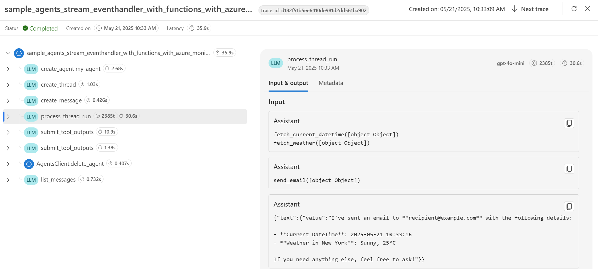

**Content Recording**

Content recording determines whether message contents and tool call details—such as parameter values and return values—are captured in traces. These contents may include personal information. By default, content recording is disabled. To enable it, set the following environment variable to TRUE:

```bash
set AZURE_TRACING_GEN_AI_CONTENT_RECORDING_ENABLED=TRUE
```

**Enable Azure Monitor Tracing**

Using environment variable:
```
from azure.monitor.opentelemetry import configure_azure_monitor

application_insights_connection_string = os.environ["APPLICATIONINSIGHTS_CONNECTION_STRING"]
configure_azure_monitor(connection_string=application_insights_connection_string)
```

Using connection string from projects client:

```
from azure.monitor.opentelemetry import configure_azure_monitor
from azure.identity import DefaultAzureCredential
from azure.ai.projects import AIProjectClient

endpoint = os.environ["PROJECT_ENDPOINT"]

with DefaultAzureCredential(exclude_interactive_browser_credential=False) as credential:
    with AIProjectClient(endpoint=endpoint, credential=credential) as project_client:
        application_insights_connection_string = project_client.telemetry.get_connection_string()
        if not application_insights_connection_string:
            print("Application Insights was not enabled for this project.")
            print("Enable it via the 'Tracing' tab in your AI Foundry project page.")
            exit()
configure_azure_monitor(connection_string=application_insights_connection_string)
```

**Enable Console Tracing**

Without AIProjectClient:

```
from azure.core.settings import settings
settings.tracing_implementation = "opentelemetry"
from opentelemetry import trace
from opentelemetry.sdk.trace import TracerProvider
from opentelemetry.sdk.trace.export import SimpleSpanProcessor, ConsoleSpanExporter
from azure.ai.agents.telemetry import AIAgentsInstrumentor

span_exporter = ConsoleSpanExporter()
tracer_provider = TracerProvider()
tracer_provider.add_span_processor(SimpleSpanProcessor(span_exporter))
trace.set_tracer_provider(tracer_provider)
tracer = trace.get_tracer(__name__)

AIAgentsInstrumentor().instrument()
```

With AIProjectClient (pending fix):

```
from azure.ai.projects import enable_telemetry

enable_telemetry(destination=sys.stdout)
```

**Collect Traces from Scenario Under One Span**

Creating a span that contain the spans from a single scenario will make it more convenient to view the traces.

```
# Create the desired name for the scenario
scenario = os.path.basename(__file__)
tracer = trace.get_tracer(__name__)

with tracer.start_as_current_span(scenario):
    # Execute your scenario here
```


**Trace Tool Calls Streaming**

This section demonstrates Agent API usage that will provide detailed traces of the run, including tool calls.

Setup agent with BingGroundingTool:
```
bing = BingGroundingTool(connection_id=bing_connection_id)

agent = agents_client.create_agent(
    model=os.environ["MODEL_DEPLOYMENT_NAME"],
    name="my-agent",
    instructions="You are a helpful agent",
    tools=bing.definitions,
)
```

Setup agent with FunctionTool using ToolSet:
```
functions = FunctionTool(user_functions)
toolset = ToolSet()
toolset.add(functions)
agents_client.enable_auto_function_calls(toolset)

agent = agents_client.create_agent(
    model=os.environ["MODEL_DEPLOYMENT_NAME"],
    name="my-agent",
    instructions="You are a helpful agent",
    toolset=toolset,
)
```

Stream the run using AgentEventHandler or your own event handler that is derived from AgentEventHandler:
```
from azure.ai.agents.models import AgentEventHandler

...

with agents_client.runs.stream(thread_id=thread.id, agent_id=agent.id, event_handler=AgentEventHandler()) as stream:
    stream.until_done()
```

**Trace Tool Calls Non-Streaming**

Listing the run steps will trace the tool calls that were part of the run:
```
agents_client.run_steps.list(thread_id=thread.id, run_id=run.id)
for step in agents_client.run_steps.list(thread_id=thread.id, run_id=run.id):
    print(f"Run step ID: {step.id}, Type: {step.type}, Status: {step.status}")
```

**Trace Your Own Function**

The @trace_function is provided for tracing your own functions:
```
# The trace_function decorator will trace the function call and enable adding additional attributes
# to the span in the function implementation. Note that this will trace the function parameters and their values.
@trace_function()
def fetch_weather(location: str) -> str:
    """
    Fetches the weather information for the specified location.

    :param location (str): The location to fetch weather for.
    :return: Weather information as a JSON string.
    :rtype: str
    """
    # In a real-world scenario, you'd integrate with a weather API.
    # Here, we'll mock the response.
    mock_weather_data = {"New York": "Sunny, 25°C", "London": "Cloudy, 18°C", "Tokyo": "Rainy, 22°C"}

    # Adding attributes to the current span
    span = trace.get_current_span()
    span.set_attribute("requested_location", location)

    weather = mock_weather_data.get(location, "Weather data not available for this location.")
    weather_json = json.dumps({"weather": weather})
    return weather_json
```

**Add Custom Attributes to Spans**

Define your own span processor which adds your custom attributes:

```
# Define the custom span processor that is used for adding the custom
# attributes to spans when they are started.
class CustomAttributeSpanProcessor(SpanProcessor):
    def __init__(self):
        pass

    def on_start(self, span: Span, parent_context=None):
        # Add this attribute to all spans
        span.set_attribute("trace_sample.sessionid", "123")

        # Add another attribute only to create_message spans
        if span.name == "create_message":
            span.set_attribute("trace_sample.message.context", "abc")

    def on_end(self, span: ReadableSpan):
        # Clean-up logic can be added here if necessary
        pass
```

Add your custom span processor to the global trace provider:

```
provider = cast(TracerProvider, trace.get_tracer_provider())
provider.add_span_processor(CustomAttributeSpanProcessor())
```

**View Azure Monitor Traces in Azure AI Foundry**

Traces can be viewed on the Tracing tab in the Azure AI Foundry.



**Sample Spans**

Following are some sample console traces from various Agent API scenarios to show what kind of info gets collected as part of the traces.

***Create Agent***
```
{
    "name": "create_agent my-agent",
    "context": {
        "trace_id": "0x8c1f37bcb127c893b3e4b45fbd0e85d0",
        "span_id": "0xca035b9cae1c932e",
        "trace_state": "[]"
    },
    "kind": "SpanKind.CLIENT",
    "parent_id": null,
    "start_time": "2025-05-16T19:27:16.095613Z",
    "end_time": "2025-05-16T19:27:19.239039Z",
    "status": {
        "status_code": "UNSET"
    },
    "attributes": {
        "gen_ai.system": "az.ai.agents",
        "gen_ai.operation.name": "create_agent",
        "server.address": "https://test-resource.services.ai.azure.com",
        "gen_ai.request.model": "gpt-4o-mini",
        "gen_ai.agent.name": "my-agent",
        "gen_ai.agent.id": "asst_UF1Tn7NpCoI23hVekVFoOMne"
    },
    "events": [
        {
            "name": "gen_ai.system.message",
            "timestamp": "2025-05-16T19:27:16.095613Z",
            "attributes": {
                "gen_ai.system": "az.ai.agents",
                "gen_ai.event.content": "{\"content\": \"You are a helpful agent\"}"
            }
        }
    ],
    "links": [],
    "resource": {
        "attributes": {
            "telemetry.sdk.language": "python",
            "telemetry.sdk.name": "opentelemetry",
            "telemetry.sdk.version": "1.31.1",
            "service.name": "unknown_service"
        },
        "schema_url": ""
    }
}
```

**Create Thread**
```
{
    "name": "create_thread",
    "context": {
        "trace_id": "0x3cce6f3be73978af1651b2f83bd75a04",
        "span_id": "0x178ba33a5b45bb60",
        "trace_state": "[]"
    },
    "kind": "SpanKind.CLIENT",
    "parent_id": null,
    "start_time": "2025-05-16T19:27:19.239039Z",
    "end_time": "2025-05-16T19:27:19.609130Z",
    "status": {
        "status_code": "UNSET"
    },
    "attributes": {
        "gen_ai.system": "az.ai.agents",
        "gen_ai.operation.name": "create_thread",
        "server.address": "https://test-resource.services.ai.azure.com",
        "gen_ai.thread.id": "thread_9OCZOvz5RPlAVjtbsRbNF7mz"
    },
    "events": [],
    "links": [],
    "resource": {
        "attributes": {
            "telemetry.sdk.language": "python",
            "telemetry.sdk.name": "opentelemetry",
            "telemetry.sdk.version": "1.31.1",
            "service.name": "unknown_service"
        },
        "schema_url": ""
    }
}
```

**Create Message**
```
{
    "name": "create_message",
    "context": {
        "trace_id": "0x170c140e0e76f9f02349a7e7558df4e9",
        "span_id": "0xd5c0b1cd67c8770e",
        "trace_state": "[]"
    },
    "kind": "SpanKind.CLIENT",
    "parent_id": null,
    "start_time": "2025-05-16T19:27:19.609130Z",
    "end_time": "2025-05-16T19:27:20.065959Z",
    "status": {
        "status_code": "UNSET"
    },
    "attributes": {
        "gen_ai.system": "az.ai.agents",
        "gen_ai.operation.name": "create_message",
        "server.address": "https://test-resource.services.ai.azure.com",
        "gen_ai.thread.id": "thread_9OCZOvz5RPlAVjtbsRbNF7mz",
        "gen_ai.message.id": "msg_kE7X0JTIJOOtodOnCharkKgI"
    },
    "events": [
        {
            "name": "gen_ai.user.message",
            "timestamp": "2025-05-16T19:27:19.609130Z",
            "attributes": {
                "gen_ai.system": "az.ai.agents",
                "gen_ai.thread.id": "thread_9OCZOvz5RPlAVjtbsRbNF7mz",
                "gen_ai.event.content": "{\"content\": \"Hello, send an email with the datetime and weather information in New York? Also let me know the details.\", \"role\": \"user\"}"
            }
        }
    ],
    "links": [],
    "resource": {
        "attributes": {
            "telemetry.sdk.language": "python",
            "telemetry.sdk.name": "opentelemetry",
            "telemetry.sdk.version": "1.31.1",
            "service.name": "unknown_service"
        },
        "schema_url": ""
    }
}
```

**Submit Tool Outputs**
```
{
    "name": "submit_tool_outputs",
    "context": {
        "trace_id": "0xac05396df50229183f57dbf8477e3d37",
        "span_id": "0x12733ec91119e75a",
        "trace_state": "[]"
    },
    "kind": "SpanKind.CLIENT",
    "parent_id": null,
    "start_time": "2025-05-16T19:27:22.996104Z",
    "end_time": "2025-05-16T19:27:24.725356Z",
    "status": {
        "status_code": "UNSET"
    },
    "attributes": {
        "gen_ai.system": "az.ai.agents",
        "gen_ai.operation.name": "submit_tool_outputs",
        "server.address": "https://test-resource.services.ai.azure.com",
        "gen_ai.thread.id": "thread_9OCZOvz5RPlAVjtbsRbNF7mz",
        "gen_ai.thread.run.id": "run_pACTAEPYAgQiS8ZrvRFcDrgk"
    },
    "events": [
        {
            "name": "gen_ai.tool.message",
            "timestamp": "2025-05-16T19:27:22.996104Z",
            "attributes": {
                "gen_ai.event.content": "{\"content\": \"{\\\"current_time\\\": \\\"2025-05-16 14:27:22\\\"}\", \"id\": \"call_bwc7qi3Tcu2L5xGFhc4Fe1LA\"}"
            }
        },
        {
            "name": "gen_ai.tool.message",
            "timestamp": "2025-05-16T19:27:22.996104Z",
            "attributes": {
                "gen_ai.event.content": "{\"content\": \"{\\\"weather\\\": \\\"Sunny, 25\\\\u00b0C\\\"}\", \"id\": \"call_5B18WgV8FOlJMyxATEkggAyo\"}"
            }
        }
    ],
    "links": [],
    "resource": {
        "attributes": {
            "telemetry.sdk.language": "python",
            "telemetry.sdk.name": "opentelemetry",
            "telemetry.sdk.version": "1.31.1",
            "service.name": "unknown_service"
        },
        "schema_url": ""
    }
}

{
    "name": "submit_tool_outputs",
    "context": {
        "trace_id": "0x3d4ab4a395c34faa148a2a27161815e4",
        "span_id": "0x794ae2fc51ea8815",
        "trace_state": "[]"
    },
    "kind": "SpanKind.CLIENT",
    "parent_id": null,
    "start_time": "2025-05-16T19:27:26.079798Z",
    "end_time": "2025-05-16T19:27:27.474193Z",
    "status": {
        "status_code": "UNSET"
    },
    "attributes": {
        "gen_ai.system": "az.ai.agents",
        "gen_ai.operation.name": "submit_tool_outputs",
        "server.address": "https://test-resource.services.ai.azure.com",
        "gen_ai.thread.id": "thread_9OCZOvz5RPlAVjtbsRbNF7mz",
        "gen_ai.thread.run.id": "run_pACTAEPYAgQiS8ZrvRFcDrgk"
    },
    "events": [
        {
            "name": "gen_ai.tool.message",
            "timestamp": "2025-05-16T19:27:26.079798Z",
            "attributes": {
                "gen_ai.event.content": "{\"content\": \"{\\\"message\\\": \\\"Email successfully sent to recipient@example.com.\\\"}\", \"id\": \"call_Hu9pJxDUU0mHZBaGABBRNodX\"}"
            }
        }
    ],
    "links": [],
    "resource": {
        "attributes": {
            "telemetry.sdk.language": "python",
            "telemetry.sdk.name": "opentelemetry",
            "telemetry.sdk.version": "1.31.1",
            "service.name": "unknown_service"
        },
        "schema_url": ""
    }
}
```

**Process Thread Run Streaming with Tool Calls**

With function tool:
```
{
    "name": "process_thread_run",
    "context": {
        "trace_id": "0xc6a6d6f27ae68b9a3f591de5bd81ce67",
        "span_id": "0xeb8db61f6464c821",
        "trace_state": "[]"
    },
    "kind": "SpanKind.CLIENT",
    "parent_id": "0xc3466e1242d04808",
    "start_time": "2025-05-19T17:22:25.424505Z",
    "end_time": "2025-05-19T17:22:39.309571Z",
    "status": {
        "status_code": "UNSET"
    },
    "attributes": {
        "gen_ai.system": "az.ai.agents",
        "gen_ai.operation.name": "process_thread_run",
        "server.address": "https:/test-resource.services.ai.azure.com",
        "gen_ai.thread.id": "thread_ptNdFgaw7USNkwFh16tAkI0O",
        "gen_ai.agent.id": "asst_3ltKbuX2OSBQQPRyUHjiJTWu",
        "gen_ai.message.id": "msg_DTy5vKJ6PoC55HmVDNOZKNk7",
        "gen_ai.thread.run.status": "completed",
        "gen_ai.thread.run.id": "run_liFTeIxmCeAK7aOcMsJiROGV",
        "gen_ai.response.model": "gpt-4o-mini",
        "gen_ai.usage.input_tokens": 2220,
        "gen_ai.usage.output_tokens": 194
    },
    "events": [
        {
            "name": "gen_ai.tool.message",
            "timestamp": "2025-05-19T17:22:29.279383Z",
            "attributes": {
                "gen_ai.event.content": "{\"content\": \"{\\\"current_time\\\": \\\"YYYY-MM-DD HH:mm:ss\\\"}\", \"id\": \"call_Lw5kjjsQ8mL9vWt1DAW9LNz2\"}"
            }
        },
        {
            "name": "gen_ai.tool.message",
            "timestamp": "2025-05-19T17:22:29.279383Z",
            "attributes": {
                "gen_ai.event.content": "{\"content\": \"{\\\"weather\\\": \\\"Sunny, 25\\\\u00b0C\\\"}\", \"id\": \"call_f6NhmznHJ8wmcaFeP55YkO6f\"}"
            }
        },
        {
            "name": "gen_ai.assistant.message",
            "timestamp": "2025-05-19T17:22:31.016057Z",
            "attributes": {
                "gen_ai.system": "az.ai.agents",
                "gen_ai.thread.id": "thread_ptNdFgaw7USNkwFh16tAkI0O",
                "gen_ai.agent.id": "asst_3ltKbuX2OSBQQPRyUHjiJTWu",
                "gen_ai.thread.run.id": "run_liFTeIxmCeAK7aOcMsJiROGV",
                "gen_ai.message.status": "completed",
                "gen_ai.run_step.start.timestamp": "2025-05-19T17:22:28+00:00",
                "gen_ai.run_step.end.timestamp": "2025-05-19T17:22:30+00:00",
                "gen_ai.usage.input_tokens": 656,
                "gen_ai.usage.output_tokens": 52,
                "gen_ai.event.content": "{\"tool_calls\": [{\"id\": \"call_Lw5kjjsQ8mL9vWt1DAW9LNz2\", \"type\": \"function\", \"function\": {\"name\": \"fetch_current_datetime\", \"arguments\": {\"format\": \"YYYY-MM-DD HH:mm:ss\"}}}, {\"id\": \"call_f6NhmznHJ8wmcaFeP55YkO6f\", \"type\": \"function\", \"function\": {\"name\": \"fetch_weather\", \"arguments\": {\"location\": \"New York\"}}}]}"
            }
        },
        {
            "name": "gen_ai.tool.message",
            "timestamp": "2025-05-19T17:22:35.773273Z",
            "attributes": {
                "gen_ai.event.content": "{\"content\": \"{\\\"message\\\": \\\"Email successfully sent to recipient@example.com.\\\"}\", \"id\": \"call_ME2096E64SAaAZHQloa9estE\"}"
            }
        },
        {
            "name": "gen_ai.assistant.message",
            "timestamp": "2025-05-19T17:22:37.747586Z",
            "attributes": {
                "gen_ai.system": "az.ai.agents",
                "gen_ai.thread.id": "thread_ptNdFgaw7USNkwFh16tAkI0O",
                "gen_ai.agent.id": "asst_3ltKbuX2OSBQQPRyUHjiJTWu",
                "gen_ai.thread.run.id": "run_liFTeIxmCeAK7aOcMsJiROGV",
                "gen_ai.message.status": "completed",
                "gen_ai.run_step.start.timestamp": "2025-05-19T17:22:33+00:00",
                "gen_ai.run_step.end.timestamp": "2025-05-19T17:22:37+00:00",
                "gen_ai.usage.input_tokens": 745,
                "gen_ai.usage.output_tokens": 53,
                "gen_ai.event.content": "{\"tool_calls\": [{\"id\": \"call_ME2096E64SAaAZHQloa9estE\", \"type\": \"function\", \"function\": {\"name\": \"send_email\", \"arguments\": {\"recipient\": \"recipient@example.com\", \"subject\": \"Current DateTime and Weather in New York\", \"body\": \"Current DateTime: YYYY-MM-DD HH:mm:ss\\n\\nWeather in New York: Sunny, 25\u00b0C\"}}}]}"
            }
        },
        {
            "name": "gen_ai.assistant.message",
            "timestamp": "2025-05-19T17:22:39.270430Z",
            "attributes": {
                "gen_ai.system": "az.ai.agents",
                "gen_ai.thread.id": "thread_ptNdFgaw7USNkwFh16tAkI0O",
                "gen_ai.agent.id": "asst_3ltKbuX2OSBQQPRyUHjiJTWu",
                "gen_ai.thread.run.id": "run_liFTeIxmCeAK7aOcMsJiROGV",
                "gen_ai.message.id": "msg_DTy5vKJ6PoC55HmVDNOZKNk7",
                "gen_ai.message.status": "completed",
                "gen_ai.usage.input_tokens": 819,
                "gen_ai.usage.output_tokens": 89,
                "gen_ai.event.content": "{\"content\": {\"text\": {\"value\": \"I have successfully sent an email with the current datetime and weather information in New York.\\n\\n### Email Details:\\n- **Recipient:** recipient@example.com\\n- **Subject:** Current DateTime and Weather in New York\\n- **Body:**\\n  ```\\n  Current DateTime: YYYY-MM-DD HH:mm:ss\\n\\n  Weather in New York: Sunny, 25\u00b0C\\n  ```\\n\\nIf you need anything else, feel free to ask!\"}}, \"role\": \"assistant\"}"
            }
        }
    ],
    "links": [],
    "resource": {
        "attributes": {
            "telemetry.sdk.language": "python",
            "telemetry.sdk.name": "opentelemetry",
            "telemetry.sdk.version": "1.31.1",
            "service.name": "unknown_service"
        },
        "schema_url": ""
    }
}
```

With bing grounding:

```
{
    "name": "process_thread_run",
    "context": {
        "trace_id": "0x7c306d7c0d8a4638ab34627689e1feff",
        "span_id": "0xd044f223460e0259",
        "trace_state": "[]"
    },
    "kind": "SpanKind.CLIENT",
    "parent_id": "0x562b52e8eb67e607",
    "start_time": "2025-05-19T16:52:36.110250Z",
    "end_time": "2025-05-19T16:52:41.917008Z",
    "status": {
        "status_code": "UNSET"
    },
    "attributes": {
        "gen_ai.system": "az.ai.agents",
        "gen_ai.operation.name": "process_thread_run",
        "server.address": "https://test-resource.services.ai.azure.com",
        "gen_ai.thread.id": "thread_Gp5PrkDmVGfUY1mL18TKmxzV",
        "gen_ai.agent.id": "asst_e9B204dxGouMIoRTt1fPshSm",
        "gen_ai.message.id": "msg_Or4FrlHIfF8dog3F0zXIMpXg",
        "gen_ai.thread.run.status": "completed",
        "gen_ai.thread.run.id": "run_UzU0a34kSDed5HE2lZzjazx8",
        "gen_ai.response.model": "gpt-4o-mini",
        "gen_ai.usage.input_tokens": 1518,
        "gen_ai.usage.output_tokens": 226
    },
    "events": [
        {
            "name": "gen_ai.assistant.message",
            "timestamp": "2025-05-19T16:52:39.589703Z",
            "attributes": {
                "gen_ai.system": "az.ai.agents",
                "gen_ai.thread.id": "thread_Gp5PrkDmVGfUY1mL18TKmxzV",
                "gen_ai.agent.id": "asst_e9B204dxGouMIoRTt1fPshSm",
                "gen_ai.thread.run.id": "run_UzU0a34kSDed5HE2lZzjazx8",
                "gen_ai.message.status": "completed",
                "gen_ai.run_step.start.timestamp": "2025-05-19T16:52:38+00:00",
                "gen_ai.run_step.end.timestamp": "2025-05-19T16:52:39+00:00",
                "gen_ai.usage.input_tokens": 457,
                "gen_ai.usage.output_tokens": 19,
                "gen_ai.event.content": "{\"tool_calls\": [{\"id\": \"call_rlq5FAEkp3e9vzU2FnDt2Xfw\", \"type\": \"bing_grounding\", \"bing_grounding\": {\"requesturl\": \"https://api.bing.microsoft.com/v7.0/search?q=Euler's Identity site:wikipedia.org\", \"response_metadata\": \"{'market': 'en-US', 'num_docs_retrieved': 5, 'num_docs_actually_used': 5}\"}}]}"
            }
        },
        {
            "name": "gen_ai.assistant.message",
            "timestamp": "2025-05-19T16:52:41.906640Z",
            "attributes": {
                "gen_ai.system": "az.ai.agents",
                "gen_ai.thread.id": "thread_Gp5PrkDmVGfUY1mL18TKmxzV",
                "gen_ai.agent.id": "asst_e9B204dxGouMIoRTt1fPshSm",
                "gen_ai.thread.run.id": "run_UzU0a34kSDed5HE2lZzjazx8",
                "gen_ai.message.id": "msg_Or4FrlHIfF8dog3F0zXIMpXg",
                "gen_ai.message.status": "completed",
                "gen_ai.usage.input_tokens": 1061,
                "gen_ai.usage.output_tokens": 207,
                "gen_ai.event.content": "{\"content\": {\"text\": {\"value\": \"According to Wikipedia, Euler's Identity is expressed as \\\\( e^{i\\\\pi} + 1 = 0 \\\\). This remarkable equation links five fundamental mathematical constants: \\n\\n- \\\\( e \\\\) (Euler's number, the base of natural logarithms),\\n- \\\\( i \\\\) (the imaginary unit, where \\\\( i^2 = -1 \\\\)),\\n- \\\\( \\\\pi \\\\) (the ratio of the circumference of a circle to its diameter),\\n- 1 (the multiplicative identity), and\\n- 0 (the additive identity).\\n\\nEuler's Identity is a special case of Euler's formula, which states that for any real number \\\\( x \\\\), \\\\( e^{ix} = \\\\cos(x) + i\\\\sin(x) \\\\). When \\\\( x = \\\\pi \\\\), this simplifies to Euler's Identity. Described as \\\"the most remarkable formula in mathematics\\\" by physicist Richard Feynman, it features key operations: addition, multiplication, and exponentiation\u30103:0\u2020source\u3011.\", \"annotations\": [{\"type\": \"url_citation\", \"text\": \"\u30103:0\u2020source\u3011\", \"start_index\": 766, \"end_index\": 778, \"url_citation\": {\"url\": \"https://en.wikipedia.org/wiki/Euler%27s_identity\", \"title\": \"Euler's identity - Wikipedia\"}}]}}, \"role\": \"assistant\"}"
            }
        }
    ],
    "links": [],
    "resource": {
        "attributes": {
            "telemetry.sdk.language": "python",
            "telemetry.sdk.name": "opentelemetry",
            "telemetry.sdk.version": "1.31.1",
            "service.name": "unknown_service"
        },
        "schema_url": ""
    }
}
```

**List Messages**
```
{
    "name": "list_messages",
    "context": {
        "trace_id": "0x2c0c730de5fb4144de350fbe686071ce",
        "span_id": "0x0d686f63de3ba1a3",
        "trace_state": "[]"
    },
    "kind": "SpanKind.CLIENT",
    "parent_id": null,
    "start_time": "2025-05-16T19:27:29.411497Z",
    "end_time": "2025-05-16T19:27:30.207412Z",
    "status": {
        "status_code": "UNSET"
    },
    "attributes": {
        "gen_ai.system": "az.ai.agents",
        "gen_ai.operation.name": "list_messages",
        "server.address": "https://test-resource.services.ai.azure.com",
        "gen_ai.thread.id": "thread_9OCZOvz5RPlAVjtbsRbNF7mz"
    },
    "events": [
        {
            "name": "gen_ai.user.message",
            "timestamp": "2025-05-16T19:27:29.890096Z",
            "attributes": {
                "gen_ai.system": "az.ai.agents",
                "gen_ai.thread.id": "thread_9OCZOvz5RPlAVjtbsRbNF7mz",
                "gen_ai.message.id": "msg_kE7X0JTIJOOtodOnCharkKgI",
                "gen_ai.event.content": "{\"content\": {\"text\": {\"value\": \"Hello, send an email with the datetime and weather information in New York? Also let me know the details.\"}}, \"role\": \"user\"}"
            }
        },
        {
            "name": "gen_ai.assistant.message",
            "timestamp": "2025-05-16T19:27:29.890096Z",
            "attributes": {
                "gen_ai.system": "az.ai.agents",
                "gen_ai.thread.id": "thread_9OCZOvz5RPlAVjtbsRbNF7mz",
                "gen_ai.agent.id": "asst_UF1Tn7NpCoI23hVekVFoOMne",
                "gen_ai.thread.run.id": "run_pACTAEPYAgQiS8ZrvRFcDrgk",
                "gen_ai.message.id": "msg_cLZjHvNkQBDp9XoL7f2w9o5O",
                "gen_ai.event.content": "{\"content\": {\"text\": {\"value\": \"I have successfully sent the email with the following details:\\n\\n- **Current Datetime**: 2025-05-16 14:27:22\\n- **Weather in New York**: Sunny, 25\u00b0C\\n\\nThe email was sent to **recipient@example.com**. If you need anything else, feel free to ask!\"}}, \"role\": \"assistant\"}"
            }
        }
    ],
    "links": [],
    "resource": {
        "attributes": {
            "telemetry.sdk.language": "python",
            "telemetry.sdk.name": "opentelemetry",
            "telemetry.sdk.version": "1.31.1",
            "service.name": "unknown_service"
        },
        "schema_url": ""
    }
}
```

**Tracing Own Function**
```
{
    "name": "fetch_weather",
    "context": {
        "trace_id": "0x55849ba01fbe5888a2bd1cf456b97007",
        "span_id": "0xb9562fdc3100d730",
        "trace_state": "[]"
    },
    "kind": "SpanKind.INTERNAL",
    "parent_id": "0x6fd56f9f6b387f9c",
    "start_time": "2025-05-19T16:02:52.697196Z",
    "end_time": "2025-05-19T16:02:52.697825Z",
    "status": {
        "status_code": "UNSET"
    },
    "attributes": {
        "code.function.parameter.location": "New York",
        "requested_location": "New York",
        "code.function.return.value": "{\"weather\": \"Sunny, 25\\u00b0C\"}"
    },
    "events": [],
    "links": [],
    "resource": {
        "attributes": {
            "telemetry.sdk.language": "python",
            "telemetry.sdk.name": "opentelemetry",
            "telemetry.sdk.version": "1.31.1",
            "service.name": "unknown_service"
        },
        "schema_url": ""
    }
}
```

**Trace with Custom Attribute**
```
{
    "name": "create_message",
    "context": {
        "trace_id": "0xda3ef71340ca24377a8abb13f66032de",
        "span_id": "0xa01334db12017500",
        "trace_state": "[]"
    },
    "kind": "SpanKind.CLIENT",
    "parent_id": "0x7939de9c8c0756d6",
    "start_time": "2025-05-19T15:58:34.644119Z",
    "end_time": "2025-05-19T15:58:35.352470Z",
    "status": {
        "status_code": "UNSET"
    },
    "attributes": {
        "trace_sample.sessionid": "123",
        "trace_sample.message.context": "abc",
        "gen_ai.system": "az.ai.agents",
        "gen_ai.operation.name": "create_message",
        "server.address": "https://test-resource.services.ai.azure.com",
        "gen_ai.thread.id": "thread_MjKJC7HCk1x8LTMCOjdaovEl",
        "gen_ai.message.id": "msg_y3ydiMZnQPgpWpAytcvEY1Vd"
    },
    "events": [
        {
            "name": "gen_ai.user.message",
            "timestamp": "2025-05-19T15:58:34.644119Z",
            "attributes": {
                "gen_ai.system": "az.ai.agents",
                "gen_ai.thread.id": "thread_MjKJC7HCk1x8LTMCOjdaovEl",
                "gen_ai.event.content": "{\"content\": \"Hello, tell me a joke\", \"role\": \"user\"}"
            }
        }
    ],
    "links": [],
    "resource": {
        "attributes": {
            "telemetry.sdk.language": "python",
            "telemetry.sdk.name": "opentelemetry",
            "telemetry.sdk.version": "1.31.1",
            "service.name": "unknown_service"
        },
        "schema_url": ""
    }
}
```

**List Run Steps**
```
{
    "name": "list_run_steps",
    "context": {
        "trace_id": "0xbf0aad3b0826917681184a69983d8b24",
        "span_id": "0xe961dd9877e50001",
        "trace_state": "[]"
    },
    "kind": "SpanKind.CLIENT",
    "parent_id": "0x3bceaad3d645331c",
    "start_time": "2025-05-19T17:14:53.559593Z",
    "end_time": "2025-05-19T17:14:54.829019Z",
    "status": {
        "status_code": "UNSET"
    },
    "attributes": {
        "gen_ai.system": "az.ai.agents",
        "gen_ai.operation.name": "list_run_steps",
        "server.address": "https://test-resource.services.ai.azure.com",
        "gen_ai.thread.id": "thread_7OcZvkDctdMRmI4lZZQXNkB2",
        "gen_ai.thread.run.id": "run_noZCnq64mvXzmPbtcB2vDXiP"
    },
    "events": [
        {
            "name": "gen_ai.run_step.message_creation",
            "timestamp": "2025-05-19T17:14:54.343601Z",
            "attributes": {
                "gen_ai.system": "az.ai.agents",
                "gen_ai.thread.id": "thread_7OcZvkDctdMRmI4lZZQXNkB2",
                "gen_ai.agent.id": "asst_XJYg3GpFxv0D9uHl8fr0s9rR",
                "gen_ai.thread.run.id": "run_noZCnq64mvXzmPbtcB2vDXiP",
                "gen_ai.message.id": "msg_AuY9dzfBIslIWFO1293QxCo8",
                "gen_ai.run_step.status": "completed",
                "gen_ai.run_step.start.timestamp": "2025-05-19T17:14:51+00:00",
                "gen_ai.run_step.end.timestamp": "2025-05-19T17:14:51+00:00",
                "gen_ai.usage.input_tokens": 347,
                "gen_ai.usage.output_tokens": 17
            }
        },
        {
            "name": "gen_ai.run_step.tool_calls",
            "timestamp": "2025-05-19T17:14:54.344609Z",
            "attributes": {
                "gen_ai.system": "az.ai.agents",
                "gen_ai.thread.id": "thread_7OcZvkDctdMRmI4lZZQXNkB2",
                "gen_ai.agent.id": "asst_XJYg3GpFxv0D9uHl8fr0s9rR",
                "gen_ai.thread.run.id": "run_noZCnq64mvXzmPbtcB2vDXiP",
                "gen_ai.run_step.status": "completed",
                "gen_ai.run_step.start.timestamp": "2025-05-19T17:14:47+00:00",
                "gen_ai.run_step.end.timestamp": "2025-05-19T17:14:50+00:00",
                "gen_ai.usage.input_tokens": 309,
                "gen_ai.usage.output_tokens": 16,
                "gen_ai.event.content": "{\"tool_calls\": [{\"id\": \"call_W7TTBinrrNcTwbtIhdJTgiTC\", \"type\": \"function\", \"function\": {\"name\": \"fetch_weather\", \"arguments\": {\"location\": \"New York\"}}}]}" 
            }
        }
    ],
    "links": [],
    "resource": {
        "attributes": {
            "telemetry.sdk.language": "python",
            "telemetry.sdk.name": "opentelemetry",
            "telemetry.sdk.version": "1.31.1",
            "service.name": "unknown_service"
        },
        "schema_url": ""
    }
}

```
