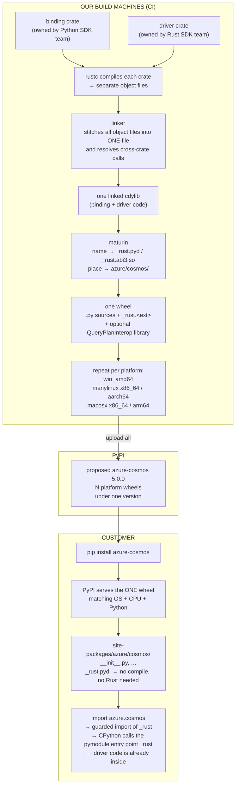

# From Pure Python to a Shipped Rust Wheel

This document describes how the Azure Cosmos DB Python SDK's **packaging** and **CI/release
pipeline** change when a Rust extension is added.

It follows the transition from the pure-Python package model to a **proposed** v5
native-package model: a compiled Rust extension with platform-specific wheels.

Local development: Maturin builds the `azure_cosmos_rust` binding against a sibling
`azure-sdk-for-rust` checkout for local development.

The source baseline for the factual statements is Python migration commit
`94d71b88c63408fa9920ed3ef53165491f7c6ebd` and Rust driver commit
`5c170b53837bc01af5a7e28ef9189410f67f9d66`. The Python manifest does **not** pin
that Rust commit; it is the revision inspected for this document.

---

## Table of contents

- [1. The task, and the two numbers that define it](#1-the-task-and-the-two-numbers-that-define-it)
- [2. What's in the repos: two Rust crates](#2-whats-in-the-repos-two-rust-crates)
- [3. Building the binding and its driver dependency](#3-building-the-binding-and-its-driver-dependency)
- [4. The output Python can't import yet: `cdylib`](#4-the-output-python-cant-import-yet-cdylib)
- [5. The functions Python still can't call: PyO3](#5-the-functions-python-still-cant-call-pyo3)
- [6. Maturin connects `pip` to Cargo](#6-maturin-connects-pip-to-cargo)
- [7. How Maturin knows what to do: `pyproject.toml` and the four names](#7-how-maturin-knows-what-to-do-pyprojecttoml-and-the-four-names)
- [8. What actually ships: the wheel](#8-what-actually-ships-the-wheel)
- [9. One wheel becomes many: platforms, `abi3`, and `manylinux`](#9-one-wheel-becomes-many-platforms-abi3-and-manylinux)
- [10. The release math changes: today vs. after v5](#10-the-release-math-changes-today-vs-after-v5)
- [11. The package-level edits](#11-the-package-level-edits)
- [12. The CI pipeline edits](#12-the-ci-pipeline-edits)
- [13. The shape that comes out the other end](#13-the-shape-that-comes-out-the-other-end)
- [14. What has to be arranged with System Engineering](#14-what-has-to-be-arranged-with-system-engineering)
- [15. Rolling it out without breaking a release](#15-rolling-it-out-without-breaking-a-release)
- [16. What stays the same unless service requirements change](#16-what-stays-the-same-unless-service-requirements-change)
- [17. Where it all ends up: the customer's machine](#17-where-it-all-ends-up-the-customers-machine)

---


## 1. The task, and the two numbers that define it

The build-and-ship side of **v5** — the first release where part of the SDK is written in
Rust — changes almost every assumption baked into the current release pipeline.

The pure-Python baseline used by the Rust migration branch is `azure-cosmos==4.16.2`:

```
Pure-Python migration baseline (azure-cosmos 4.16.2):
  - Package generation is active in the Linux job.
  - It produces TWO files:
        azure_cosmos-4.16.2-py3-none-any.whl     (one wheel, works everywhere)
        azure_cosmos-4.16.2.tar.gz               (a source archive)
  - The normal release shape is one wheel plus one source archive.
```

The phrase that matters is **`py3-none-any`**: one wheel, any operating system, any CPU,
and every Python version allowed by the package's `Requires-Python` metadata. That single
fact — *one wheel works for every supported environment* — is something the release pipeline
depends on in many places.

**The problem:** the moment the SDK contains compiled Rust, `py3-none-any` becomes
impossible, because compiled code is specific to an operating system and CPU. Almost every
number above is about to change. Before any of that can be planned, it helps to understand
what's actually in the repo now — including files that don't usually appear in a Python
project.

---

## 2. What's in the repos: two Rust crates

The Python SDK and Rust driver are in separate sibling repositories. The `azure-cosmos`
package contains the Python-owned binding source, while the driver source remains in
`azure-sdk-for-rust`:

```
source/repos/
├── azure-sdk-for-python/
│   └── sdk/cosmos/azure-cosmos/
│       ├── azure/cosmos/                   ← the Python package
│       │   ├── __init__.py
│       │   ├── cosmos_client.py
│       │   └── _rust.pyd                   ← compiled extension on Windows
│       ├── azure_cosmos_rust/              ← Rust: the binding crate
│       │   ├── Cargo.toml
│       │   └── src/*.rs
│       ├── Cargo.toml                      ← binding workspace manifest
│       └── pyproject.toml                  ← Python/Maturin build manifest
└── azure-sdk-for-rust/
    └── sdk/cosmos/azure_data_cosmos_driver/
        ├── Cargo.toml
        └── src/*.rs                        ← Rust: the driver crate
```

There are two sets of Rust code here, and to avoid confusion this document names them the
**driver** and the **binding**. Rust's word for a package is a **crate**, so these are the
driver crate and the binding crate.

Two Rust terms show up in that tree and are used throughout. **Cargo** is Rust's build tool
and package manager: it resolves and downloads dependencies (`pip`'s job), packages the
result (`setuptools`' job), and — with no Python equivalent — **compiles** the code. Every
crate has a **`Cargo.toml`**, the manifest where Cargo reads the crate's name, its
dependencies, and what kind of output to produce; it uses the same TOML format as
`pyproject.toml`, so it will look familiar.

- **The driver crate** (`azure_data_cosmos_driver/`) does the real Cosmos work: builds HTTP
  requests, routes partitions, retries, and tracks session tokens. It is **owned by Rust SDK
  team** and its source remains in the separate `azure-sdk-for-rust` repository.
  The Python SDK consumes it as a dependency rather than copying it into `azure-cosmos`.
- **The binding crate** (`azure_cosmos_rust/`) is the Python-specific adapter. It exposes
  Python-callable functions and owns boundary work such as type translation, credential
  callbacks, runtime bridging, exception mapping, and diagnostics before calling the driver.
  **The Python SDK team owns this**, and it is hand-written — no tool generates it. Cosmos
  protocol and transport behavior still belongs in the driver rather than being duplicated
  here.

So the repository boundary is simple: Python-specific integration changes belong in the
**binding** crate. Driver changes belong in `azure-sdk-for-rust` and follow that repository's
ownership and review process rather than being copied into the Python repository.

> **How the current build resolves the driver.** The binding's `Cargo.toml` declares
> `azure_data_cosmos_driver` as a local **path dependency** pointing to the sibling
> `azure-sdk-for-rust` checkout. Maturin starts the binding build, then Cargo compiles both
> crates and links the driver into the binding's single Python extension (`_rust.pyd` on
> Windows or `_rust.abi3.so` on Linux/macOS). The `azure_cosmos_rust` directory contains only
> binding source, but the resulting extension contains compiled code from both crates. The current
> manifest does not download the driver from crates.io. Before release, that dependency
> declaration must be changed to the approved published `azure_data_cosmos_driver` version;
> the sibling path remains a local-development arrangement only.

**The problem:** these are *two separate crates*, and the binding depends on the driver.
When a build runs, how does one `cargo build` compile both and link them together — and make
sure they agree on the versions of the libraries they share?

---

## 3. Building the binding and its driver dependency

Two Cargo mechanisms answer that, and they are easy to confuse:

| Mechanism | The question it answers | Where it's declared |
|---|---|---|
| **Workspace membership** | Which crates in *this* repository are built together and share settings? | `[workspace] members` in the root `Cargo.toml` |
| **Dependency resolution** | Which crates get compiled at all, from where, and at which version? | `[dependencies]` in each crate, plus Cargo's version reconciliation |

A **workspace** is Cargo's way of saying
"these crates are built together and share settings" — declared in a root-level `Cargo.toml`
that compiles nothing itself. The Python repository has one member:

```toml
[workspace]
members = ["azure_cosmos_rust"]
resolver = "2"
```

The driver is not a member, because its source is not in this workspace; it belongs to the
sibling `azure-sdk-for-rust` repository. The binding names it under its own `[dependencies]`:

```toml
# sdk/cosmos/azure-cosmos/azure_cosmos_rust/Cargo.toml  (the binding crate)
[dependencies]
pyo3 = { version = "0.22", features = ["extension-module", "abi3-py39"] }
azure_data_cosmos_driver = { path = "../../../../../azure-sdk-for-rust/sdk/cosmos/azure_data_cosmos_driver", features = ["__internal_native_query_plan"] }
tokio = { workspace = true, features = ["rt-multi-thread", "macros"] }
azure_core = { workspace = true }
# ... pyo3-async-runtimes, parking_lot, serde, serde_json, url, async-trait ...
```

Cargo walks the binding's complete dependency graph, so it compiles the path-based driver
and links it into the binding's `cdylib` without the driver being a member. Membership
decides who shares settings; the dependency graph decides what gets built.

**Declaring versions in one place.** Look again at `tokio = { workspace = true }` in the
snippet above: it names a crate and its features but no version. That declaration is
deliberately incomplete, and it is finished in a *different file*. Two manifests are involved:

| File | What it declares for `tokio` |
|---|---|
| `azure_cosmos_rust/Cargo.toml` (the binding crate) | *which* crate to depend on, and which features it needs — `rt-multi-thread`, `macros` |
| `sdk/cosmos/azure-cosmos/Cargo.toml` (the workspace root) | *what version* every member crate gets — `tokio = "1"` |

`workspace = true` is the binding manifest saying "take the version from the root manifest's
`[workspace.dependencies]` table":

```toml
# sdk/cosmos/azure-cosmos/Cargo.toml  (the workspace root)
[workspace.dependencies]
azure_core = "1.1.0"
tokio      = "1"
serde      = { version = "1", features = ["derive"] }
url        = "2"
# ... async-lock, async-trait, base64, futures, reqwest, serde_json, tracing, uuid ...
```

The point is to keep version numbers out of individual crate manifests so members cannot
drift apart. The binding now inherits both `tokio` and `azure_core` from this table.
`azure_core = "1.1.0"` is also compatible with the driver's crates.io requirement, so Cargo
can unify them into one `azure_core` package. The root table still has no effect on the
external driver, which reads its own repository's manifest.

One project-specific dependency-policy question remains: Cargo unions features requested by
the binding and driver on that shared copy. Review the resulting feature set for binary size
and dependency policy; this is not a version conflict.

**The driver revision is also not pinned by Cargo.** The dependency is a relative `path`, not
a `git` dependency with a `rev`. The Python commit therefore records neither
`5c170b538` nor any other Rust commit; it compiles whichever sibling checkout happens to be
at that path. The release fix is to replace this path with the approved crates.io version.
If developers still want to test unreleased driver source, they can override that dependency
locally without putting the override in the published manifest.

**Verify resolution on a clean build, don't assume it.** The branch does not commit
**`Cargo.lock`**, the generated file recording every crate in the graph at one exact version.
The branch explicitly ignores `/Cargo.lock`, so its current policy is to resolve from the
manifest ranges rather than commit the generated lock. That distinction follows from the
version-range rule described in `RUST_BASICS.md`: `Cargo.toml` says what the build will
*accept*, while `Cargo.lock` records what one build actually *got*. Release owners should
confirm whether that unlocked policy meets the reproducibility requirement; otherwise two
clean builds of the same Python and Rust commits can resolve different compatible registry
versions.

**The compiler floor is also inconsistent.** `rust-version` is package metadata, not a
dependency requirement that Cargo merges. The binding declares a minimum of 1.75 and the
driver declares 1.88; the compiler used for the combined build must satisfy both, making 1.88
the effective minimum for this pairing. Update the binding workspace metadata to match,
confirming the figure against the driver revision being shipped — otherwise the Python
manifest understates the toolchain the build agents need (§14).

**One enabled feature has its own native packaging decision.** The binding enables the
driver's explicitly internal `__internal_native_query_plan` feature; it is not a public
compatibility guarantee. The driver's loader module is always compiled, while the feature
enables the execution path that instantiates and uses it to look for
`Cosmos.QueryPlanInterop.dll`, `libqueryplaninterop.so`, or
`libqueryplaninterop.dylib`; it does **not** compile that library into the PyO3 extension.
The driver loads it lazily from `AZURE_COSMOS_QUERYPLANINTEROP_DIR` or the operating system's
library search path. If it is absent or query-plan generation fails, the driver falls back to
the Gateway.

The feature therefore does not make the wheel unimportable when the native query-plan library
is absent, but it also does not provide local query planning by itself. Before release, choose
one of two explicit models:

1. Package, sign, license, and test the QueryPlanInterop library for every supported wheel
   target and make its runtime location discoverable.
2. Do not claim local query planning as shipped behavior; either retain the feature with its
   Gateway fallback or disable the internal feature until the extra library has an approved
   distribution strategy.

**The new problem:** once those prerequisites are satisfied, `cargo build` produces a raw
platform library — for example, `azure_cosmos_rust.dll` on Windows — and
`import azure.cosmos._rust` still does nothing. Cargo built *a* file, but not one Python knows
how to load.

---

## 4. The output Python can't import yet: `cdylib`

**The problem:** Cargo's default output for a library is a `.rlib` — a Rust-only format
that only *other Rust code* can use. Python can't load it. Even the `.dll` that appears
isn't automatically importable.

**The solution — tell Cargo to build a `cdylib`.** In the binding crate's `Cargo.toml`:

```toml
[lib]
name       = "azure_cosmos_rust"
crate-type = ["cdylib"]
```

`crate-type = ["cdylib"]` tells Cargo to produce a dynamic-library format intended for
non-Rust consumers. It does not by itself turn ordinary Rust functions into a Python API;
PyO3 supplies the exported CPython entry point and conversions described in §5.

"Dynamic" is worth pinning down against its opposite:

- **Static library:** the library's machine code is copied *into* the program that uses it
  at build time; there's no separate library file at run time. (Rust `.rlib`/`.a`.)
- **Dynamic library:** the library stays its own file, and the program loads it at run time
  when it needs it. (Rust `cdylib`: `.dll` on Windows, `.so` on Linux, `.dylib` on macOS.)

Python extensions are **always** dynamic libraries, because the "program" loading them is
`python.exe`, and it loads extension modules on the fly when an `import` runs.

But there's a naming mismatch. Cargo's raw output on Windows is `azure_cosmos_rust.dll`,
and Python does not import that raw Cargo filename. Maturin gives this ABI3 project the
platform-specific Python extension name:

| Platform | This project imports | Cargo's raw `cdylib` suffix |
|----------|----------------------|------------------------------|
| Windows  | `_rust.pyd`          | `.dll`                       |
| Linux    | `_rust.abi3.so`      | `.so`                        |
| macOS    | `_rust.abi3.so`      | `.dylib`                     |

**One file, several names for it.** This document says *compiled extension*, *platform
extension*, *native extension*, and *the `.pyd`/`.so`* — they all mean this same single file:
`_rust.pyd` on Windows, `_rust.abi3.so` on Linux and macOS. "Platform" and "native" just
emphasize that it is machine code built for one OS/CPU; "extension" is Python's word for a
module written in compiled code rather than `.py`.

So Cargo's `azure_cosmos_rust.dll` has to be **renamed** to `_rust.pyd` and **placed**
inside `azure/cosmos/` before Python can import it. Cargo does neither of those steps.

**The new problem:** even after renaming the file by hand and getting Python to load it, the
functions inside are still unreachable. They speak Rust — Rust types, Rust calling
conventions, Rust errors. A Rust `String` is not a Python `str`; a Rust `Result` is not a
raised exception. Something has to translate at the boundary.

---

## 5. The functions Python still can't call: PyO3

**The problem:** a compiled `_rust.pyd` loaded into Python still contains Rust
functions Python cannot call — wrong argument types, wrong error model, and no marking of
which functions are even meant to be public.

**The solution — PyO3.** PyO3 is a Rust crate (the one already in `Cargo.toml`) that does
the translation at the boundary. Concretely, it does five jobs:

1. **Marks what's Python-visible.** A Rust function tagged `#[pyfunction]` becomes a
   callable in the Python module; a struct tagged `#[pyclass]` becomes a Python class.
2. **Converts simple types automatically.** A Python `bytes` arrives as a Rust `&[u8]`,
   `str` becomes `String`, `list` becomes `Vec`, and numbers/booleans pass through.
3. **Provides GIL APIs** (for Python's interpreter lock). The sync binding uses
   `py.allow_threads(...)` while it blocks on Rust network work, and the async entry points
   return awaitables through `pyo3-async-runtimes`.
4. **Re-raises errors.** A Rust `Err(...)` becomes a real Python exception of the class the
   Rust code chose.
5. **Lets Rust call back into Python** when needed (for example, to ask a Python credential
   object for a token).

A precise word for the boundary itself: **FFI** (Foreign Function Interface) is the
*concept* of one language calling into another's compiled code. The `.pyd` is the *file*;
the C-compatible function signatures inside it are the FFI surface; **PyO3 is what
generates that surface** from ordinary Rust so nobody hand-writes raw C glue.

**The new problem:** now there is a Rust dynamic library marked up with PyO3, but Python
packaging still needs a build backend that knows how to run Cargo, give the extension its
Python filename, and place it in the package.

---

## 6. Maturin connects `pip` to Cargo

**The problem:** getting from Rust source to an importable extension needs three steps, and
Cargo alone does not perform all three:

1. Run Cargo to compile the `cdylib`.
2. Rename the output (`azure_cosmos_rust.dll` → `_rust.pyd`) and copy it into `azure/cosmos/`.
3. Install the Python package into the active environment so `import azure.cosmos` finds it.

`pip` delegates source builds to the backend declared in `pyproject.toml`. In this branch
that backend is Maturin, so `pip install .` does **not** default to setuptools: it creates an
isolated build environment, installs Maturin from `[build-system].requires`, and asks Maturin
to build a wheel. The current build can still fail for package-specific reasons described
later, especially the external driver path and incomplete distribution metadata.

Maturin is a build tool that does all three. The command used
most often during development is:

```powershell
maturin develop
```

Here is exactly what that one command does, the first time it runs:

- Reads the workspace `Cargo.toml`, the binding crate's `Cargo.toml`, and `pyproject.toml`
  to figure out what to build and where the result goes.
- Runs `cargo build`. A cold build downloads and compiles PyO3, Tokio, the driver, and their
  transitive dependencies. Later incremental builds can reuse compiled results under
  `target/`, so cold and warm timing must be measured separately.
- Finds Cargo's debug `cdylib`, gives it the import filename (`_rust.pyd` on Windows or
  `_rust.abi3.so` on Linux/macOS), and places it with the mixed Python package.
- Installs the package in **editable mode**. `site-packages/` is the directory in the Python
  environment where installed packages live — it's what `import azure.cosmos` searches. A
  normal install *copies* the project files there: the `azure/cosmos/*.py` sources, the
  package data, **and the compiled extension**. Editable mode copies none of it — it drops a
  small pointer file in `site-packages/` saying "`azure.cosmos` actually lives in this working
  tree." So the `_rust.pyd`/`_rust.abi3.so` stays in `azure/cosmos/` in your checkout and is
  imported from there; `.py` edits take effect with no reinstall, and each later
  `maturin develop` rebuilds that extension in place.

Two more Maturin commands appear later:

```powershell
maturin build --release    # produce a shippable wheel under target/wheels/
maturin publish            # Maturin can build and upload distributions; Cosmos CI does not call this
```

`maturin develop` is the command run repeatedly while developing; `maturin build
--release` is the local command used to exercise a release-mode build. The current Cosmos
release pipeline is not yet wired to run it. 


Maturin does several things "automatically" — but *how* does it know
which crate to compile, where the Python package is, and what to name the file it drops in?
And there's a specific, common way to break the whole thing with a one-character mismatch.

---

## 7. How Maturin knows what to do: `pyproject.toml` and the four names

Maturin's behavior depends on settings it reads from `pyproject.toml`, and
one of those settings must match a name buried in the Rust source — get them out of sync
and the build *succeeds* while the import *fails at runtime*, which is a confusing failure
to debug.


Here's the relevant `pyproject.toml`:

```toml
[build-system]
requires      = ["maturin>=1.4,<2.0"]
build-backend = "maturin"                       # use Maturin, not setuptools

[tool.maturin]
manifest-path = "azure_cosmos_rust/Cargo.toml"  # which crate to build
python-source = "."                             # where the Python package lives
module-name   = "azure.cosmos._rust"            # the import path of the compiled file
features      = ["pyo3/extension-module"]
```

Across the whole build there are four names, and only a specific pair
must match:

| # | Name | Where it's set | Example | Who sees it |
|---|------|----------------|---------|-------------|
| 1 | Crate library name | binding `Cargo.toml`, `[lib] name` | `azure_cosmos_rust` | Cargo / the Rust linker (internal) |
| 2 | Distribution name | release metadata consumed by the selected build backend; currently only `setup.py` carries it | `azure-cosmos` | Customers, after `pip install` |
| 3 | Python import path | `pyproject.toml`, `module-name` | `azure.cosmos._rust` | The Python code: `from azure.cosmos import _rust` |
| 4 | `#[pymodule]` function name | the binding's `src/lib.rs` | `_rust` | The Python interpreter, when it loads the `.pyd` |

Names **3 and 4 must match on the last segment.** Because `module-name = "azure.cosmos._rust"`,
the Rust entry-point function must be named `_rust`:

```rust
#[pymodule]
fn _rust(_py: Python<'_>, m: &Bound<'_, PyModule>) -> PyResult<()> {
    add_pyfn!(m, runtime::init_client);
    add_pyfn!(m, documents::create_item);
    // ...the remaining sync/async operation and diagnostics functions...
    Ok(())
}
```

When CPython loads a compiled extension it calls **one specific function inside it** (the
"entry point") to build the module. In a PyO3 project that's the `#[pymodule]` function.
If `fn _rust` is renamed to `fn cosmos_rust` without updating `module-name`, the
build succeeds, but `import azure.cosmos._rust` fails at run time because CPython opens the
`.pyd` looking for an entry point called `_rust` and doesn't find it. 

Names 1 and 2 can differ, but both must be configured. The crate name controls Cargo's
internal library output; separate Python project metadata must keep the distribution named
`azure-cosmos`. The current Maturin configuration does not yet provide that release metadata,
so it derives `azure_cosmos_rust==0.1.0` from the binding crate.

> Name #1 only decides what Cargo calls its *raw* output — `azure_cosmos_rust.dll`
> on Windows, `libazure_cosmos_rust.so` on Linux — under `target/`. That name never reaches
> Python: Maturin renames it to `_rust.pyd` on Windows or `_rust.abi3.so` on Linux/macOS
> and places it in `azure/cosmos/` .
> So the crate library name is a purely internal, build-time label, which is why the table's
> "who sees it" column says *Cargo / the Rust linker*. And that single raw file already
> contains the **driver's** compiled code because the binding lists the driver under
> `[dependencies]`. There is no separate Cosmos driver `.dll`/`.so` beside it. This
> does not mean every native dependency is linked into it. In particular, the enabled
> native-query-plan feature looks for a separate QueryPlanInterop library at runtime.
> Whether that optional library ships in the wheel remains an explicit release decision.
>
> **What is "the Rust linker"?** Compiling happens in two phases. First the compiler turns
> each crate's `.rs` source into a separate chunk of machine code (an "object file") — the
> binding, the driver, PyO3, Tokio, each compiled on its own. Then the **linker** is the
> tool that stitches all those separate chunks into **one** loadable file and fills in the
> cross-references between them — e.g. when the binding's code says "call the driver's
> `create_item`," the linker writes in the actual location of that function inside the
> combined file. Cargo runs the linker automatically at the end of a build (it's
> `link.exe` on Windows, `ld`/`lld` on Linux); it's never invoked by hand. Its output here
> is the `azure_cosmos_rust.dll` that Maturin then renames to `_rust.pyd`.

`maturin develop` gives a live platform extension in the working tree,
and everything imports. But that's a local dev environment. Customers don't get a working
tree — they get a wheel from PyPI. What is a wheel, and what's actually inside the one that
ships?

---

## 8. What actually ships: the wheel

**The problem:** the thing tested locally (a `.pyd` sitting in the source tree) is not
the thing customers install. The shipped artefact's contents matter, because everything
about the release pipeline is about producing *that*.

Once the package metadata and release
pipeline are completed, a platform build should produce a wheel shaped like:

```
azure_cosmos-5.0.0-cp39-abi3-win_amd64.whl
```

That is not the current artifact name. With the repository as it stands, Maturin derives
the distribution name and version from the binding crate and attempts to produce
`azure_cosmos_rust-0.1.0-...whl`. Release metadata still has to make the native build produce
the `azure-cosmos` distribution and version.

A wheel is just a ZIP file. Unzipping this one:

```
azure/cosmos/
├── __init__.py          ← the .py source files, copied as-is (NOT compiled)
├── cosmos_client.py
├── container.py
├── py.typed
├── _query_advisor/query_advice_rules.json
├── …
└── _rust.pyd            ← the compiled Rust extension (binding + driver machine code)
[optional QueryPlanInterop library; wheel path still to be designed]
azure_cosmos-5.0.0.dist-info/
├── METADATA
├── WHEEL
└── RECORD
```

The wheel always needs the normal Python source, package data, one compiled Python extension,
and standard `.dist-info` metadata. If the release chooses to ship local query planning, it
also needs the platform-specific QueryPlanInterop library and runtime loading configuration
described in section3; otherwise queries use the Gateway fallback. It is called a "binary wheel"
because it includes native machine code, not because the Python source is compiled.

Every segment of the filename is doing work:

- `azure_cosmos` — the package name (the dash becomes an underscore, a PyPI convention).
- `5.0.0` — the version.
- `cp39` — the CPython stable-ABI floor used with the next `abi3` tag: 3.9.
- `abi3` — the stable ABI (§9).
- `win_amd64` — the operating system and CPU: 64-bit Windows.

that last segment, `win_amd64`, is the whole difficulty. That one
`_rust.pyd` is Windows-x86-64 machine code. It **cannot** load on Linux, and it cannot run
on an Apple Silicon Mac. The old `py3-none-any` wheel ran everywhere; this one runs on
exactly one platform. So one wheel is no longer enough.

---

## 9. One wheel becomes many: platforms, `abi3`, and `manylinux`

**The problem:** because the compiled `_rust.pyd` is platform-specific, the release now
needs a *separate* wheel for each operating system and CPU it supports. Left unmanaged, it
gets worse: without help, there would also need to be a separate wheel for every *Python
version* (3.9, 3.10, 3.11, …), because each CPython release has slightly different internals
— that's one-wheel-per-platform-per-Python, easily dozens of wheels per release.

**The solution — two mechanisms that keep the number of wheels small.**

**`abi3` (the stable ABI)** removes the need for a separate wheel per Python version. CPython
guarantees that a fixed subset of its internals won't change across versions. If the
extension uses only that subset, **one wheel built with a 3.9 ABI floor can be compatible
with later CPython versions** rather than requiring one wheel per Python version.

This is turned on with a **Cargo feature**. A feature is an optional switch a Rust crate
publishes so callers can enable extra behavior; it's flipped in the `features = [...]` list
where the dependency is declared. The SDK enables PyO3's `abi3-py39` feature in the binding's
`Cargo.toml` (the same line shown in Section3):

```toml
pyo3 = { version = "0.22", features = ["extension-module", "abi3-py39"] }
#                                                           ^^^^^^^^^ build against the
#                                                           stable ABI, Python 3.9 as the floor
```

`abi3-py39` tells PyO3 to compile against the stable-ABI subset with 3.9 as the minimum,
which produces a `cp39-abi3` tag. The SDK currently declares Python 3.9 through 3.13 support;
forward ABI compatibility does not replace testing or an explicit support declaration for
later Python releases.

**`manylinux`** solves a problem specific to Linux. Linux distributions ship different
versions of the system C library (glibc), and a binary built against a newer glibc won't run
on an older one. The tag `manylinux_2_17` is a promise that the wheel was built against glibc
2.17 or older. A future pipeline would need to build in a compatible manylinux environment
to make that promise; the current Cosmos pipeline does not configure this.

The following **five-wheel matrix is a proposed target**, not current configuration:

```
azure_cosmos-5.0.0-cp39-abi3-win_amd64.whl
azure_cosmos-5.0.0-cp39-abi3-manylinux_2_17_x86_64.whl
azure_cosmos-5.0.0-cp39-abi3-manylinux_2_17_aarch64.whl
azure_cosmos-5.0.0-cp39-abi3-macosx_10_12_x86_64.whl
azure_cosmos-5.0.0-cp39-abi3-macosx_11_0_arm64.whl
```

| Platform | Wheel suffix |
|----------|--------------|
| Windows 64-bit | `win_amd64` |
| Linux x86_64 | `manylinux_2_17_x86_64` |
| Linux ARM64 | `manylinux_2_17_aarch64` |
| macOS Intel | `macosx_10_12_x86_64` |
| macOS Apple Silicon | `macosx_11_0_arm64` |

The exact platform tags and supported architectures must be confirmed with the release
owners. **`cibuildwheel`** is the tool that would produce that matrix: given a list of target
platforms, it runs the package's build once per target — setting up the right Python and
build environment for each — and collects the resulting wheels. It reads that target list
from a `[tool.cibuildwheel]` table in `pyproject.toml`, and the current `pyproject.toml`
has none.

An **sdist** (short for **source distribution**) is a `.tar.gz` archive containing the
package's source files and build instructions, rather than an already-built wheel. If `pip`
cannot find a compatible wheel, it may download the sdist and build a wheel from it on the
customer's machine.

`python setup.py sdist` is the current command that creates that source archive. `setup.py`
provides the package metadata and `MANIFEST.in` controls which extra source files are copied
into the archive. It does **not** compile Rust; it only assembles the files another machine
would need for a later build.

There are two separate concerns here, but only the first remains a release decision:

1. **Will we publish an sdist?** If yes, choose which tool creates it: today's
   `setup.py sdist` path or a future Maturin sdist path. Those tools include files using
   different rules, so the release cannot configure one and assume the other behaves the
   same way.
2. **Where will the sdist get the Rust driver source?** This is now decided: release builds
   will depend on the **published crates.io driver** rather than the local sibling path. The
   binding's `Cargo.toml` must replace `path = "../../../../../azure-sdk-for-rust/..."` with
   the approved published driver version. That makes Cargo download the driver source during
   the build, so a clean CI checkout or unpacked sdist no longer depends on a developer's
   directory layout. Local development may still use the sibling checkout through a Cargo
   patch/override, but that override must not be part of the published package.

The current and proposed sdist-building paths are:

1. The current EngSys path runs `setup.py sdist`; its `MANIFEST.in` omits the Cargo manifests,
   binding Rust source, and any optional committed lock file.
2. A future Maturin sdist is not controlled by `MANIFEST.in`; Maturin builds it from the Cargo
   package plus the mixed Python source and supports explicit sdist-only include globs.
3. Under either path, the archive remains unbuildable until the binding manifest is changed
   from the sibling `path` dependency to the approved crates.io version.

The chosen source archive must then be used to build a wheel from an unpacked, clean
directory. That test proves the crates.io dependency and the archive's included source files
are sufficient without either repository already checked out nearby.

**The new problem:** a native build must produce binaries for every supported target.
The current shared pipeline provides Windows, Linux, and macOS jobs, which is the simplest
place to build and test each operating-system wheel. Cross-compilation may be possible for
some targets, but the repository does not define or validate such a policy. The current
Cosmos package-generation work runs only in the Linux job.

---

## 10. The release math changes: today vs. after v5

The release shape changes enough that the pure-Python assumptions ("one wheel, one active
package-build job") need to be revisited.

**The planning view — put today and the proposed target side by side.**

| Aspect | Pure-Python baseline | Proposed native release |
|--------|---------------------|---------------------------|
| Active package-generation OS jobs | Linux only | Windows + Linux + macOS |
| Wheels per release | 1 universal wheel | One wheel per supported OS/CPU target |
| Release artifacts | Wheel + sdist | Target-dependent; sdist strategy unresolved |
| Compilation | none | Rust → compiled binary, on each platform |
| Build time | Existing pipeline measurement | Must be measured after CI integration |
| Cross-compilation | no | Architecture and agent strategy still to be decided |

Two consequences to hold onto:

- **The active package-build jobs may grow from Linux-only to the existing Windows and macOS
  jobs.** Native builds on their matching operating systems are the current shared-pipeline
  pattern. Linux ARM64 could use an ARM64 agent or an x86 agent with suitable
  cross-compilation/emulation; the repository does not choose between them yet.
- **Build time will increase, but the number is not established.** Rust dependencies must be
  compiled on a cold build, while cached builds can be much faster. CI measurements are
  required before setting job timeouts or release estimates.

Note: The package metadata, migration
from the local driver path to the approved crates.io release, platform matrix, and shared
pipeline integration all still need explicit implementation.

---

## 11. The package-level edits

Package-level means **files inside `sdk/cosmos/azure-cosmos/` that the Cosmos Python SDK
team owns** — `pyproject.toml`, `setup.py`, `sdk_packaging.toml`, `MANIFEST.in`, and the
Rust build files and source. Here, the **Rust manifest files** are specifically the two
`Cargo.toml` files: the workspace manifest at `sdk/cosmos/azure-cosmos/Cargo.toml` and the
binding-crate manifest at `azure_cosmos_rust/Cargo.toml`. `Cargo.lock` is the generated
dependency lock file, not a manifest, and `azure_cosmos_rust/src/*.rs` are the Rust source
files. That's the distinction from sections 12-14, where files live in `eng/` or the
capability lives on a build agent and EngSys has to be involved.

**Current state:**

- The root and binding `Cargo.toml` files exist, and the binding builds a `cdylib`.
- `Cargo.lock` is generated on disk, explicitly ignored by `/Cargo.lock`, and not committed;
  release owners must confirm whether unlocked registry resolution is acceptable.
- The binding enables `__internal_native_query_plan`, but no QueryPlanInterop library is
  included or made discoverable by the package configuration.
- `pyproject.toml` already selects Maturin (`build-backend = "maturin"`) and points it at
  `azure_cosmos_rust/Cargo.toml`, with `module-name = "azure.cosmos._rust"`.
- `pyproject.toml` does **not** define the release distribution metadata or a
  `[tool.cibuildwheel]` platform matrix.
- `MANIFEST.in` does not include the Rust manifests, lock file, or binding source.
- `sdk_packaging.toml` does this need to be changed?(TBD)

Other changes to be made:

1. Driver source — make the build work on a machine that isn't a developer's - replace the path dependency with the
   approved **published crates.io version** of `azure_data_cosmos_driver`, then prove both a
   clean CI checkout and an unpacked sdist can resolve and build it. Keep any sibling-checkout
   override local-only.


2. **Toolchain declaration — make the manifest describe the real compiler floor.**
   The root `sdk/cosmos/azure-cosmos/Cargo.toml` declares
   `rust-version = "1.75"`, while the inspected driver requires Rust 1.88. Because Cargo
   compiles both crates, the build must satisfy the higher minimum. *What:* update the root
   `rust-version` after confirming the requirement of the published driver version selected
   for release. 


3. **Source-distribution strategy — make one source-build path complete.**
   The current EngSys `setup.py sdist` path is controlled by `MANIFEST.in` and omits
   Rust inputs, while a Maturin sdist uses Cargo/Maturin inclusion rules instead. Both still
   fail as standalone inputs until the selected crates.io dependency replaces the external
   sibling path. *What:* choose the backend that owns the release sdist, include the required
   Python and Rust source, apply the crates.io driver dependency, decide the lock policy, and
   prove a wheel can be built from the unpacked archive; or approve wheel-only publication
   and make release/support policy enforce that choice.


4. **Native query-plan model — decide whether local planning actually ships.**
   enabling `__internal_native_query_plan` makes the driver use its runtime loader, but
   the required QueryPlanInterop library is separate and currently absent. either
   package and configure the signed platform library for every supported wheel, or document
   and test the Gateway-fallback model without claiming local planning as shipped behavior.


5. **Distribution identity — make the build produce `azure-cosmos`.**
   Maturin derives the package name and version from the crate it's told to build, so
   today it emits `azure_cosmos_rust-0.1.0-*.whl`. Publishing that would put a wrong-named
   package on PyPI; existing customers' `pip install azure-cosmos` wouldn't find it. The
   `setup.py` metadata that carries the real name and version isn't what the Maturin build
   reads. *What:* supply the release metadata (name `azure-cosmos`, version `5.0.0`,
   description, classifiers, dependencies) so the native build stamps the right identity onto
   the wheel.


6. **Wheel matrix — declare which platforms get built.**
   We established that one wheel per OS/CPU is now required, and `cibuildwheel` is the
   tool that drives that fan-out — but it reads its target list from a `[tool.cibuildwheel]`
   table in `pyproject.toml`, and this package has no such table. Today's `pyproject.toml`
   has `[build-system]`, `[tool.maturin]`, `[tool.azure-sdk-build]`, and
   `[tool.azure-sdk-conda]` — nothing that names a platform. *What:* add that table, naming
   the approved targets and minimum platform tags, roughly:

   ```toml
   [tool.cibuildwheel]
   build = "cp39-*"                      # one abi3 wheel per platform, 3.9 floor
   # ...plus the approved archs and minimum tags per OS, e.g.
   # [tool.cibuildwheel.linux]   archs = ["x86_64", "aarch64"], manylinux image
   # [tool.cibuildwheel.macos]   archs = ["x86_64", "arm64"], MACOSX_DEPLOYMENT_TARGET
   # [tool.cibuildwheel.windows] archs = ["AMD64"]
   ```

   Deliberately **after** the matrix is approved , so we don't encode a guess about
   which of the five targets are actually supported and then have to unpick it.


7. **Azure SDK packaging integration — satisfy both native-build gates.**
   Section 12 shows two separate blockers: the platform fan-out switch is hardcoded for
   `azure-storage-extensions`, and `sdk_build` parses this package through `setup.py`, where
   it sees zero `ext_modules` and therefore does not select `cibuildwheel`. use the
   package marker and metadata shape that EngSys supports so both the Windows/macOS jobs and
   the compiled-extension build path are selected. Nothing in the repository confirms that
   adding an invented `extension = true` key to `sdk_packaging.toml` would do this.

Items 1-5 are package and release-policy work. Items 6 and 7 also require agreement with
EngSys on the supported matrix and package-detection mechanism.

---

## 12. The CI pipeline edits

**Current state:** `sdk/cosmos/ci.yml` — branch/path triggers, then `extends:` the
shared `cosmos-sdk-client.yml` template with two artifacts (`azure-cosmos`,
`azure-mgmt-cosmosdb`). Nothing in it says "this package contains compiled code."

Three repo-specific pipeline mechanisms matter here: the **platform fan-out variable** that
turns on Windows/macOS package jobs, the **artifact suffix** that labels each platform's
output, and the **compiled-extension detector** that decides whether to invoke
`cibuildwheel`:

- **The platform fan-out variable** is an Azure Pipelines variable named
  `ENABLE_EXTENSION_BUILD`. It's set in
  `eng/pipelines/templates/steps/resolve-build-platforms.yml`, which inspects the packages
  being built and does exactly one check:

  ```yaml
  if ($packageProperties -contains "azure-storage-extensions") {
    Write-Host "##vso[task.setvariable variable=ENABLE_EXTENSION_BUILD]true"
  }
  ```

  `eng/pipelines/templates/steps/build-package-artifacts.yml` then keys off it: when it is
  `true`, package generation runs in the Windows and macOS jobs as well as Linux; when it is
  not set, only Linux generates packages and the other jobs publish empty artifacts. This
  switch enables platform jobs, but it does **not by itself** make `sdk_build` use
  `cibuildwheel`.

- **The artifact marker** is the `ArtifactSuffix` parameter (`linux`, `windows`, `mac`) that
  the same template uses to label which platform's job produced which artifact, so the
  per-platform outputs stay distinct and can be collected together at the end. Without native
  builds enabled, the Windows and macOS artifacts are intentionally empty.

- **The compiled-extension detector** is separate. `ci_tools.build.create_package` invokes
  `cibuildwheel` only when `ParsedSetup.ext_modules` is non-empty. The current
  `pyproject.toml` has no `[project]` table, so `ParsedSetup` selects `setup.py`; that file
  declares no `ext_modules`. A direct parse of the migration package therefore reports
  `is_pyproject=False` and `ext_modules=0`. Even if `ENABLE_EXTENSION_BUILD` were enabled,
  the present `sdk_build` path would run `setup.py bdist_wheel`, not Maturin through
  `cibuildwheel`.

**`ci.yml`triggers and path filters do not need to change** — `sdk/cosmos/` already
covers the new `*.rs` and `Cargo.toml` files. What has to change is *how `azure-cosmos`
gets selected into the native build path*, and that switch does not currently live in
`ci.yml` at all — it's the hardcoded package-name check above, in a shared template Cosmos
doesn't own. Whether the fix is a parameter passed from `ci.yml`, package metadata EngSys recognizes, or
changes to the shared platform-selection and parsing/build steps is an **EngSys decision**.

Note also that `azure-storage-extensions` proves the repo can ship multi-platform wheels for
a native **C** extension; it is not a Rust-specific precedent.

At minimum, the completed pipeline must:

1. Select the native multi-platform build path for `azure-cosmos`.
2. Make the package parser/builder recognize the Maturin extension and invoke its PEP
   517/Maturin build through `cibuildwheel`.
3. Install or provide Rust.
4. Build against the approved published crates.io driver version; remove any dependency on a
   sibling `azure-sdk-for-rust` checkout from the release package and CI job.
5. Build and test every approved platform wheel.
6. Aggregate and publish only after all required artifacts pass validation.

`cibuildwheel` is already present in the central CI tool set, but Cosmos has no package-level
configuration for it. Maturin is declared as a build-system requirement in the package
`pyproject.toml`; whether EngSys also wants it preinstalled on agents is an implementation
decision, not a current repository fact.

**The new problem:** with those edits in, what does the pipeline actually *look* like when
it runs — and does it introduce any step the old pipeline never had?

---

## 13. The shape that comes out the other end

The shared CI template already defines `Build_Linux`, `Build_Windows`, and `Build_MacOS`
jobs. Each publishes a distinct `packages_<platform>` artifact. `Build_Extended` depends on
all three jobs, downloads all three artifacts into one staging directory, and publishes the
combined `packages_extended` artifact used by later analysis.

That aggregation plumbing is current repository behavior. The Cosmos-native outputs are not:

- Without `ENABLE_EXTENSION_BUILD`, only Linux runs package generation; Windows and macOS
  publish empty package artifacts.
- With only that variable enabled, all three jobs run `sdk_build`, but the current package
  parser still sees `setup.py` with zero `ext_modules`, so it does not select
  `cibuildwheel`.
- After both gates are fixed, each job can contribute its approved wheel or wheels to the
  existing aggregation path. Repository source proves CI artifact collation, but it does not
  by itself prove production signing or a complete multi-file PyPI release.

The intended end state is therefore not a new aggregation design. It is a correctly detected
Maturin package feeding validated native wheels into the aggregation design that already
exists.

---


## 14. What has to be arranged with System Engineering

The pipeline edits depend on capabilities that are not established by the repository files
audited here. Each needs an explicit confirmation before v5's release branch is cut.

1. **Agent toolchain.** Do the Windows, Linux, and macOS agents provide a Rust toolchain at
   or above the minimum the *driver* requires (§3 — higher than the version our own binding
   workspace currently declares)? If not, should each build install it, or should the agent
   image provide it?

2. **ARM coverage — ARM and x86 are two different CPU designs, and machine code built for
   one will not run on the other. So who builds the ARM wheels? Either we rent an ARM machine
   and build there (simplest, needs that agent to exist), or we build on our existing x86
   machines by telling the compiler "target ARM" (cross-compilation — no new machine, but
   nothing on that box can actually *run* the result to test it), or we fake an ARM CPU in
   software (emulation — it runs, but slowly).

3. **Signing and multi-file publication.** The CI templates prove that platform artifacts
   can be collected. Confirm separately that release tooling signs the native binaries as
   required, publishes the complete required artifact set as one version, and fails safely
   if any required wheel is missing.

4. **Build and test timeouts.** Measure cold and cached Rust builds on each selected agent,
   then set caching, sharding, and timeout policy from data rather than estimates.

**"Native-extension infrastructure"** — the shared CI machinery in this repository
 already knows how to build a package containing **compiled code** — fan a build out
across Windows/Linux/macOS agents, produce one platform-tagged wheel per target, and collect
them all as artifacts — as opposed to the single `py3-none-any` wheel every pure-Python
package produces. That machinery exists and is proven: `azure-storage-extensions` uses it
today. So the multi-platform *plumbing* is not something Cosmos has to invent.

What is **not** proven is the Cosmos-specific part of it. `azure-storage-extensions` is a **C**
extension and proves that the existing native path can build that package on the selected
agents. Cosmos needs a **Rust** toolchain and must be able to resolve the approved crates.io
driver version from every build environment. Both still need explicit confirmation.

The operating-system jobs and artifact aggregation already exist, but Rust setup, package
detection, crates.io driver resolution, target coverage, signing, and publication policy
still have to be proven together. Turning them all on in one change immediately before a
release would create avoidable release risk.

---

## 15. Rolling it out without breaking a release

Four deliberately conservative phases, each one reducing the risk for the next:

1. **Land the build configuration behind a flag.** Complete distribution metadata, switch
   the release dependency to the approved crates.io driver version, and add the approved
   EngSys integration. The pipeline runs the new path on PRs but publishes **nowhere**.
2. **Turn on multi-platform wheel build in non-release validation.** Every approved wheel is
   produced and checked as a build output — still not published.
3. **Validate test-matrix timing and shard boundaries.** Run a few PRs through the full-scale
   matrix, measure the slow shards, split them. Goal: confirm the pipeline stays within its
   configured job timeouts before a release is queued.
4. **Enable release publishing.** Wire the collected outputs into the release pipeline and
   prove the multi-artifact upload on a non-production target *before* using it for real,
   then, if `5.0.0` remains the approved version, publish that release.

Define measurable exit criteria for each phase: all required artifacts present, installation
and import tests passing on every supported target, and no unexplained instability over an
agreed observation period. The order matters because each phase removes a category of risk
before the next depends on it.


---

## 16. What stays the same unless service requirements change

Two existing surfaces do not need package-driven changes, with one service-capability caveat:

- **`test-resources.bicep`** — the template that stands up the Cosmos accounts the tests run
  against — does not need to change merely because the client is implemented in Rust: the
  extension speaks to the same service and uses the same authentication. Revisit the template
  if the release gate adds a service capability not provisioned today, such as mandatory
  Gateway V2/thin-client validation; the current template does not establish that capability.
- **The triggers and path filters in `sdk/cosmos/ci.yml`** don't change. Same branches, same
  path globs. The pipeline already runs whenever `sdk/cosmos/` changes, and the new `*.rs`
  and `Cargo.toml` files sit under that path, so they're covered automatically.

---

## 17. Where it all ends up: the customer's machine

In the intended wheel-complete release, the customer runs `pip install azure-cosmos` and then
`import azure.cosmos`. When `pip` finds a wheel that matches their OS, CPU, and Python, it
installs the already-compiled `_rust.pyd` or `_rust.abi3.so`; no Rust compiler runs on the
customer's machine. Rust, Cargo, and Maturin are build-time tools for the release, not runtime
requirements for wheel users.

The opposite case must be explicit. If PyPI has no matching wheel **and an sdist is published**,
`pip` may select the sdist and try to **build** it on the customer's machine. That requires a
local Rust toolchain and native compile and — with the current external path dependency — the
build cannot find the driver source. If the release is wheel-only, an unsupported platform
fails installation instead of falling back to source. So "Rust does not compile at install
time" depends on complete wheel coverage or an explicit unsupported-platform policy.

The whole picture, end to end:




The intended wheel flow is:

1. CI builds every approved Windows, Linux, and macOS wheel.
2. CI publishes the complete validated artifact set under one `azure-cosmos` version.
3. The customer runs `pip install azure-cosmos`. PyPI hands them the **one** wheel matching
   their OS + CPU + Python. The wheel contains `_rust.pyd` on Windows or `_rust.abi3.so` on
   Unix-like platforms, with the binding and Cosmos driver code linked into that extension.
4. Importing `azure.cosmos` eagerly imports the sync Rust backend module. That module performs
   a guarded `from azure.cosmos import _rust`; if the extension is present, it is loaded then
   and calls the `#[pymodule] fn _rust` entry point. If it is absent, the guarded import leaves
   Rust operations unavailable rather than breaking the top-level package import. The async
   backend follows the same guarded pattern when `azure.cosmos.aio` is imported.

There is no separate Cosmos driver library for the customer to install. If local query
planning is included, QueryPlanInterop must be carried and discovered by the wheel rather
than installed manually by the customer. Platform inspection is still required to identify
other operating-system runtime dependencies of the compiled extension. Publishing complete
wheel coverage is what keeps customers from needing a Rust toolchain.
