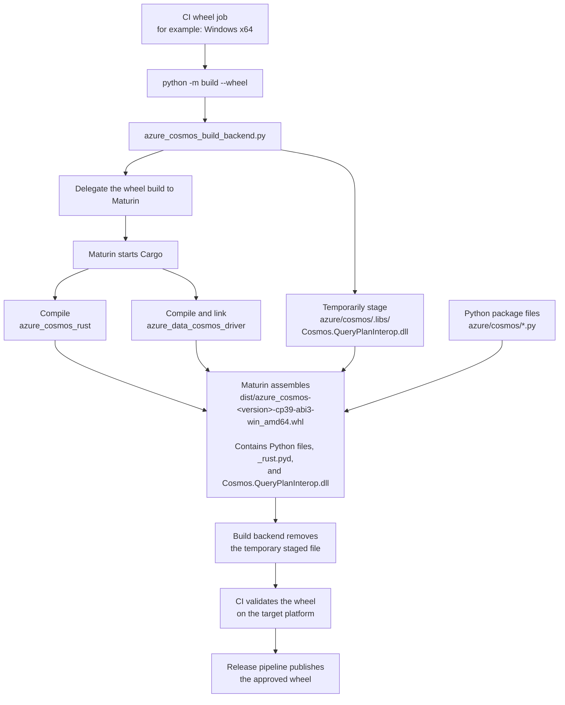
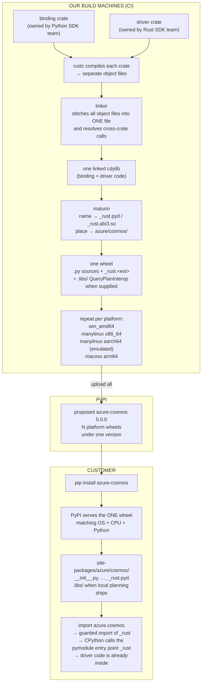

# From Pure Python to a Shipped Rust Wheel

This document describes how the Azure Cosmos DB Python SDK's **packaging** and **CI/release
pipeline** change when a Rust extension is added.

It follows the transition from the pure-Python package model to a **proposed** v5
native-package model: a compiled Rust extension with platform-specific wheels.

The current development checkout builds the `azure_cosmos_rust` binding against a
sibling `azure-sdk-for-rust` directory. That path is for local development only. The
configuration committed for release must select the approved driver published on
crates.io.

## Proposed release plan at a glance

The intended release arrangement is:

1. Commit the Python-owned binding source and build configuration to
   `azure-sdk-for-python`.
2. In `azure_cosmos_rust/Cargo.toml`, select an approved published
   `azure_data_cosmos_driver` crates.io version and enable its required
   `__internal_native_query_plan` feature.
3. Check in `sdk/cosmos/azure-cosmos/rust-toolchain.toml` with the exact stable Rust
   compiler selected for release, at or above the package MSRV.
4. On each CI build machine, Cargo downloads that driver source from crates.io and
   compiles the binding and driver into one dynamic library.
5. Maturin gives that library its Python extension name—`_rust.pyd` on Windows or
   `_rust.abi3.so` on Linux and macOS—and places it under `azure/cosmos/` in the
   wheel.
6. The custom build wrapper adds the matching QueryPlanInterop files under
   `azure/cosmos/.libs`, then lets Maturin finish the wheel.
7. Publish one `azure-cosmos` wheel for each supported operating-system and processor
   combination.

The Rust driver source is **not committed to `azure-sdk-for-python`**. The following
table separates what is stored and what is delivered:

| Location or artifact | Contains the Rust driver source? | Contains compiled driver code? |
|----------------------|----------------------------------|--------------------------------|
| `azure-sdk-for-python` repository | No; it contains the binding source and a crates.io version declaration | No committed release binary |
| CI build directory | Yes; Cargo downloads the selected crates.io source while building | Yes, after Cargo compiles it |
| Customer wheel | No Rust source | Yes; the binding and driver are linked into `_rust.pyd` or `_rust.abi3.so` |
| Optional `azure-cosmos` source distribution | It does not need to embed the driver source; Cargo can download the declared crates.io dependency during the customer's build | No, until the customer builds it |
| crates.io package for `azure_data_cosmos_driver` | Yes | No platform-specific Python extension |

### Customer wheel requirements at a glance

The detailed compatibility contract appears in section 10. At a glance, a customer
installing a compatible wheel needs:

- A supported CPython version, currently proposed as CPython 3.9 through 3.13.
- A supported operating system and processor combination.
- A sufficiently recent `pip`.

`pip` installs the declared Python dependencies. The customer does not need Rust,
Cargo, Maturin, a compiler, an `azure-sdk-for-rust` checkout, or a separate
QueryPlanInterop download.

### Customer building from a source distribution

A **source distribution**, or **sdist**, is an archive containing source and build
instructions rather than precompiled `_rust` code. Maturin can create an sdist, but
whether the v5 release publishes one remains a release-policy decision.

If an sdist is published and customers are expected to build it, they need:

- A supported CPython version and `pip`.
- Rust and Cargo at or above the declared minimum.
- The native compiler and operating-system build tools required for their platform.
- Network access to crates.io, unless the approved driver source is supplied through
  an approved internal source mirror.
- Every other native dependency required by the build.
- An approved QueryPlanInterop input if the source-built wheel is expected to include
  local query planning. Without it, the current design builds without that sidecar and
  the driver uses the Cosmos DB Gateway for query plans.

During that build, Cargo downloads the published Rust driver source.

---

## Table of contents

- [1. Current release shape: one universal wheel and one source archive](#1-current-release-shape-one-universal-wheel-and-one-source-archive)
- [2. What's in the repos: two Rust crates](#2-whats-in-the-repos-two-rust-crates)
- [3. Building the binding and its driver dependency](#3-building-the-binding-and-its-driver-dependency)
- [4. The output Python can't import yet: `cdylib`](#4-the-output-python-cant-import-yet-cdylib)
- [5. What Cargo produces for this project](#5-what-cargo-produces-for-this-project)
- [6. How Maturin, Cargo, and the Python build command work together](#6-how-maturin-cargo-and-the-python-build-command-work-together)
- [7. How Maturin knows what to do: `pyproject.toml`](#7-how-maturin-knows-what-to-do-pyprojecttoml)
- [8. What actually ships: the wheel](#8-what-actually-ships-the-wheel)
- [9. Why QueryPlanInterop must be shipped beside `_rust`](#9-why-queryplaninterop-must-be-shipped-beside-_rust)
- [10. One wheel becomes many: platforms, `abi3`, and `manylinux`](#10-one-wheel-becomes-many-platforms-abi3-and-manylinux)
- [11. The release math changes: today vs. after v5](#11-the-release-math-changes-today-vs-after-v5)
- [12. The package-level edits](#12-the-package-level-edits)
- [13. The CI pipeline edits](#13-the-ci-pipeline-edits)
- [14. The shape that comes out the other end](#14-the-shape-that-comes-out-the-other-end)
- [15. What System Engineering must implement and confirm](#15-what-system-engineering-must-implement-and-confirm)
- [16. Rolling it out without breaking a release](#16-rolling-it-out-without-breaking-a-release)
- [17. What stays the same unless service requirements change](#17-what-stays-the-same-unless-service-requirements-change)
- [18. Where it all ends up: the customer's machine](#18-where-it-all-ends-up-the-customers-machine)

---


## 1. Current release shape: one universal wheel and one source archive

The build-and-ship side of **v5** — the first release where part of the SDK is written in
Rust — changes almost every assumption baked into the current release pipeline.

The pure-Python baseline used by the Rust migration branch is `azure-cosmos==4.16.2`:

```
Pure-Python migration baseline (azure-cosmos 4.16.2):
  - Package generation is active in the Linux job.
  - It produces TWO files:
        azure_cosmos-4.16.2-py3-none-any.whl     (one wheel, works everywhere)
        azure_cosmos-4.16.2.tar.gz               (a source archive)
  - The normal release shape is one wheel plus one source archive.
```

The phrase that matters is **`py3-none-any`**: one wheel, any operating system, any CPU,
and every Python version allowed by the package's `Requires-Python` metadata.

**Problem:** the moment the SDK contains compiled Rust, `py3-none-any` becomes
impossible, because compiled code is specific to an operating system and CPU. Before any of that can be planned, it helps to understand
what's actually in the repo now — including files that don't usually appear in a Python
project.

---

## 2. What's in the repos: two Rust crates

The Python SDK and Rust driver are in separate sibling repositories. The `azure-cosmos`
package contains the Python-owned binding source, while the driver source remains in
`azure-sdk-for-rust`:

```text
source/repos/
├── azure-sdk-for-python/
│   └── sdk/cosmos/azure-cosmos/
│       ├── azure/cosmos/                   ← the Python package
│       │   ├── __init__.py
│       │   ├── cosmos_client.py
│       │   └── _rust.pyd                   ← compiled extension on Windows
│       ├── azure_cosmos_rust/              ← Rust: the binding crate
│       │   ├── Cargo.toml
│       │   ├── build.rs                    ← rejects QueryPlanInterop files built for the wrong platform
│       │   ├── query_plan_binary.rs        ← reads the target CPU from native-library files
│       │   └── src/*.rs
│       ├── azure_cosmos_build_backend.py   ← adds QueryPlanInterop files to the wheel
│       ├── Cargo.toml                      ← binding workspace manifest
│       └── pyproject.toml                  ← Python/Maturin build manifest
└── azure-sdk-for-rust/
    └── sdk/cosmos/azure_data_cosmos_driver/
        ├── Cargo.toml
        └── src/*.rs                        ← Rust: the driver crate
```

The process begins when a developer or CI runs:

```bash
python -m build
```

This is the standard Python entry point for creating an installable package. It does not
know how to compile Rust or construct this particular wheel. Instead, it reads
`pyproject.toml` to discover the project's configured build backend:

```toml
build-backend = "azure_cosmos_build_backend"
```

That backend is the file `azure_cosmos_build_backend.py`. This document calls it the
**custom wrapper** because it runs immediately around Maturin: it performs
Cosmos-specific preparation, calls Maturin for the normal Rust extension and wheel build,
and then performs Cosmos-specific cleanup. It does not replace Maturin and does not rename
or move Cargo's Rust extension output itself.

For a wheel build, the wrapper performs this sequence:

1. Temporarily copy the target platform's QueryPlanInterop files into
   `azure/cosmos/.libs`.
2. Call Maturin.
3. Let Maturin invoke Cargo, give the resulting extension its Python filename, place it
   under `azure/cosmos/`, and assemble the wheel.
4. Remove the temporary QueryPlanInterop copies from the source checkout after the build,
   whether the build succeeds or fails.

The backend receives a QueryPlanInterop binary built for the target platform—for example,
Windows x64—and temporarily copies it into:

```text
azure/cosmos/.libs/
```

Here, `azure/cosmos/` is the Python package directory that customers ultimately import.
The copy is temporary only in the source checkout. It must be present while the wheel is
assembled so that it becomes a permanent part of the finished wheel. Once the build
finishes, the backend removes the staged copy, preventing a Windows or x64 binary from
being accidentally reused in a later Linux, macOS, or ARM64 build.

After staging QueryPlanInterop, the backend hands the main build work to **Maturin**.
Maturin is the bridge between Python packaging and Rust: it understands both Python wheels
and Cargo-based Rust projects. It knows where the binding crate lives, where the Python
source files live, and that the compiled module should be installed as
`azure.cosmos._rust`.

Maturin then invokes **Cargo**, Rust's package manager and build tool. Cargo resolves the
Rust dependencies and compiles both Rust crates:

- `azure_cosmos_rust`, the Python-facing binding.
- `azure_data_cosmos_driver`, the Cosmos implementation engine.

Although the crates live in separate repositories, the binding declares the driver as a
dependency. Cargo follows that relationship, compiles both, and links their code into one
native Python extension such as `_rust.pyd`.

Before compilation completes, Cargo automatically runs the binding's `build.rs`. That build
script uses `query_plan_binary.rs` to inspect the staged QueryPlanInterop binary's header.
It verifies that the binary matches the intended operating system, CPU architecture, and
bitness. For example, it prevents an ARM64 QueryPlanInterop DLL from being included in a
Windows x64 wheel.

Once validation and compilation succeed, Maturin assembles the final platform-specific
wheel. Conceptually, the installed Python package looks like:

```text
azure/cosmos/
├── Python SDK files
├── _rust.pyd                    compiled binding and driver
└── .libs/
    └── Cosmos.QueryPlanInterop.dll
```


The customer receives one ordinary Python wheel containing the Python SDK, the compiled
Rust implementation, and the compatible query-planning library. The customer does not need
Maturin, Cargo, a Rust compiler, or a separate QueryPlanInterop installation.

> **How the current build resolves the driver.** The binding's `Cargo.toml` declares
> `azure_data_cosmos_driver` as a local **path dependency** pointing to the sibling
> `azure-sdk-for-rust` checkout. Maturin starts the binding build, then Cargo compiles both
> crates and links the driver into the binding's single Python extension (`_rust.pyd` on
> Windows or `_rust.abi3.so` on Linux/macOS). The `azure_cosmos_rust` directory contains only
> binding source, but the resulting extension contains compiled code from both crates. The current
> manifest does not download the driver from crates.io. Before release, that dependency
> declaration must be changed to the approved published `azure_data_cosmos_driver` version;
> the sibling path remains a local-development arrangement only.

**Problem:** these are *two separate crates*, and the binding depends on the driver.
When a build runs, how does one `cargo build` compile both and link them together — and make
sure they agree on the versions of the libraries they share?

---

## 3. Building the binding and its driver dependency

Two Cargo mechanisms answer that, and they are easy to confuse:

| Mechanism | The question it answers | Where it's declared |
|---|---|---|
| **Workspace membership** | Which crates in *this* repository are built together and share settings? | `[workspace] members` in the root `Cargo.toml` |
| **Dependency resolution** | Which crates get compiled at all, from where, and at which version? | `[dependencies]` in each crate, plus Cargo's version reconciliation |

A **workspace** is Cargo's way of saying
"these crates are built together and share settings" — declared in a root-level `Cargo.toml`
that compiles nothing itself. The Python repository has one member:

```toml
[workspace]
members = ["azure_cosmos_rust"]
resolver = "2"
```

The driver is not a member, because its source is not in this workspace; it belongs to the
sibling `azure-sdk-for-rust` repository. The binding names it under its own `[dependencies]`:

```toml
# sdk/cosmos/azure-cosmos/azure_cosmos_rust/Cargo.toml  (the binding crate)
[dependencies]
pyo3 = { version = "0.22", features = ["extension-module", "abi3-py39"] }
azure_data_cosmos_driver = { path = "../../../../../azure-sdk-for-rust/sdk/cosmos/azure_data_cosmos_driver", features = ["__internal_native_query_plan"] }
tokio = { workspace = true, features = ["rt-multi-thread", "macros"] }
azure_core = { workspace = true }
# ... pyo3-async-runtimes, parking_lot, serde, serde_json, url, async-trait ...
```

That snippet shows the **current local-development configuration**, not the required
release configuration. Before the v5 build configuration is merged to `main`, the committed
dependency must instead have this form:

```toml
azure_data_cosmos_driver = {
    version = "<approved crates.io version>",
    features = ["__internal_native_query_plan"],
}
```

The two fields answer different questions:

- `version` tells Cargo which published `azure_data_cosmos_driver` source release to
  download from crates.io. This removes any dependency on the directory layout of a
  developer's machine.
- `features` enables optional code that exists inside that selected driver release.
  `__internal_native_query_plan` includes the driver's local query-plan functionality.
  The selected crates.io version must contain that feature and have the behavior required
  by this SDK.

The Python repository does not need to copy the Rust driver's source into
`azure-sdk-for-python`. The committed `main` branch contains the binding source and the
versioned dependency declaration; Cargo obtains the published driver source from crates.io
during the build.

A developer who needs to test unpublished driver changes may locally override that
crates.io dependency with the sibling checkout using a Cargo patch or local Cargo
configuration. That override must remain outside the committed release package. Editing
the committed binding manifest back to a sibling `path = ...` dependency would make clean
CI, an unpacked sdist, and release agents depend on a developer-specific directory again.

Cargo walks the binding's complete dependency graph. With the current development
declaration, it reads the driver from the sibling path. With the required release
declaration, it downloads the approved version from crates.io. In both cases Cargo compiles
the driver and links it into the binding's `cdylib` without making the driver a workspace
member. Membership decides who shares workspace settings; the dependency declaration
decides which source Cargo builds.

**Declaring versions in one place.** Look again at `tokio = { workspace = true }` in the
snippet above: it names a crate and its features but no version. That declaration is
deliberately incomplete, and it is finished in a *different file*. Two manifests are involved:

| File | What it declares for `tokio` |
|---|---|
| `sdk/cosmos/azure-cosmos/azure_cosmos_rust/Cargo.toml` (the binding crate) | *which* crate to depend on, and which features it needs — `rt-multi-thread`, `macros` |
| `sdk/cosmos/azure-cosmos/Cargo.toml` (the workspace root) | *what version* every member crate gets — `tokio = "1"` |

`workspace = true` is the binding manifest saying "take the version from the root manifest's
`[workspace.dependencies]` table":

```toml
# sdk/cosmos/azure-cosmos/Cargo.toml  (the workspace root)
[workspace.dependencies]
azure_core = "1.1.0"
tokio      = "1"
serde      = { version = "1", features = ["derive"] }
url        = "2"
# ... async-lock, async-trait, base64, futures, reqwest, serde_json, tracing, uuid ...
```

The point is to keep version numbers out of individual crate manifests so members cannot
drift apart. The binding now inherits both `tokio` and `azure_core` from this table.
`azure_core = "1.1.0"` is also compatible with the driver's crates.io requirement, so Cargo
can unify them into one `azure_core` package. The root table still has no effect on the
external driver, which reads its own repository's manifest.

One project-specific dependency-policy question remains: Cargo unions features requested by
the binding and driver on that shared copy. Review the resulting feature set for binary size
and dependency policy; this is not a version conflict.


**Moving to a new driver version is a binding code change, not a version bump.** This is
easy to under-budget, because in a pure-Python project "take the new dependency" is an edit
to one line of metadata. It is not that here. 

Two consequences worth planning around:

- **The published Python API is unaffected.** None of the above reaches customer code. What
  customers feel is *cadence*: a driver release that fixes a known parity gap needs
  binding edits landed first, then a new `azure-cosmos` release, before the fix is on
  PyPI.


**Verify resolution on a clean build, don't assume it.** The branch does not commit
**`Cargo.lock`**, the generated file recording every crate in the graph at one exact version.
The branch explicitly ignores `/Cargo.lock`, so its current policy is to resolve from the
manifest ranges rather than commit the generated lock. That distinction follows from the
Cargo version-range model: `Cargo.toml` says what the build will *accept*, while
`Cargo.lock` records what one build actually *got*. 

**The Rust compiler policy needs two values, not one vague "stable" setting.**

- The **minimum supported Rust version**, or **MSRV**, is the oldest compiler the package
  promises can build the source. The package MSRV is the higher of the binding's requirement
  and the selected published driver's requirement. The current binding declares 1.75, while
  the inspected driver declares 1.88, so 1.88 is the effective minimum for that inspected
  pairing. Confirm the exact value against the driver version selected for release, then
  update the root `rust-version`.
- The **release-wheel compiler** should be one exact, pinned stable Rust version at or above
  that MSRV. Do not use an unpinned `stable` channel whose version can change between builds.
  Record the selected version in a checked-in `rust-toolchain.toml` so local package builds
  and Windows, Linux, and macOS CI jobs select the same compiler.

`rust-toolchain.toml` is a `rustup` configuration file, not a Cargo dependency manifest.
When a developer or CI job runs `cargo`, `rustc`, or Maturin in the file's directory or a
child directory, `rustup` reads the file and selects the declared compiler toolchain. If
that toolchain is not already installed, `rustup` can install it before the build. This
prevents a floating `stable` channel from silently changing the compiler between two local
or release builds. The file can also declare required Rust components and compilation
targets if the build later needs them.

The file does **not**:

- define the package's MSRV; `rust-version` in `Cargo.toml` does that;
- lock Rust crate dependency versions; `Cargo.lock` does that; or
- install Rust on a machine that does not already provide `rustup` or an equivalent
  EngSys-managed toolchain installation mechanism.

No `rust-toolchain.toml` exists in this repository today. The preferred location is:

```text
sdk/cosmos/azure-cosmos/rust-toolchain.toml
```

`rustup` applies a toolchain file to its directory and descendants. Keeping it at the
package root therefore makes the selection apply to the Cosmos binding workspace while
avoiding a repository-wide compiler change for unrelated Python SDK packages. Its final
contents would have this shape:

```toml
[toolchain]
channel = "<approved-pinned-stable-version>"
profile = "minimal"
```

The placeholder must be replaced by the exact approved stable version. `profile = "minimal"`
requests only the components needed for compilation rather than the larger default
installation. Maturin ultimately invokes Cargo, so the Cargo process selected through
`rustup` uses this pinned compiler without requiring Maturin-specific compiler selection.
EngSys must ensure that each native-package job has `rustup` or an equivalent installer and
honors this file inside the Windows environment, Linux build and emulation environments,
and macOS environment. If EngSys requires one shared repository-level toolchain file
instead, that placement must be agreed explicitly because it can affect other packages.

If customer sdist builds are supported, CI should also perform a separate build with the
declared MSRV. Building release wheels with a newer pinned stable compiler does not prove
that the advertised minimum compiler can build the source.

**One enabled feature adds a second native component.** The binding enables the driver's
explicitly internal `__internal_native_query_plan` feature. The Rust driver code is linked into
the PyO3 extension, but QueryPlanInterop is loaded separately at runtime. That distinction
changes both wheel contents and release validation; §9 covers the complete build, loading,
fallback, and artifact-source model.

**Problem:** once those prerequisites are satisfied, `cargo build` produces a raw
platform library — for example, `azure_cosmos_rust.dll` on Windows — and
`import azure.cosmos._rust` still does nothing. Cargo built *a* file, but not one Python knows
how to load.

---

## 4. The output Python can't import yet: `cdylib`

**The problem:** Cargo's default output for a library is a `.rlib` — a Rust-only format
that only *other Rust code* can use. Python can't load it. Even the `.dll` that appears
isn't automatically importable.

**The solution — tell Cargo to build a `cdylib`.** In the binding crate's `Cargo.toml`:

```toml
[lib]
name       = "azure_cosmos_rust"
crate-type = ["cdylib"]
```

`crate-type = ["cdylib"]` tells Cargo to produce a dynamic-library format intended for
non-Rust consumers. It does not by itself turn ordinary Rust functions into a Python API;
PyO3 supplies the exported CPython entry point and conversions described in §5.

"Dynamic" is worth pinning down against its opposite:

- **Static library:** the library's machine code is copied *into* the program that uses it
  at build time; there's no separate library file at run time. (Rust `.rlib`/`.a`.)
- **Dynamic library:** the library stays its own file, and the program loads it at run time
  when it needs it. (Rust `cdylib`: `.dll` on Windows, `.so` on Linux, `.dylib` on macOS.)

Python extensions are **always** dynamic libraries, because the "program" loading them is
`python.exe`, and it loads extension modules on the fly when an `import` runs.

But there's a naming mismatch. Cargo produces a library named for the Rust crate, while
Python must import a file named for the Python module:

| Platform | Cargo's raw `cdylib` output | Python imports |
|----------|------------------------------|----------------|
| Windows  | `azure_cosmos_rust.dll`      | `_rust.pyd` |
| Linux    | `libazure_cosmos_rust.so`    | `_rust.abi3.so` |
| macOS    | `libazure_cosmos_rust.dylib` | `_rust.abi3.so` |

The terms *compiled extension*, *platform extension*, *native extension*, and *the
`.pyd`/`.so`* all mean this same single Python-loadable file: `_rust.pyd` on Windows and
`_rust.abi3.so` on Linux and macOS. "Platform" and "native" emphasize that it contains
machine code built for one operating system and processor architecture. "Extension" is
Python's term for an importable module implemented in compiled code rather than a `.py`
file.

Cargo alone does not create the final Python filename or package location. The configured
build system does. `pyproject.toml` sets:

```toml
[tool.maturin]
manifest-path = "azure_cosmos_rust/Cargo.toml"
python-source = "."
module-name = "azure.cosmos._rust"
```

The package's custom build backend wrapper, `azure_cosmos_build_backend.py`, calls Maturin.
Maturin builds the Cargo `cdylib`, locates Cargo's output, gives it the correct Python
extension filename, and places it under `azure/cosmos/` while assembling the wheel. The CI
pipeline should invoke that configured backend/Maturin build; it should not contain separate
code that searches for, renames, or moves the Rust library.

The custom build backend wrapper has a different responsibility: it temporarily stages the
QueryPlanInterop files under `azure/cosmos/.libs` and then delegates normal extension
building and wheel assembly to Maturin.

**Problem:** even after renaming the file by hand and getting Python to load it, the
functions inside are still unreachable. They speak Rust — Rust types, Rust calling
conventions, Rust errors. A Rust `String` is not a Python `str`; a Rust `Result` is not a
raised exception. Something has to translate at the boundary.

---

## 5. What Cargo produces for this project

The Rust source that belongs to the Python package is in:

```text
azure_cosmos_rust/src/*.rs
```

Its `Cargo.toml` declares the sibling Cosmos driver as a dependency:

```text
azure-sdk-for-rust/sdk/cosmos/azure_data_cosmos_driver
```

When Cargo builds `azure_cosmos_rust`, it follows that dependency, compiles both crates, and links
them into one native library. On Windows, the raw Cargo output is conceptually:

```text
target/release/azure_cosmos_rust.dll
```

On Linux, it is a `.so` file. PyO3 supplies the small Python-facing boundary inside that library.


At this point Cargo has completed its job: the Rust code is compiled. Cargo does **not**:

- name the file `_rust.pyd` or `_rust.abi3.so`;
- place it under `azure/cosmos/`;
- include the Python files such as `cosmos_client.py`;
- include `Cosmos.QueryPlanInterop.dll`; or
- create an `azure_cosmos-...whl` file.

Maturin performs those Python-package steps.

---

## 6. How Maturin, Cargo, and the Python build command work together

There are two entry points: one for local development and one for producing the wheel that ships.

### Local development: `maturin develop --release`

Run this from `sdk/cosmos/azure-cosmos`:

```powershell
maturin develop --release
```

Maturin starts Cargo, which builds the Rust binding and driver as one native Python extension.
Maturin then gives the compiled file its Python filename and places it in the active Python
environment so `from azure.cosmos import _rust` can load it. It also connects imports of the
`azure-cosmos` Python package to the source files in the developer's local folder.

This is an **editable installation**: Python uses the source files in the developer's local
`azure-sdk-for-python` folder instead of a separate copied set. Python edits therefore take effect
without reinstalling the SDK. After changing Rust code, the developer reruns
`maturin develop --release` to rebuild the native extension.

This command does not create the final release wheel or include QueryPlanInterop. Section 9
explains QueryPlanInterop and local query planning.

### Official release wheel: the CI pipeline runs `python -m build --wheel`

The official wheels are built by controlled CI jobs, not on a developer's machine. Each CI job
targets one supported operating system and CPU architecture and runs:

```powershell
python -m build --wheel
```

Developers can run the same command locally to check packaging, but a local wheel is not a release
artifact and is not published.

This command is the top-level Python packaging entry point. It does not compile Rust itself. It
reads `pyproject.toml` and calls the configured backend:

```toml
build-backend = "azure_cosmos_build_backend"
```



The diagram shows one Windows x64 job. Linux and macOS jobs follow the same flow but produce their
own platform wheel. For example, Linux packages `_rust.abi3.so` and the Linux QueryPlanInterop
library instead of the Windows files. The release pipeline gathers, validates, and publishes the
approved wheels from all required jobs.

The responsibilities are:

| Tool | What it does in this project |
|---|---|
| Cargo | Compiles `azure_cosmos_rust` and its `azure_data_cosmos_driver` dependency. |
| Maturin | Invokes Cargo, gives the result its Python extension name, and combines it with the Python package. |
| `azure_cosmos_build_backend.py` | Stages and validates the platform's QueryPlanInterop files, delegates to Maturin, and cleans up the source tree. |
| `python -m build --wheel` | Starts the standard isolated Python wheel build using the configured backend. |

Do not use `maturin build` as the release command for this package. It calls Maturin and Cargo, but
bypasses the Cosmos-specific backend that stages QueryPlanInterop.

The next section shows the `pyproject.toml` settings that tell Maturin which Cargo manifest to use,
where the Python package lives, and why the names must agree.

---

## 7. How Maturin knows what to do: `pyproject.toml`

Maturin needs four pieces of information:

1. Which Rust crate should it compile?
2. Where are the Python `.py` files?
3. Where should it install the compiled extension?
4. Which Python module must that extension initialize when Python loads it?

The relevant `pyproject.toml` settings provide those answers:

```toml
[build-system]
requires      = ["maturin>=1.4,<2.0"]
build-backend = "azure_cosmos_build_backend"    # package staging wrapper
backend-path  = ["."]

[tool.maturin]
manifest-path = "azure_cosmos_rust/Cargo.toml"  # which crate to build
python-source = "."                             # where the Python package lives
module-name   = "azure.cosmos._rust"            # the import path of the compiled file
features      = ["pyo3/extension-module"]
```

At a high level, the flow is:

```text
pyproject.toml
    tells Maturin which Cargo.toml to use
                 ↓
Cargo compiles azure_cosmos_rust and its Rust-driver dependency
                 ↓
Maturin turns the compiled library into a Python extension
                 ↓
Maturin installs it at azure.cosmos._rust
                 ↓
Python calls the #[pymodule] function named _rust
```

Four names appear across that flow, and each serves a different audience:

### 1. Rust crate library name

The binding's `Cargo.toml` names the Rust library `azure_cosmos_rust`. Cargo uses this internal
name for its raw build output. Customers do not import that raw filename directly; Maturin later
gives it the platform-specific Python extension name, such as `_rust.pyd` on Windows or
`_rust.abi3.so` on Linux.

### 2. Python distribution name

The distribution name is what customers install:

```bash
pip install azure-cosmos
```

It also determines the distribution portion of the wheel filename, where the dash is normalized
to an underscore: `azure_cosmos-...whl`. This name identifies the complete product containing the
Python files and the compiled extension; it is separate from the Rust crate's internal name.

### 3. Python import path

This setting:

```toml
module-name = "azure.cosmos._rust"
```

tells Maturin to install the compiled extension inside the `azure.cosmos` package so Python code
can run:

```python
from azure.cosmos import _rust  # type: ignore[attr-defined]  # generated native extension
```

### 4. PyO3 module function

After Python opens the compiled extension, it needs an initialization entry point that creates the
module and registers its Python-callable functions. PyO3 supplies that through the `#[pymodule]`
function in `azure_cosmos_rust/src/lib.rs`:

```rust
#[pymodule]
fn _rust(_py: Python<'_>, m: &Bound<'_, PyModule>) -> PyResult<()> {
    add_pyfn!(m, runtime::init_client);
    add_pyfn!(m, documents::create_item);
    // ...the remaining sync/async operation and diagnostics functions...
    Ok(())
}
```

### The required matching rule

Names 3 and 4 must match on the final segment:

```text
module-name = "azure.cosmos._rust"
                              └────┘
                                  must match
#[pymodule]
fn _rust(...)
   └────┘
```

If the Rust function is renamed to `cosmos_rust` without changing `module-name`, compilation can
succeed while `import azure.cosmos._rust` fails at run time. Python opens the extension expecting
the `_rust` initialization entry point and cannot find it.

The crate library name does not need to match `_rust`; Maturin translates the internal Cargo
output into the configured Python module path.


In one sentence: `pyproject.toml` tells Maturin which Rust crate to compile and where to install
it; Cargo's library name is internal, while the final segment of `module-name` must match the Rust
`#[pymodule]` function that Python calls.

`maturin develop` gives a live platform extension in the working tree,
and everything imports. But that's a local dev environment. Customers get a wheel from PyPI. What is a wheel, and what's actually inside the one that
ships?

---

## 8. What actually ships: the wheel

**The problem:** the thing tested locally (a `.pyd` sitting in the source tree) is not
the thing customers install. The shipped artefact's contents matter, because everything
about the release pipeline is about producing *that*.

Once the package metadata and release
pipeline are completed, a platform build should produce a wheel shaped like:

```
azure_cosmos-5.0.0-cp39-abi3-win_amd64.whl
```

That is not the current artifact name. With the repository as it stands, Maturin derives
the distribution name and version from the binding crate and attempts to produce
`azure_cosmos_rust-0.1.0-...whl`. Release metadata still has to make the native build produce
the `azure-cosmos` distribution and version.

A wheel is just a ZIP file. Unzipping this one:

```
azure/cosmos/
├── __init__.py          ← the .py source files, copied as-is (NOT compiled)
├── cosmos_client.py
├── container.py
├── py.typed
├── _query_advisor/query_advice_rules.json
├── …
├── _rust.pyd            ← the compiled Rust extension (binding + driver machine code)
└── .libs/
    ├── Cosmos.QueryPlanInterop.dll  ← Windows example; .so/.dylib on Linux/macOS
    └── [its native dependencies]
azure_cosmos-5.0.0.dist-info/
├── METADATA
├── WHEEL
└── RECORD
```

The wheel always needs the normal Python source, package data, one compiled Python extension,
and standard `.dist-info` metadata. A release claiming local query planning also needs the
platform-specific QueryPlanInterop library and dependencies under `.libs`, as described in
§9; otherwise queries use the Gateway fallback. It is called a "binary wheel" because it
includes native machine code, not because the Python source is compiled.

Every segment of the filename is doing work:

- `azure_cosmos` — the package name (the dash becomes an underscore, a PyPI convention).
- `5.0.0` — the version.
- `cp39` — the CPython stable-ABI floor used with the next `abi3` tag: 3.9.
- `abi3` — the stable ABI (§10).
- `win_amd64` — the operating system and CPU: 64-bit Windows.

that last segment, `win_amd64`, is the whole difficulty. That one
`_rust.pyd` is Windows-x86-64 machine code. It **cannot** load on Linux, and it cannot run
on an Apple Silicon Mac. The old `py3-none-any` wheel ran everywhere; this one runs on
exactly one platform. So one wheel is no longer enough.

---

## 9. Why QueryPlanInterop must be shipped beside `_rust`

**Start with a Windows x64 customer example.** The customer installs:

```
azure_cosmos-5.0.0-cp39-abi3-win_amd64.whl
```

The wheel contains `_rust.pyd`. 
It does **not** contain the code that creates a local query plan. That code is in a separate file
named `Cosmos.QueryPlanInterop.dll`.

If the DLL is present and loads successfully, the Rust query path can create the query plan on
the customer's machine. If the DLL is missing or cannot load, the SDK asks the Cosmos Gateway
for the query plan instead. The query still works, but it did not use local query planning.

This is why a wheel that is meant to provide local query planning needs two native files:

| Platform | Python extension containing the Rust driver | Separate query-plan library |
|---|---|---|
| Windows | `_rust.pyd` | `Cosmos.QueryPlanInterop.dll` |
| Linux | `_rust.abi3.so` | `libqueryplaninterop.so` |
| macOS | `_rust.abi3.so` | `libqueryplaninterop.dylib` |

QueryPlanInterop may need other native libraries, so those files must also be
included in the wheel.

### Files installed for a Windows customer

The wheel installs the files like this:

```
azure/cosmos/
├── _rust.pyd
└── .libs/
    ├── Cosmos.QueryPlanInterop.dll
    └── QueryPlanInteropDependency.dll
```

`QueryPlanInteropDependency.dll` is only an example name. The real wheel must include every DLL
that `Cosmos.QueryPlanInterop.dll` needs and that Windows does not already provide.


### How a release build adds the files

For an official release, each platform's CI wheel job must receive native files already built for
that operating system and processor. The job sets:

```
AZURE_COSMOS_QUERYPLANINTEROP_SOURCE_DIR=<directory containing the native files>
```

No build converts a Windows DLL into a Linux or macOS library. The QueryPlanInterop owner or
artifact pipeline must build each one separately:

```text
Windows x64 build -> Cosmos.QueryPlanInterop.dll
Linux x64 build   -> libqueryplaninterop.so
macOS ARM64 build -> libqueryplaninterop.dylib
```

The directory must contain exactly one primary QueryPlanInterop library for the target platform.
It also contains additional native files only when that primary library really depends on them.
`QueryPlanInteropDependency.dll` in the earlier example is a placeholder, not a second file that
every wheel automatically requires.

For example, the Windows x64 CI job might set:

```powershell
$env:AZURE_COSMOS_QUERYPLANINTEROP_SOURCE_DIR = "C:\build-artifacts\query-plan\windows-x64"
python -m build --wheel
```

That directory might contain only:

```text
C:\build-artifacts\query-plan\windows-x64\
└── Cosmos.QueryPlanInterop.dll
```

or it might contain the primary DLL plus its real native dependencies.

The wheel build then follows this path:

```text
platform artifact directory
    -> azure_cosmos_build_backend.py temporarily copies the native files
    -> source checkout: azure/cosmos/.libs/
    -> build.rs verifies the files match the target OS and processor
    -> Maturin packages _rust and .libs/* into the wheel
    -> the backend removes only the temporary copies from the source checkout
```

The cleanup does **not** remove the files from the completed wheel. After installation, a Windows
customer has a layout such as:

```text
site-packages/azure/cosmos/
├── _rust.pyd
└── .libs/
    └── Cosmos.QueryPlanInterop.dll
```

The Python Rust backend finds that installed `.libs` directory and tells the Rust driver to load
QueryPlanInterop from it. This is why the source checkout can be cleaned while the installed SDK
can still create query plans locally.

The same packaging variable can be set manually when a developer wants to test a wheel build
locally:

```powershell
$env:AZURE_COSMOS_QUERYPLANINTEROP_SOURCE_DIR = "C:\query-plan\x64"
python -m build --wheel
```

Calling `maturin build` directly skips these copy and cleanup steps. Release wheel builds must
therefore use `python -m build --wheel`.

An editable local build such as `maturin develop --release` deliberately does not package release
sidecars. To use local query planning, the developer points the running SDK at an external native
library directory instead:

```
AZURE_COSMOS_QUERYPLANINTEROP_DIR=<directory containing the native files>
```

Without that runtime setting or an operating-system-visible native library, Rust queries still
work, but the driver asks the Cosmos Gateway for their query plans.

### How the build rejects the wrong native file

Each wheel is for one operating system and CPU. The native files under `.libs` must match it.

The check lives in `azure_cosmos_rust/build.rs`, a **build script** — a Rust file Cargo
compiles and runs before it compiles the crate itself. 

### How the installed wheel finds QueryPlanInterop

Both the sync and async Rust backends calculate this directory when they import `_rust`:

```
Path(_rust.__file__).resolve().parent / ".libs"
```

For a normal Windows installation, the result is similar to:

```
C:\venv\Lib\site-packages\azure\cosmos\.libs
```

Before the driver is initialized, the Python wrapper sets
`AZURE_COSMOS_QUERYPLANINTEROP_DIR` to that installed `.libs` directory. If a developer or test
already supplied the variable, the wrapper preserves that explicit value.

The driver then tries these locations in order:

1. `AZURE_COSMOS_QUERYPLANINTEROP_DIR`, using the absolute directory supplied by the caller or
   the Python wrapper; and
2. the bare library name, which hands the search to the operating system's normal rules.

The driver loads the library lazily on the first native query-plan attempt and caches that
result for the process lifetime. The environment variable therefore must be set before the
first query reaches the native provider; importing either Rust backend performs that setup.

On Windows, the first attempt passes the absolute DLL path to `LoadLibraryA`; the second passes
the bare name and uses the normal Windows DLL search. Linux and macOS use the same two-step
model with `dlopen`. The Linux wheel repair step must make dependent-library paths relative to
`$ORIGIN`. The macOS equivalent is `@loader_path`.


### Remaining release work


Five release checks - each one is listed here and explained below:

1. **Supply the libraries.** No checked-in Python pipeline sets
   `AZURE_COSMOS_QUERYPLANINTEROP_SOURCE_DIR`, so no pipeline currently gives the build the
   QueryPlanInterop files.
2. **Check the final repaired and signed wheel.** There is no checked-in test proving that wheel
   repair and signing preserve QueryPlanInterop and its dependent libraries.
3. **Open the wheel archive.** The eight build-wrapper tests check staging and cleanup. They do
   not open the built wheel and assert that the expected `.dll`, `.so`, or `.dylib` files are
   present.
4. **Run native-library tests in CI.** The Rust native tests exist, but all 64 are ignored unless
   CI enables `test_category="native_query_plan"`. No checked-in CI configuration enables it.
5. **Restore query-plan-source observability.** The current driver `main` no longer exposes
   native-plan and Gateway-plan counters to the binding. The release test still needs a
   deterministic driver-supported signal proving that an installed wheel used QueryPlanInterop,
   and a second signal proving Gateway fallback when the library is absent.

The release therefore still needs licensed and signed files for every supported operating system
and CPU. For each wheel, the pipeline must build, repair, sign, open the final archive to check
its native files, install it in a clean environment, prove both native selection and Gateway
fallback with the restored driver-supported signal, and run the 64 native tests with their test
category enabled.

---

## 10. One wheel becomes many: platforms, `abi3`, and `manylinux`

**The problem:** because the compiled `_rust.pyd` is platform-specific, the release now
needs a *separate* wheel for each operating system and CPU it supports. Left unmanaged, it
gets worse: without help, there would also need to be a separate wheel for every *Python
version* (3.9, 3.10, 3.11, …), because each CPython release has slightly different internals
— that's one-wheel-per-platform-per-Python, easily dozens of wheels per release.

**The solution — two mechanisms that keep the number of wheels small.**

**`abi3` (the stable ABI)** removes the need for a separate wheel per Python version. CPython
guarantees that a fixed subset of its internals won't change across versions. If the
extension uses only that subset, **one wheel built with a 3.9 ABI floor can be compatible
with later CPython versions** rather than requiring one wheel per Python version.

This is turned on with a **Cargo feature**. A feature is an optional switch a Rust crate
publishes so callers can enable extra behavior; it's flipped in the `features = [...]` list
where the dependency is declared. The SDK enables PyO3's `abi3-py39` feature in the binding's
`Cargo.toml` (the same line shown in Section 3):

```toml
pyo3 = { version = "0.22", features = ["extension-module", "abi3-py39"] }
#                                                           ^^^^^^^^^ build against the
#                                                           stable ABI, Python 3.9 as the floor
```

`abi3-py39` tells PyO3 to compile against the stable-ABI subset with 3.9 as the minimum,
which produces a `cp39-abi3` tag. The SDK currently declares Python 3.9 through 3.13 support;
forward ABI compatibility does not replace testing or an explicit support declaration for
later Python releases.

**`manylinux`** solves a problem specific to Linux. Linux distributions ship different
versions of the system C library (glibc), and a binary built against a newer glibc won't run
on an older one. The tag `manylinux_2_17` is a promise that the wheel was built against glibc
2.17 or older. A future pipeline would need to build in a compatible manylinux environment
to make that promise; the current Cosmos pipeline does not configure this.

The review established one platform decision: **macOS support is Apple Silicon ARM64
only; Intel macOS is not a target.** The remaining minimum operating-system versions and
Linux compatibility floor still require release-owner confirmation.

The proposed support contract is:

| Support area | Proposed statement |
|--------------|--------------------|
| Python implementation | CPython only |
| Python versions | CPython 3.9 through 3.13 |
| Python ABI | `cp39-abi3`: build against the CPython stable ABI with Python 3.9 as the floor |
| Later CPython versions | Not supported merely because `abi3` may load; add support only after testing and an explicit declaration |
| PyPy | Not supported unless a separate PyPy build and test policy is approved |
| Windows | 64-bit x86 (`AMD64`) |
| Linux | x86-64 and ARM64, using the approved manylinux floor; ARM64 runs under CI emulation |
| macOS | Apple Silicon ARM64 only |
| Intel macOS | Not supported |
| Windows ARM64 | `cibuildwheel` can cross-compile it, but it is not a supported release target until CI can run and validate the resulting wheel or another approved test mechanism exists |

That contract would produce a proposed **four-wheel matrix**, not current
configuration:

```
azure_cosmos-5.0.0-cp39-abi3-win_amd64.whl
azure_cosmos-5.0.0-cp39-abi3-manylinux_2_17_x86_64.whl
azure_cosmos-5.0.0-cp39-abi3-manylinux_2_17_aarch64.whl
azure_cosmos-5.0.0-cp39-abi3-macosx_11_0_arm64.whl
```

| Platform | Wheel suffix |
|----------|--------------|
| Windows 64-bit | `win_amd64` |
| Linux x86_64 | `manylinux_2_17_x86_64` |
| Linux ARM64 | `manylinux_2_17_aarch64` |
| macOS Apple Silicon | `macosx_11_0_arm64` |

The `macosx_11_0_arm64` suffix means ARM64 machine code with macOS 11.0 as the minimum
declared operating-system version. That minimum version, the `manylinux_2_17` floor, and
the other exact tags must still be approved before they become release promises.

These declarations are split across two TOML files; they are not all
`[tool.cibuildwheel]` settings:

| Declaration | Configuration location | Purpose |
|-------------|------------------------|---------|
| CPython stable ABI and 3.9 ABI floor | `azure_cosmos_rust/Cargo.toml`: PyO3 feature `abi3-py39` | Controls which CPython C API the Rust extension uses and produces the `cp39-abi3` wheel tags |
| Supported Python versions and minimum Python version | Release metadata in `pyproject.toml`, such as `requires-python` and classifiers | Tells pip, PyPI, and customers which Python versions the SDK supports |
| CPython build selector | `[tool.cibuildwheel]` in `pyproject.toml` | Selects the CPython build used to produce each `abi3` wheel and excludes unapproved implementations such as PyPy |
| Windows architecture | `[tool.cibuildwheel.windows]` | Selects `AMD64` |
| Linux architectures, build image, and emulator | `[tool.cibuildwheel.linux]` plus EngSys job setup | Selects x86-64 and ARM64, uses the approved manylinux image, and enables the emulator used to run ARM64 builds and tests on the Linux x86-64 agent |
| macOS architecture and minimum deployment version | `[tool.cibuildwheel.macos]` and its build environment | Selects ARM64 only and supplies the approved `MACOSX_DEPLOYMENT_TARGET` |

**`cibuildwheel`** is the tool that would produce this matrix. Given the approved
targets, it runs the package build once per operating-system and processor combination
and collects the resulting wheels. The current `pyproject.toml` has no
`[tool.cibuildwheel]` table and no `[project]` release metadata, so the proposed support
contract is documented here but is not yet encoded in the package build.

### Detailed customer wheel compatibility contract

The release-plan summary at the top of this document gives the short customer requirements.
This section defines what “compatible wheel” means, including the exact Python, processor,
and operating-system constraints:

1. A supported **CPython** version. The current proposed declaration is CPython 3.9
   through 3.13. The `abi3` setting may allow the extension to load on a later CPython
   version, but that version is not supported until the SDK tests and declares it.
2. A supported operating system and processor combination matching one published wheel:
   Windows AMD64, Linux x86-64, Linux ARM64, or macOS ARM64 under the proposed matrix.
3. An operating-system version that satisfies the wheel tag. For example,
   `macosx_11_0_arm64` requires macOS 11.0 or later on Apple Silicon, while
   `manylinux_2_17_x86_64` requires a compatible x86-64 Linux system with glibc 2.17 or
   later. The `win_amd64` tag identifies the Windows processor architecture but does not
   state a minimum Windows release, so the SDK support policy must declare that separately.
4. `pip`, or another Python installer that understands wheel compatibility tags.

`pip` installs the declared Python dependencies, such as `azure-core` and
`typing-extensions`, automatically. The finished wheel must contain `_rust` and the
matching QueryPlanInterop files. Platform wheel repair and signing must also ensure that
any nonstandard native dependencies are included or otherwise satisfied by the documented
operating-system baseline.

A customer installing a compatible wheel should **not** need:

- Rust or Cargo.
- Maturin or `cibuildwheel`.
- A C or C++ compiler.
- An `azure-sdk-for-rust` source checkout.
- A separately downloaded QueryPlanInterop library.

If no compatible wheel exists and an sdist is published, pip may try to build from source.
That path can require Rust, Cargo, a compiler, native build tools, and access to every
source dependency. The release policy must therefore either make the sdist build complete
and document those requirements or publish wheels only. Customers must not unexpectedly
fall from a missing platform wheel into an unsupported native source build.

An **sdist** (short for **source distribution**) is a `.tar.gz` archive containing the
package's source files and build instructions, rather than an already-built wheel. If `pip`
cannot find a compatible wheel, it may download the sdist and build a wheel from it on the
customer's machine.

`python setup.py sdist` is the current command that creates that source archive. `setup.py`
provides the package metadata and `MANIFEST.in` controls which extra source files are copied
into the archive. It does **not** compile Rust; it only assembles the files another machine
would need for a later build.

There are two separate concerns here, but only the first remains a release decision:

1. **Will we publish an sdist?** If yes, choose which tool creates it: today's
   `setup.py sdist` path or a future Maturin sdist path. Those tools include files using
   different rules, so the release cannot configure one and assume the other behaves the
   same way.
2. **Where will the sdist get the Rust driver source?** This is now decided: release builds
   will depend on the **published crates.io driver** rather than the local sibling path. The
   binding's `Cargo.toml` must replace `path = "../../../../../azure-sdk-for-rust/..."` with
   the approved published driver version. That makes Cargo download the driver source during
   the build, so a clean CI checkout or unpacked sdist no longer depends on a developer's
   directory layout. Local development may still use the sibling checkout through a Cargo
   patch/override, but that override must not be part of the published package.

The current and proposed sdist-building paths are:

1. The current EngSys path runs `setup.py sdist`; its `MANIFEST.in` omits the Cargo manifests,
   binding Rust source, and any optional committed lock file.
2. A future Maturin sdist is not controlled by `MANIFEST.in`; Maturin builds it from the Cargo
   package plus the mixed Python source and supports explicit sdist-only include globs.
3. Under either path, the archive remains unbuildable until the binding manifest is changed
   from the sibling `path` dependency to the approved crates.io version.

The chosen source archive must then be used to build a wheel from an unpacked, clean
directory. That test proves the crates.io dependency and the archive's included source files
are sufficient without either repository already checked out nearby.

**Problem:** a native build must produce binaries for every supported target.
The current shared pipeline provides Windows x86-64, Linux x86-64, and macOS ARM64 jobs.
The proposed `cibuildwheel` configuration uses those jobs to build and test Windows x86-64
and macOS ARM64 natively, Linux x86-64 in its native container, and Linux ARM64 through an
emulated ARM64 container on the Linux x86-64 agent. `cibuildwheel` can cross-compile Windows
ARM64, but that wheel remains outside the supported matrix until an approved environment
can run its validation. None of this is configured for Cosmos today: only the Linux CI job
creates the `azure-cosmos` package, and the current parser does not select the Maturin
native-wheel path.

---

## 11. The release math changes: today vs. after v5

The number and type of `azure-cosmos` release files change, but the repository does not
need a new multi-platform packaging system designed specifically for Cosmos. The shared
Azure SDK build system already has a native-package path used by packages such as
`azure-storage-extensions`. That path can run package generation on Windows, Linux, and
macOS, keep each platform's output separate, and collect the outputs afterward.

The preferred plan is to make `azure-cosmos` recognizable to that existing native-package
path and provide the Rust-specific configuration and inputs it needs. Sections 12 and 13
separate those Cosmos and EngSys changes.

**The planning view — put today and the proposed target side by side.**

| Aspect | Pure-Python baseline | Proposed native release |
|--------|---------------------|---------------------------|
| Shared build path selected for `azure-cosmos` | Pure-Python package path | Existing native-package path |
| Active package-generation OS jobs | Linux only | Existing Windows, Linux, and macOS native-package jobs |
| Wheels per release | 1 universal wheel | One wheel per supported OS/CPU target |
| Release artifacts | Wheel + sdist | Target-dependent; sdist strategy unresolved |
| Compilation | none | Rust → compiled binary, on each platform |
| Build time | Existing pipeline measurement | Must be measured after CI integration |
| Non-native target handling | Not needed because no platform-specific code is compiled | Let `cibuildwheel` orchestrate Linux ARM64 through containers and emulation; use native macOS ARM64; keep Windows ARM64 outside the supported matrix until a runnable validation path is approved |
| New aggregation design | Not needed | Not needed; use the existing per-platform artifact collection |

What remains Cosmos-specific:

- Make the package metadata identify `azure-cosmos` as a Maturin-built native package.
- Declare the approved CPython, ABI, operating-system, and processor matrix.
- Provide a suitable Rust toolchain and the published crates.io driver dependency.
- Supply the matching QueryPlanInterop files to each platform build.
- Install and test every finished wheel before it enters the existing artifact collection.

Two consequences still require proof or measurement:

- **Linux ARM64 emulation.** The `cibuildwheel`/EngSys configuration must prove that the
  emulated ARM64 environment builds the wheel, installs it, loads `_rust` and
  QueryPlanInterop, and runs the required tests on the Linux x86-64 agent.
- **Build time will increase, but the number is not established.** Rust dependencies must be
  compiled on a cold build, while cached builds can be much faster. CI measurements are
  required before setting job timeouts or release estimates.

Existing native-package infrastructure proves the multi-platform job and artifact flow.
It does not by itself prove that the current Cosmos package is detected correctly, that
Rust and QueryPlanInterop are available on every target, or that the complete wheel set is
ready for publication. Those are the remaining integration tasks.

---

## 12. The package-level edits

Here, **package** means the `azure-cosmos` Python distribution, especially the wheel
installed by a customer with:

```bash
pip install azure-cosmos
```

It also means the source and configuration files under
`sdk/cosmos/azure-cosmos/` that are used to build that wheel. A wheel containing
native code is specific to an operating system and processor architecture. The
release will therefore contain several `azure-cosmos` wheels rather than one
universal pure-Python wheel.

The **distribution name** remains `azure-cosmos`. Python packaging normalizes `-`
to `_` in a wheel filename, so a filename such as
`azure_cosmos-5.0.0-cp39-abi3-win_amd64.whl` still represents the distribution
installed with `pip install azure-cosmos`.

The other customer-facing distribution information includes:

- **Version:** the release number pip and PyPI use to distinguish releases. For
  the first v5 release, this is expected to be `5.0.0`. The current
  `azure/cosmos/_version.py` value is `4.16.2`.
- **Dependencies:** other Python distributions pip must install with
  `azure-cosmos`. `setup.py` currently declares `azure-core>=1.30.0` and
  `typing-extensions>=4.6.0`, plus the optional `aio` dependency.
- **Metadata:** the description, required Python version, license, project URL,
  classifiers, README text, and other information stored in the wheel and shown
  by package indexes such as PyPI.

`MANIFEST.in` has a different job. The current `setup.py sdist` command uses it to
choose which repository files are copied into a **source distribution**, or
**sdist**. An sdist is a source archive from which another machine may try to
build a wheel. `MANIFEST.in` does not directly choose the files in a Maturin-built
wheel. If the release publishes an sdist through `setup.py`, it must include the
Rust manifests and Rust source required for that build. If Maturin owns the sdist,
Cargo and Maturin inclusion rules apply instead.

| Change and why it is needed | Where to make it | Owner |
|---|---|---|
| **Use an approved published Rust driver dependency.** `azure_cosmos_rust/Cargo.toml` currently refers to a neighboring `azure-sdk-for-rust` checkout. Clean CI agents and customers building an sdist will not have that developer checkout, so the release build must resolve an approved `azure_data_cosmos_driver` version from crates.io. Any sibling-checkout override must remain local-only. | `azure_cosmos_rust/Cargo.toml`; remove other release-time sibling paths from the root `Cargo.toml` if they are not required by the binding | Cosmos SDK |
| **Declare the MSRV and pin the release compiler.** The root manifest currently declares Rust 1.75, while the inspected driver requires 1.88. The package MSRV must be the higher requirement after the exact published driver is selected. Add a package-level `rust-toolchain.toml` containing one exact stable compiler version at or above that MSRV instead of using a floating `stable` channel. If sdist builds are supported, test the declared MSRV separately. | Root `Cargo.toml` for `rust-version`; new `sdk/cosmos/azure-cosmos/rust-toolchain.toml` for the release compiler; shared job setup must honor the file | Cosmos SDK declares the MSRV and checks in the toolchain file; EngSys installs and uses that toolchain on each build machine |
| **Choose and complete the source-distribution strategy.** If an sdist is published, it must contain all Python and Rust inputs needed to build without either source repository beside it. The current `setup.py` sdist is controlled by `MANIFEST.in`, which omits the Rust manifests and Rust source. A Maturin sdist follows different inclusion rules. The team must choose one supported path, decide whether `Cargo.lock` is included, and prove that an unpacked sdist builds a wheel. The alternative is an explicitly approved and enforced wheel-only policy. | `MANIFEST.in`, `pyproject.toml`, both `Cargo.toml` files, the `Cargo.lock` policy, and release policy | Cosmos SDK and release-policy owners; EngSys confirms what the shared release system supports |
| **Provide QueryPlanInterop for every supported platform.** Package-local loading and staging into `azure/cosmos/.libs` are implemented, but no approved QueryPlanInterop artifacts are available in this checkout. Each wheel needs the licensed and approved binary and dependencies matching its operating system and processor architecture. The final installed wheels must prove both native query-plan selection and Gateway fallback when the library is unavailable. | Supply build inputs through `AZURE_COSMOS_QUERYPLANINTEROP_SOURCE_DIR`; stage wheel files under `azure/cosmos/.libs`; maintain validation in the build wrapper, `build.rs`, and package tests | Cosmos SDK obtains the approved libraries and implements behavior/tests; EngSys provides secure CI delivery, platform repair, and signing |
| **Keep the customer distribution identity as `azure-cosmos`.** Maturin currently reads `[package] name = "azure_cosmos_rust"` and `version = "0.1.0"` from the binding crate, while the customer package metadata remains in `setup.py`. Left unchanged, the native build can produce a wheel identified as `azure-cosmos-rust`, which `pip install azure-cosmos` will not select. The Maturin build must instead produce the `azure-cosmos` distribution with the v5 release version, Python dependencies, required Python version, description, license, classifiers, README, and project information. The wheel filename may contain the normalized spelling `azure_cosmos`; its distribution identity is still `azure-cosmos`. | Primarily add authoritative release metadata to `pyproject.toml` in the form supported by Maturin and EngSys; keep `azure/cosmos/_version.py`, `setup.py`, and Cargo metadata consistent or remove duplicate authority after the build design is approved | Cosmos SDK |
| **Declare the supported wheel matrix.** Compiled machine code cannot use one universal wheel. The proposed matrix is Windows AMD64, Linux x86-64, Linux ARM64, and macOS ARM64. `cibuildwheel` can build and test Linux ARM64 through an emulator on the Linux x86-64 agent. Intel macOS is not a target. Windows ARM64 can be cross-compiled but is not supported until an approved runnable test path exists. The package currently has no `[tool.cibuildwheel]` table. | Add `[tool.cibuildwheel]` and platform-specific settings to `pyproject.toml`; configure Linux ARM64 emulation in the EngSys job; keep the PyO3 `abi3-py39` setting in `azure_cosmos_rust/Cargo.toml` | Cosmos SDK applies the package matrix; EngSys supplies emulation and shared-job support; both approve the support contract |
| **Mark `azure-cosmos` as containing compiled code.** The shared Azure SDK builder currently parses `setup.py`, sees no `ext_modules`, and treats this as a pure-Python package. It therefore does not select `cibuildwheel`, even though `pyproject.toml` uses Maturin. The package must use an EngSys-supported marker or metadata shape that makes both native-build gates recognize it. An unverified key such as `extension = true` must not be invented. | The EngSys-approved package metadata location, possibly `sdk_packaging.toml`, `pyproject.toml`, or another supported file | EngSys defines the supported detection mechanism; Cosmos SDK applies the package-local edit |
| **Enable native package jobs on all approved operating systems.** The current shared platform switch recognizes `azure-storage-extensions`, so Windows and macOS do not generate Cosmos packages. The switch must recognize `azure-cosmos` through the approved mechanism. This change is required to produce more than a Linux wheel. | Shared platform-selection logic under `eng/pipelines/`; section 13 identifies the current hardcoded check | EngSys |
| **Make the shared builder invoke Maturin through `cibuildwheel`.** Enabling Windows and macOS jobs is not enough: the current parser still sees zero `setup.py` extensions and would run the pure-Python wheel path. The shared builder must recognize the PEP 517/Maturin extension and call the native wheel build path. | Shared package parser and build logic under `eng/` | EngSys |
| **Provide the pinned Rust toolchain in every selected build environment.** Maturin cannot compile `_rust` unless the Windows x86-64 agent, Linux x86-64 environment, emulated Linux ARM64 environment, and macOS ARM64 agent use the selected stable Rust version at or above the package MSRV. | Shared pipeline steps, build containers, emulator setup, or managed build-agent images | EngSys |
| **Build and test every produced wheel.** A successful source compilation does not prove that the installed wheel contains the correct `_rust` extension and QueryPlanInterop library or that fallback works. CI must install each finished wheel in a clean environment and run the applicable tests, including the existing `native_query_plan` category rather than ignoring it. | Package tests and shared per-platform CI jobs | Cosmos SDK writes and enables the tests; EngSys executes them on every approved platform |
| **Repair and sign the native wheels before publication.** Apply the required platform repair, then unpack the Windows and macOS wheels, sign `_rust` and the packaged native sidecar libraries, and repack the wheels with correct wheel records. Install and test the final repacked wheels because signing changes the files customers receive. Only then collect and publish the complete wheel set under one `azure-cosmos` version. | Shared wheel-repair, signing, repacking, validation, artifact aggregation, and release infrastructure | EngSys and release owners |

The responsibility split is:

- **Cosmos SDK:** package source, Rust dependencies, customer-facing metadata,
  native-library behavior, and tests.
- **EngSys/System Engineering:** package detection in shared tooling, platform
  jobs, build agents, Rust installation, wheel repair, signing, aggregation, and
  publication.
- **Joint decisions:** supported platforms, sdist versus wheel-only publication,
  the official compiled-package marker, QueryPlanInterop delivery, and the
  authority for package name and version.

---

## 13. The CI pipeline edits

**Current state:** `sdk/cosmos/ci.yml` — branch/path triggers, then `extends:` the
shared `cosmos-sdk-client.yml` template with two artifacts (`azure-cosmos`,
`azure-mgmt-cosmosdb`). Nothing in it says "this package contains compiled code."

Three repo-specific pipeline mechanisms matter here: the **platform fan-out variable** that
turns on Windows/macOS package jobs, the **artifact suffix** that labels each platform's
output, and the **compiled-extension detector** that decides whether to invoke
`cibuildwheel`:

- **The platform fan-out variable** is an Azure Pipelines variable named
  `ENABLE_EXTENSION_BUILD`. It's set in
  `eng/pipelines/templates/steps/resolve-build-platforms.yml`, which inspects the packages
  being built and does exactly one check:

  ```yaml
  if ($packageProperties -contains "azure-storage-extensions") {
    Write-Host "##vso[task.setvariable variable=ENABLE_EXTENSION_BUILD]true"
  }
  ```

  `eng/pipelines/templates/steps/build-package-artifacts.yml` then keys off it: when it is
  `true`, package generation runs in the Windows and macOS jobs as well as Linux; when it is
  not set, only Linux generates packages and the other jobs publish empty artifacts. This
  switch enables platform jobs, but it does **not by itself** make `sdk_build` use
  `cibuildwheel`.

- **The artifact marker** is the `ArtifactSuffix` parameter (`linux`, `windows`, `mac`) that
  the same template uses to label which platform's job produced which artifact, so the
  per-platform outputs stay distinct and can be collected together at the end. Without native
  builds enabled, the Windows and macOS artifacts are intentionally empty.

- **The compiled-extension detector** is separate. `ci_tools.build.create_package` invokes
  `cibuildwheel` only when `ParsedSetup.ext_modules` is non-empty. The current
  `pyproject.toml` has no `[project]` table, so `ParsedSetup` selects `setup.py`; that file
  declares no `ext_modules`. A direct parse of the migration package therefore reports
  `is_pyproject=False` and `ext_modules=0`. Even if `ENABLE_EXTENSION_BUILD` were enabled,
  the present `sdk_build` path would run `setup.py bdist_wheel`, not Maturin through
  `cibuildwheel`.

**`ci.yml`triggers and path filters do not need to change** — `sdk/cosmos/` already
covers the new `*.rs` and `Cargo.toml` files. What has to change is *how `azure-cosmos`
gets selected into the native build path*, and that switch does not currently live in
`ci.yml` at all — it's the hardcoded package-name check above, in a shared template Cosmos
doesn't own. Whether the fix is a parameter passed from `ci.yml`, package metadata EngSys recognizes, or
changes to the shared platform-selection and parsing/build steps is an **EngSys decision**.

Note also that `azure-storage-extensions` proves the repo can ship multi-platform wheels for
a native **C** extension; it is not a Rust-specific precedent.

At minimum, the completed pipeline must:

1. Select the native multi-platform build path for `azure-cosmos`.
2. Make the package parser/builder recognize the Maturin extension and invoke its PEP
   517/Maturin build through `cibuildwheel`.
3. Read the exact stable Rust version from the checked-in package-level
   `rust-toolchain.toml` and install it on each build machine. It must be at or above the
   package MSRV declared after choosing the published driver version. If source builds are
   supported, run a separate build using the exact MSRV.
4. Build against the approved published crates.io driver version; remove any dependency on a
   sibling `azure-sdk-for-rust` checkout from the release package and CI job.
5. Build and test the four proposed wheel targets:

   | Build machine | Wheel target | How tests run |
   |---------------|--------------|---------------|
   | Windows x86-64 | Windows x86-64 (`win_amd64`) | Directly on the agent |
   | Linux x86-64 | Linux x86-64 (`manylinux_*_x86_64`) | Directly in the Linux build environment |
   | Linux x86-64 | Linux ARM64 (`manylinux_*_aarch64`) | In the emulator orchestrated for `cibuildwheel` |
   | macOS ARM64 | macOS ARM64 (`macosx_*_arm64`) | Directly on the agent |

   Windows ARM64 can be cross-compiled by `cibuildwheel`, but it must not be published as a
   supported target until the pipeline can run and validate that wheel through an approved
   mechanism.
6. Apply the required platform wheel repair.
7. For Windows and macOS, unpack each wheel, sign `_rust` and the packaged native sidecar
   libraries, then repack the wheel with correct wheel records.
8. Install and test the repaired and signed wheel in clean environments for every declared
   CPython version, currently proposed as 3.9 through 3.13. This proves that the single
   `cp39-abi3` wheel is usable across the versions the SDK claims to support. PyPy is not
   part of this test matrix.
9. Aggregate and publish only after every required final wheel passes validation.

`cibuildwheel` is already present in the central CI tool set. The Cosmos-owned selector and
architecture matrix should be added to the package's `pyproject.toml`, for example:

```toml
[tool.cibuildwheel]
# Build once at the CPython 3.9 ABI floor; PyO3 produces an abi3 wheel.
build = "cp39-*"

[tool.cibuildwheel.windows]
archs = ["AMD64"]

[tool.cibuildwheel.linux]
archs = ["x86_64", "aarch64"]

[tool.cibuildwheel.macos]
archs = ["arm64"]
```

The approved manylinux image, Linux ARM64 emulator setup, macOS deployment target, test
command, and other release settings must be added after those values are confirmed. Do not
add Windows ARM64, Intel macOS, or PyPy selectors to the supported matrix without their own
approved validation policy.

This package configuration tells `cibuildwheel` what to build after a native-package job
starts. It cannot create build machines, enable the shared Windows and macOS jobs, or make
the shared package parser choose `cibuildwheel`; those remain EngSys integration work.

Maturin is declared in `[build-system].requires`, so a normal isolated PEP 517 build installs
the declared Maturin version into its temporary build environment. EngSys may still choose
to cache or preinstall it for performance, but correctness should come from the declared
build requirement rather than an undeclared agent installation.

The remaining question is therefore not where the matrix belongs. It belongs in
`pyproject.toml`. The remaining question is how the existing shared pipeline recognizes
`azure-cosmos` as a native package and starts `cibuildwheel` with that configuration.

---

## 14. The shape that comes out the other end

The shared CI template already defines `Build_Linux`, `Build_Windows`, and `Build_MacOS`
jobs. Each publishes a distinct `packages_<platform>` artifact. `Build_Extended` depends on
all three jobs, downloads all three artifacts into one staging directory, and publishes the
combined `packages_extended` artifact used by later analysis.

That aggregation plumbing is current repository behavior. The Cosmos-native outputs are not:

- Without `ENABLE_EXTENSION_BUILD`, only Linux runs package generation; Windows and macOS
  publish empty package artifacts.
- With only that variable enabled, all three jobs run `sdk_build`, but the current package
  parser still sees `setup.py` with zero `ext_modules`, so it does not select
  `cibuildwheel`.
- EngSys will adjust the shared build system so `azure-cosmos` selects the native package
  path, receives the pinned Rust toolchain, and builds through `cibuildwheel` using the
  package matrix in `pyproject.toml`.
- The preferred design is for `cibuildwheel` to orchestrate the supported wheel outputs
  inside the existing Windows x86-64, Linux x86-64, and macOS ARM64 jobs. The implementation
  must prove that the Linux job also builds and tests the Linux ARM64 wheel through its
  configured emulator, that the four-wheel matrix is exact, and that each final wheel is
  returned through the existing per-platform artifact directories.
- After that integration, the existing `Build_Extended` job can collect the approved final
  wheels. No Cosmos-specific artifact aggregator is required.

The intended end state is therefore the existing native-package and aggregation design,
extended by EngSys to recognize the Maturin package and supply its Rust toolchain. Cosmos
owns the `pyproject.toml` matrix, package build configuration, native inputs, and tests;
EngSys owns starting and supporting that build in the shared pipeline.

Repository source proves the existing artifact collation, but the completed implementation
must still prove wheel repair, Windows/macOS signing and repacking, post-signing installation
tests, and complete multi-file publication.

---


## 15. What System Engineering must implement and confirm

EngSys will adjust the shared build system to support the Rust toolchain and native wheel
build. The following implementation details still need to be completed and demonstrated
before the v5 release branch is cut.

1. **Agent toolchain.** Agree on one exact stable Rust compiler at or above the package
   MSRV and record it in `sdk/cosmos/azure-cosmos/rust-toolchain.toml`. Configure the
   Windows x86-64, Linux x86-64, the emulated Linux ARM64 build environment, and macOS
   ARM64 jobs to install and honor that file. If sdist builds are supported, also run a
   separate build with the exact MSRV. Use a repository-root toolchain file only if EngSys
   intentionally wants the same Rust version to apply beyond this package.

2. **Build machines and target handling.** Configure `cibuildwheel` around the available
   agents:

   | Build machine | Target | Build and test method |
   |---------------|--------|-----------------------|
   | Windows x86-64 | Windows x86-64 | Native build and direct test |
   | Linux x86-64 | Linux x86-64 | Native container build and direct test |
   | Linux x86-64 | Linux ARM64 | ARM64 container and emulator build; run tests through the emulator |
   | macOS ARM64 | macOS ARM64 | Native build and direct test |

   `cibuildwheel` can also orchestrate a Windows ARM64 cross-compile on the Windows x86-64
   agent. That capability alone does not make Windows ARM64 supported because the current
   agent cannot run the resulting wheel. Add that target only after an approved runtime
   validation method exists. Intel macOS is not a target.

3. **Signing and mixed wheel/sdist publication.** Signing already works in an EngSys
   branch; the remaining work is to generalize that implementation for services whose
   release contains both built distributions and source distributions. A **built
   distribution**, or **bdist**, is the prebuilt wheel. The sdist is the source `.tar.gz`
   archive.

   For `azure-cosmos`, the release tooling must:

   1. Identify wheel files separately from sdist files.
   2. After platform repair, unpack the Windows and macOS wheels.
   3. Sign `_rust` and the packaged native sidecar libraries.
   4. Repack each wheel with correct wheel records.
   5. Leave the sdist on its source-archive path rather than treating it as a wheel that
      contains signable platform binaries.
   6. Install and test the repacked wheels.
   7. Publish the required wheel set and the sdist, if the release policy includes one, as
      the same `azure-cosmos` version.

   Release tooling must fail safely if signing, repacking, post-signing validation, or any
   required artifact is missing. The branch proves that signing mechanics exist; it does
   not yet prove the generalized mixed-bdist/sdist release flow.

4. **Build and test timeouts.** Measure cold and cached Rust builds on each selected agent,
   then set caching, sharding, and timeout policy from data rather than estimates.

**"Native-extension infrastructure"** — the shared CI machinery in this repository
 already knows how to build a package containing **compiled code** — fan a build out
across Windows/Linux/macOS agents, produce one platform-tagged wheel per target, and collect
them all as artifacts — as opposed to the single `py3-none-any` wheel every pure-Python
package produces. That machinery exists and is proven: `azure-storage-extensions` uses it
today. So the multi-platform *plumbing* is not something Cosmos has to invent.

`azure-storage-extensions` is a **C** extension, so it proves the shared native path but not
the Rust-specific package integration. Cosmos owns the package configuration, approved
crates.io driver version, wheel contents, and tests. The remaining shared build-system work
belongs to EngSys:

1. Detect that `azure-cosmos` is a Rust-backed native package and invoke `cibuildwheel` to
   produce the configured platform wheels.
2. Sign the native artifacts inside the applicable built-distribution wheels and return
   correctly repacked, tested wheels.
3. Publish one release that can contain a mixture of signed built-distribution wheels and
   an sdist source archive, when the release policy includes an sdist.

The existing operating-system jobs and artifact aggregation are the foundation for these
changes. EngSys must implement and validate the three extensions above; Cosmos must provide
the package configuration and test contract they execute.

---

## 16. Rolling it out without breaking a release

Four deliberately conservative phases, each one reducing the risk for the next:

1. **Land the build configuration behind a flag.** Complete distribution metadata, switch
   the release dependency to the approved crates.io driver version, and add the approved
   EngSys integration. The pipeline runs the new path on PRs but publishes **nowhere**.
2. **Turn on multi-platform wheel build in non-release validation.** Every approved wheel is
   produced and checked as a build output — still not published.
3. **Validate test-matrix timing and shard boundaries.** Run a few PRs through the full-scale
   matrix, measure the slow shards, split them. Goal: confirm the pipeline stays within its
   configured job timeouts before a release is queued.
4. **Enable release publishing.** Wire the collected outputs into the release pipeline and
   prove the multi-artifact upload on a non-production target *before* using it for real,
   then, if `5.0.0` remains the approved version, publish that release.

Define measurable exit criteria for each phase: all required artifacts present, installation
and import tests passing on every supported target, and no unexplained instability over an
agreed observation period. The order matters because each phase removes a category of risk
before the next depends on it.


---

## 17. What stays the same unless service requirements change

Two existing surfaces do not need package-driven changes, with one service-capability caveat:

- **`test-resources.bicep`** — the template that stands up the Cosmos accounts the tests run
  against — does not need to change merely because the client is implemented in Rust: the
  extension speaks to the same service and uses the same authentication. Revisit the template
  if the release gate adds a service capability not provisioned today, such as mandatory
  Gateway V2/thin-client validation; the current template does not establish that capability.
- **The triggers and path filters in `sdk/cosmos/ci.yml`** don't change. Same branches, same
  path globs. The pipeline already runs whenever `sdk/cosmos/` changes, and the new `*.rs`
  and `Cargo.toml` files sit under that path, so they're covered automatically.

---

## 18. Where it all ends up: the customer's machine

In the intended wheel-complete release, the customer runs `pip install azure-cosmos` and then
`import azure.cosmos`. When `pip` finds a wheel that matches their OS, CPU, and Python, it
installs the already-compiled `_rust.pyd` or `_rust.abi3.so`; no Rust compiler runs on the
customer's machine. Rust, Cargo, and Maturin are build-time tools for the release, not runtime
requirements for wheel users.

The opposite case must be explicit. If PyPI has no matching wheel **and an sdist is published**,
`pip` may select the sdist and try to **build** it on the customer's machine. That requires a
local Rust toolchain and native compile and — with the current external path dependency — the
build cannot find the driver source. If the release is wheel-only, an unsupported platform
fails installation instead of falling back to source. So "Rust does not compile at install
time" depends on complete wheel coverage or an explicit unsupported-platform policy.

The whole picture, end to end:




The intended wheel flow is:

1. CI builds every approved Windows, Linux, and macOS wheel.
2. CI publishes the complete validated artifact set under one `azure-cosmos` version.
3. The customer runs `pip install azure-cosmos`. PyPI hands them the **one** wheel matching
   their OS + CPU + Python. The wheel contains `_rust.pyd` on Windows or `_rust.abi3.so` on
   Unix-like platforms, with the binding and Cosmos driver code linked into that extension.
4. Importing `azure.cosmos` eagerly imports the sync Rust backend module. That module performs
   a guarded `from azure.cosmos import _rust`; if the extension is present, it is loaded then
   and calls the `#[pymodule] fn _rust` entry point. It then configures the binding with the
   absolute installed `azure/cosmos/.libs` path when that directory exists. If the extension is
   absent, the guarded import leaves Rust operations unavailable rather than breaking the
   top-level package import. The async backend follows the same guarded pattern when
   `azure.cosmos.aio` is imported.

There is no separate Cosmos driver library for the customer to install. If local query
planning is included, the wheel carries QueryPlanInterop under `.libs` and the package
discovers it automatically; customers do not set `PATH` or
`AZURE_COSMOS_QUERYPLANINTEROP_DIR`. Platform inspection and wheel repair are still required
for transitive native dependencies. Publishing complete wheel coverage is what keeps customers
from needing a Rust toolchain.
