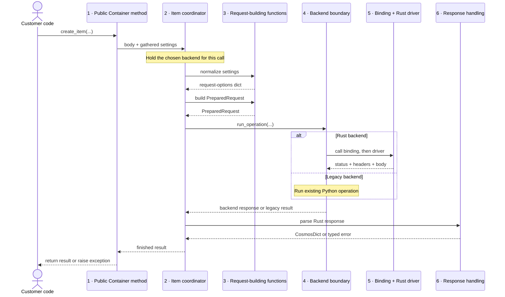

# V5 architect : one `create_item` call, layer by layer


This document follows one Cosmos DB item write from the customer's Python call to
the Rust driver and back. 

---

## Table of contents

- [1. The call we will follow](#1-the-call-we-will-follow)
- [2. The six parts involved](#2-the-six-parts-involved)
- [3. Before the call: build the client](#3-before-the-call-build-the-client)
- [4. Receive and gather the Python arguments](#4-receive-and-gather-the-python-arguments)
- [5. Prepare one request](#5-prepare-one-request)
  - [5.1 Normalize the request settings](#51-normalize-the-request-settings)
  - [5.2 Find the container's service-assigned id](#52-find-the-containers-service-assigned-id)
  - [5.3 Build the `PreparedRequest`](#53-build-the-preparedrequest)
- [6. Choose Rust or legacy Python and run the operation](#6-choose-rust-or-legacy-python-and-run-the-operation)
- [7. Turn the response into the public Python result](#7-turn-the-response-into-the-public-python-result)
- [8. Why the Rust driver is shared](#8-why-the-rust-driver-is-shared)
- [9. The whole call in one list](#9-the-whole-call-in-one-list)
- [10. Where to go next](#10-where-to-go-next)

---

## 1. The call we will follow

Contoso is an online store. When a shopper places an order, its application calls:

```python
container.create_item(
    body={"id": "order-42", "pk": "customerA", "total": 99.5},
    pre_trigger_include="validateOrder",  # run this service check before writing
    no_response=True,                     # do not send the saved document back
    response_hook=on_response,            # call this Python function after the response
)
```

The container is named `orders` in database `contoso`. Its Python link is:

```text
dbs/contoso/colls/orders
```

The container was created with `/pk` as its partition-key path. Therefore
`create_item` reads `"customerA"` from the body; the customer does not pass a
separate `partition_key=` argument.

Keep these values in mind; they stay fixed through the document:

```text
account endpoint    https://contoso.documents.azure.com
database            contoso
container           orders
container link      dbs/contoso/colls/orders
container RID       abc123==
item id             order-42
partition key       customerA
body                {"id":"order-42","pk":"customerA","total":99.5}
expected status     201 Created
expected body       empty, because no_response=True
```

The call must solve four concrete problems:

1. Keep the Python method compatible with existing customer code.
2. Turn the customer's arguments into one complete request.
3. Run that request through either the Rust driver or the existing Python code.
4. Return the same Python result or exception whichever implementation ran.

Those needs explain why the code is divided into the parts below.

---

## 2. The six parts involved

Read this diagram from top to bottom. A solid arrow is a call. A dotted arrow is
the returned value. The **family coordinator** remains responsible for this call
while it asks the other parts to do focused pieces of work.



| Part | Code | Why it exists |
|---|---|---|
| **1. Public method** | `Container` / `ContainerProxy` | Customers need the same Python method and arguments they already use. |
| **2. Family coordinator** | `ItemHelper` / `AsyncItemHelper` | One place must gather inputs and keep sync and async item behavior aligned. |
| **3. Request-building functions** | `_helpers/_item_dispatch.py` and `_helpers/_request_prep.py` | Request construction should be testable without a network call. |
| **4. Backend boundary** | `RustBackend` / `LegacyBackend` | The coordinator needs one way to request work without Rust-versus-Python branches throughout its code. |
| **5. Binding and driver** | `azure_cosmos_rust` plus `azure_data_cosmos_driver` | The binding converts Python values to Rust values; the driver signs, routes, retries, and sends. |
| **6. Response handling** | backend response parsers | Customers must receive the same result types and exceptions from either implementation. |

The numbered parts are an explanation aid, not separate installed packages. Several
are ordinary Python modules inside `azure.cosmos`.

The diagram is the route, not the explanation. The following sections stop at each
arrow and show the actual value crossing it.

---

## 3. Before the call: build the client

Before Contoso writes an order, it creates one client and reuses it:

```python
client = CosmosClient(url, credential, _backend="rust")
```

Client construction records:

- the account endpoint;
- the credential used to authenticate requests;
- the customer settings; and
- whether operations should use the Rust backend.

For example, these two clients make different backend choices even though they use
the same account and credential:

```python
rust_client = CosmosClient(url, credential, _backend="rust")
python_client = CosmosClient(url, credential)  # current core-Python path
```

Calling `create_item` on `rust_client` reaches the compiled binding. Calling it on
`python_client` runs the existing Python implementation. A network error does not
cause the Rust client to switch to Python halfway through the call; backend choice is
configuration, not an error-recovery rule.

Why choose the backend here? If every operation decided independently, methods on
the same client could accidentally use different implementations. Choosing once
gives the client one consistent rule.

Construction does **not** immediately open all network connections. Building the
Rust driver can require account information and connection setup, and a client may
never make a request. The SDK waits until the first operation needs the driver.
Section 8 explains how that driver is then shared safely.

The sequence for a newly constructed Rust client is therefore:

```text
T0  CosmosClient(...) returns; endpoint, credential, config are stored.
T1  No item operation has run, so this client has no Rust driver handle yet.
T2  The first create_item call asks the binding to create or reuse a driver.
T3  Later calls reuse the returned handle and skip driver construction.
```

This matters for a command-line tool that constructs a client only to validate
configuration and then exits: it does not pay for a driver it never uses.

---

## 4. Receive and gather the Python arguments

The call first reaches the public `create_item` method on:

- `Container` for synchronous code; or
- `ContainerProxy` for asynchronous code.

This method keeps the existing public signature so customer applications do not
need to change when the implementation underneath changes.

Before handing the call to the item coordinator, the public method does two jobs.

### Warn about arguments that do not apply

Older code may pass `etag` or `match_condition` to `create_item` through
`**kwargs`. A create has no existing item version to compare with, so these values
cannot affect the operation. The method warns instead of silently pretending to
honour them or abruptly breaking existing applications.

For example:

```python
container.create_item(
    {"id": "order-42", "pk": "customerA"},
    etag='"old-version"',
)
```

There is no existing `order-42` version to compare during a create. The SDK emits a
deprecation warning and ignores the etag before request execution. Without the
warning, Contoso could incorrectly believe the service was enforcing a version
condition that never existed.

### Gather request settings into one dictionary

The method combines the named request settings and `**kwargs` supplied by the
customer into one **merged kwargs** dictionary:

```text
named settings + **kwargs  ->  merged kwargs
```

For Contoso, the relevant settings are:

```python
{
    "pre_trigger_include": "validateOrder",
    "no_response": True,
    "response_hook": on_response,
}
```

The body stays separate because it is the document being written, not a setting.
`response_hook` **does enter this merged dictionary** so the public sync and async
methods pass every optional argument to the coordinator in one shape. Later request
preparation removes it from the service settings and keeps it as Python callback
context; `on_response` never becomes an HTTP header.

The merge function copies only values the customer supplied. If Contoso omitted
`no_response`, that key would not appear and later code would use the client-level
default instead.

The public method gives the body and gathered settings to `ItemHelper` or
`AsyncItemHelper`.

---

## 5. Prepare one request

The item coordinator now gathers everything the operation needs:

| Input | Value | Source |
|---|---|---|
| Operation | `create_item` | The method the customer called |
| Body | `{"id": "order-42", "pk": "customerA", "total": 99.5}` | Customer argument |
| Partition key | `"customerA"` | The body's `/pk` field |
| Container link | `dbs/contoso/colls/orders` | The `Container` object |
| Container RID | for example `abc123==` | Cached container information |
| Request settings | trigger and no-response values | Merged kwargs |

The next three steps turn these values into a request a backend can run.

One `ItemHelper` object is created for this call. It is cheap: it holds references to
the selected backend, the existing Python connection, and the metadata provider. It
does not create a connection pool of its own.

### 5.1 Normalize the request settings

Python uses names that follow Python conventions:

```python
{
    "pre_trigger_include": "validateOrder",
    "no_response": True,
    "response_hook": on_response,
}
```

The Cosmos service expects different names. A module-level function in
`_helpers/_item_dispatch.py` creates a new **request-options dictionary**:

```python
{"preTriggerInclude": "validateOrder", "responsePayloadOnWriteDisabled": True}
```

The callback is deliberately absent from the second dictionary:

```text
pre_trigger_include  -> preTriggerInclude
no_response          -> responsePayloadOnWriteDisabled
response_hook        -> no service option; save it for response handling
```

The code calls these functions `build_*_request_options`; this operation uses
`build_create_item_request_options`.

Why create a second dictionary? Keeping the translation in one function prevents
the synchronous and asynchronous paths from spelling the same service setting
differently. It also leaves the original inputs available to compatibility code.

This dictionary still contains ordinary Python values. It is not an HTTP request,
and no network call happens here.

There is one mutation detail worth making concrete. The legacy option-building code
may consume recognized kwargs while processing them. The helper therefore makes a
copy first:

```text
original merged kwargs
    -> copy A for legacy option construction
    -> copy B for Rust request preparation
```

Without the copy, whichever path read `pre_trigger_include` first could remove it
before the other path saw it, and `validateOrder` would silently disappear.

### 5.2 Find the container's service-assigned id

The human-readable name `orders` can be reused after a container is deleted and
created again. Cosmos gives each created container a separate internal resource id,
or **RID**. In this example it is:

```text
abc123==
```

The SDK includes the RID it believes it is addressing in the intended-container
header. This lets the service detect that a client is using information for an old
container instead of silently writing to a new container with the same name.

Here is the failure this value prevents:

```text
09:00  Contoso reads container "orders"; its RID is abc123==.
09:05  An administrator deletes that container.
09:06  A new container is created with the same name "orders"; its RID is xyz789==.
09:07  The old client sends containerRID=abc123==.
```

The name still says `orders`, but the RID shows that the client's cached information
belongs to the deleted container. The service can reject the stale request instead of
letting it reach `xyz789==` unnoticed.

A `ContainerMetadataProvider` reads and caches the container information. The same
information contains the partition-key definition (`/pk`) needed to extract
`"customerA"` from the body.

The partition-key definition also tells the SDK how to distinguish three bodies
that look similar but route differently:

| Body | Partition-key JSON text | Meaning |
|---|---|---|
| `{"pk": "customerA"}` | `["customerA"]` | Route to customer A's logical partition. |
| `{"pk": null}` | `[null]` | Route to the logical partition for the explicit value `null`. |
| no `pk` field | `[{}]` | Route to the special “partition-key path missing” value. |

That is why request preparation needs the container's `/pk` definition rather than
simply searching every body for a field named `pk`.

### 5.3 Build the `PreparedRequest`

A function in `_helpers/_request_prep.py` combines the body, partition key,
container identity, and normalized options:

```python
PreparedRequest(
    op="create_item",                         # which operation to run
    container_link="dbs/contoso/colls/orders",
    body_bytes=b'{"id":"order-42","pk":"customerA","total":99.5}',
    partition_key_header='["customerA"]',
    headers={
        "preTriggerInclude": "validateOrder",
        "responsePayloadOnWriteDisabled": True,
        "containerRID": "abc123==",
    },
    item_id="order-42",
)
```

The request contains three forms of data:

- a **Python object**, such as the original body dictionary;
- **JSON text**, such as `'["customerA"]'`; and
- **bytes**, such as `body_bytes`.

Python serializes the body once because these exact JSON bytes are what the service
must store. The Rust driver passes the body bytes to its HTTP client without
encoding the document again. The driver builds the rest of the HTTP request:
`op` determines the operation, the link and item id determine the URL, and the
headers become HTTP header values.

For this request, the work is divided like this:

| Prepared value | Who finishes it | Result used for network execution |
|---|---|---|
| `body_bytes` | Already finished in Python | HTTP body bytes, unchanged by the driver |
| `partition_key_header` | Driver writes the supplied JSON text as a header value | `x-ms-documentdb-partitionkey: ["customerA"]` |
| `op="create_item"` | Driver | A create operation sent to the container's documents path |
| `container_link` | Binding parses names; driver resolves the container | database `contoso`, container `orders` |
| `item_id` | Driver operation | Identity `order-42` without reparsing the whole body |
| `headers` | Binding and driver | Typed options plus final HTTP headers and authentication |

There is no double body conversion. The HTTP client accepts a byte body and sends
those bytes. It still encodes the URL, headers, and HTTP/TLS framing required around
that body.

Why put everything in one record? It gives both backends one complete description
of the Rust-boundary request and lets request construction be unit tested without a
connection. The legacy backend does **not** consume this record; it runs a typed
`LegacyOperation` made from the original Python arguments. The record is built
lazily only when the selected backend needs the Rust path.

`PreparedRequest` is a frozen dataclass, so its fields cannot be reassigned. Its
`headers` field is a normal dictionary and is treated as read-only by convention;
the dataclass does not deeply freeze that dictionary.

Concretely, `prepared.item_id = "order-99"` raises instead of changing the target
after preparation. Code could still mutate `prepared.headers["x"]` because the
dictionary itself is not frozen, so backends follow the rule that this mapping is
read-only.

---

## 6. Choose Rust or legacy Python and run the operation

The item coordinator holds one concrete backend object:

- `RustBackend` when the client selected Rust; or
- `LegacyBackend` / `AsyncLegacyBackend` for the existing Python implementation.

For a single-response operation it calls:

```text
backend.run_operation(...)
```

The call supplies a lazy `PreparedRequest` builder, the existing Python operation,
and the Rust response parser. This lets the coordinator describe the operation once
without checking the backend type throughout its code.

The two paths receive different forms on purpose:

```text
RustBackend   -> call build_prepared() -> send PreparedRequest -> parse BackendResponse
LegacyBackend -> invoke LegacyOperation made from the original Python arguments
```

If Contoso uses the legacy client, `build_prepared()` is never called. The old
implementation keeps receiving its historically shaped arguments, while the Rust
path receives the new frozen record.

### When the Rust backend runs

`RustBackend` calls the compiled binding function for `create_item`. The binding
converts Python values into the Rust types expected by the driver. For example,
Python `bytes` becomes a Rust byte buffer.

For Contoso, the boundary conversion looks like this:

| Python value | Rust value used by the binding/driver |
|---|---|
| `"dbs/contoso/colls/orders"` | owned Rust strings `"contoso"` and `"orders"` |
| `b'{"id":"order-42",...}'` | `Vec<u8>`, an owned byte buffer |
| `'["customerA"]'` | driver's partition-key value for `customerA` |
| `item_id="order-42"` | Rust `String` used to identify the item |
| `responsePayloadOnWriteDisabled=True` | typed “do not return write content” option |
| remaining header entries | typed driver options or HTTP header name/value pairs |

PyO3 performs the Python-to-Rust extraction. No live Python dictionary is handed to
the driver thread; the binding first copies out the Rust-owned strings, bytes, and
options it needs.

For a synchronous call, the binding releases Python's Global Interpreter Lock while
waiting for Rust network work, allowing other Python threads to run. For an
asynchronous call, it returns a Python awaitable while Tokio runs the Rust future.
Tokio is the runtime that makes progress on asynchronous Rust work.

For a synchronous call, the observable order is:

```text
T0  Python enters container.create_item(...).
T1  The binding extracts Rust-owned inputs while holding the Python lock.
T2  The binding releases that lock and waits for the Tokio future.
T3  Other Python threads may run while the Cosmos request is in flight.
T4  The driver completes; the binding takes the Python lock again to build the tuple.
T5  Python response handling returns the CosmosDict.
```

For an asynchronous call, no Python worker thread waits for the network:

```python
result = await async_container.create_item(body=order)
```

The binding starts the same Rust driver future on the process-wide Tokio runtime and
returns an awaitable to Python. Python's event loop can run other coroutines until the
Rust future completes.

The driver then:

1. resolves the account, database, container, and partition;
2. signs the request;
3. chooses the service region and endpoint;
4. sends the request;
5. retries eligible temporary failures; and
6. returns status, headers, body bytes, and diagnostics.

Using the fixed example, those broad steps mean:

```text
resolve container  -> contoso / orders
resolve item       -> partition customerA, id order-42
sign request       -> use this driver's credential
choose endpoint    -> a permitted region for contoso.documents.azure.com
send body          -> b'{"id":"order-42","pk":"customerA","total":99.5}'
receive result     -> 201, response headers, empty body, diagnostics
```

For Contoso the service returns `201 Created`. Because `no_response=True`, the
body is empty. Without that setting, the body would contain the stored document
and service fields such as `_etag`, `_rid`, and `_ts`.

### When the legacy backend runs

The legacy backend invokes the existing Python operation and returns its public
result. The coordinator does not use `None` or a failed Rust attempt as a signal to
switch implementations; the selected backend owns which operation runs.

For example, if the Rust driver cannot connect to the service, the call raises a
transport error. It does **not** retry the same write through legacy Python, because
the first attempt might already have reached Cosmos and repeating it through another
engine could create an ambiguous duplicate.

Paged operations such as query use a separate `execute_pages` method because they
return a page plus a continuation value. 
---

## 7. Turn the response into the public Python result

The Rust driver returns:

```text
status + sub-status + headers + body bytes + diagnostics
```

An illustrative successful binding tuple for Contoso is:

```python
(
    201,
    0,
    {"x-ms-request-charge": "5.24", "etag": '"0000-abcd"'},
    b"",
    "<Rust driver diagnostics>",
)
```

The exact request charge and etag come from the service; the values above only make
the response shape visible.

Customer code expects Python SDK types. Response handling performs that conversion.

### Success

For a successful create it:

1. records the latest response headers on the client;
2. parses a non-empty JSON body, if one was returned;
3. wraps the result in the SDK's dictionary-like response type; and
4. calls `response_hook` once.

For Contoso, `no_response=True` means the result is empty but still carries
response-header information.

The transformation is:

```text
(201, headers, b"")
    -> update client.last_response_headers
    -> CosmosDict({}, response_headers=headers)
    -> on_response(headers, {})
    -> return the empty CosmosDict
```

If Contoso had omitted `no_response=True`, the service body could instead be:

```json
{
  "id": "order-42",
  "pk": "customerA",
  "total": 99.5,
  "_rid": "service-item-rid",
  "_etag": "0000-abcd",
  "_ts": 1784600000
}
```

Response handling would parse those bytes and return a populated `CosmosDict`.

### Service error

When the service returns an HTTP status, the SDK maps important statuses to the
same public exceptions as the legacy path:

| Status | Python exception |
|---|---|
| `404` | `CosmosResourceNotFoundError` |
| `409` | `CosmosResourceExistsError` |
| `412` | `CosmosAccessConditionFailedError` |
| Other failures | `CosmosHttpResponseError` |

A duplicate `order-42` becomes `CosmosResourceExistsError`, not a generic Rust
error.

That failure still has a real service response:

```text
service returns 409 + headers + JSON error body
driver returns those response parts
binding preserves status 409
Python maps 409 -> CosmosResourceExistsError
```

Contoso can catch the same exception class on both backends.

### Failure before a service response exists

A connection or client-validation failure may occur before the service returns a
status, headers, or body. The binding reports a transport failure, and Python
converts it to the corresponding Azure Core service error. It cannot create a
status-specific Cosmos exception because no service status exists.

For example, if DNS lookup for the account endpoint fails, there is no `404`, `409`,
or `500` from Cosmos—there is no Cosmos response at all. Calling it
`CosmosResourceNotFoundError` would falsely claim the service said the item was
missing, so the SDK raises `ServiceResponseError` instead.

The finished result or exception returns through the coordinator and public method
to the customer's code.

---

## 8. Why the Rust driver is shared

First, “shared” needs a precise boundary. It means **shared inside one running
Python process**, not shared across every machine and not one driver for all
accounts.

If Contoso runs four web-worker processes on one server, each process has its own
Rust runtime, driver cache, and drivers. Memory cannot be shared through this map
across process boundaries. Inside one of those processes, matching clients can reuse
one driver.

Four scopes are involved:

| Scope | What exists there |
|---|---|
| One Python process | One Tokio runtime, one driver runtime, and one driver-cache map |
| One `(endpoint, credential, config)` key | One cached `CosmosDriver` and connection pool |
| One `CosmosClient` | One backend object and, after first use, one handle naming its cached driver |
| One operation | Its own prepared inputs, timeout, response, and diagnostics |

The driver owns expensive, reusable state:

- network connection pools;
- account and partition information;
- regional routing information; and
- retry and diagnostics machinery.

Building that state for every operation would repeatedly open connections and fetch
the same information. The binding keeps one shared driver for each distinct
combination of endpoint, credential, and relevant configuration.

Consider three clients in the **same Python process**:

| Client | Endpoint | Credential | Preferred region | Shares which driver? |
|---|---|---|---|---|
| A | Contoso account | key K1 | East US | Driver D1 |
| B | Contoso account | key K1 | East US | Driver D1, shared with A |
| C | Contoso account | key K2 | East US | Driver D2, because the credential differs |

If client B instead preferred West Europe, it would also get a separate driver
because the configuration differs. A driver stores its credential and routing
settings; sharing across different values could sign B's request with A's key or
silently use A's region settings.

Python does not hold the Rust driver directly. It holds a short string called a
**handle**. Every operation passes the handle to the binding, which uses it to find
the shared driver in a Rust-side map.

For clients A and B, both handles contain the same cache-key parts—endpoint plus
safe credential/config fingerprints—so both look up D1. The actual master key is
not placed in the handle.

The binding counts how many clients use each driver:

```text
client A first uses D1       -> D1 count 1
client B first uses D1       -> D1 count 2
client C first uses D2       -> D2 count 1
client A closes              -> D1 count 1; B still needs it
client B closes              -> D1 count 0; remove D1 and its connections
client C closes              -> D2 count 0; remove D2
```

Without the count, closing A could tear down D1 while B was still using it.

The driver is built on the first operation rather than during client construction.
If several asynchronous calls arrive during the first build, they wait for the same
build instead of creating duplicates.

For example, a cold Contoso service may start 50 order coroutines at once:

```text
coroutine 1 reaches _ensure_handle -> starts one background driver build
coroutines 2–50                   -> await that same build future
driver build completes            -> all 50 receive the same client handle
operations begin                  -> all use the same connection pool
```

This is called *coalescing* only after the behavior is clear: many callers share
one in-progress build. If client A closes while its build is still running, the
newly returned handle is immediately closed and discarded rather than being stored
on an already closed client.

Cancellation also needs a concrete path. Suppose Contoso allows three seconds for
checkout:

```python
await asyncio.wait_for(
    async_container.create_item(body=order),
    timeout=3,
)
```

The sequence is:

```text
T0       Python awaits create_item; Tokio starts the driver task.
T+3 s    wait_for times out and cancels the Python awaitable.
T+3 s    cancelling drops the binding's bridging future.
T+3 s    its AbortOnDrop guard calls abort() on the Tokio task.
after    the task stops doing further client-side work instead of running detached.
```

Without the abort guard, dropping Tokio's task handle would detach the operation:
it could keep a connection occupied and continue retrying or spending request units,
then throw away the response because Python had stopped waiting.

Cancellation has an important limit: it stops remaining client-side work; it cannot
undo a write Cosmos already accepted. If Cosmos stored `order-42` just before the
three-second timeout but the reply was delayed, Contoso may see a timeout even though
the item exists. Application retry logic must still account for that normal ambiguity
of cancelling a network write.


---

## 9. The whole call in one list

1. `Container.create_item` receives the customer's arguments.
2. The public method warns about obsolete create arguments and gathers settings.
3. `ItemHelper` or `AsyncItemHelper` coordinates the item operation.
4. The coordinator holds the backend selected for this client.
5. A request-options function normalizes the setting names.
6. The metadata provider supplies the container RID and partition-key definition.
7. Request preparation extracts `"customerA"`, serializes the body once, and creates
   a `PreparedRequest`.
8. The backend runs either the Rust binding/driver or the existing Python operation.
9. A Rust success becomes the SDK's dictionary-like result.
10. A Rust service status becomes the matching public Cosmos exception.
11. The result or exception reaches the customer's call.

```text
Python public API and SDK behavior
        -> backend boundary
        -> binding converts Python values to Rust values
        -> driver performs Cosmos network execution
        -> response handling restores Python SDK result types
```

---

