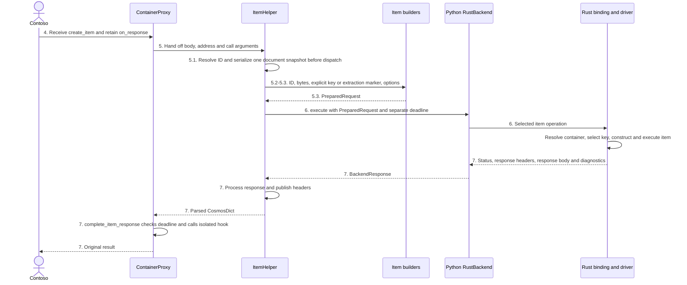

# V5 architecture: one `create_item` call, layer by layer

This is the concise implementation reference. The complete numbered walkthrough is
in `V5/use-cases/01-sync-python-to-async-rust.md`. The Rust driver is treated as a
black box; this document describes the Python SDK and binding contract.

## Table of contents

- [1. The call we will follow](#1-the-call-we-will-follow)
- [2. The six parts involved](#2-the-six-parts-involved)
- [3. Before the call: build the client](#3-before-the-call-build-the-client)
- [4. Receive and gather the Python arguments](#4-receive-and-gather-the-python-arguments)
- [5. Prepare one request](#5-prepare-one-request)
  - [5.1 Normalize the request settings](#51-normalize-the-request-settings)
  - [5.2 Find the container's service-assigned id](#52-find-the-containers-service-assigned-id)
  - [5.3 Build the `PreparedRequest`](#53-build-the-preparedrequest)
- [6. Choose Rust or legacy Python and run the operation](#6-choose-rust-or-legacy-python-and-run-the-operation)
- [7. Turn the response into the public Python result](#7-turn-the-response-into-the-public-python-result)
- [8. Why the Rust driver is shared](#8-why-the-rust-driver-is-shared)
- [9. The whole call in one list](#9-the-whole-call-in-one-list)
- [10. Where to go next](#10-where-to-go-next)
- [11. Related offer and feed preparation](#11-related-offer-and-feed-preparation)
- [12. Typed partition-key boundary](#12-typed-partition-key-boundary)
- [13. Write body snapshots and encoding](#13-write-body-snapshots-and-encoding)
- [14. Names, effects and dispatch contracts](#14-names-effects-and-dispatch-contracts)

## 1. The call we will follow

Contoso uses a client configured with `_backend="rust"` and
`no_response_on_write=False`. Its container address is `dbs/Contoso/colls/Orders`,
with partition-key path `/customerId`:

```python
order = {"id": "order-42", "customerId": "customer-17", "total": 125.50}
result = container.create_item(order, no_response=True, response_hook=on_response)
```

| Term | Concrete meaning |
|---|---|
| Request body | The complete order being saved |
| Request headers | Actual outgoing HTTP header names and string values |
| Request options | Per-operation choices, including whether to omit the returned document |
| Response headers | Received information such as request charge |
| Response body | Returned document content, empty for this successful no-response example |

`on_response` is local Python behavior, not a request option or header.
`no_response=True` does not remove the outgoing document.

## 2. The six parts involved



| Part | Responsibility |
|---|---|
| Public `ContainerProxy` | Validate the public call and own the success hook |
| `ItemHelper` / `AsyncItemHelper` | Coordinate preparation and execution using explicit dependencies |
| Request utilities | Build the request without obtaining container metadata |
| Python backend | Execute the supplied preparation, binding call and parser |
| Compiled Rust binding | Resolve container, extract missing document keys, bridge sync/async execution |
| Response handling | Preserve Python result, exception and response-header behavior |

## 3. Before the call: build the client

Client construction creates the backend and an `ItemClientContext` containing
the backend, immutable `ItemClientDefaults` and shared `ClientLastResponseHeaders`.
Database and container proxies retain that context. The item helper does not
recover its backend, defaults or metadata through a legacy connection.

Driver configuration belongs to client construction, not `request_options`.
The backend obtains its `_driver_handle` lazily through `_ensure_driver_handle`.
The handle identifies a retained Rust driver; it is not the Python client,
container RID or document ID.

## 4. Receive and gather the Python arguments

`ContainerProxy.create_item` calls `prepare_create_item_kwargs`. Retired create
arguments such as `etag` and `match_condition` are rejected by presence, including
explicit `None`. A supplied timeout establishes one monotonic deadline covering
preparation, metadata and execution.
The wrapper is the only owner of create preparation. It passes `deadline=...`
to the helper even when the value is `None`; no deadline marker is used to infer
whether validation already occurred.

The wrapper keeps `response_hook=on_response` locally. It gathers the remaining
arguments with `merge_create_item_explicit_kwargs`, obtains the selected helper,
and passes the body and container link onward. There is no hook in this public
call's helper arguments or prepared request.

## 5. Prepare one request

The helper owns the call and directly invokes its request builder before execution.
There is no builder callback into the helper and no Python metadata retrieval.
The container reuses its Rust helper while the immutable item context is unchanged.

### 5.1 Normalize the request settings

`normalize_item_arguments` builds a shallow document copy. For create it calls
`build_create_document` to validate and resolve the ID once. It then calls the
pure `serialize_document` in `_helpers/_document.py`, which returns
`SerializedDocument(body_id, body_bytes)` before backend dispatch.
The helper retains no copied document tree alongside the encoded bytes:

```python
b'{"id":"order-42","customerId":"customer-17","total":125.5}'
```

The same serialized bytes supply subsequent partition-key extraction inside Rust.
Changing the customer's dictionary cannot change either the bytes or extracted
key. Invalid body data fails before metadata or item I/O.

`compose_item_options` normalizes request options once, for example
`no_response=True` becomes `responsePayloadOnWriteDisabled=True`.
The helper rejects unsupported Rust options before metadata. It retains normalized
options explicitly, rather than packaging and rescanning `wire_kwargs`.

### 5.2 Find the container's service-assigned id

Python no longer finds the RID or obtains the partition-key definition for a point
operation. `build_request` is entirely local. For create/upsert/replace without an
explicit key, it sets `partition_key=PartitionKeyInput("extract")`.
Explicit null is `PartitionKeyInput("components", (None,))`; read/delete/patch require a target key and
never infer one from patch instructions.

Inside the single item binding call, `execute_item_on_driver` resolves the container
through the driver's cache and uses that same definition for extraction and item
construction. `extract_partition_key_from_body` reads the exact outgoing bytes,
preserving key kind, path rules, and missing-level behavior. The driver owns routing
identity and the corresponding transport headers. There is no preliminary metadata
FFI call, returned Python metadata object, or additional Python metadata cache.

Metadata failures still raise `DriverResponseError` separately from item responses.
The backend maps their details to Cosmos exceptions without updating public response
headers or calling the item hook. The native timeout covers resolution, extraction,
and execution; an expired extraction budget is checked before constructing the item.
Async cancellation retains ownership of the native task.

The driver crate is unchanged. Its missing `systemKey` flag and partitionless-key
limitations remain; Python/binding preserve the existing unknown/false fallback.
Extraction is binding-owned, not a new driver capability, and is not automatically
repeated if driver recovery later changes the partition-key definition. The typed
`get_container_metadata` API remains available for explicit internal lookups, not
as a point-operation prerequisite. One FFI item call does not imply one HTTP request.

### 5.3 Build the `PreparedRequest`

Both helpers use `build_item_request`. It selects the operation-specific builder
and maps its inputs; it does not execute an item. Every builder receives normalized
request options explicitly and returns only a `PreparedRequest`.

`build_create_item_request` requires a `SerializedDocument` containing the
resolved body ID and bytes. It receives no body dictionary, ID-generation
instruction or serialization fallback. Create, upsert, replace and patch all
delegate to the same bytes-only `_build_write_prepared` function.
It normalizes an explicit key to typed components or emits the explicit extraction kind.
The item helper supplies no container RID and performs no routing-header stamping.

`build_request_headers_and_settings` normalizes compatibility option names into validated
`RequestSettings`, with item, query and resource groups. Trigger sequences remain
tuples until native header serialization. Conditional precedence and truthy-only
gates still omit values such as bucket `0`; explicit false controls are retained.

```python
PreparedRequest(
    op="create_item",
    container_link="dbs/Contoso/colls/Orders",
    body_bytes=b'{"id":"order-42","customerId":"customer-17","total":125.5}',
    partition_key=PartitionKeyInput("extract"),
    headers={},
    settings=RequestSettings(no_response=True),
    item_id="order-42",
)
```

`headers` contains caller/default header overrides, not generated service controls.
`settings` carries priority, session, no-response, exclusions, typed hedging and
supported request-level `timeout_seconds`, plus operation-specific settings. `partitionKey` and
`disableAutomaticIdGeneration` have already been consumed and do not cross the boundary.
Compact UTF-8 is Python serialization configuration, not a request header.

The same separation applies to database/container requests, throughput requests,
feed-range requests and `PreparedQuery` page adapters. The adapters preserve
typed settings when constructing a binding `PreparedRequest`. Absolute deadlines
belong to the invocation and are passed separately to execution, not stored on
either prepared record.
Batch contracts will be introduced with an actual native implementation; the
existing public legacy batch API is independent of this boundary.
Settings and their nested groups are frozen and validate values at construction.
Tuple snapshots prevent caller mutation of trigger/exclusion lists. Header maps
remain read-only by convention. Exclusions distinguish inheritance (`None`) from
explicit clearing (`()`); hedging distinguishes inheritance, disabled and enabled.

## 6. Choose Rust or legacy Python and run the operation

Backend choice precedes helper construction. A Rust item helper builds its
`PreparedRequest`, calls `execute(prepared, deadline=deadline)` directly, and
processes the response. There is no `run_item_operation`, builder callback,
legacy operation or fallback callback in this path.
Explicitly selected legacy clients use the separate `LegacyItemHelper`.

`RustBackend.execute` resolves the binding function using
`_get_binding_function`, then supplies the driver handle and prepared request.
The `aio` backend has the same `_get_binding_function` name and looks up the
native export with its `_async` suffix.

Rust's shared readers delegate to `wire/settings.rs`, which extracts named typed
attributes and performs final service-header encoding or driver-type conversion.
The internal `RequestHeadersAndOptions` result is not a Python option dictionary.
Unknown normalized Rust options always raise `TypeError`; `COSMOS_WIRE_STRICT`
no longer controls this behavior. Raw caller headers remain a separate input.

Private protocol version 3 requires typed settings and partition keys; rebuilding
`_rust.pyd` is required. Python compares settings and `PartitionKeyInput` field
inventories with the native reader's exported schema before acquiring a driver handle.
Native readers also check the request-envelope version. A mismatch fails when Rust is selected,
without blocking import or use of the legacy backend.
There is no dual-protocol shim for older direct callers of the private extension.
The binding's separate `timeout_seconds` argument still represents the remaining
monotonic deadline, not a header or client transport configuration.

The synchronous binding releases the GIL while waiting for asynchronous Rust work.
The async binding returns an awaitable. Neither path reserializes the order or
replays a failure through legacy Python.

## 7. Turn the response into the public Python result

The response boundary remains:

```text
native (status, sub-status, response headers, response body bytes, diagnostics)
    -> BackendResponse
    -> CosmosDict or existing Cosmos exception
```

A **hypothetical item response**, not an observed service result, is
`(201, 0, {"x-ms-request-charge": "5.0"}, b"", None)`.
`process_backend_response` replaces latest response headers before evaluating status.
An empty successful response becomes an empty `CosmosDict` retaining its own headers.

The public wrapper then calls `complete_item_response`. It checks the deadline
before calling `on_response` once with independent response-header and nested-body
snapshots. A falsey callable is still called. Mutating the hook inputs does not
change the returned result or shared header state. A hook exception propagates
without replaying the write.

Preparation, metadata, execution and parsing errors skip the success hook.
Service errors retain status-specific Python exceptions; response-less transport
errors do not invent a Cosmos HTTP status.

## 8. Why the Rust driver is shared

The Rust registry retains drivers within the current process. Matching endpoint,
credential identity and compatible client configuration can share an entry.
Python retains its driver-handle string, not the driver object. `acquire_driver_handle`
acquires a client reference; `release_driver_handle` releases it.

Each item call uses the retained driver handle. Native container resolution and
item execution share that driver; Python preparation no longer obtains metadata.
The binding still performs the necessary handle lookup for each item entry.

## 9. The whole call in one list

1. Validate the public call and retain `on_response`.
2. Validate a shallow document copy, resolve its ID and retain one serialized snapshot.
3. Normalize and validate request options once.
4. Enter the backend, which calls `build_request`.
5. Select the explicit key or automatic-extraction marker.
6. Build one request with actual headers and separate request options, without a resolved RID.
7. Enter the selected item binding once; resolve the container and extract an omitted document key from the outgoing bytes.
8. Execute through the driver, without legacy replay.
9. Convert the native tuple to `BackendResponse`, then a result or exception.
10. Check the deadline, call the isolated success hook once and return the result.

## 10. Where to go next

The complete 12-chunk explanation, with matching numbered sequence diagrams, is
`V5/use-cases/01-sync-python-to-async-rust.md`. Use cases 02 and 03 remain placeholders.
The binding's request protocol is also documented in `../azure_cosmos_rust/README.md`.

## 11. Related offer and feed preparation

Offers and compatibility feed pages now follow the same direct-preparation rule as
items: prepare values for Rust, not a signed legacy request for a different transport.

```text
normalized options + unsigned client defaults
    -> pure request builder
    -> PreparedRequest (offers) or PreparedQuery (feeds)
    -> existing binding entry
    -> driver-owned authentication, defaults and session management
```

`_helpers/_request_offer.py` owns the two offer builders. The lookup retains the
existing query for a database/container's offer; replacement extracts the offer RID
from `_self` and sends the full updated body. Connection adapters only supply defaults;
the async callbacks reuse synchronous preparation because it performs no I/O.

`_query_rust_routing.py` directly prepares database/container list/query pages and
compatible internal item query/read-feed pages. In both connection implementations,
`GetHeaders`, `RequestObject` and legacy session preparation execute only on a
legacy-selected path, including an allowed capability fallback. Public retained
item query/read-all/change-feed pagers remain independent of these compatibility routes.

Client defaults are overlaid by case-insensitive caller headers and then normalized
service options. Explicit activity IDs and supported session headers are preserved,
but Python does not generate a new activity ID or read its session cache for Rust.
Master resources still ignore typed session-token options; raw caller headers retain
their existing meaning. Response hooks, diagnostics and response-state finalization
remain on their existing paths.

For feed pages, page size and continuation have a single source of truth:
non-`None` typed options win, otherwise raw headers are promoted to typed fields.
The prepared header map has neither paging header; the binding adapter adds the wire
values at dispatch. Invalid raw page-size text raises explicitly.

The regeneration set and customer-override gate remain distinct. Master-resource
feeds reject unsupported overrides without replay; offers retain their compatibility
fallback, now including those overrides. This does not extend timeout/deadline support,
change the sibling driver, or establish a measured latency improvement.

## 12. Typed partition-key boundary

`PreparedRequest`, `PreparedQuery` and the reserved batch record carry
`partition_key: PartitionKeyInput`, not an HTTP header string.
`_helpers/_partition_key.py` normalizes public inputs; `wire/partition_key.rs`
extracts the tuple directly into driver components while holding the GIL.
Only Rust-owned values enter asynchronous driver work.

| Meaning | Kind | Values |
|---|---|---|
| Explicit key | `components` | `("customer-17",)` |
| Explicit null | `components` | `(None,)` |
| Missing property | `components` | `(UNDEFINED_PARTITION_KEY,)` |
| Extract from outgoing document | `extract` | `()` |
| Whole-container scope | `cross_partition` | `()` |
| Legacy empty sentinel | `empty_sentinel` | `()` |
| Explicit empty sequence | `empty_sequence` | `()` |

The undefined marker is private, immutable and distinct from null. Public APIs
do not accept Ellipsis as a key. Scalar booleans remain distinct from numbers,
numeric conversion retains the driver's finite-f64 behavior, and component order
is preserved. Point operations retain their existing restrictions; the two empty
sources remain distinct for feed-range resolution. Nonpartitioned resources ignore
the key field rather than treating it as a logical partition.

Explicit string components combine valid UTF-16 surrogate pairs before native
extraction, matching the former JSON transport and automatic extraction from
document bytes. This applies to scalar and hierarchical keys, including query,
change-feed and feed-range inputs. ASCII keys bypass normalization; unpaired
surrogates remain unchanged and still fail native string extraction rather than
being silently replaced. Persisted bookmark representations remain unchanged.

Retained query/change-feed bodies no longer embed another JSON-encoded partition
key. Query bookmark identities and change-feed bookmarks retain their existing
persisted representation; JSON at that persistence boundary is intentional, not
the native request transport. Explicit customer HTTP partition-key headers are
decoded once at their input boundary.

`legacy_partition_key_header` in `_helpers/_legacy_partition_key.py` remains only
for legacy execution/parity. The corresponding native JSON parsers are test-only
oracles. The driver still produces the actual service header. No driver capability,
partitionless support, or public API signature changes are implied.

## 13. Write body snapshots and encoding

The final architecture retains the Python wrapper and binding. Serialization is
a wrapper responsibility, not a dependency on the temporary legacy pipeline.

`normalize_item_arguments` produces a frozen `SerializedDocument(body_id, body_bytes)`
for create/upsert/replace. Patch serializes its canonical operations envelope in
`_helpers/_patch_item.py`. All four snapshot before backend dispatch, including on
async execution, and share `_build_write_prepared`. Builders receive no mutable
document/operation list and have no serialization fallback. Reusing a prepared
snapshot does not generate another ID or encode the payload again.

| Operation | Preserved preparation rules |
|---|---|
| Create | Accept a mapping, validate the ID, optionally generate it in a shallow top-level copy, and reject non-finite numbers before dispatch. |
| Upsert | Do not generate an ID; forward an available body ID without inventing a missing one. |
| Replace | Preserve the explicit target ID independently of the payload ID; do not rewrite the body. |
| Patch | Retain the explicit target ID/key, normalize `increment` to `incr`, and reject non-finite numbers before dispatch. |

Upsert/replace retain their existing non-finite-number serialization policy;
this does not promise acceptance by native parsing or the service. Create's body
ID is resolved before native key extraction, including when the partition path is
`/id`. Explicit keys still travel separately as `PartitionKeyInput`; automatic
extraction reads the exact outgoing bytes using native container metadata.

Encoding remains in `_helpers/_wire_encoding.py`: compact JSON separators, insertion
order, numeric formatting, escaped non-ASCII by default, and opt-in compact UTF-8
for singleton writes. `encode_json_to_utf8` retains the legacy behavior for UTF-16
text: combine surrogate pairs into Unicode scalars and escape remaining unpaired
code units. Body IDs likewise combine pairs so their native representation agrees
with the JSON body. Metadata and query bodies retain their existing encoding
defaults. Already-encoded replacement bodies retain their existing handling.

**Native limitation:** escaped unpaired surrogates can be encoded by Python but
are rejected by the full `serde_json::Value` parse used for automatic key
extraction, even outside key fields. Encoding parity is not proof of end-to-end
support for these documents. They are not silently rewritten or routed through
legacy Python.

The optimization removes the recursive create-body clone and its retained
dictionary, not every allocation: JSON encoding still creates text and UTF-8 bytes,
and a shallow top-level dictionary is used for document preparation. A completed
snapshot is immutable; it does not guarantee an atomic snapshot against concurrent
mutation while serialization itself is running.

**Removable legacy code:** `legacy_item_helper._prepare_legacy_create_item_body`
retains recursive copying and pre-I/O encoding validation only because the
temporary legacy pipeline still accepts dictionaries. Delete it with that adapter,
not the retained document serializer, ID policy or UTF-8 codec. No driver change
or protocol-version bump is needed for this body-lifetime cleanup.

## 14. Names, effects and dispatch contracts

These conventions describe retained private wrapper/binding code, not public
API renames or changes to external driver identifiers.

| Name | Contract |
|---|---|
| `build`, `normalize` | Return new values without changing caller-owned input. Local copies may be changed. |
| `serialize`, `parse` | Encode or decode values without allocating IDs, invoking hooks, or publishing client state. A serialized value object is a valid result. |
| `validate` | Check without mutation; return `None` or raise. |
| `apply`, `stamp` | Mutate the target argument and return `None`. |
| `prepare` | In-place wrapper preparation of an owned argument mapping. |
| `get` | Retrieve an existing selection/value; do not choose another backend. |
| `resolve` | Construction-time credential/backend selection, not per-request function lookup. |
| `read`, `write`, `execute`, `fetch` | Execution work, not a local request builder disguised as an execution step. |

`build_item_request` constructs a request from normalized arguments.
`_build_item_headers_and_settings` and `build_request_headers_and_settings`
return new header/settings values. `apply_patch_item_options` performs explicit
mutation on copied options during normalization; `validate_rust_item_options`
does not modify those options.

`parse_backend_response(response)` is pure, including copying the response's
header mapping. `process_backend_response` is the effectful path: it consumes
single-use response headers, publishes them before body decoding or mapped errors,
and invokes the optional success callback only after successful decoding.
`complete_item_response` retains deadline enforcement, isolated hook arguments
and result return. Read/create/patch use that same helper without a read-specific
alias. Changing names does not move callbacks into retries.

The temporary migration ports on both backends accept
`build_request: Callable[[], PreparedRequest]` and a synchronous `process_response`
callback. Their page builders return `PreparedQuery` directly. Point helpers do
not use these ports or callbacks. All current builders perform local work, so no
awaitable builder contract or coroutine shim remains. Async point execution is
`await backend.execute(prepared, deadline=deadline)`. Python classes/modules carry async
context; native functions in the shared `_rust` namespace retain their `_async`
suffix because both entrypoints coexist there.

For paging, `STATELESS_QUERY_TO_BINDING_METHOD` and
`CURSOR_QUERY_TO_BINDING_METHOD` represent different call signatures.
`get_page_binding_method` selects once using the operation and
`cursor is not None`. The pager creates its cursor lazily at its first fetch
through the backend factory; dispatch never writes into a caller-owned dictionary.
Retained read-all, query and change feeds use `ItemFeedCursor` and
`fetch_page_with_cursor` / `fetch_page_with_cursor_async` from
`wire/item_feed.rs`. Logging names the actual selected export. Missing required
cursor exports raise a rebuild error before driver acquisition, not a stateless
or legacy fallback. The old read-all-specific cursor exports and change-feed
binding aliases are removed; public `query_items_change_feed` is unchanged.

A **backend** is the Python dispatch object; a **driver** is the native
`CosmosDriver` identified by a handle. The **runtime** owns process-wide settings
and remains a distinct concept. `register_driver_client` / `release_driver_client`
manage Python reservations, not native handle references. Their private identity
helpers maintain counts; `StrictDriverIsolationError` reports strict isolation
conflicts. Transaction rollback, provisional holds and frozen runtime policies
are unchanged. Legitimate references to a service query engine are not renamed.

Rebuild the extension with the Python wrapper after native export renames.
The request data schema remains protocol 3. No driver-crate or public API change,
new capability, or measured performance improvement is implied.

## 15. Linear execution and cohesive helper modules

Point helpers own build -> execute -> process directly. `execute` takes a
non-optional `PreparedRequest` and returns a `BackendResponse` or raises; `None`
is neither a no-op request nor a fallback response. Concrete Rust executors reject
a missing native reply with `BackendProtocolError`. Empty successful bodies still
produce response records with status and headers.

`PreparedRequest` and `PreparedQuery` have no `deadline` field.
`execute(..., deadline=...)` and `execute_pages(..., deadline=...)` take the
existing absolute monotonic budget as a keyword-only argument. Conversion to the
native remaining duration stays after lazy initialization and request adaptation.
Cursor pages retain their outer native budget; stateless feeds retain their
existing driver request-timeout path and binding signature. This refactor does
not add deadline support to previously unsupported native entrypoints.

One public page fetch keeps one budget across internal empty pages. The next
public page fetch creates a fresh budget. Page preparation still caps the typed
driver request duration against that budget. Wrapper completion checks and
async cancellation draining are unchanged; patch execution and completion stay
in the same cancellable task. Customer hook errors are not reclassified or replayed.

| Retained module | Responsibility |
|---|---|
| `_wire_encoding.py` | JSON/UTF-8 body encoding and RU header-value formatting. |
| `_document.py` | ID preparation and immutable document snapshots. |
| `_item_prep.py` | Public create/read/patch argument rules, item budgets and patch snapshots. |
| `_request_settings.py` | Option normalization, header ownership/defaults, RID stamping and typed settings construction. |
| `_response_parse.py` | Pure decoding, response-state publication and isolated completion hooks. |

Ten former helper modules are removed without forwarding shims; the directory
now contains 31 Python files including `__init__.py`. Shared path parsing and
resource validation remain outside item preparation. `_legacy_partition_key`
remains isolated for eventual deletion. Backend `RequestSettings` type definitions
remain separate from helper normalization.

The temporary migration ports now accept plain legacy callables and a centralized
routing decision (section 17). Frozen-record caveats, backend lifecycle sharing, credential lifetime
management and the driver crate are unchanged. No native ABI change or additional
extension rebuild is required by this execution/module cleanup; protocol 3 remains.

## 16. Preparation ownership and remaining dependency reductions

Public create wrappers call `prepare_create_item_kwargs` once, with or without
a timeout. Rust and legacy helpers require an explicit `deadline` keyword,
including `None`; they do not repeat public preparation or infer a budget from
the presence of an internal marker. Read, patch and read-many retain their
existing deadline propagation. Direct helper tests use the same preparation
entrypoint rather than relying on implicit revalidation.

`ContainerProxy._get_item_helper` lazily caches the Rust helper against the item
context's identity. Repeated calls avoid helper construction and backend-name
selection. Replacing the context invalidates that cache. Operation inputs remain
local to each call; only immutable defaults and the intentionally shared latest
response-header state are retained. Legacy adapters are not cached: their
container-bound metadata callbacks would introduce a proxy/helper reference cycle.

Read/delete/replace/patch no longer construct document-link strings in public
wrappers. Legacy preparation builds those links from container and item IDs.
`prepare_item_target` preserves mapping `_self` validation and snapshots that value
for the legacy adapter; Rust discards this compatibility input and routes by
container plus item ID. Mapping fields are not re-read by the adapter. Arbitrary
keyword arguments cannot override the target. The old `_get_document_link` helper
is removed, without relaxing the existing mapping-input requirement.

`complete_item_response` checks the deadline even without a hook. With a hook,
an empty result produces a fresh empty `CosmosDict` without `deepcopy`; a nonempty
result still receives a deep body snapshot. Both hook header maps remain isolated
from each other and from the returned result. No-hook calls copy neither body nor
hook headers.

These are source-level and regression-verified reductions, not latency benchmark
claims. A warmed create uses one item-dispatch crossing and one document
serialization; successful response JSON is decoded only for a nonempty body.

## 17. Migration policy and pager-owned cursors

There are two implemented wire shapes: single responses and pages. Migrated
point and retained-feed helpers execute directly. Remaining compatibility
coordinators pass `OperationRouting`, a lazy request builder, a synchronous
response processor and an optional plain legacy callable. Async legacy
callables must return awaitables. The named legacy-port record and speculative
batch records, executor stubs and table are removed; public batch APIs remain.

`_backend/capabilities.py` is the sole migration-policy table. It records allowed
wire operations, fallback permission and unsupported-call diagnostics. Missing
policy and mismatched operation identities fail closed. Request eligibility
remains request-dependent: a supported operation does not imply that every
timeout, header override or transport option is representable. Compound
workflows retain their shared eligibility decision and contextual diagnostics.
Explicit core-python selection bypasses Rust preparation and policy evaluation.

Compatibility routing is permitted only before execution. Ineligible requests
may use legacy when their policy allows it; static page preflight may detect a
missing module/export before driver acquisition. Builder errors, driver/query
planning failures, transport errors, empty reply contracts, iterator-finalization
errors and response-hook failures never trigger replay. Legacy-only feed-range
shapes are selected before dispatch rather than caught as `ValueError` afterwards.
The compatibility counter includes both allowed pre-dispatch routes, not explicit
core-python selection or failed/rejected Rust calls.

`PreparedQuery.cursor` names a concretely typed `ItemFeedCursor`, declared in the
extension stub. Runtime native imports remain confined to the backend boundary.
The pager creates it lazily, keeps it across internal and public pages, and
releases it on completion or invalidation after cancellation is drained.
`None` means stateless dispatch; no mutable cursor-storage dictionary remains.
Frozen `QueryScope` preserves the existing JSON field names, nulls and arrays,
including the representation used to compute bookmark identity.

The native protocol remains 3; this Python-only cleanup requires no additional
extension rebuild. Python construction reservations and acquired native driver
references retain their different lifetimes. Typed settings and unconditional
schema checks remain in effect; cross-language mismatches are explicit runtime
compatibility errors, not universally compile-time errors. Shared routing
matrices supplement, rather than replace, public encoding, mutation, deadline,
cancellation and hook regressions.
Cold driver initialization and service latency must be measured separately.
