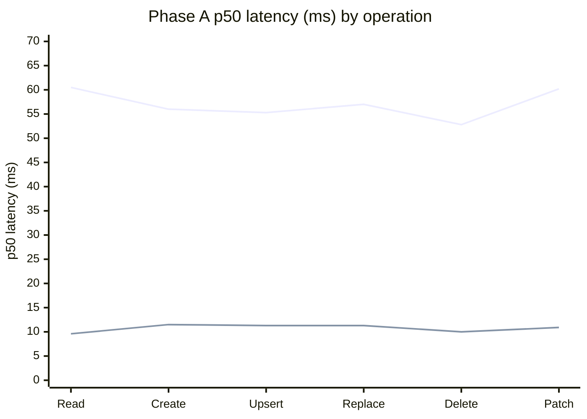
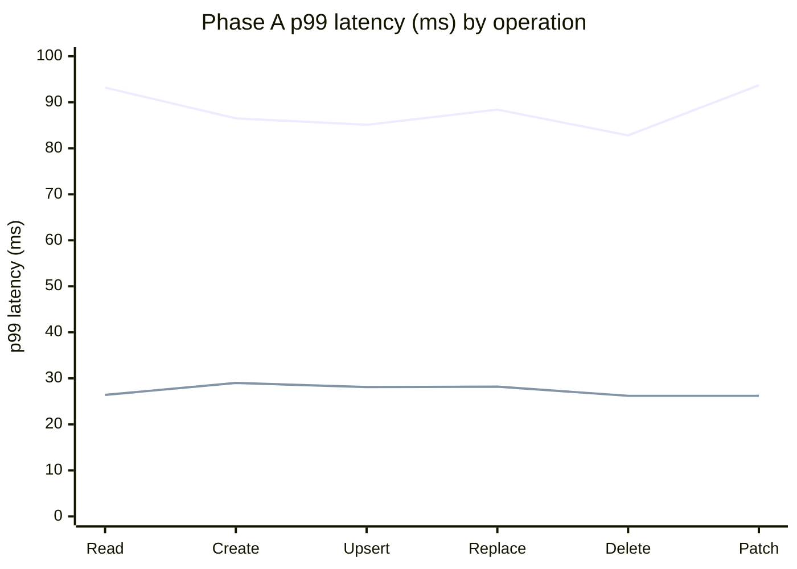
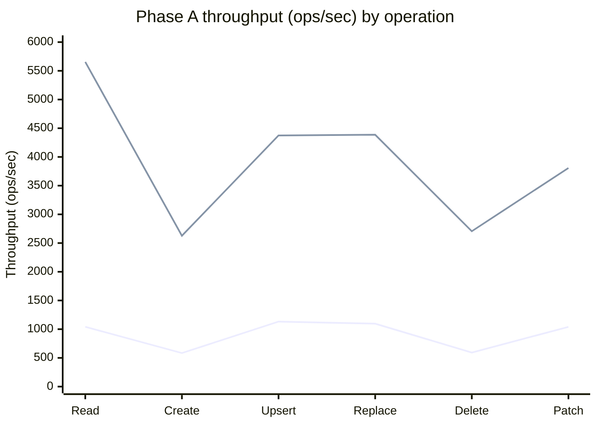
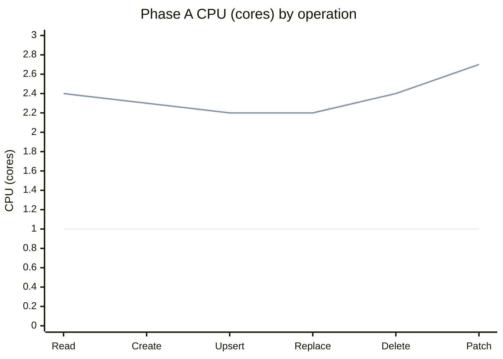
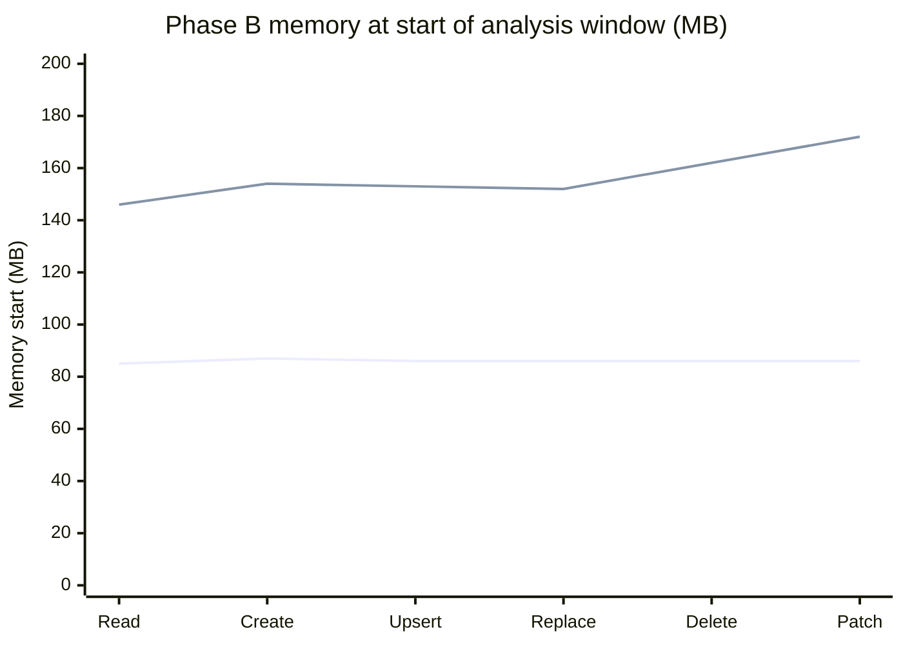
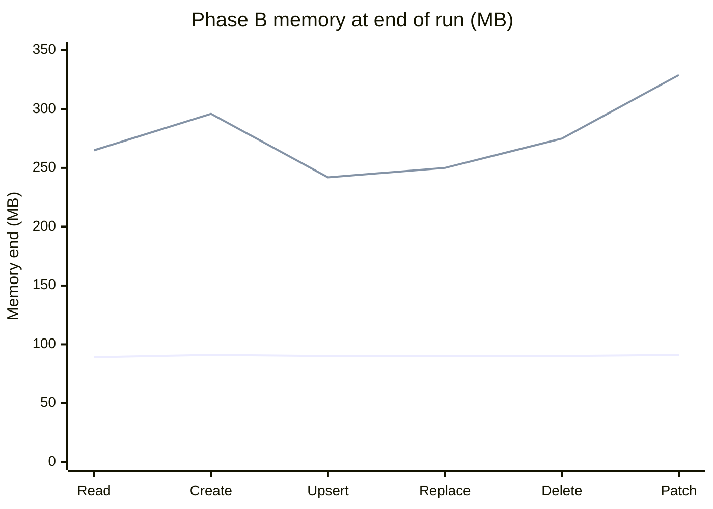
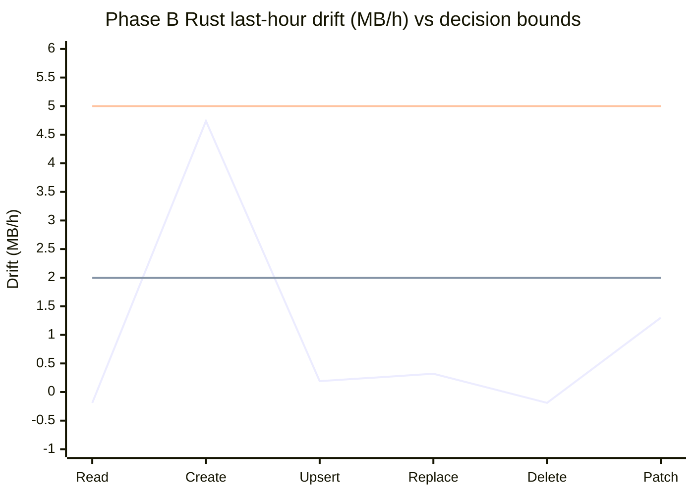

# Rust vs Python — Cosmos SDK Speed Test Results

The Cosmos Python SDK can run database calls two ways: the original **all-Python**
engine, and a **new engine that hands the heavy work to Rust**. This document answers a
simple question a customer would ask: **is the new (Rust) engine faster, by how much, and
what does it cost?**

## Test plan in this doc (Iteration 1)

We keep the phase labels for tracking, but each phase maps to a clear test goal:

| Phase | Test goal | Current status |
|------|-----------|----------------|
| **Phase A** | **Fixed-load performance baseline** (latency, throughput, RU/op, CPU) | **Complete** |
| **Phase B** | **Long-run memory stability** (12-hour soak, leak/drift checks) | **Complete** |
| **Phase C** | **Stress behavior under heavy load** (resilience at higher pressure) | **Pending** |
| **Phase D** | **Failure-mode resilience + correctness under breakage** (failover/429/cancel/fork/resource-pressure/correctness parity) | **Planned (future iteration)** |

So this doc is not just one benchmark dump — it is the migration performance story: baseline speed first, then memory safety, then stress behavior.
Phase D is intentionally out of Iteration 1 scope, see TODO below.

## Phase setup quick-reference (A vs B)

This is the fast "what changed between phases" view so nobody has to hunt in the long sections.

| Phase | Account path | Operation container | Results container | Throughput / request model |
|------|--------------|---------------------|-------------------|----------------------------|
| **Phase A** (fixed-load baseline) | **Compute Gateway** (Gateway path) | `scale_db/scale_cont` | `perfdb/perfresults` | Operation container at **100,000 RU/s**; results container at **4,000 RU/s**; fixed **100 in-flight requests**; **30-minute** run per operation per engine |
| **Phase B** (12-hour memory soak) | **Compute Gateway** (Gateway path) | `leak_cont` | `perfdb/perfresults` (same as Phase A) | Not a throughput benchmark; request model changed to a **continuous 12-hour soak** — the six operations run as six parallel processes per engine (engines back-to-back, ~24 h wall-clock) — with ~5-minute memory sampling; integrity gate observed **772,501,793** total requests |

---

## Why we ran this test, and how the results are used

**Motivation.** The Rust engine is a large change to how the SDK executes every database
call. Before it can be trusted in production or recommended to customers, we need hard,
side-by-side numbers proving it is actually faster, that it does not cost more in database
charges, and that we understand what it trades away (CPU). 

**Goals achieved by this test (Phase A — fixed-load baseline):**

- **A trustworthy speed baseline.** Exact p50/p99 latency and throughput for all six
  everyday operations on both engines, under identical conditions, with proof of which
  engine ran each request.
- **Cost transparency.** Confirmation that the Rust engine charges the *same* database
  cost (RU) per operation, and a clear measure of the *extra CPU* it uses to go faster.
- **A clean reference point.** Zero errors, steady numbers, database never a bottleneck —
  so these results measure the SDK engine itself, not the network or the service.

**How these results will be used:**

- **A go/no-go signal for the Rust engine** — the per-operation speedups here are the core
  evidence for whether the new engine is worth shipping.
- **The "hour-0" anchor for the follow-up tests** — the long-running memory test is now
  complete (**Phase B — memory stability**, below); a heavy-load stress test
  (**Phase C — stress behavior**) is still to come.
  Both are read *against* this baseline, so any drift or slowdown they show can be attributed
  to the thing being tested, not to a broken workload.
- **A customer-facing summary** of the expected latency and CPU trade-off when choosing
  the Rust engine.

---

## What we tested and why (Phase A baseline details)

We ran the six everyday database operations — **Read, Create, Upsert, Replace, Delete,
and Patch (partial update)** — through each engine and timed every request.

**Test setup at a glance:**

| Setting | Value |
|---------|-------|
| Azure region | **West US 2** — single region (the account's only read *and* write region; multi-region writes off) |
| Client machine | One VM, `vm-python-phasec`, in the same region as the database |
| Account routing plane | **Compute Gateway** |
| Client connection mode | **Gateway** |
| VM networking | **Accelerated networking enabled** |
| Operation container | `scale_db/scale_cont`, provisioned at **100,000 RU/s** |
| Account consistency | **Session** (the account's default consistency level) — identical for both engines |
| Records pre-loaded | **~1,000,000 items** (~1 KB each) so reads/updates/deletes had a real working set |
| Results container | A **separate** container, `perfdb/perfresults`, at 4,000 RU/s, so recording results never competes with the operation being timed |
| Load | **100 requests in flight at all times**, identical for both engines; 30-second request timeout |
| Duration | **30 minutes per operation, per engine** |
| Total operations run | **52,271,400** across both engines, with **0 errors** |

A few choices kept the comparison fair and the numbers trustworthy:

- **App and database in the same Azure region.** No long-distance network time is mixed
  into the results — we're measuring the SDK itself.
- **Connection mode was Gateway for this run.** The table compares the two SDK engines under
  the same Gateway-path conditions; do not read it as a direct-mode SLA certification.
- **The operation container had far more capacity (100,000 RU/s) than the load needed**,
  so the database was never the thing slowing us down. Confirmed by **zero errors** across
  every run.
- **Results were written to a separate container** (`perfdb/perfresults`), so the act of
  recording a measurement never competed with the operation being measured.
- **Each operation ran for 30 minutes on each engine**, long enough that the numbers
  settle and stay steady rather than reflecting a brief warm-up spike.
- **100 requests were kept in flight at all times**, identical for both engines. This is
  a steady, moderate load — deliberately *not* the maximum either engine can handle — so
  neither engine gets an unfair advantage.
- **We recorded proof of which engine actually ran each request.** So the "Rust" numbers
  are genuinely from Rust and the "Python" numbers are genuinely from Python — not
  mislabeled.

**How to read the columns (latency in milliseconds; lower is better):**

- **p50** — the median. Half of all requests were faster than this; the everyday
  experience.
- **p99** — the slow tail. Only 1 request in 100 was slower.
- **p99.9** — the deep tail. Only 1 request in 1,000 was slower — the rare slow ones.
  (See the measurement caveat at the end: these deep-tail numbers are approximate.)
- **throughput** — how many operations finished per second.
- **Requests** — the total number of operations completed over the 30-minute run.
- **Errors** — requests that failed (timeout, throttling/429, or a service error). Zero
  everywhere here, which is what makes the latency numbers trustworthy.
- **CPU** — how many processor cores the engine used, on average, to sustain that load
  (1.0 = one full core).

---

## Detailed — each operation

| Operation | Engine | p50 (ms) | p99 (ms) | p99.9 (ms) | Throughput (ops/sec) | Requests | Errors | RU/op | CPU (cores) | p50 speed-up |
|-----------|--------|---------:|---------:|-----------:|---------------------:|---------:|:------:|------:|------------:|:------------:|
| **Read**    | Python | 60.5 | 93.2 | 103.7 | 1,041 | 1,873,700 | 0 | 1.00 | 1.0 | — |
|             | Rust   | 9.6  | 26.4 | 31.9  | 5,655 | 10,177,100 | 0 | 1.00 | 2.4 | **6.3× faster** |
| **Create**  | Python | 56.0 | 86.5 | 102.1 | 584   | 1,051,800 | 0 | 7.24 | 1.0 | — |
|             | Rust   | 11.5 | 29.0 | 38.5  | 2,627 | 4,727,900 | 0 | 7.24 | 2.3 | **4.9× faster** |
| **Upsert**  | Python | 55.3 | 85.1 | 99.5  | 1,132 | 2,037,100 | 0 | 11.19 | 1.0 | — |
|             | Rust   | 11.3 | 28.1 | 39.3  | 4,374 | 7,872,900 | 0 | 11.19 | 2.2 | **4.9× faster** |
| **Replace** | Python | 57.0 | 88.4 | 102.7 | 1,096 | 1,972,800 | 0 | 11.63 | 1.0 | — |
|             | Rust   | 11.3 | 28.2 | 36.1  | 4,387 | 7,895,200 | 0 | 11.63 | 2.2 | **5.0× faster** |
| **Delete**  | Python | 52.8 | 82.8 | 101.6 | 593   | 1,067,200 | 0 | 7.24 | 1.0 | — |
|             | Rust   | 10.0 | 26.2 | 34.1  | 2,706 | 4,870,800 | 0 | 7.24 | 2.4 | **5.3× faster** |
| **Patch**   | Python | 60.2 | 93.7 | 114.8 | 1,040 | 1,871,700 | 0 | 10.80 | 1.0 | — |
|             | Rust   | 10.9 | 26.2 | 58.4  | 3,808 | 6,853,200 | 0 | 10.67 | 2.7 | **5.5× faster** |

---

## Visual snapshot — Phase A (fixed-load baseline, XY-coordinate curves)

Below are XY charts built from the same table values above (X = operation, Y = metric).

### p50 latency curve (lower is better)

### p99 latency curve (lower is better)

### Throughput curve (higher is better)

### CPU curve (higher is more host CPU)

---

## Summary — the bottom line

The per-operation numbers are in the table above; this is only the aggregate synthesis
that the detailed rows don't show at a glance. Across all six operations the Rust engine
was faster at every latency level, for the **same** database cost (RU) and with **zero**
errors:

- **Typical latency (p50):** ~57 ms → ~11 ms — about **5× faster**.
- **Slow tail (p99):** ~88 ms → ~27 ms — about **3× faster**.
- **Total work in the same 30 min/op:** ~9.9 million ops → ~42.4 million ops — about
  **4× more**.
- **Cost unchanged, CPU higher:** RU/op identical on both engines; Rust used ~2.2–2.7
  cores vs ~1.0 for all-Python.

**In plain terms:** the new engine is several times faster and handles far more work in
the same time, without costing any more in database charges. The trade-off is that it
uses more of the machine's CPU — a good deal on today's multi-core servers.

---

## About the latency percentiles (p50/p90/p99/p99.9) — a measurement limitation

**Iteration note:** this document is **Iteration 1**. In a later iteration we will publish
pooled p50/p90/p99/p99.9 computed from merged per-window histograms, which closes this
percentile-pooling gap.

**What to keep in mind:** throughput/cost/error totals are exact from additive fields. Any
latency percentile derived from per-window scalar summaries (p50, p90, p99, p99.9) is not
strictly poolable across windows. p99.9 is called out separately below because it was the
least stable percentile in this run.

- **What we recorded.** For each operation we split its 30-minute run into six 5-minute
  slices, and for each slice we saved scalar percentile summaries (p50, p90, p99, p99.9) —
  **not** the raw timing of every single request.
- **How errors are tracked.** Each slice also records `count` and `errors` for that window,
  and the harness emits separate error documents with message/status metadata. For this
  Phase A stamp, all windows reported `errors = 0`.
- **Why this affects all percentile rows (and especially p99.9).** You cannot correctly
  combine per-window percentile scalars into one true run-wide percentile — percentiles do
  not add up the way counts do. So representative-slice percentile values are approximations.
  In this run, p99.9 was the most sensitive one (up to ~28% slice-to-slice spread), so its
  approximation error is the largest.
- **Why p50/p90/p99 were acceptable here (but still not mathematically poolable).** These
  percentiles also do **not** add up across windows; we used representative-slice values because
  they were very stable between slices (only a few-percent spread), making the practical
  approximation error small for this run. Throughput and request counts simply add up across
  slices, so those are exact.
- **The one operation to call out is Patch.** Its p99.9 (~58 ms) is higher than the other
  Rust operations. Even so, that ~58 ms is still faster than the Python engine's *typical*
  (p50 ~60 ms) Patch time and about half its p99.9 (~115 ms) — so Patch is still a clear
  win, just with a bumpier deep tail, most likely because partial-document updates vary
  more on the server side.
- **How future runs fix this.** The harness stores a full HdrHistogram per slice (`hist_b64`).
  That is **not** raw per-request storage; it is a compact bucketed latency distribution for
  each 5-minute window. Those window histograms can be merged offline into one pooled
  distribution and then used to compute pooled p50/p90/p99/p99.9 from the merged histogram.
  This Phase A run was captured before `hist_b64` was present in the stored rows, so pooled
  percentiles cannot be recomputed after the fact for this stamp.

---

## Phase B — Long-run memory stability (12-hour soak)

**Status:** Complete. **Both engines are safe to run continuously; neither leaks.** One Rust
operation (Create) shows a small, unresolved upward drift we are keeping an eye on — details
below.

**Why we ran this, and what's at stake for a customer.** Speed (Phase A) tells you how the
SDK behaves for a few minutes. But real customer apps run for *days or weeks* without
restarting. If an SDK uses a little more memory on every call and never gives it back — a
"memory leak" — that memory piles up until the app runs out and the operating system kills
it. The customer sees random crashes and forced restarts, usually at the worst time (peak
load). So before recommending the Rust engine for always-on services, we had to prove its
memory settles at a stable level and *stays* there over a long run, rather than creeping up
forever. Phase B is that proof.

**What "memory" means here.** We tracked the RAM the SDK's process actually held (its
"resident" memory, in megabytes). A healthy long-running process climbs a bit during warm-up
— as it builds connection pools and caches — and then holds flat. A leaking one keeps
climbing with no ceiling.

**Test setup (verified from the live account):**

| Setting | Value |
|---------|-------|
| What we varied | The **engine** (all-Python vs Rust) and the **operation** (all six) |
| Account routing plane | **Compute Gateway** |
| Client connection mode | **Gateway** |
| Duration | **12 hours per engine.** The six operations ran as **six separate processes on the VM at the same time** (one process per operation, all six in parallel), each soaking continuously for the full 12 hours. The two engines ran **back-to-back, never together** (all-Python's 12-hour batch, then Rust's) — so the total wall-clock was **~24 hours**, and at no moment were more than six workload processes running. We keep the engines apart on purpose: run them together and they would fight over the same VM CPU and RAM, which would distort each engine's memory reading. |
| Container | `leak_cont` (same West US 2 account) |
| Request profile change vs Phase A | Switched from fixed **100 in-flight** / 30-minute windows to a **continuous 12-hour soak** — six operations in parallel per engine (six concurrent processes, **not** one operation after another), memory-focused run |
| What we recorded | The process's memory (RSS), sampled about every **5 minutes** — **144 readings per operation** over the 12 hours. Each reading stamps its own window length (`window_seconds`), which is normally ~300 s but can drift if a flush is delayed or shortened; for this run the windows were tightly clustered (median **300.196 s**, range **256.216–305.305 s**). The first reading, taken during warm-up, is dropped from the trend, leaving **143 analyzed**. |
| Results container | The same separate `perfdb/perfresults`, so recording never disturbs the run |
| Provenance | Every reading is stamped with which engine produced it, and we **verified engine purity** before trusting the numbers |

**A note on data hygiene (why you can trust these numbers).** The harness records two kinds
of documents: normal memory readings, and separate *error notes* (which carry no memory
number). An earlier version of our checking tool accidentally mixed the two — which made a
clean run look like it had failed and made some memory lines appear to start at "0 MB". We
fixed the checker to keep error notes out of the memory math and count them separately. On
this run the purity check **passed**, with **7 error notes** across the whole 12 hours (core
Patch 3, Rust Delete 2, Rust Patch 2) — a negligible rate — all correctly set aside from the
memory trend.

### How we know this run is trustworthy — two required gates + completion

We do not trust the memory numbers on their own; a run only counts if it passes **two
automated gates** and is proven to have run to completion.

**Gate 1 — provenance + memory-verdict gate.** Confirms every recorded row
actually ran on the engine it claims (the all-Python rows really are Python; the Rust rows
really are Rust), then computes the leak verdict. **Result: PASS** (exit 0), 7 error notes
set aside as described above.

**Gate 2 — integrity gate.** This is the check that a *dropped* reading can't
quietly hide a leak. It verifies three things: (1) **no reporting window was lost** — the time
gap between consecutive readings matches each row's recorded window length (any bigger jump =
a lost window); (2) **the reporter logged no dropped-write warnings**; and (3) **binding-call
counts prove the engine** — each Rust row shows Rust binding calls, each Python row shows
zero. **Result: PASS** (exit 0) — all 12 operation×engine cells clean, **772,501,793 total
operations** with **7 errors** (0.00%), no missing windows.

**Completion proof.** The soak ran the **full 12 hours per engine** — the run's output ends on
its terminal line `=== integrity gate PASSED ===`, and that output file is timestamped exactly
at the 12-hour mark (06:16:11 UTC, i.e. 43200 s after the core-engine batch began). Afterwards
**every worker process exited** (no hung or stuck processes), and re-running *both* gates today
reproduces PASS. (The harness build used for this run ends at the integrity gate; the updated
harness we will use for Phase C also prints an explicit `Phase B OK` line and a pass/fail exit
code, so future runs have a one-line success stamp.)

### How to read the verdicts:

- **PLATEAUED** — climbed during warm-up, then went flat and stayed there. Healthy.
- **STAIRCASE** — rose in a few discrete jumps (memory pools grabbing a chunk at a time) and
  then held. Bounded and healthy — *not* a leak.
- **WATCH** — mostly flat, but the final stretch is still drifting up a little, so we cannot
  yet *prove* it has leveled off. Not a proven leak; a follow-up item.

*How we decide the verdict, in plain English: we look at the last hour's growth rate and
its uncertainty band (95% CI). If the worst-case side is still small (upper bound ≤ 2 MB/h),
we call it bounded/flat (`PLATEAUED` or `STAIRCASE` depending on shape). If even the best-case
side is clearly high (lower bound ≥ 5 MB/h), we call it `GROWING`. Anything in between is
`WATCH` — basically "not scary, but not fully closed yet."*

### All-Python engine — flat, no leak

Every operation settled around **85–91 MB** and held there for 12 hours. The tail (the last
hour) is essentially flat — between **+0.01 and +0.07 MB per hour**, which is noise, not
growth.

| Operation | Memory start→end (MB) | Verdict |
|-----------|----------------------:|---------|
| Read    | 85 → 89 | PLATEAUED |
| Create  | 87 → 91 | PLATEAUED |
| Upsert  | 86 → 90 | PLATEAUED |
| Replace | 86 → 90 | PLATEAUED |
| Delete  | 86 → 90 | PLATEAUED |
| Patch   | 86 → 91 | PLATEAUED |

Shape (Create, all-Python): `87 ▁▅▅▅▆▆▆▇▇▇▇▇▇▇▇▇▇▇▇▇█ 91` — a small warm-up rise, then a flat line.

### Rust engine — higher but bounded; one to watch

The Rust engine settles at a **higher** memory level than the all-Python engine (roughly
**2.5–3.6× more**, ~240–330 MB). That is expected: it keeps more machinery resident (per-core
worker threads, connection pools, buffers) — the same machinery that buys the 5× speed. The
important question is not "is it higher?" (it is, by design) but "does it *keep climbing*?"
For four of six operations, no — they rise in a couple of steps and hold:

| Operation | Memory start→end (MB) | Last-hour drift (MB/h) | Verdict |
|-----------|----------------------:|-----------------------:|---------|
| Delete  | 162 → 275 | −0.19 | STAIRCASE (bounded) |
| Read    | 146 → 265 | −0.19 | STAIRCASE (bounded) |
| Replace | 152 → 250 | +0.32 | STAIRCASE (bounded) |
| Upsert  | 153 → 242 | +0.19 | STAIRCASE (bounded) |
| Patch   | 172 → 329 | +1.30 | WATCH (mild) |
| **Create** | **154 → 296** | **+4.74** | **WATCH** |

### Visual snapshot — Phase B (XY-coordinate curves)

For chart consistency, X-axis order is: **Read, Create, Upsert, Replace, Delete, Patch**.

Shape (Create, Rust): `154 ▁▁▂▂▂▂▂▂▂▂▂▂▂▂▂▂▄▄▇▇▇█ 296` — flat for most of the run, then a
**step-up near the very end**.

**What the Create "WATCH" means, honestly.** Create's upward drift (+4.74 MB/h) comes almost
entirely from a single step-up that landed in the **last hour** of the run — which is exactly
the window we measure the "is it still climbing?" slope over. So the number reads as "still
rising" even though the rest of the 12 hours was flat. This is most likely another staircase
step (a memory pool grabbing one more chunk) that simply arrived late — **not** evidence of
an unbounded leak. But because the run ended before it flattened, we are being conservative
and labeling it **WATCH** rather than declaring it closed. Patch shows a much milder version
of the same thing.

### Phase B bottom line

- **The all-Python engine does not leak** — flat ~90 MB for 12 hours, every operation.
- **The Rust engine does not leak either**, with one caveat: it runs at a **higher, bounded**
  memory level (~240–330 MB) that grows in discrete steps and then holds. Four of six
  operations are conclusively flat; **Create and (mildly) Patch** end on a small upward drift
  we have flagged **WATCH** — probably a late bounded step, not a leak.
- **Recommendation:** safe for long-running services. To fully close the Create question, a
  short **Create-only settle run** (let it continue past the last step until the line goes
  flat) is the clean follow-up. It needs the account to itself, so it will run after the
  heavy-load test (Phase C).

---

## TODO (next iteration)

- **Phase C stress test is still pending.** Next step is a heavy-load run to show how both
  engines behave under higher pressure, not just fixed-load baseline conditions.
- **Phase A percentile gap (iteration follow-up).** Publish pooled percentile numbers from
  merged per-window histograms so p50/p90/p99/p99.9 are mathematically pooled for the full run.
- **Phase B Create closure.** Run the short Create-only settle follow-up to confirm the late
  step levels off and close the current `WATCH` item.
- **Phase D planning backlog .** Add the failure-mode
  and resilience runs we still owe: open-loop overload recovery, 429/throttle recovery,
  region failover, many-clients/many-accounts boundedness, mixed/large-item behavior, and
  lifecycle create/close churn.
- **Phase D correctness/safety gates (same §13 backlog).** Add differential correctness fuzz,
  cancellation/timeout chaos, fork+signal lifecycle, resource-exhaustion behavior, credential
  refresh at scale, and multi-day sanitizer soak.
- **Phase D dependency to unblock failover/429 on Rust.** Add fault injection that sits below
  the SDK path the Rust engine actually uses; without that, failover/429 “passes” can be false
  positives.

---

## Bottom line

**The new Rust engine won every operation at every level: about 5× faster for typical
response time, about 3× faster for slow requests, and about 4× more work handled in the
same time — for the same database cost, in exchange for using 2–3× more CPU. Zero errors
throughout.** Because the app and database were in the same region with the database
never a bottleneck, these numbers reflect the SDK engine itself. This is now the trusted
reference point for the remaining tests. The **memory test (Phase B) is now complete — both
engines are stable over 12 hours, with one Rust operation (Create) flagged WATCH for a late,
likely-bounded drift** (see the Phase B section); the heavy-load stress test (Phase C) is
still to come.
