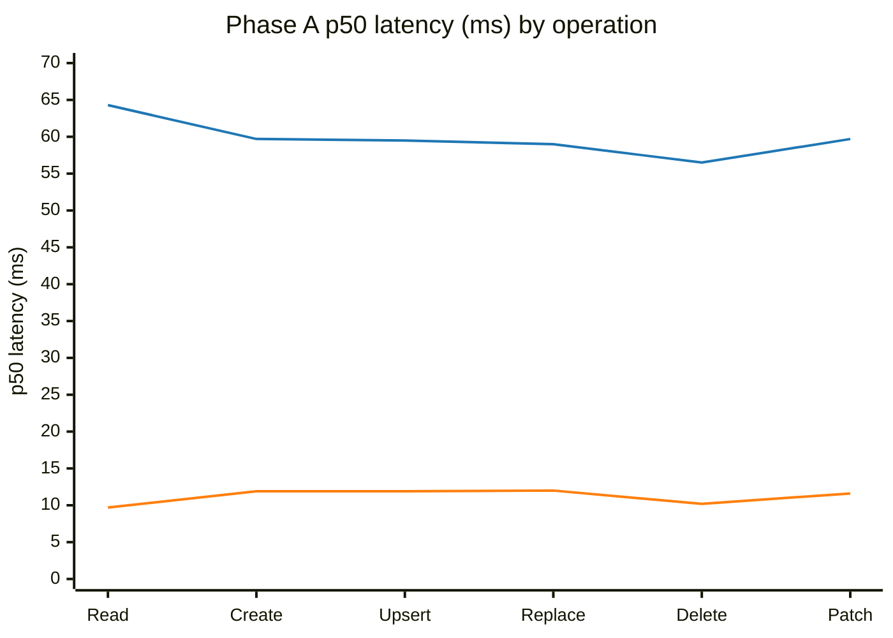
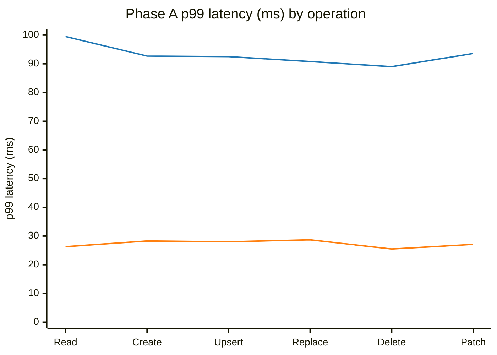
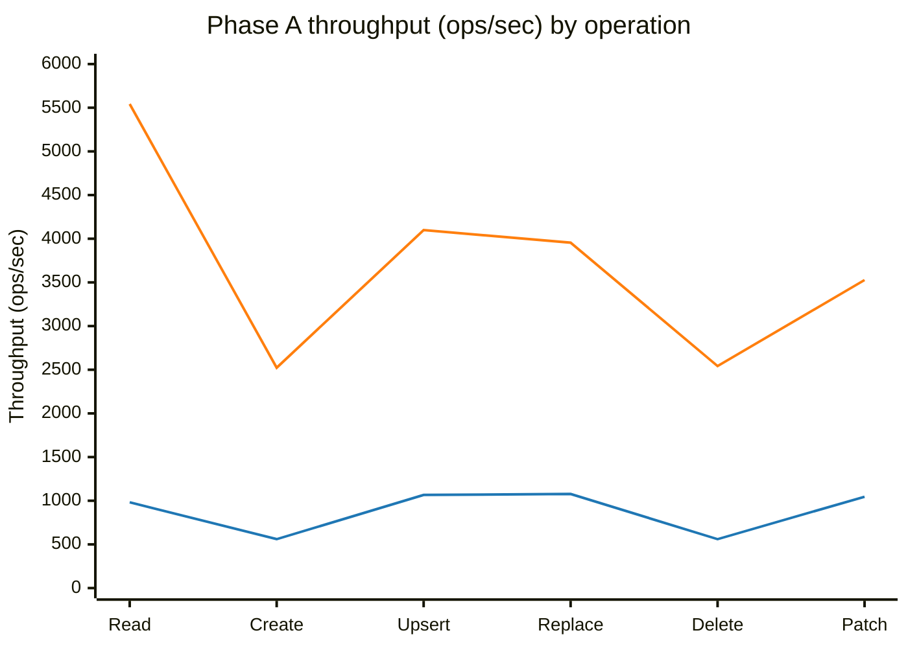
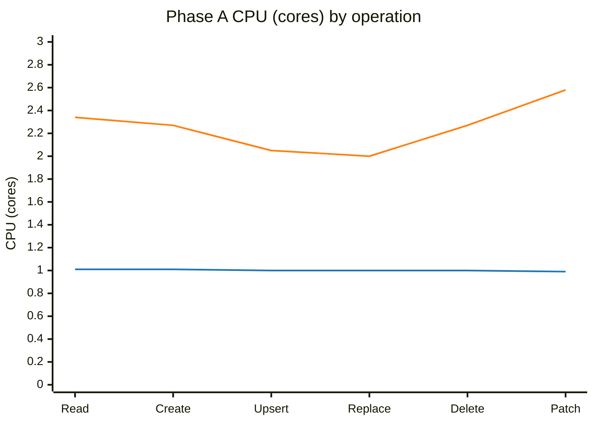
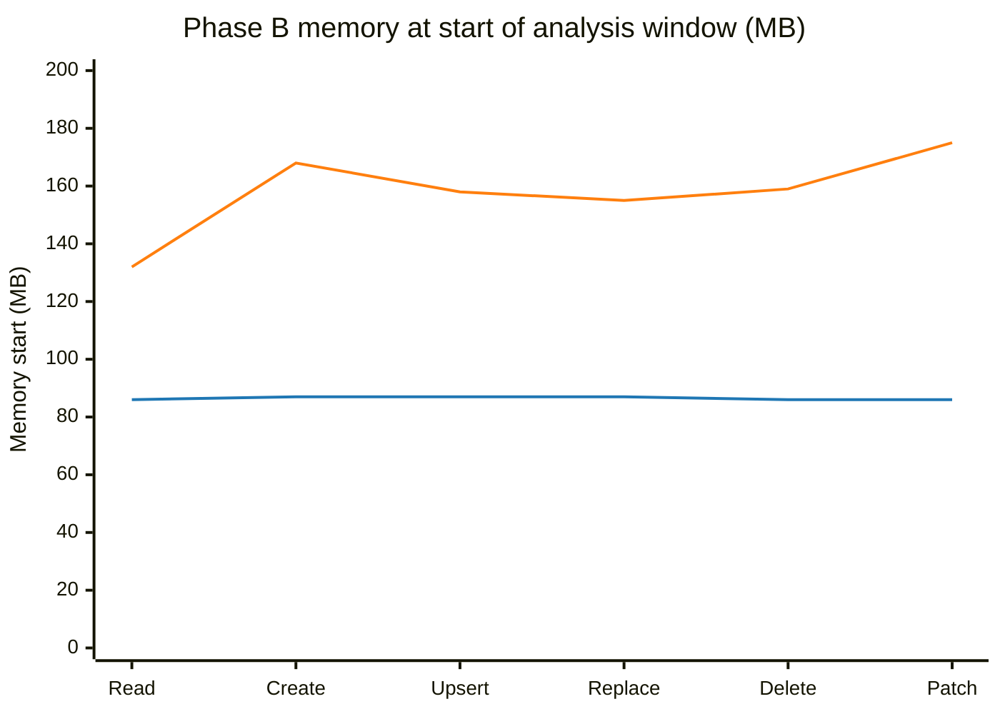
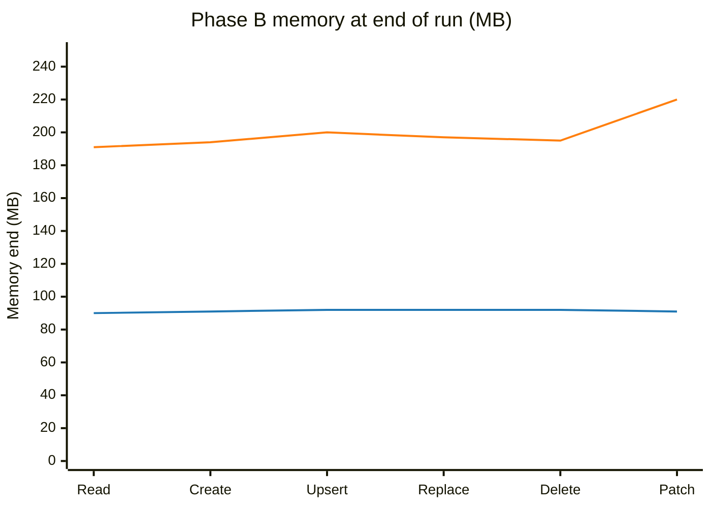
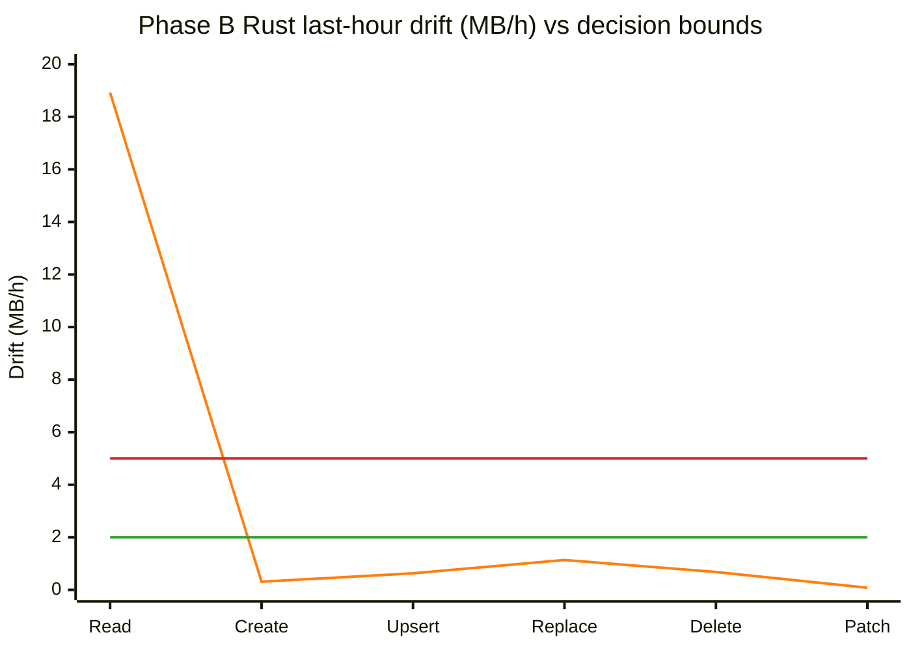

# Rust vs Python — Cosmos SDK Speed Test Results

The Cosmos Python SDK can run database calls two ways: the original **all-Python**
engine, and a **new engine that hands the heavy work to Rust**. This document answers a
simple question : **is the new (Rust) engine faster, by how much, and
what does it cost?**

> **Rust driver under test:** Cosmos Rust driver **v0.6.0** (commit `106ad05bc`). Every Rust
> measurement in this document was produced by this single build.

## Phase 0 — SLA validation

**What this phase does.** Validates the environment with a light-load probe — one request at a time (no client queue) — to establish the true per-request latency baseline (target p99 ≈ 10 ms).

**What we did.** Single region (West US 2), account on the **Compute Gateway** , client VM
in the same region with accelerated networking on, over the Gateway path, on an isolated container. For
each of the six point operations, on **both engines**, we ran one request at a time (`concurrency=1`,
one client) for ~8 minutes. The percentiles below reflect every request across the full run — true
per-request latencies, not an average of separate time windows.

**Results (one request in flight; p50/p90/p99/p99.9 in milliseconds):**

| Operation | Engine | p50 | p90 | p99 | p99.9 | req/s @conc=1 | RU/op | Errors |
|-----------|--------|----:|----:|----:|------:|--------------:|------:|:------:|
| **Read**    | Python | 3.66 | 4.63 | 7.62 | 23.90 | 250 | 1.00 | 0 |
|             | Rust   | 2.75 | 3.56 | 6.28 | 9.90  | 337 | 1.00 | 0 |
| **Create**  | Python | 6.89 | 7.88 | 10.64 | 34.14 | 70  | 7.24 | 0 |
|             | Rust   | 6.36 | 7.24 | 10.46 | 15.56 | 78 | 7.24 | 0 |
| **Upsert**  | Python | 7.37 | 8.34 | 10.04 | 16.43 | 132 | 11.18 | 0 |
|             | Rust   | 6.68 | 7.89 | 10.96 | 15.31 | 144 | 11.19 | 0 |
| **Replace** | Python | 7.43 | 8.50 | 11.32 | 17.84 | 130 | 11.62 | 0 |
|             | Rust   | 6.73 | 7.91 | 10.95 | 15.26 | 143 | 11.62 | 0 |
| **Delete**  | Python | 6.68 | 7.68 | 10.57 | 23.86 | 70  | 7.24 | 0 |
|             | Rust   | 5.97 | 7.06 | 9.83 | 15.49 | 78  | 7.24 | 0 |
| **Patch**   | Python | 7.48 | 8.62 | 11.12 | 15.97 | 129 | 10.79 | 0 |
|             | Rust   | 9.46 | 11.03 | 14.63 | 23.50 | 101 | 10.67 | 0 |

**What this proves.**

- **The environment is valid.** The Python baseline lands at **~7–11 ms p99** for every operation
  (reads well under 10 ms; writes right on the line, which is expected since writes replicate and
  cost 7–12 RU). Zero errors, zero throttling. 
- **Patch on Rust is slightly slower .** The Rust driver implements Patch as a
  client-side read-modify-write (an internal read plus an ETag-guarded replace, so two round trips)
  rather than a single server-side patch — which accounts for the higher conc=1 latency.

---

## Phase A — fixed-load performance baseline

We ran the six everyday database operations — **Read, Create, Upsert, Replace, Delete,
and Patch (partial update)** — through each engine under a fixed, identical load and timed every request.

**Environment.** Single region (West US 2), account on the **Compute Gateway** routing plane, client VM
in the same region with accelerated networking on, Gateway connection mode, **Session** consistency.
What's specific to Phase A on top of that baseline:

- **Records pre-loaded:** **~1,000,000 items** (~1 KB each), so reads/updates/deletes worked against a real data set.
- **Load:** **100 requests in flight at all times**, identical for both engines — a steady, moderate load (deliberately *not* each engine's maximum); 30-second request timeout.
- **Duration:** **30 minutes per operation, per engine** — **49,452,500** operations in total, with **0 errors**.
- **Containers:** operation container `scale_db/scale_cont` at **100,000 RU/s** (far more headroom than the load needs, so the database is never the bottleneck); results written to a separate container so recording never competes with the measured operation.

---

## Detailed — each operation

> **These are fixed-load numbers, not SLA latency.** Every latency below is measured with **100
> requests in flight at all times**, so it includes the time each request spent waiting its turn
> **inside the SDK client**.  The load generator deliberately keeps 100 requests outstanding, so under saturation most of
> the measured time is a request queued in that client waiting for one of the 100 slots, rather than
> time the database took. That is the right basis for comparing the two engines under identical
> pressure, but *not* a per-request SLA figure. 

| Operation | Engine | p50 (ms) | p99 (ms) | p99.9 (ms) | Throughput (ops/sec) | Requests | Errors | RU/op | CPU (cores) | p50 speed-up |
|-----------|--------|---------:|---------:|-----------:|---------------------:|---------:|:------:|------:|------------:|:------------:|
| **Read**    | Python | 64.3 | 99.5 | 114.2 | 982   | 1,767,700 | 0 | 1.00 | 1.01 | — |
|             | Rust   | 9.7  | 26.3 | 31.5  | 5,542 | 9,973,900 | 0 | 1.00 | 2.34 | **6.6× faster** |
| **Create**  | Python | 59.7 | 92.7 | 104.4 | 560   | 1,007,200 | 0 | 7.24 | 1.01 | — |
|             | Rust   | 11.9 | 28.3 | 37.8  | 2,523 | 4,540,500 | 0 | 7.24 | 2.27 | **5.0× faster** |
| **Upsert**  | Python | 59.5 | 92.5 | 104.1 | 1,066 | 1,917,900 | 0 | 11.19 | 1.00 | — |
|             | Rust   | 11.9 | 28.0 | 35.1  | 4,099 | 7,377,400 | 0 | 11.19 | 2.05 | **5.0× faster** |
| **Replace** | Python | 59.0 | 90.8 | 101.4 | 1,077 | 1,937,600 | 0 | 11.63 | 1.00 | — |
|             | Rust   | 12.0 | 28.7 | 40.1  | 3,955 | 7,117,400 | 0 | 11.63 | 2.00 | **4.9× faster** |
| **Delete**  | Python | 56.5 | 89.0 | 113.2 | 560   | 1,007,100 | 0 | 7.24 | 1.00 | — |
|             | Rust   | 10.2 | 25.5 | 35.6  | 2,542 | 4,575,500 | 0 | 7.24 | 2.27 | **5.5× faster** |
| **Patch**   | Python | 59.7 | 93.6 | 115.7 | 1,046 | 1,882,600 | 0 | 10.80 | 0.99 | — |
|             | Rust   | 11.6 | 27.1 | 45.5  | 3,527 | 6,347,700 | 0 | 10.67 | 2.58 | **5.1× faster** |

> **Each operation ran with 100 requests in flight for 30
> minutes on each engine**, on the `scale_db/scale_cont` container (100,000 RU/s). The two engines and
> the six operations were run **one at a time, back-to-back — never in parallel**, so no two measured
> runs ever shared the machine's CPU (which would distort latency): per operation, 30 min core-python
> then 30 min Rust = 1 hour, and 6 operations × 2 engines × 30 min = **~6 hours of measured load
> end-to-end** (plus warm-up). The latency
> percentiles are the exact values across the whole run (not an average of separate windows); CPU is the
> per-process average after dropping the first 10 minutes of warm-up; and every cell had **zero errors
> and zero throttling**.

> **About the p99.9 column.** p99.9 is the "one-in-a-thousand slowest request" number, so it has to be
> combined across the whole run correctly rather than averaged. For this run every latency percentile
> (p50/p90/p99/p99.9) is computed from the full recorded distribution of *every* request — nothing
> sampled, estimated, or dropped — so these are exact run-wide values, and the throughput,
> request-count, RU/op, and error/429 totals are exact too.

---

## Visual snapshot — Phase A 

- **Blue = Python (core-python backend)**
- **Orange = Rust backend**

### p50 latency curve (lower is better)

### p99 latency curve (lower is better)

### Throughput curve (higher is better)

### CPU curve (higher is more host CPU)

---

- **The one operation to call out is Patch.** Its Rust p99.9 (~46 ms) is higher than the other
  Rust operations. Even so, that ~46 ms is still faster than the Python engine's *typical*
  (p50 ~60 ms) Patch time and well under half its p99.9 (~116 ms) — so Patch is still a clear win, just
  with a bumpier deep tail.

---

## Phase B — Long-run memory stability (12-hour continuous run)

Phase A tells  how the
SDK behaves for a few minutes. But real customer apps run for *days or weeks* without
restarting. If an SDK uses a little more memory on every call and never gives it back — a
"memory leak" — that memory piles up until the app runs out and the operating system kills
it. This phase proves 
memory settles at a stable level and *stays* there over a long run, rather than creeping up
forever. 

**What "memory" means here.** We tracked the RAM the SDK's process actually held (its
"resident" memory, in megabytes). A healthy long-running process climbs a bit during warm-up
— as it builds connection pools and caches — and then holds flat. A leaking one keeps
climbing with no ceiling.

**What we did.** Single region (West US 2), account on the **Compute Gateway** ,
client VM  in the same region, Gateway connection mode, **Session**
consistency — the same baseline as Phase A.  What's specific to
Phase B on top of that baseline:

- **Coverage:** all six operations on both engines — the same operations as Phase A, measured here
  for long-run memory rather than short-run speed.
- **What changed vs Phase A:** the load shape. Instead of Phase A's fixed 100-in-flight / 30-minute
  windows, each operation ran **continuously for 12 hours**. The six operations ran as **six separate
  processes at the same time on the VM** (one process per operation), each running the full 12 hours.
- **Engines run apart:** the two engines ran **back-to-back, never together** (all-Python's 12
  hours, then Rust's), so the total wall-clock was **~24 hours** and at no moment were more than
  six workload processes running. Running them together would make them fight over the same VM CPU
  and RAM, which would distort each engine's memory reading.

**What we measured.** The process's memory (RSS), sampled about every **5 minutes** — **144
readings per operation** over the 12 hours, with windows tightly clustered around a median of
**300.197 s**. The first reading, taken during warm-up, is dropped from the trend, leaving **143
analyzed**. 

### How to read the verdicts:

- **PLATEAUED** — climbed during warm-up, then went flat and stayed there. Healthy.
- **STAIRCASE** — rose in a few discrete jumps (memory pools grabbing a chunk at a time) and
  then held. Bounded and healthy — *not* a leak.
- **WATCH** — mostly flat, but the final stretch is still drifting up a little, so we cannot
  yet *prove* it has leveled off. Not a proven leak; a follow-up item.
- **GROWING** — the final stretch is still *clearly* climbing (even the best-case slope is ≥ 5
  MB/h), so this run alone cannot call it bounded. Not proof of an unbounded leak, but the
  strongest "keep investigating" signal.

we look at the last hour's growth rate and
its uncertainty band (95% CI). If the worst-case side is still small (upper bound ≤ 2 MB/h),
we call it bounded/flat (`PLATEAUED` or `STAIRCASE` depending on shape). If even the best-case
side is clearly high (lower bound ≥ 5 MB/h), we call it `GROWING`. Anything in between is
`WATCH` — basically "not scary, but not fully closed yet."*

### All-Python engine — flat, no leak

Every operation settled around **85–92 MB** and held there for 12 hours. The tail (the last
hour) is essentially flat — between **+0.00 and +0.05 MB per hour**, which is noise, not
growth.

| Operation | Memory start→end (MB) | Verdict |
|-----------|----------------------:|---------|
| Read    | 86 → 90 | PLATEAUED |
| Create  | 87 → 91 | PLATEAUED |
| Upsert  | 87 → 92 | PLATEAUED |
| Replace | 87 → 92 | PLATEAUED |
| Delete  | 86 → 92 | PLATEAUED |
| Patch   | 86 → 91 | PLATEAUED |

Shape (Create, all-Python): `87 ▁▅▅▅▆▆▆▇▇▇▇▇▇▇▇▇▇▇▇▇█ 91` — a small warm-up rise, then a flat line.

### Rust engine — higher but bounded, no per-operation leak

The Rust engine settles at a **higher** memory level than the all-Python engine (roughly
**2.1–2.4× more**, ~190–220 MB). That is expected: it keeps more machinery resident (per-core
worker threads, connection pools, buffers) — the same machinery that buys the 5× speed. The
important question is not "is it higher?" (it is, by design) but "does it *keep climbing*?"
For **five of six** operations, no — they rise during warm-up and then hold flat. The one
operation still drifting at the end is **Read**:

| Operation | Memory start→end (MB) | Last-hour drift (MB/h) | Verdict                |
|-----------|----------------------:|-----------------------:|------------------------|
| Create  | 168 → 194 | +0.31 | PLATEAUED              |
| Delete  | 159 → 195 | +0.68 | PLATEAUED              |
| Patch   | 175 → 220 | +0.08 | PLATEAUED              |
| Replace | 155 → 197 | +1.14 | PLATEAUED              |
| Upsert  | 158 → 200 | +0.63 | PLATEAUED              |
| **Read** | **132 → 191** | **+18.92** | **GROWING(See Below)** |

### Visual snapshot — Phase B (XY-coordinate curves)

- **Blue = Python (core-python backend)**
- **Orange = Rust backend**
- *(drift chart only)* **Green = flat upper bound (2 MB/h)**, **Red = leak lower bound (5 MB/h)**

For chart consistency, X-axis order is: **Read, Create, Upsert, Replace, Delete, Patch**.

Shape (Read, Rust): `132 ▁▂▂▃▃▄▄▄▅▅▅▆▆▆▇▇▇▇███ 191` — a warm-up rise that, unlike the other five
operations, **never flattened** — it kept drifting upward through the end of the run.

Shape (Create, Rust): `168 ▁▃▄▅▅▆▆▆▇▇▇▇▇▇▇▇▇▇▇██ 194` — warm-up rise, then flat.

**What the Read result means.** Rust Read rose from 132 to 191 MB and was still drifting up
(+18.9 MB/h) in the final hour of the six-operation run. This is **not** an unbounded per-operation
leak. Read is actually the *cheapest* operation per call (1.00 RU/op), but it runs at the **highest
throughput** — ~5,500 req/s in Phase A, well above the other operations — so over 12 hours it does the
most allocate/free **churn per second**. It is that churn, not a Read-specific defect, that pushes the C
allocator's held-memory high point up the most. The explanation and the 12-hour capped run below confirm
this directly: under `MALLOC_ARENA_MAX=2` the same Read line goes flat at +0.00 MB/h.

### Why Rust sits higher and drifts — glibc arena retention, not a leak

To classify the residual creep, we drove the **real Rust read path** in-process while sampling, every
15 s, the resident memory (RSS), the Python heap (`tracemalloc`), and the C allocator's own accounting
(`mallinfo2`: bytes **in use** vs bytes **freed-but-retained**), and we periodically called
`malloc_trim(0)` to see how much the allocator would hand back to the OS. We ran the same 12-minute read
loop under three allocator settings: the glibc default (many per-thread arenas) and with arenas capped
to `MALLOC_ARENA_MAX=2` and `=1`.

| Setting | Warmed RSS | Python heap | In-use (live) | Freed-but-retained | `malloc_trim` returned |
|---------|-----------:|------------:|--------------:|-------------------:|-----------------------:|
| glibc default (many arenas) | **176 MB** | 36 MB | 60–66 MB | **~48 MB** | ~15 MB |
| `MALLOC_ARENA_MAX=2` | **142 MB** | 36 MB | 60–63 MB | **~6 MB** | ~2 MB |
| `MALLOC_ARENA_MAX=1` | **147 MB** | 36 MB | 60–66 MB | **~6 MB** | ~1 MB |

**Four independent signals all point to bounded allocator retention, not a leak:**

- **The bytes are not in Python.** The Python heap stays flat at **~36 MB** the whole run while RSS is
  ~176 MB — so the bulk of resident memory is native/allocator-side, not accumulating Python objects.
- **The genuinely-live pool is flat.** The C allocator's *in-use* bytes hold steady at **~60–66 MB**
  across every setting and over time. A real leak would drive this up without bound; it does not.
- **The excess is reclaimable.** A single `malloc_trim(0)` returned **~15 MB** to the OS in the default
  configuration — memory a true leak could never give back.
- **Capping arenas removes it.** `MALLOC_ARENA_MAX=2` cut warmed RSS by **~34 MB** and collapsed the
  freed-but-retained pool from **~48 MB to ~6 MB**. That is the textbook signature of glibc
  **per-thread arena fragmentation**: the Rust async runtime's thread pool creates many threads, each
  keeping its own arena of freed chunks that glibc does not return to the OS by default.

**Conclusion.** The higher Rust resident memory — and, by the same mechanism, the slow multi-hour creep
(an arena high-water ratchet) — is **bounded, reclaimable glibc-arena retention, not a memory leak.**

**Confirmatory long run — the drift goes flat under the cap (PASS).** The 12-minute probe proves the
*mechanism* of the extra resident memory but not that the multi-hour drift fully levels off, so we ran the
decisive confirmation: a **12-hour Read run on `leak_cont`, on its own, with `MALLOC_ARENA_MAX=2`**
applied to the workload (stamp `leak-20260705-203944246`, single verified build `106ad05bc`, zero
errors). The pass bar was set in advance: Rust Read **last-hour slope 95% CI upper bound ≤ 2 MB/h**.

| Engine | Read memory start→end (MB) | Last-hour drift (MB/h) | Steps | Verdict |
|--------|---------------------------:|-----------------------:|:-----:|---------|
| **Rust** (`MALLOC_ARENA_MAX=2`) | **106 → 128** | **+0.00 ± 0.00** | 0 | **PLATEAUED** |
| All-Python (control) | 86 → 89 | −0.01 ± 0.01 | 0 | PLATEAUED |

The Rust line **flattened completely** (0.00 MB/h in the final hour, well inside the ≤ 2 MB/h bar) —
versus **+18.9 MB/h** in the uncapped six-operation run. **The decisive signal is that last-hour slope
collapsing to zero under the arena
cap**; the "0 steps" (no staircase jumps) is *supportive corroboration, not standalone proof*. The
early-vs-late split on this same run confirms the mechanism directly: **+2.3 MB/h at ~3 h** (arenas still
warming) decays to **+0.00 MB/h** once they saturate. This confirms the root cause: the slow creep is
**bounded arena retention that plateaus under the
cap — not a leak.** `MALLOC_ARENA_MAX=2` is the validated default mitigation for memory-sensitive,
always-on deployments.

**One caveat.** This fix **only applies to Linux machines that use the glibc C library** —
`MALLOC_ARENA_MAX` is a setting glibc's memory allocator reads at startup, so it does nothing on
Windows, macOS, or a Linux build with a different allocator. On those platforms the arena behavior
(and any tuning) is different; this specific recommendation is for the common Linux/glibc deployment.

The memory readings we saved don't
record whether the cap was switched on, so rather than take it on faith, we captured a snapshot of the
running process's startup settings from Linux (`/proc/<pid>/environ`) and kept it with the run record
(`logs/leak-20260705-203944246/arena_provenance.txt`). That snapshot shows `MALLOC_ARENA_MAX=2` was
set on the Rust workload during the decisive run. And both runs — the capped Rust run and the
all-Python control — ran the **full 12 hours (43,200 s)**, each with 144 five-minute readings, no
missing windows, and zero errors, so the control is a complete comparison run, not a partial one.

---

## Phase C — Stress behavior under heavy load (concurrency scale sweep)

 Phase 0 measured one request at a
time, and Phase A held a single fixed load (100 in flight). Neither answers the question a
team sizing a service actually asks: *"As I turn concurrency up, how much work can each engine
really push, where does it stop getting faster, and what becomes the wall — the database or my
own process?"* Phase C answers exactly that. It drives each engine harder and harder and reads
back the **achieved throughput, the latency cost, and the CPU cost** at every step. The payoff
is concrete: it tells you the **maximum requests/second you can expect from one
process**, the **concurrency setting that reaches it** (past which you only add latency, not
throughput), and **whether scaling further needs a bigger RU budget or just more processes**.

**How we ran it.** Same account and Gateway path, on a dedicated VM — the same environment as the
Phase A fixed-load baseline (**West US 2, same region as the account, accelerated
networking on, Gateway connection mode, Session consistency**) — with the account to itself.
Operation container `scale_db/scale_cont` provisioned at **150,000 RU/s** (the same physical
container used in Phase A, re-provisioned up from 100,000 RU/s so RU headroom — not the SDK — is
the intended limit under the heavier concurrency). This throughput is configured out-of-band
(`az ... throughput update`); the runner reports the target but does not enforce it. For two representative
operations (`read`, `upsert`) on **both engines**, we swept a concurrency ladder of
**32 → 64 → 128 → 256 → 512 → 1024** in-flight requests. Each **point** is one cell of that grid —
a single operation, at a single concurrency rung, on a single engine (so read + upsert × 6 rungs ×
2 engines = 24 points). Every point ran **1800 s**, one at a time back-to-back (never overlapping),
with the first **600 s dropped as warm-up**. Achieved throughput is measured directly as
`count / window_seconds` per reporting window.

**Results — achieved throughput (req/s) with p50/p99 latency (median across the post-warm-up
measurement windows). Per-process CPU is summarized in the prose below, not tabled.**

| Op | Engine | c32 | c64 | c128 | c256 | c512 | c1024 |
|----|--------|----:|----:|-----:|-----:|-----:|------:|
| **Read** | core-python req/s | 948 | **960** | 950 | 923 | 910 | 882 |
|          | rust req/s | 4,514 | 5,027 | **5,468** | 5,453 | 5,205 | 5,161 |
|          | core-python p50/p99 ms | 20.9/42.1 | 40.8/70.0 | 84.9/126.1 | 172.2/234.0 | 354.6/451.8 | 723.5/912.9 |
|          | rust p50/p99 ms | 3.6/7.6 | 7.0/20.6 | 12.2/30.7 | 23.1/46.5 | 45.5/85.6 | 87.7/157.1 |
| **Upsert** | core-python req/s | 900 | 986 | **1,051** | 1,047 | 1,012 | 994 |
|            | rust req/s | 2,454 | 3,583 | 4,360 | 4,732 | **4,820** | 4,789 |
|            | core-python p50/p99 ms | 23.3/44.2 | 40.5/68.7 | 76.1/113.7 | 152.8/203.8 | 327.2/396.5 | 648.2/791.6 |
|            | rust p50/p99 ms | 7.6/11.9 | 8.4/22.6 | 14.8/34.0 | 26.9/53.1 | 47.8/87.5 | 93.8/160.3 |

**Zero throttling (0 × 429) at every point** — the 150k RU container was never the bottleneck. As
in every phase, core-python is pinned near **~1 CPU core** (the GIL ceiling) while Rust spreads
across **~2+ cores**, which is why Rust keeps scaling with concurrency and core-python does not.

**What the sweep tells us:**

- **Each engine has a clear ceiling, and rust's is far higher.** Rust delivers **~5.5× more read
  throughput** (geomean 5.52×, range 4.76–5.91× across the shared levels) and **~4× more upsert
  throughput** (geomean 4.03×, range 2.73–4.82×) than core-python at matched concurrency.
- **core-python is GIL-bound and saturates almost immediately.** Its throughput is essentially flat
  (~0.9k read / ~1.05k upsert req/s), topping out by c64–c256 while pinned at ~1 CPU core — adding
  concurrency buys **no** extra throughput, only linearly worse latency (read p50 21 ms → 724 ms at c1024).
- **rust scales with concurrency to a knee, then flattens.** Read **peaks at c128 (~5,468 req/s)** and
  holds its knee at **c256 (~5,453 req/s)**. Upsert **peaks and knees together at c512 (~4,820 req/s)**,
  beyond which throughput is flat/slightly down while latency keeps climbing. **Practical guidance:
  operate rust around 256–512 in-flight per process**; pushing to 1024 gains nothing.
- **The wall is the client, not the database.** 0 × 429 everywhere means RU headroom was never the
  limit — core-python is capped by the GIL (~1 core) and rust by client CPU (~2+ cores). To go
  past one process's ceiling toward the account's full capacity, **scale out** (run N processes at
  the knee concurrency and sum their throughput), not up — quantified in the next section.

---

## Scale-out — one VM, many processes

**Why we ran this.** The ceiling sweep above found each *single process* has a ceiling (Rust ~5.5k read req/s at
its knee) set by client CPU, not the database. The obvious question for anyone sizing a fleet:
*if one process tops out on CPU, do several processes side by side simply add up?* This run
answers it directly.

**How we ran it.** On one VM, we launched **N identical Rust `read`
processes**, each at the single-process knee concurrency (c256), for **N = 1, 2, 4, 8, 12, 16**,
and summed their achieved throughput. The 150k RU/s container had ample RU headroom, so the only
thing that can bend the curve is the VM's own CPU.

| N processes | Total read req/s | vs 1 process | Efficiency |
|------------:|-----------------:|-------------:|-----------:|
| 1  | 5,399  | 1.0×  | 1.00 |
| 2  | 10,746 | 2.0×  | 1.00 |
| 4  | 20,079 | 3.7×  | 0.93 |
| 8  | 35,838 | 6.6×  | 0.83 |
| 12 | 47,911 | 8.9×  | 0.74 |
| 16 | 56,263 | 10.4× | 0.65 |

**What it means.** Throughput **scales out cleanly**: two processes are perfectly linear, and even
at 16 processes one VM pushes **~56,000 read req/s** — 10.4× a single process — with **zero
throttling**. Efficiency tapers from 1.00 to 0.65 only because the VM's CPU fills up (system CPU
rose ~3 % → ~53 %), exactly the expected shape. The takeaway: **to go past one process's
ceiling, add processes (and then VMs), not concurrency** — the database was never the limit here.

---

## Mixed / blended workload — the realistic-SLA number

The phases above isolate one operation at a time. Real services send a *mix*. Here one
process issues a weighted blend (read-heavy, with create/upsert/replace/patch) so we can report
the **blended tail latency** a real app would actually see.

**How we ran it.** One process per engine issued a **read-heavy mix — read 70%, upsert 15%, create 5%,
replace 5%, patch 5%** (by relative weight) — with **100 requests in flight**, for **15 minutes (900 s)
per engine**, against the seeded `lat_probe_db/lat_probe_cont` container (so reads/replace/patch hit
existing items). That produced **861,800 requests on all-Python and 3,244,100 on Rust**, with **zero
errors and zero throttling** on both. The blended p99/p99.9 are computed from every request in the
run (all operation types combined), not averaged from per-operation summaries, so they reflect the
true one-in-100 and one-in-1,000 slowest calls a mixed app would actually see.

| Engine | Blended p99 | Blended p99.9 | Total requests (15 min) | Throughput (req/s) | Errors |
|--------|------------:|--------------:|------------------------:|-------------------:|-------:|
| All-Python | 91.0 ms | 99.7 ms | 861,800 | ~958 | 0 |
| **Rust**   | **26.7 ms** | **35.0 ms** | **3,244,100** | **~3,605** | 0 |

**What it means.** On a realistic mix, **Rust's blended p99 is ~3.4× lower** (26.7 ms vs 91.0 ms)
and it pushes ~3.8× the aggregate throughput (~3,605 vs ~958 req/s), with zero errors on both engines.
The per-operation wins from Phase A carry through to a blended workload — the SLA number a customer
would quote improves across the board.

---

## Cold-start — the first call after a process starts

**Why this matters.** Everything above measures steady state — a process that has been running for a
while and has already opened its network connections. But serverless functions, autoscaled pods, and
scale-to-zero services are judged on what happens right after a **brand-new process starts**, before
any of that setup has happened. The **first** request a fresh process makes is the slowest one, because
that single call has to pay the one-time setup cost — opening a TLS connection to Cosmos, establishing a
session, and (for Rust) starting the Tokio runtime. Every later call reuses that setup and is fast.
We started **25 fresh processes per operation per engine**, recorded the latency of each process's first
request, and report both the median (p50) and the slow tail (p99) of those 25 first-call times below.

| Operation | All-Python p50 | All-Python p99 | Rust p50 | Rust p99 |
|-----------|---------------:|---------------:|---------:|---------:|
| Read    | 20.3 ms | 59.3 ms | 152.7 ms | **5211.8 ms** |
| Create  | 27.6 ms | 65.2 ms | 160.6 ms | 213.0 ms |
| Upsert  | 28.5 ms | 50.9 ms | 161.9 ms | **4181.0 ms** |
| Replace | 28.1 ms | 58.5 ms | 167.8 ms | **5184.9 ms** |
| Patch   | 28.6 ms | 51.9 ms | 155.0 ms | 225.6 ms |

Note: with 25 samples per cell, "p99" is effectively the single slowest of the 25 first calls, so read
it as a worst-case first-call, not a stable percentile.

**What it means — a real Rust trade-off.** Rust's **typical first call (p50) is ~5–8× slower** than
all-Python (~150–170 ms vs ~20–30 ms), because it front-loads more one-time setup (cold TLS handshake,
Tokio-runtime start-up, connection-pool warm-up). The **worst-case first call (p99) is far heavier on
three operations** — Read, Upsert, and Replace hit **~4–5 seconds** on the unluckiest of the 25
processes, versus a well-behaved ~0.2 s on Create and Patch and ~0.05–0.07 s for all-Python everywhere.
So a fraction of cold Rust processes can pay a multi-second first request. This is the flip side of
Rust's steady-state speed.
**Guidance:** for long-lived processes this is a non-issue (paid once, then far faster forever);
for short-lived / scale-to-zero workloads, **pre-warm the client** (make one throwaway call at
startup) before serving traffic.

---

## TODO

- **Payload shape & size — turn single points into curves.** The blended-SLA, cold-start, and
  payload-size probes above are each one data point. Before publishing payload-size claims, run a
  full small-vs-large document grid (plus more op mixes and idle/first-call scenarios) and localize
  the Rust large-write tail (p99 510 ms) and cold-start first-call cost. Until that rerun confirms
  stable, reproducible numbers, keep the single-point payload-size claim out of the main findings.
- **Phase D planning backlog.** Add the failure-mode
  and resilience runs we still owe: open-loop overload recovery, 429/throttle recovery,
  region failover, many-clients/many-accounts boundedness, mixed/large-item behavior, and
  lifecycle create/close churn.
- **Phase D correctness/safety gates.** Add differential correctness fuzz,
  cancellation/timeout chaos, fork+signal lifecycle, resource-exhaustion behavior, credential
  refresh at scale, and multi-day sanitizer soak.
- **Phase D dependency to unblock failover/429 on Rust.** Add fault injection that sits below
  the SDK path the Rust engine actually uses; without that, failover/429 “passes” can be false
  positives.

---

