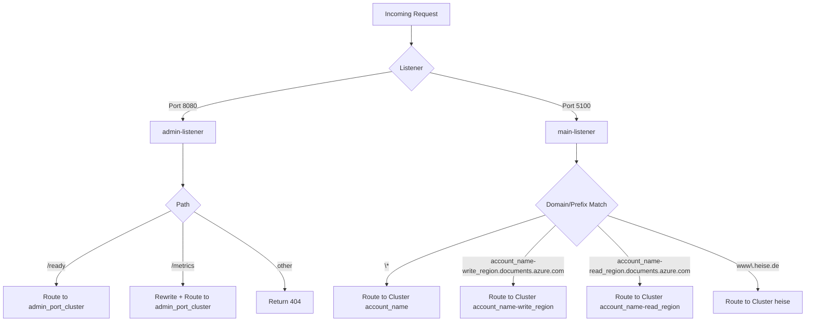

<!-- cspell:disable -->
# Envoy Configuration Documentation

**Purpose:**  
This Envoy proxy configuration manages traffic routing to internal and external services, such as Azure Cosmos DB endpoints, while exposing local admin metrics. It enforces strict retry logic, TLS encryption, and structured access logging.

---

## Listeners

### 1. `admin-listener` (Port `8080`)

**Purpose:** Handles health checks and Prometheus metrics access for observability.

**Routes:**

| Path       | Action                                  |
|------------|------------------------------------------|
| `/ready`   | Routed to `admin_port_cluster`           |
| `/metrics` | Routed to `admin_port_cluster` with `prefix_rewrite: /stats/prometheus` |
| `*`        | Returns HTTP 404 (direct response)       |

**HTTP Filter Chain:**
- Uses `envoy.filters.http.router`
- Enables `respect_expected_rq_timeout: true` to support `x-envoy-expected-rq-timeout-ms` header.

---

### 2. `main-listener` (Port `5100`)

**Purpose:** Handles user/application traffic and routes to various external services including Azure Cosmos DB regions.

**Key Settings:**
- **Stat Prefix:** `router_http`
- **Scheme Overwrite:** Forces outgoing requests to use `https` (`scheme_header_transformation`)
- **Strip Host Ports:** Enabled (`strip_any_host_port: true`)
- **Node ID-based Proxy Status:** Enabled

**Timeouts and Limits:**

| Setting                    | Value   |
|----------------------------|---------|
| Max Connection Duration    | 900s    |
| Drain Timeout              | 330s    |
| Stream Idle Timeout        | 60s     |
| Max Request Header Size    | 120 KB  |

**Response Header Modification:**
- Adds: `via: %ENVIRONMENT(POD_NAME)%` (for traceability)

**HTTP Filters:**
- Only one: `envoy.filters.http.router`, with retry logic support.

**Routes:**

| Name                                  | Domains                       | Cluster   | Retry Policy                                  |
|---------------------------------------|-------------------------------|-----------|-----------------------------------------------|
| `local_<account_name>`                | `*`                           | `<>`      | `connect-failure,refused-stream,reset`, 3 retries |
| `local_<account_name>-<write_region>` | `<account_name>-<write_region>.documents.azure.com` | `<account_name>-<write_region>` | Same                                         |
| `local_<account_name>-<read_region>`  | `<account_name>-<read_region>.documents.azure.com`   | `<account_name>-<read_region>`   | Same                                          |
| `local_heise`                         | `www.heise.de`                | `heise`   | Same                                          |

---

## Request Routing Flow (Mermaid Diagram)

