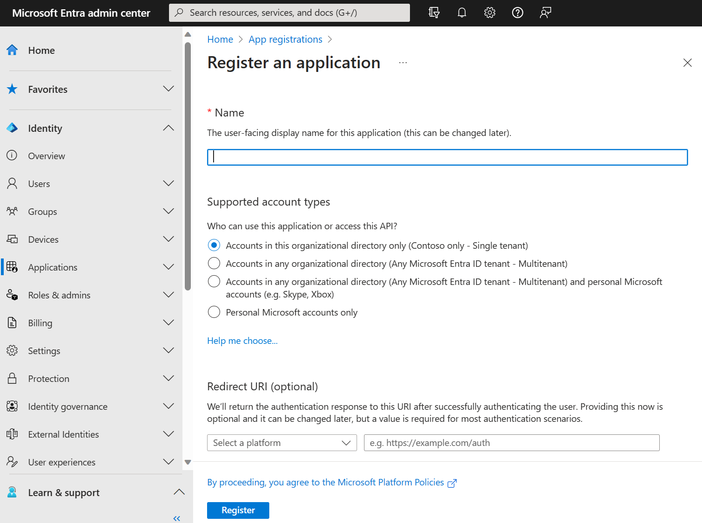
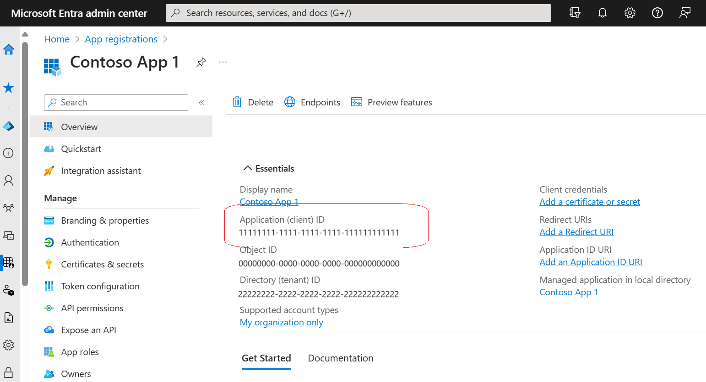
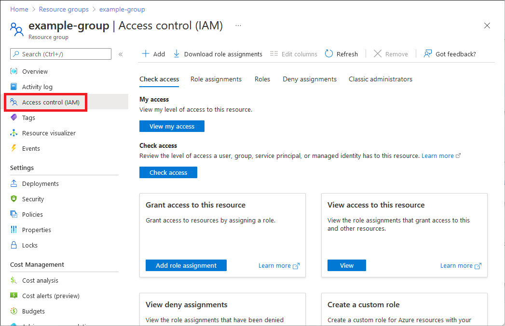
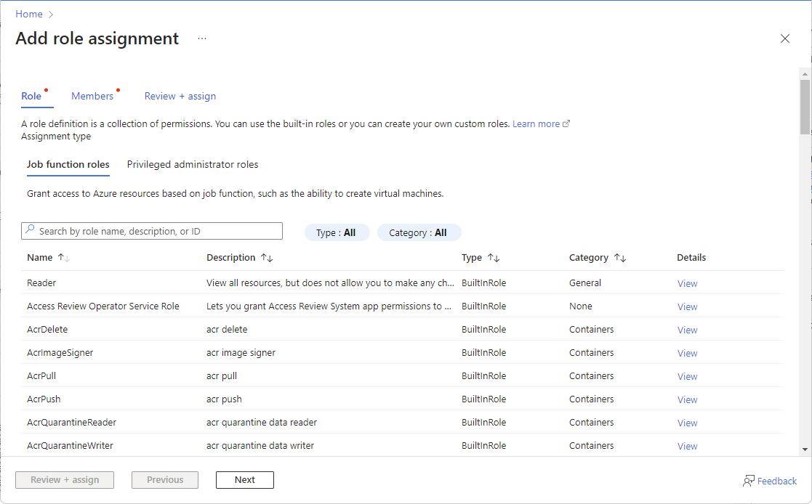
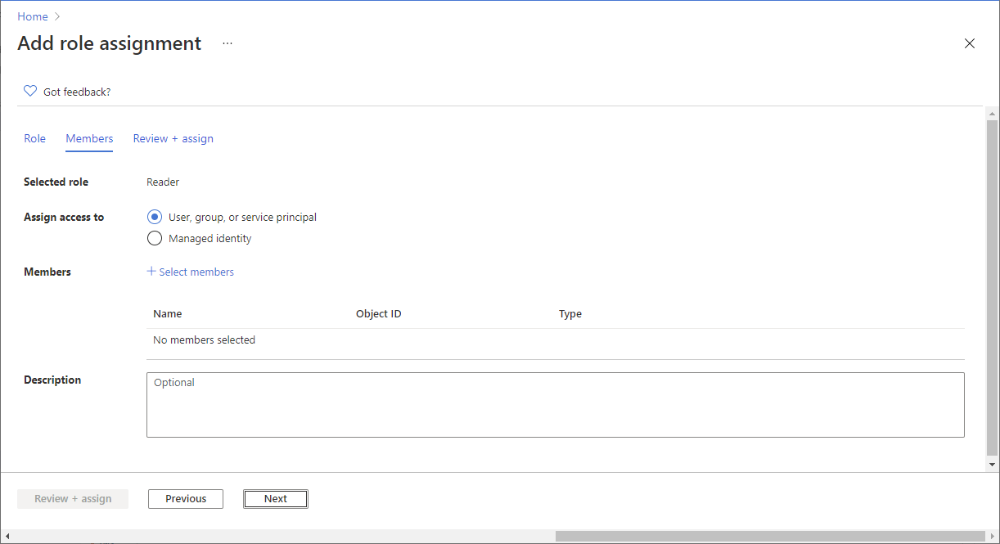
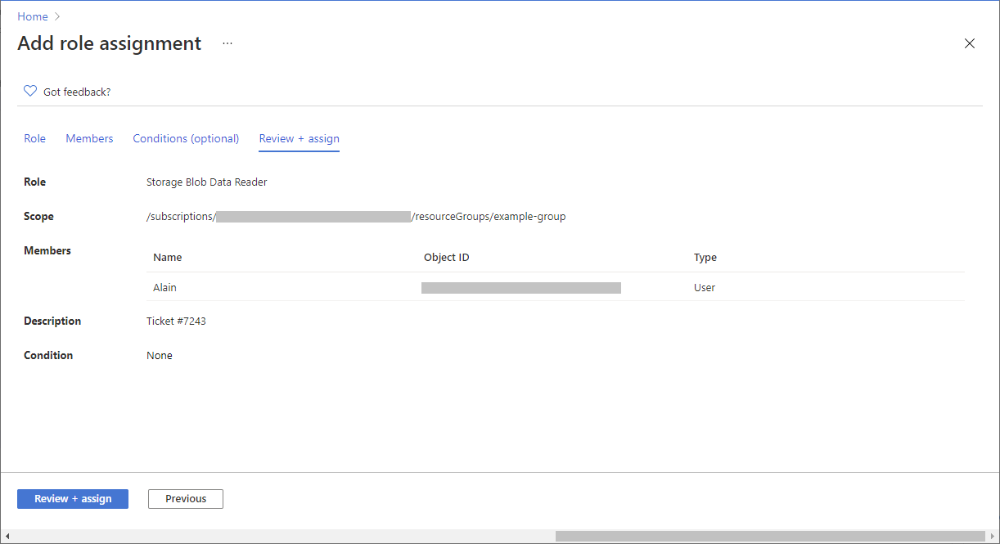
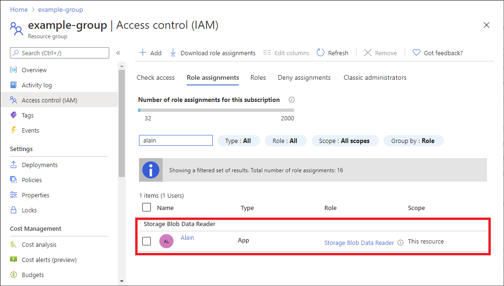

# Application Registration and Role Assignment

## Prerequisites

- An Azure account that has an active subscription. [Create an account for free](https://azure.microsoft.com/free/).
- The Azure account must be at least a [Cloud Application Administrator](https://learn.microsoft.com/entra/identity/role-based-access-control/permissions-reference#cloud-application-administrator).
- Completion of the [Set up a tenant](https://learn.microsoft.com/entra/identity-platform/quickstart-create-new-tenant) quickstart.

## Register an application

Registering your application establishes a trust relationship between your app and the Microsoft identity platform. The trust is unidirectional. In other words, your app trusts the Microsoft identity platform, and not the other way around. Once created, the application object cannot be moved between different tenants. 

Follow these steps to create the app registration:

1. Sign in to the [Microsoft Entra admin center](https://entra.microsoft.com) as at least a [Cloud Application Administrator](https://learn.microsoft.com/entra/identity/role-based-access-control/permissions-reference#cloud-application-administrator). 
1. If you have access to multiple tenants, use the **Settings**  in the top menu to switch to the tenant in which you want to register the application from the **Directories + subscriptions** menu.
1. Browse to **Identity** > **Applications** > **App registrations** and select **New registration**.
1. Enter a display **Name** for your application. Users of your application might see the display name when they use the app. For example, during sign-in.
   You can change the display name at any time and multiple app registrations can share the same name. The app registration's automatically generated Application (client) ID, not its display name, uniquely identifies your app within the identity platform.
1. Specify who can use the application, sometimes called its *sign-in audience*.

   | Supported account types | Description   |
   | ----------------------- | ------------- |
   | **Accounts in this organizational directory only** | Select this option if you're building an application for use only by users (or guests) in *your* tenant.  Often called a *line-of-business* (LOB) application, this app is a *single-tenant* application in the Microsoft identity platform. |
   | **Accounts in any organizational directory** | Select this option if you want users in *any* Microsoft Entra tenant to be able to use your application. This option is appropriate if, for example, you're building a software-as-a-service (SaaS) application that you intend to provide to multiple organizations.  This type of app is known as a *multitenant* application in the Microsoft identity platform. |
   | **Accounts in any organizational directory and personal Microsoft accounts** | Select this option to target the widest set of customers.  By selecting this option, you're registering a *multitenant* application that can also support users who have personal *Microsoft accounts*. Personal Microsoft accounts include Skype, Xbox, Live, and Hotmail accounts. |
   | **Personal Microsoft accounts** | Select this option if you're building an application only for users who have personal Microsoft accounts. Personal Microsoft accounts include Skype, Xbox, Live, and Hotmail accounts. |

1. Leave **Redirect URI (optional)** alone for now as you configure a redirect URI in the next section.
1. Select **Register** to complete the initial app registration.

When registration finishes, the Microsoft Entra admin center displays the app registration's **Overview** pane. You see the **Application (client) ID**. Also called the *client ID*, this value uniquely identifies your application in the Microsoft identity platform.

> New app registrations are hidden to users by default. When you're ready for users to see the app on their [My Apps page](https://support.microsoft.com/account-billing/sign-in-and-start-apps-from-the-my-apps-portal-2f3b1bae-0e5a-4a86-a33e-876fbd2a4510), you can enable it. To enable the app, in the Microsoft Entra admin center navigate to **Identity** > **Applications** > **Enterprise applications** and select the app. Then on the **Properties** page, toggle **Visible to users?** to **Yes**.

Your application's code, or more typically an authentication library used in your application, also uses the client ID. The ID is used as part of validating the security tokens it receives from the identity platform.

# Assign Azure roles using the Azure portal

## Step 1: Identify the needed scope

When you assign roles, you must specify a scope. Scope is the set of resources the access applies to. In Azure, you can specify a scope at four levels, from broad to narrow:
- [management group](https://learn.microsoft.com/azure/governance/management-groups/overview)
- subscription
- [resource group](https://learn.microsoft.com/azure/azure-resource-manager/management/overview#resource-groups)
- resource

- Sign in to the [Azure portal](https://portal.azure.com).

- In the Search box at the top, search for the scope you want to grant access to. For example, search for **Management groups**, **Subscriptions**, **Resource groups**, or a specific resource.

- Select the specific resource for that scope.

The following shows an example resource group.

## Step 2: Open the Add role assignment page

**Access control (IAM)** is the page that you typically use to assign roles to grant access to Azure resources. It's also known as identity and access management (IAM) and appears in several locations in the Azure portal.

- Select **Access control (IAM)**.

The following shows an example of the Access control (IAM) page for a resource group.

- Select the **Role assignments** tab to view the role assignments at this scope.

- Select **Add** > **Add role assignment**.

If you don't have permissions to assign roles, the Add role assignment option will be disabled.

The Add role assignment page opens.

## Step 3: Select the appropriate role

To select a role, follow these steps: 

- On the **Role** tab, select a role that you want to use.

You can search for a role by name or by description. You can also filter roles by type and category.

- Select **Next**.

## Step 4: Select who needs access

To select who needs access, follow these steps:  

- On the **Members** tab, select **service principal** to assign the selected role to one or more service principals (applications).

- Click **Select members**.

- Find and select the service principals.

- Click **Select** to add the service principals to the Members list.

- In the **Description** box enter an optional description for this role assignment.

Later, you can show this description in the role assignments list.

- Click **Next**.

## Step 5: Assign role

Follow these steps:   

- On the **Review + assign** tab, review the role assignment settings.

- Click **Review + assign** to assign the role.

After a few moments, the security principal is assigned the role at the selected scope.

- If you don't see the description for the role assignment, click **Edit columns** to add the **Description** column.

# Conclusion

Congratulations! You have successfully registered your application and assigned Azure roles. These steps ensure your application can securely interact with Azure resources, and users have the appropriate access levels to perform their tasks.

For further information on managing applications and roles, explore the following resources:

- [Microsoft Entra documentation](https://learn.microsoft.com/entra/identity/)
- [Azure Role-Based Access Control (RBAC) documentation](https://learn.microsoft.com/azure/role-based-access-control/)

Remember to periodically review and update your application registrations and role assignments to align with your organization’s security policies and evolving requirements.
