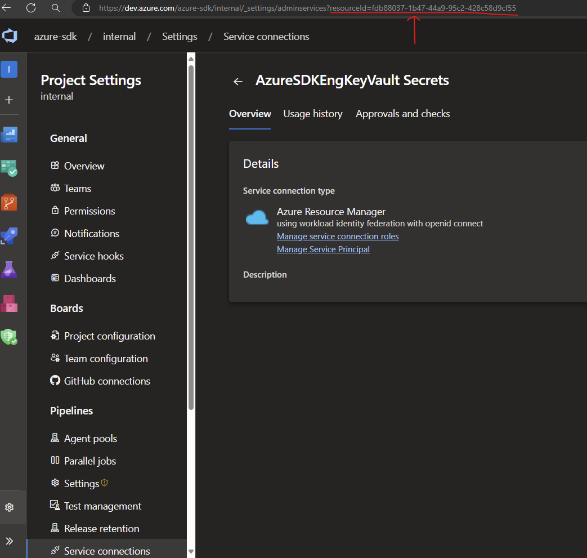
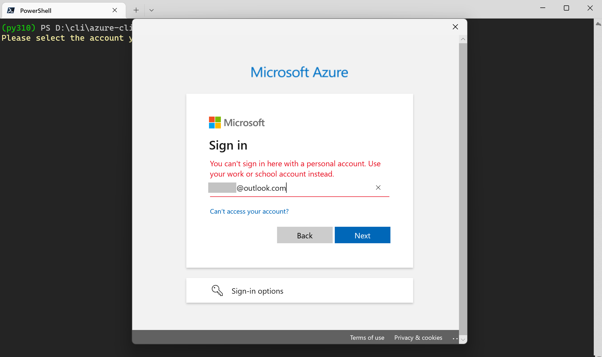
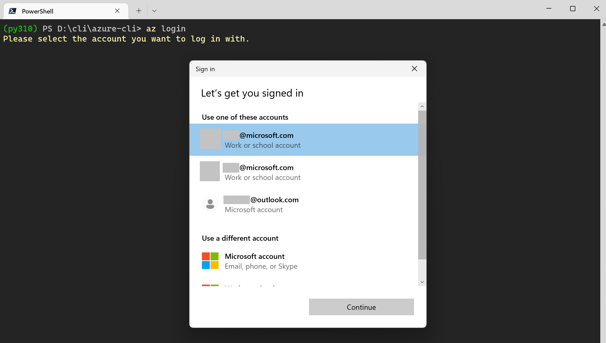
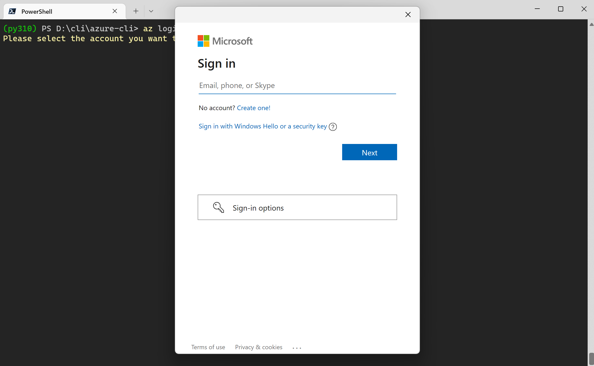

# Troubleshoot Azure Identity authentication issues

This troubleshooting guide covers failure investigation techniques, common errors for the credential types in the Azure Identity Python client library, and mitigation steps to resolve these errors.

## Table of contents

- [Handle Azure Identity errors](#handle-azure-identity-errors)
  - [ClientAuthenticationError](#clientauthenticationerror)
  - [CredentialUnavailableError](#credentialunavailableerror)
  - [Permission issues](#permission-issues)
- [Find relevant information in error messages](#find-relevant-information-in-error-messages)
- [Logging](#logging)
- [Troubleshoot DefaultAzureCredential authentication issues](#troubleshoot-defaultazurecredential-authentication-issues)
- [Troubleshoot EnvironmentCredential authentication issues](#troubleshoot-environmentcredential-authentication-issues)
- [Troubleshoot ClientAssertionCredential authentication issues](#troubleshoot-clientassertioncredential-authentication-issues)
- [Troubleshoot ClientSecretCredential authentication issues](#troubleshoot-clientsecretcredential-authentication-issues)
- [Troubleshoot CertificateCredential authentication issues](#troubleshoot-certificatecredential-authentication-issues)
- [Troubleshoot ManagedIdentityCredential authentication issues](#troubleshoot-managedidentitycredential-authentication-issues)
  - [Azure Virtual Machine managed identity](#azure-virtual-machine-managed-identity)
  - [Azure App Service and Azure Functions managed identity](#azure-app-service-and-azure-functions-managed-identity)
  - [Azure Kubernetes Service managed identity](#azure-kubernetes-service-managed-identity)
- [Troubleshoot AzureCliCredential authentication issues](#troubleshoot-azureclicredential-authentication-issues)
- [Troubleshoot AzureDeveloperCliCredential authentication issues](#troubleshoot-azuredeveloperclicredential-authentication-issues)
- [Troubleshoot AzurePowerShellCredential authentication issues](#troubleshoot-azurepowershellcredential-authentication-issues)
- [Troubleshoot WorkloadIdentityCredential authentication issues](#troubleshoot-workloadidentitycredential-authentication-issues)
- [Troubleshoot AzurePipelinesCredential authentication issues](#troubleshoot-azurepipelinescredential-authentication-issues)
- [Troubleshoot multi-tenant authentication issues](#troubleshoot-multi-tenant-authentication-issues)
- [Troubleshoot Web Account Manager (WAM) brokered authentication issues](#troubleshoot-web-account-manager-wam-brokered-authentication-issues)
- [Get additional help](#get-additional-help)

## Handle Azure Identity errors

### ClientAuthenticationError

Errors arising from authentication can be raised on any service client method that makes a request to the service. This is because the token is requested from the credential on the first call to the service and on any subsequent requests to the service that need to refresh the token.

To distinguish these failures from failures in the service client, Azure Identity raises the `ClientAuthenticationError` with details describing the source of the error in the error message. Depending on the application, these errors may or may not be recoverable.

```python
from azure.core.exceptions import ClientAuthenticationError
from azure.identity import DefaultAzureCredential
from azure.keyvault.secrets import SecretClient

# Create a secret client using the DefaultAzureCredential
client = SecretClient("https://myvault.vault.azure.net/", DefaultAzureCredential())
try:
    secret = client.get_secret("secret1")
except ClientAuthenticationError as ex:
    print(ex.message)
```

### CredentialUnavailableError

The `CredentialUnavailableError` is a special error type derived from `ClientAuthenticationError`. This error type is used to indicate that the credential can't authenticate in the current environment, due to lack of required configuration or setup. This error is also used as a signal to chained credential types, such as `DefaultAzureCredential` and `ChainedTokenCredential`, that the chained credential should continue to try other credential types later in the chain.

### Permission issues

Calls to service clients resulting in `HttpResponseError` with a `StatusCode` of 401 or 403 often indicate the caller doesn't have sufficient permissions for the specified API. Check the service documentation to determine which RBAC roles are needed for the specific request, and ensure the authenticated user or service principal have been granted the appropriate roles on the resource.

## Find relevant information in error messages

`ClientAuthenticationError` is raised when unexpected errors occurred while a credential is authenticating. This can include errors received from requests to the Microsoft Entra STS and often contains information helpful to diagnosis. Consider the following `ClientAuthenticationError` message.


This error contains several pieces of information:

- __Failing Credential Type__: The type of credential that failed to authenticate. This can be helpful when diagnosing issues with chained credential types such as `DefaultAzureCredential` or `ChainedTokenCredential`.
- __STS Error Code and Message__: The error code and message returned from the Microsoft Entra STS. This can give insight into the specific reason the request failed. For instance in this specific case because the provided client secret is incorrect. More information on STS error codes can be found [here](https://learn.microsoft.com/entra/identity-platform/reference-error-codes#aadsts-error-codes).

## Logging

This library uses the standard
[logging](https://docs.python.org/3/library/logging.html) library for logging.

Basic information about HTTP sessions (URLs, headers, etc.) is logged at `INFO` level.

Detailed `DEBUG` level logging, including request/response bodies and __unredacted__
headers, can be enabled on the client or per-operation with the `logging_enable` keyword argument.

See full SDK logging documentation with examples [here][sdk_logging_docs].

## Troubleshoot `DefaultAzureCredential` authentication issues

| Error |Description| Mitigation |
|---|---|---|
|`CredentialUnavailableError` raised with message. "DefaultAzureCredential failed to retrieve a token from the included credentials."|All credentials in the `DefaultAzureCredential` chain failed to retrieve a token, each raising a `CredentialUnavailableError` themselves|<ul><li>[Enable logging](#logging) to verify the credentials being tried, and get further diagnostic information.</li><li>Consult the troubleshooting guide for underlying credential types for more information.</li><ul><li>[EnvironmentCredential](#troubleshoot-environmentcredential-authentication-issues)</li><li>[ManagedIdentityCredential](#troubleshoot-managedidentitycredential-authentication-issues)</li><li>[AzureCLICredential](#troubleshoot-azureclicredential-authentication-issues)</li><li>[AzurePowershellCredential](#troubleshoot-azurepowershellcredential-authentication-issues)</li></ul>|
|`ClientAuthenticationError` raised from the client with a status code of 401 or 403|Authentication succeeded but the authorizing Azure service responded with a 401 (Authenticate), or 403 (Forbidden) status code. This can often be caused by the `DefaultAzureCredential` authenticating an account other than the intended one.|<ul><li>[Enable logging](#logging) to determine which credential in the chain returned the authenticating token.</li><li>In the case a credential other than the expected is returning a token, bypass this by either signing out of the corresponding development tool, or excluding the credential with an `exclude_xxx_credential` keyword argument when creating `DefaultAzureCredential`.</li><li>Consult the [troubleshooting guide](#troubleshoot-multi-tenant-authentication-issues) for multi-tenant authentication issues if an error is encountered stating the current credential is not configured to acquire tokens for a tenant.</li></ul>|

## Troubleshoot `EnvironmentCredential` authentication issues

`CredentialUnavailableError`

| Error Message |Description| Mitigation |
|---|---|---|
|Environment variables aren't fully configured.|A valid combination of environment variables wasn't set.|Ensure the appropriate environment variables are set **prior to application startup** for the intended authentication method.<p/>  <ul><li>To authenticate a service principal using a client secret, ensure the variables `AZURE_CLIENT_ID`, `AZURE_TENANT_ID` and `AZURE_CLIENT_SECRET` are properly set.</li><li>To authenticate a service principal using a certificate, ensure the variables `AZURE_CLIENT_ID`, `AZURE_TENANT_ID`, `AZURE_CLIENT_CERTIFICATE_PATH`, and optionally `AZURE_CLIENT_CERTIFICATE_PASSWORD` are properly set.</li><ul>|

## Troubleshoot `ClientSecretCredential` authentication issues

`ClientAuthenticationError`

| Error Code | Issue | Mitigation |
|---|---|---|
|AADSTS7000215|An invalid client secret was provided.|Ensure the `client_secret` provided when constructing the credential is valid. If unsure, create a new client secret using the Azure portal. Details on creating a new client secret can be found [here](https://learn.microsoft.com/entra/identity-platform/howto-create-service-principal-portal#option-2-create-a-new-application-secret).|
|AADSTS7000222|An expired client secret was provided.|Create a new client secret using the Azure portal. Details on creating a new client secret can be found [here](https://learn.microsoft.com/entra/identity-platform/howto-create-service-principal-portal#option-2-create-a-new-application-secret).|
|AADSTS700016|The specified application wasn't found in the specified tenant.|Ensure the specified `clientId` and `tenantId` are correct for your application registration. For multi-tenant apps, ensure the application has been added to the desired tenant by a tenant admin. To add a new application in the desired tenant, follow the instructions [here](https://learn.microsoft.com/entra/identity-platform/howto-create-service-principal-portal).|

## Troubleshoot `CertificateCredential` authentication issues

`ClientAuthenticationError`
| Error Code | Description | Mitigation |
|---|---|---|
|AADSTS700027|Client assertion contains an invalid signature.|Ensure the specified certificate has been uploaded to the Microsoft Entra application registration. Instructions for uploading certificates to the application registration can be found [here](https://learn.microsoft.com/entra/identity-platform/howto-create-service-principal-portal#option-1-upload-a-certificate).|
|AADSTS700016|The specified application wasn't found in the specified tenant.| Ensure the specified `client_id` and `tenant_id` are correct for your application registration. For multi-tenant apps, ensure the application has been added to the desired tenant by a tenant admin. To add a new application in the desired tenant, follow the instructions [here](https://learn.microsoft.com/entra/identity-platform/howto-create-service-principal-portal).

## Troubleshoot `ClientAssertionCredential` authentication issues

`ClientAuthenticationError`

| Error Code | Description | Mitigation |
|---|---|---|
|AADSTS700021| Client assertion application identifier doesn't match 'client_id' parameter. Review the documentation at https://learn.microsoft.com/entra/identity-platform/certificate-credentials. | Ensure the JWT assertion created has the correct values specified for the `sub` and `issuer` value of the payload, both of these should have the value be equal to `clientId`. Refer documentation for [client assertion format](https://learn.microsoft.com/entra/identity-platform/certificate-credentials).|
|AADSTS700023| Client assertion audience claim does not match Realm issuer. Review the documentation at https://learn.microsoft.com/entra/identity-platform/certificate-credentials. | Ensure the audience `aud` field in the JWT assertion created has the correct value for the audience specified in the payload. This should be set to `https://login.microsoftonline.com/{tenantId}/v2`.|
|AADSTS50027| JWT token is invalid or malformed. | Ensure the JWT assertion token is in the valid format. Refer to the documentation for [client assertion format](https://learn.microsoft.com/entra/identity-platform/certificate-credentials).|

## Troubleshoot `ManagedIdentityCredential` authentication issues

The `ManagedIdentityCredential` is designed to work on a variety of Azure hosts that provide managed identity. Configuring the managed identity and troubleshooting failures varies from hosts. The below table lists the Azure hosts that can be assigned a managed identity, and are supported by the `ManagedIdentityCredential`.

|Host Environment| | |
|---|---|---|
|Azure App Service and Azure Functions|[Configuration](https://learn.microsoft.com/azure/app-service/overview-managed-identity)|[Troubleshooting](#azure-app-service-and-azure-functions-managed-identity)|
|Azure Arc|[Configuration](https://learn.microsoft.com/azure/azure-arc/servers/managed-identity-authentication)||
|Azure Kubernetes Service|[Configuration](https://azure.github.io/aad-pod-identity/docs/)|[Troubleshooting](#azure-kubernetes-service-managed-identity)|
|Azure Service Fabric|[Configuration](https://learn.microsoft.com/azure/service-fabric/concepts-managed-identity)||
|Azure Virtual Machines and Scale Sets|[Configuration](https://learn.microsoft.com/entra/identity/managed-identities-azure-resources/qs-configure-portal-windows-vm)|[Troubleshooting](#azure-virtual-machine-managed-identity)|

### Azure Virtual Machine managed identity

`CredentialUnavailableError`

| Error Message |Description| Mitigation |
|---|---|---|
|The requested identity hasn't been assigned to this resource.|The IMDS endpoint responded with a status code of 400, indicating the requested identity isn't assigned to the VM.|If using a user assigned identity, ensure the specified `client_id` is correct.<p/><p/>If using a system assigned identity, make sure it has been enabled properly. Instructions to enable the system assigned identity on an Azure VM can be found [here](https://learn.microsoft.com/entra/identity/managed-identities-azure-resources/qs-configure-portal-windows-vm#enable-system-assigned-managed-identity-on-an-existing-vm).|
|The request failed due to a gateway error.|The request to the IMDS endpoint failed due to a gateway error, 502 or 504 status code.|Calls via proxy or gateway aren't supported by IMDS. Disable proxies or gateways running on the VM for calls to the IMDS endpoint `http://169.254.169.254/`|
|No response received from the managed identity endpoint.|No response was received for the request to IMDS or the request timed out.|<ul><li>Ensure managed identity has been properly configured on the VM. Instructions for configuring the manged identity can be found [here](https://learn.microsoft.com/entra/identity/managed-identities-azure-resources/qs-configure-portal-windows-vm).</li><li>Verify the IMDS endpoint is reachable on the VM, see [below](#verify-imds-is-available-on-the-vm) for instructions.</li></ul>|
|Multiple attempts failed to obtain a token from the managed identity endpoint.|Retries to retrieve a token from the IMDS endpoint have been exhausted.|<ul><li>Refer to inner exception messages for more details on specific failures. If the data has been truncated, more detail can be obtained by [collecting logs](#logging).</li><li>Ensure managed identity has been properly configured on the VM. Instructions for configuring the manged identity can be found [here](https://learn.microsoft.com/entra/identity/managed-identities-azure-resources/qs-configure-portal-windows-vm).</li><li>Verify the IMDS endpoint is reachable on the VM, see [below](#verify-imds-is-available-on-the-vm) for instructions.</li></ul>|

#### __Verify IMDS is available on the VM__

If you have access to the VM, you can verify the managed identity endpoint is available via the command line using curl.

```bash
curl 'http://169.254.169.254/metadata/identity/oauth2/token?resource=https://management.core.windows.net&api-version=2018-02-01' -H "Metadata: true"
```

> Note that output of this command will contain a valid access token, and SHOULD NOT BE SHARED to avoid compromising account security.

### Azure App Service and Azure Functions managed identity

`CredentialUnavailableError`
| Error Message |Description| Mitigation |
|---|---|---|
|ManagedIdentityCredential authentication unavailable.|The environment variables configured by the App Services host weren't present.|<ul><li>Ensure the managed identity has been properly configured on the App Service. Instructions for configuring the managed identity can be found [here](https://learn.microsoft.com/azure/app-service/overview-managed-identity?tabs=dotnet).</li><li>Verify the App Service environment is properly configured and the managed identity endpoint is available. See [below](#verify-the-app-service-managed-identity-endpoint-is-available) for instructions.</li></ul>|

#### __Verify the App Service managed identity endpoint is available__

If you have access to SSH into the App Service, you can verify managed identity is available in the environment. First ensure the environment variables `IDENTITY_ENDPOINT` and `IDENTITY_HEADER` have been set in the environment. Then you can verify the managed identity endpoint is available using curl.

```bash
curl 'http://169.254.169.254/metadata/identity/oauth2/token?resource=https://management.core.windows.net&api-version=2018-02-01' -H "Metadata: true"
```

> Note that the output of this command will contain a valid access token, and SHOULD NOT BE SHARED to avoid compromising account security.

### Azure Kubernetes Service managed identity

#### Pod identity for Kubernetes

`CredentialUnavailableError`
| Error Message |Description| Mitigation |
|---|---|---|
|No managed identity endpoint found|The application attempted to authenticate before an identity was assigned to its pod|Verify the pod is labeled correctly. This also occurs when a correctly labeled pod authenticates before the identity is ready. To prevent initialization races, configure NMI to set the Retry-After header in its responses (see [Pod Identity documentation](https://azure.github.io/aad-pod-identity/docs/configure/feature_flags/#set-retry-after-header-in-nmi-response)).

## Troubleshoot `AzureCliCredential` authentication issues

`CredentialUnavailableError`
| Error Message |Description| Mitigation |
|---|---|---|
|Azure CLI not installed|The Azure CLI isn't installed or couldn't be found.|<ul><li>Ensure the Azure CLI is properly installed. Installation instructions can be found [here](https://learn.microsoft.com/cli/azure/install-azure-cli).</li><li>Validate the installation location has been added to the `PATH` environment variable.</li></ul>|
|Please run 'az login' to set up account|No account is currently logged into the Azure CLI, or the login has expired.|<ul><li>Log into the Azure CLI using the `az login` command. More information on authentication in the Azure CLI can be found [here](https://learn.microsoft.com/cli/azure/authenticate-azure-cli).</li><li>Validate that the Azure CLI can obtain tokens. See [below](#verify-the-azure-cli-can-obtain-tokens) for instructions.</li></ul>|
|Subscription "[your subscription]" contains invalid characters. If this is the name of a subscription, use its ID instead|The subscription name contains a character that may not be safe in a command line.|Use the subscription's ID instead of its name. You can get this from the Azure CLI: `az account show --name "[your subscription]" --query "id"`|

#### __Verify the Azure CLI can obtain tokens__

You can manually verify that the Azure CLI is properly authenticated, and can obtain tokens. First use the `account` command to verify the account which is currently logged in to the Azure CLI.

```bash
az account show
```

Once you've verified the Azure CLI is using correct account, you can validate that it's able to obtain tokens for this account.

```bash
az account get-access-token --output json --resource https://management.core.windows.net
```

>Note that output of this command will contain a valid access token, and SHOULD NOT BE SHARED to avoid compromising account security.

## Troubleshoot `AzureDeveloperCliCredential` authentication issues

`CredentialUnavailableError`

| Error Message |Description| Mitigation |
|---|---|---|
|Azure Developer CLI could not be found|The Azure Developer CLI isn't installed or couldn't be found.|<ul><li>Ensure the Azure Developer CLI is properly installed. Installation instructions can be found [here](https://learn.microsoft.com/azure/developer/azure-developer-cli/install-azd).</li><li>Validate the installation location has been added to the `PATH` environment variable.</li></ul>|
|Please run 'azd auth login' to set up account|No account is currently logged into the Azure Developer CLI, or the login has expired.|<ul><li>Log into the Azure Developer CLI using the `azd auth login` command.</li><li>Validate that the Azure Developer CLI can obtain tokens. See [below](#verify-the-azure-developer-cli-can-obtain-tokens) for instructions.</li></ul>|

#### __Verify the Azure Developer CLI can obtain tokens__

You can manually verify that the Azure Developer CLI is properly authenticated, and can obtain tokens. First use the `config` command to verify the account which is currently logged in to the Azure Developer CLI.

```bash
azd config list
```

Once you've verified the Azure Developer CLI is using correct account, you can validate that it's able to obtain tokens for this account.

```bash
azd auth token --output json --scope https://management.core.windows.net/.default
```
>Note that output of this command will contain a valid access token, and SHOULD NOT BE SHARED to avoid compromising account security.

## Troubleshoot `AzurePowerShellCredential` authentication issues

`CredentialUnavailableError`
| Error Message |Description| Mitigation |
|---|---|---|
|PowerShell isn't installed.|No local installation of PowerShell was found.|Ensure that PowerShell is properly installed on the machine. Instructions for installing PowerShell can be found [here](https://learn.microsoft.com/powershell/scripting/install/installing-powershell).|
|Az.Account module >= 2.2.0 isn't installed.|The Az.Account module needed for authentication in Azure PowerShell isn't installed.|Install the latest Az.Account module. Installation instructions can be found [here](https://learn.microsoft.com/powershell/azure/install-az-ps).|
|Please run 'Connect-AzAccount' to set up account.|No account is currently logged into Azure PowerShell.|<ul><li>Login to Azure PowerShell using the `Connect-AzAccount` command. More instructions for authenticating Azure PowerShell can be found [here](https://learn.microsoft.com/powershell/azure/authenticate-azureps)</li><li>Validate that Azure PowerShell can obtain tokens. See [below](#verify-azure-powershell-can-obtain-tokens) for instructions.</li></ul>|

#### __Verify Azure PowerShell can obtain tokens__

You can manually verify that Azure PowerShell is properly authenticated, and can obtain tokens. First use the `Get-AzContext` command to verify the account which is currently logged in to the Azure CLI.

```bash
PS C:\> Get-AzContext

Name                                     Account             SubscriptionName    Environment         TenantId
----                                     -------             ----------------    -----------         --------
Subscription1 (xxxxxxxx-xxxx-xxxx-xxx... test@outlook.com    Subscription1       AzureCloud          xxxxxxxx-x...
```

Once you've verified Azure PowerShell is using the correct account, you can validate that it's able to obtain tokens for this account.

```bash
Get-AzAccessToken -ResourceUrl "https://management.core.windows.net"
```

>Note that output of this command will contain a valid access token, and SHOULD NOT BE SHARED to avoid compromising account security.

## Troubleshoot `WorkloadIdentityCredential` authentication issues

`CredentialUnavailableError`

| Error Message |Description| Mitigation |
|---|---|---|
|WorkloadIdentityCredential authentication unavailable. The workload options are not fully configured|The `WorkloadIdentityCredential` requires `client_id`, `tenant_id` and `token_file_path` to authenticate with Microsoft Entra ID.| <ul><li>If using `DefaultAzureCredential` then:</li><ul><li>Ensure client ID is specified via the `workload_identity_client_id` keyword argument or the `AZURE_CLIENT_ID` env variable.</li><li>Ensure tenant ID is specified via the `AZURE_TENANT_ID` env variable.</li><li>Ensure token file path is specified via `AZURE_FEDERATED_TOKEN_FILE` env variable.</li><li>Ensure authority host is specified via `AZURE_AUTHORITY_HOST` env variable.</ul><li>If using `WorkloadIdentityCredential` then:</li><ul><li>Ensure tenant ID is specified via the `tenant_id` keyword argument or the `AZURE_TENANT_ID` env variable.</li><li>Ensure client ID is specified via the `client_id` keyword argument or the `AZURE_CLIENT_ID` env variable.</li><li>Ensure token file path is specified via the `token_file_path` keyword argument or the `AZURE_FEDERATED_TOKEN_FILE` environment variable. </li></ul></li><li>Consult the [product troubleshooting guide](https://azure.github.io/azure-workload-identity/docs/troubleshooting.html) for other issues.</li></ul>

## Troubleshoot `AzurePipelinesCredential` authentication issues

[comment]: # ( cspell:ignore oidcrequesturi )

| Error Message | Description | Mitigation |
| --- | --- | --- |
| AADSTS900023: Specified tenant identifier `<some tenant ID>` is neither a valid DNS name, nor a valid external domain. | The Microsoft Entra tenant ID passed to the credential is invalid.  | Verify the tenant ID is valid. If the service connection federated identity credential (FIC) was configured via a user-assigned managed identity, the tenant is the one in which managed identity was registered. If the service connection FIC is configured via an app registration, the tenant should be the one in which the app registration is registered.                                                                            |
| No service connection found with identifier `<GUID>`. | The service connection ID provided is incorrect. | Verify the `service_connection_id` provided. For details on finding this value, check the [Find a service connection ID](#find-a-service-connection-id) section. |
| ClientAuthenticationError: 401 (Unauthorized) response from OIDC endpoint. | The system access token seems to be malformed/invalid when passing in as a parameter to the credential. | `System.AccessToken` is a required system variable in the Azure Pipelines task and should be provided in the pipeline task, [as mentioned in the docs](https://learn.microsoft.com/azure/devops/pipelines/build/variables?view=azure-devops&tabs=yaml#systemaccesstoken). Verify that the system access token value provided is the predefined variable in Azure Pipelines and isn't malformed. |
| ClientAuthenticationError: OIDC token not found in response. Response = {"$id":"1", "innerException":null, "message":"`<ACTUAL ERROR MESSAGE>`", "typeName":"Microsoft.VisualStudio.Services.WebApi.VssInvalidPreviewVersionException, Microsoft.VisualStudio.Services.WebApi", "typeKey":"VssInvalidPreviewVersionException", "errorCode":0} | When the OIDC token request fails, the OIDC token API throws an error. More details about the specific error are specified in the "message" field of the response. | Mitigation usually depends on the scenario based on what [error message](https://learn.microsoft.com/azure/devops/pipelines/release/troubleshoot-workload-identity?view=azure-devops#error-messages) is being thrown. Make sure you use the [recommended Azure Pipelines task](https://learn.microsoft.com/azure/devops/pipelines/release/troubleshoot-workload-identity?view=azure-devops#review-pipeline-tasks). |
| CredentialUnavailableError: Missing value for the `SYSTEM_OIDCREQUESTURI` environment variable. | This code isn't running inside of an Azure Pipelines environment. You might be running this code locally or on some other environment. | This credential is only designed to run inside the Azure Pipelines environment for the federated identity to work. |
| AuthenticationRequiredError: unauthorized_client: 700016 - AADSTS700016: Application with identifier `<client_id>` was not found in the directory 'Microsoft'. This error can happen if the application has not been installed by the administrator of the tenant or consented to by any user in the tenant. You may have sent your authentication request to the wrong tenant.| The `client_id` provided is invalid. | Verify the client ID argument is valid. If the service connection's federated identity was registered via a user-assigned managed identity, the client ID of the managed identity should be provided. If the service connection's federated identity is registered via an app registration, the application (client) ID from your app registration should be provided. |

### Find a service connection ID

A service connection ID is a GUID representing an Azure Pipelines service connection. This ID corresponds to the `resourceId` query string parameter of the service connection's configuration page in Azure Pipelines. More information about service connections can be found [here](https://learn.microsoft.com/azure/devops/pipelines/library/service-endpoints?view=azure-devops&tabs=yaml).



## Troubleshoot multi-tenant authentication issues

`ClientAuthenticationError`

| Error Message |Description| Mitigation |
|---|---|---|
|The current credential is not configured to acquire tokens for tenant <tenant ID>|<p>The application must configure the credential to allow token acquisition from the requested tenant.|Make one of the following changes in your app:<ul><li>Add the requested tenant ID to `additionally_allowed_tenants` on the credential options.</li><li>Add `*` to `additionally_allowed_tenants` to allow token acquisition for any tenant.</li></ul></p><p>This exception was added as part of a breaking change to multi-tenant authentication in version 1.11.0. Users experiencing this error after upgrading can find details on the change and migration in [BREAKING_CHANGES.md](https://github.com/Azure/azure-sdk-for-python/blob/main/sdk/identity/azure-identity/BREAKING_CHANGES.md#1110).</p> |

## Troubleshoot Web Account Manager (WAM) brokered authentication issues

| Error Message |Description| Mitigation |
|---|---|---|
|AADSTS50011|The application is missing the expected redirect URI.|Ensure that one of redirect URIs registered for the Microsoft Entra application matches the following URI pattern: `ms-appx-web://Microsoft.AAD.BrokerPlugin/{client_id}`|

### Unable to log in with Microsoft account (MSA) on Windows

When using `InteractiveBrowserBrokerCredential` via the `azure-identity-broker` package on Windows, only Microsoft Entra accounts are listed by default:


If you choose "Use another account", and type in an MSA outlook.com account, it fails:



When constructing the credential, you can set the `enable_msa_passthrough` keyword argument to `True`, and MSA outlook.com accounts that are logged in to Windows are automatically listed:



You may also log in another MSA account by selecting "Microsoft account":



## Get additional help

Additional information on ways to reach out for support can be found in the [SUPPORT.md](https://github.com/Azure/azure-sdk-for-python/blob/main/SUPPORT.md) at the root of the repo.

<!-- LINKS -->
[sdk_logging_docs]: https://learn.microsoft.com/azure/developer/python/sdk/azure-sdk-logging
