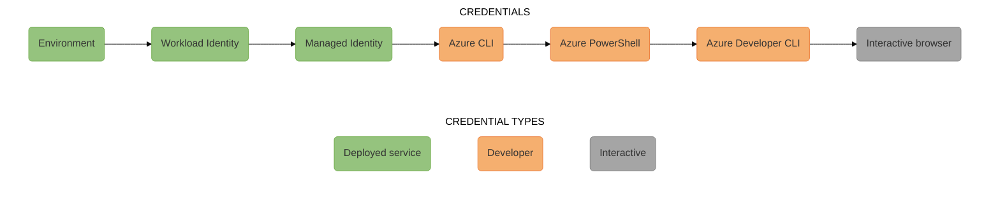

```mermaid
%% STEPS TO GENERATE IMAGE
%% =======================
%% 1. Install mermaid CLI v10.9.1 (see https://github.com/mermaid-js/mermaid-cli/blob/master/README.md):
%%    npm i -g @mermaid-js/mermaid-cli@10.9.1
%% 2. Run command: mmdc -i DefaultAzureCredentialAuthFlow.md -o DefaultAzureCredentialAuthFlow.svg

%%{
  init: {
    'theme': 'base',
    'themeVariables': {
      'tertiaryBorderColor': '#fff',
      'tertiaryColor': '#fff'
    }
  }
}%%

flowchart LR;
    subgraph CREDENTIAL TYPES;
        direction LR;
        Deployed(Deployed service):::deployed ~~~ Developer(Developer):::developer ~~~ Interactive(Interactive):::interactive;
    end;

    subgraph CREDENTIALS;
        direction LR;
        A(Environment):::deployed --> B(Workload Identity):::deployed --> C(Managed Identity):::deployed --> D(Azure CLI):::developer --> E(Azure PowerShell):::developer --> F(Azure Developer CLI):::developer --> G(Interactive browser):::interactive;
    end;

    %% Define styles for credential type boxes
    classDef deployed fill:#95C37E, stroke:#71AD4C;
    classDef developer fill:#F5AF6F, stroke:#EB7C39;
    classDef interactive fill:#A5A5A5, stroke:#828282;

    %% Add API ref links to credential type boxes
    click A "https://aka.ms/azsdk/python/identity/environmentcredential" _blank;
    click B "https://aka.ms/azsdk/python/identity/workloadidentitycredential" _blank;
    click C "https://aka.ms/azsdk/python/identity/managedidentitycredential" _blank;
    click D "https://aka.ms/azsdk/python/identity/azclicredential" _blank;
    click E "https://aka.ms/azsdk/python/identity/powershellcredential" _blank;
    click F "https://aka.ms/azsdk/python/identity/azuredeveloperclicredential" _blank;
    click G "https://aka.ms/azsdk/python/identity/interactivebrowsercredential" _blank;
```
