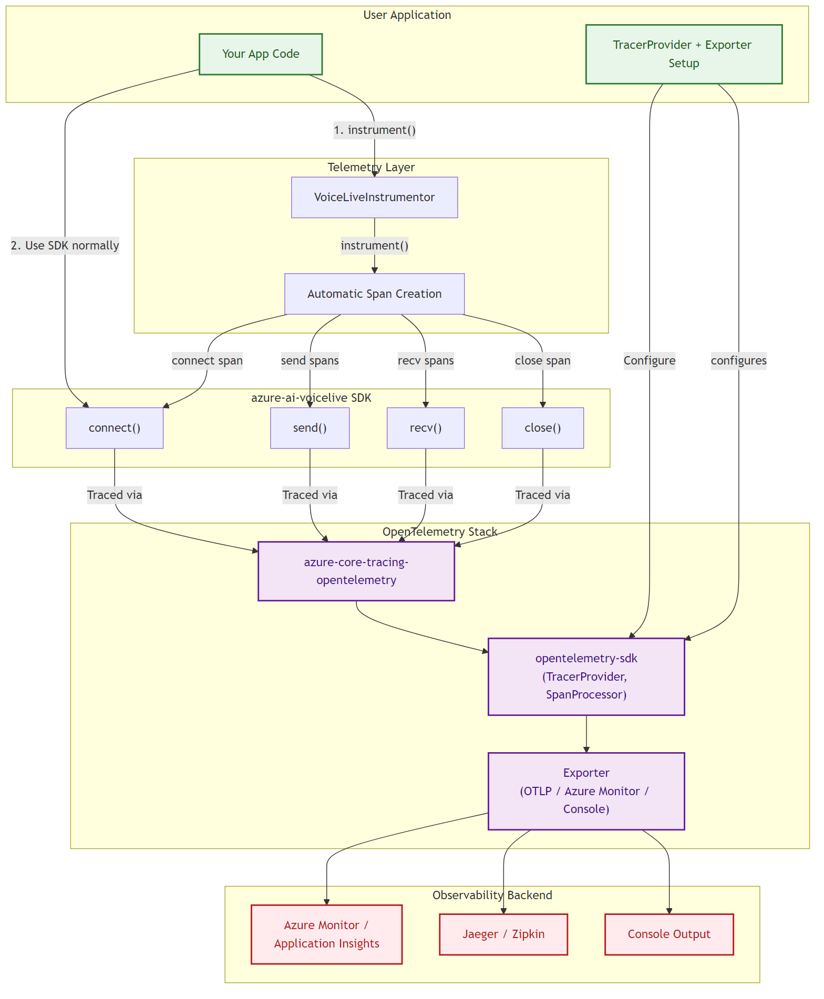

# Azure AI VoiceLive Telemetry

This module provides opt-in [OpenTelemetry](https://opentelemetry.io/)-based tracing for the Azure AI VoiceLive SDK, following [GenAI Semantic Conventions v1.34.0](https://opentelemetry.io/docs/specs/semconv/gen-ai/).

## Architecture



**Key layers:**

- **User Application** — sets up `TracerProvider` and exporter, calls `VoiceLiveInstrumentor().instrument()`.
- **azure-ai-voicelive SDK** — the VoiceLive client that manages WebSocket connections and message exchange.
- **Telemetry Layer** — `VoiceLiveInstrumentor` automatically instruments SDK operations to emit OpenTelemetry spans.
- **OpenTelemetry Stack** — `azure-core-tracing-opentelemetry` bridges to `opentelemetry-sdk` → Exporter → backend (Azure Monitor, Jaeger, console, etc.).

## Quick Start

### 1. Install dependencies

```bash
# Console tracing
pip install azure-ai-voicelive opentelemetry-sdk azure-core-tracing-opentelemetry

# Azure Monitor tracing
pip install azure-ai-voicelive azure-monitor-opentelemetry
```

### 2. Configure & enable tracing

```python
import os
from azure.core.settings import settings

# Tell azure-core to use OpenTelemetry
settings.tracing_implementation = "opentelemetry"

# Set up a tracer provider (console example)
from opentelemetry import trace
from opentelemetry.sdk.trace import TracerProvider
from opentelemetry.sdk.trace.export import SimpleSpanProcessor, ConsoleSpanExporter

provider = TracerProvider()
provider.add_span_processor(SimpleSpanProcessor(ConsoleSpanExporter()))
trace.set_tracer_provider(provider)

# Gate: required environment variable
os.environ["AZURE_EXPERIMENTAL_ENABLE_GENAI_TRACING"] = "true"

# Enable VoiceLive instrumentation
from azure.ai.voicelive.telemetry import VoiceLiveInstrumentor

VoiceLiveInstrumentor().instrument()
```

### 3. Use the SDK as normal

```python
from azure.ai.voicelive.aio import connect

async with connect(endpoint=endpoint, credential=credential, model=model) as connection:
    await connection.session.update(session=session_config)   # → "send session.update" span
    await connection.conversation.item.create(item=message)   # → "send conversation.item.create" span
    await connection.response.create()                        # → "send response.create" span

    async for event in connection:                            # → "recv" spans per event
        ...
# ← connect span ends here
```

All spans are created automatically — no code changes needed in your application logic.

### 4. Disable tracing

```python
VoiceLiveInstrumentor().uninstrument()
```

## Environment Variables

| Variable | Required | Description |
|---|---|---|
| `AZURE_EXPERIMENTAL_ENABLE_GENAI_TRACING` | **Yes** | Must be `"true"` for `instrument()` to activate. Without it, `instrument()` is a no-op. |
| `OTEL_INSTRUMENTATION_GENAI_CAPTURE_MESSAGE_CONTENT` | No | Set to `"true"` to record full message payloads in span events (`gen_ai.event.content`). **May contain personal data.** Defaults to `false`. |
| `AZURE_TRACING_GEN_AI_CONTENT_RECORDING_ENABLED` | No | Legacy equivalent of the above. If both are set and differ, content recording is disabled. |

## Span Structure

The instrumentor creates the following span hierarchy for a VoiceLive session:

```
connect (parent span — open for the entire session lifetime)
├── send session.update
├── send conversation.item.create
├── send response.create
├── recv (session.created)
├── recv (response.audio.delta)   ← first-token latency recorded here
├── recv (response.audio.delta)
├── recv (response.done)          ← turn count incremented here
├── send response.cancel          ← interruption count incremented here
├── recv (error)                  ← error event recorded
└── close
```

## Span Attributes Reference

### Standard GenAI Semantic Convention Attributes

| Attribute | Type | Description |
|---|---|---|
| `az.namespace` | string | Always `"Microsoft.CognitiveServices"` |
| `gen_ai.system` | string | Always `"az.ai.voicelive"` |
| `gen_ai.operation.name` | string | The operation: `connect`, `send`, `recv`, `close` |
| `gen_ai.request.model` | string | The model name (e.g., `gpt-4o-realtime-preview`) |
| `gen_ai.usage.input_tokens` | int | Input token count (from `response.done` usage) |
| `gen_ai.usage.output_tokens` | int | Output token count (from `response.done` usage) |
| `server.address` | string | Server hostname |
| `server.port` | int | Server port |
| `error.type` | string | Fully-qualified exception class name on error |

### VoiceLive-Specific Attributes

| Attribute | Type | Scope | Description |
|---|---|---|---|
| `gen_ai.voice.session_id` | string | Connect span | Voice session ID, captured from `session.created`/`session.updated` events |
| `gen_ai.voice.event_type` | string | Send/Recv spans | The VoiceLive event type (e.g., `session.update`, `response.done`) |
| `gen_ai.voice.input_audio_format` | string | Connect span | Input audio format from session config (e.g., `pcm16`) |
| `gen_ai.voice.output_audio_format` | string | Connect span | Output audio format from session config |
| `gen_ai.voice.first_token_latency_ms` | float | Recv span + Connect span | Milliseconds from `response.create` to first audio/text delta |
| `gen_ai.voice.turn_count` | int | Connect span | Total completed response turns in the session |
| `gen_ai.voice.interruption_count` | int | Connect span | Number of `response.cancel` events sent |
| `gen_ai.voice.audio_bytes_sent` | int | Connect span | Total raw audio bytes sent (decoded from base64) |
| `gen_ai.voice.audio_bytes_received` | int | Connect span | Total raw audio bytes received (decoded from base64) |
| `gen_ai.voice.message_size` | int | Send/Recv spans | JSON payload byte length of each WebSocket message |

### Span Events

| Event Name | When | Key Attributes |
|---|---|---|
| `gen_ai.input.messages` | On every `send()` | `gen_ai.system`, `gen_ai.voice.event_type`, `gen_ai.event.content` (if content recording enabled) |
| `gen_ai.output.messages` | On every `recv()` | `gen_ai.system`, `gen_ai.voice.event_type`, `gen_ai.event.content` (if content recording enabled) |
| `gen_ai.voice.error` | On server `error` events | `error.code`, `error.message` |
| `gen_ai.voice.rate_limits.updated` | On `rate_limits.updated` events | `gen_ai.voice.rate_limits` (JSON array) |

## Content Recording

By default, message payloads are **not** captured in span events to protect user privacy. To enable:

```python
# Option 1: Environment variable
os.environ["OTEL_INSTRUMENTATION_GENAI_CAPTURE_MESSAGE_CONTENT"] = "true"
VoiceLiveInstrumentor().instrument()

# Option 2: Programmatic
VoiceLiveInstrumentor().instrument(enable_content_recording=True)
```

When enabled, the full JSON payload appears as `gen_ai.event.content` in `gen_ai.input.messages` and `gen_ai.output.messages` span events.

> **Warning:** Content recording may capture personal data (user speech transcripts, AI responses). Only enable in development or controlled environments.

## Exporter Options

### Console (development)

```python
from opentelemetry.sdk.trace.export import SimpleSpanProcessor, ConsoleSpanExporter

provider.add_span_processor(SimpleSpanProcessor(ConsoleSpanExporter()))
```

### Azure Monitor / Application Insights (production)

```python
from azure.monitor.opentelemetry import configure_azure_monitor

configure_azure_monitor(connection_string=os.environ["APPLICATIONINSIGHTS_CONNECTION_STRING"])
```

### OTLP (Jaeger, Aspire Dashboard, etc.)

```python
from opentelemetry.exporter.otlp.proto.grpc.trace_exporter import OTLPSpanExporter
from opentelemetry.sdk.trace.export import BatchSpanProcessor

provider.add_span_processor(BatchSpanProcessor(OTLPSpanExporter()))
```

## Samples

See the [samples/telemetry/](../../../../samples/telemetry/) directory:

| Sample | Description |
|---|---|
| `sample_voicelive_with_console_tracing.py` | Console exporter — spans print to stdout |
| `sample_voicelive_with_azure_monitor_tracing.py` | Azure Monitor exporter |
| `sample_voicelive_with_console_tracing_custom_attributes.py` | Custom `SpanProcessor` to inject app-specific attributes |
| `sample_voicelive_with_content_recording.py` | Content recording enabled |

## API Reference

### `VoiceLiveInstrumentor`

```python
from azure.ai.voicelive.telemetry import VoiceLiveInstrumentor

instrumentor = VoiceLiveInstrumentor()
instrumentor.instrument()                        # Enable tracing
instrumentor.is_instrumented()                   # → True
instrumentor.is_content_recording_enabled()      # → False
instrumentor.uninstrument()                      # Disable tracing
```

| Method | Description |
|---|---|
| `instrument(enable_content_recording=None)` | Enable tracing. Requires `AZURE_EXPERIMENTAL_ENABLE_GENAI_TRACING=true`. |
| `uninstrument()` | Disable tracing. |
| `is_instrumented()` | Returns `True` if tracing is active. |
| `is_content_recording_enabled()` | Returns `True` if message content recording is enabled. |

## How It Works

1. **Enable** — Call `VoiceLiveInstrumentor().instrument()` after setting the required environment variable. This hooks into SDK operations to emit spans automatically.
2. **Connect span** — A parent span is created when the VoiceLive session starts and remains open for the entire session lifetime. Session-level metrics (turn count, interruptions, audio bytes) are recorded on this span when the session ends.
3. **Send / Recv spans** — Each message sent or received creates a child span under the connect span, capturing the event type, message size, and (optionally) the full payload.
4. **First-token latency** — The time between sending `response.create` and receiving the first audio or text delta is measured and recorded automatically.
5. **Disable** — Call `uninstrument()` to stop tracing.

## Troubleshooting

| Problem | Cause | Fix |
|---|---|---|
| `instrument()` does nothing / no spans appear | `AZURE_EXPERIMENTAL_ENABLE_GENAI_TRACING` not set | `os.environ["AZURE_EXPERIMENTAL_ENABLE_GENAI_TRACING"] = "true"` |
| `ModuleNotFoundError` when creating `VoiceLiveInstrumentor()` | `opentelemetry` packages not installed | `pip install opentelemetry-sdk azure-core-tracing-opentelemetry` |
| Spans created but not exported anywhere | No `TracerProvider` / exporter configured | Set up a `TracerProvider` with an exporter (see [Quick Start](#2-configure--enable-tracing)) |
| `settings.tracing_implementation` not set | `azure-core` doesn't know to use OpenTelemetry | `settings.tracing_implementation = "opentelemetry"` |
| Content not appearing in span events | Content recording is off by default | Set `OTEL_INSTRUMENTATION_GENAI_CAPTURE_MESSAGE_CONTENT=true` or pass `enable_content_recording=True` |
