# Microsoft Foundry `azd` bicep starter kit (basic)

This Azure Developer CLI (azd) template provides a streamlined way to provision and deploy Microsoft Foundry resources for building and running AI agents. It includes infrastructure-as-code definitions and sample application code to help you quickly get started with Microsoft Foundry's agent capabilities, including model deployments, workspace configuration, and supporting services like storage and container hosting.

This template does **not** include agent code or application code. You will find samples in other repositories such as [foundry-samples](https://github.com/azure-ai-foundry/foundry-samples):
- [hosted agents samples (python)](https://github.com/azure-ai-foundry/foundry-samples/tree/main/samples/python/hosted-agents)
- [hosted agents samples (C#)](https://github.com/azure-ai-foundry/foundry-samples/tree/main/samples/csharp/hosted-agents)

[Features](#features) • [Getting Started](#getting-started) • [Guidance](#guidance)

This template, the application code and configuration it contains, has been built to showcase Microsoft Azure specific services and tools. We strongly advise our customers not to make this code part of their production environments without implementing or enabling additional security features.

With any AI solutions you create using these templates, you are responsible for assessing all associated risks, and for complying with all applicable laws and safety standards. Learn more in the transparency documents for [Agent Service](https://learn.microsoft.com/en-us/azure/ai-foundry/responsible-ai/agents/transparency-note) and [Agent Framework](https://github.com/microsoft/agent-framework/blob/main/TRANSPARENCY_FAQ.md).

## Features

This project framework provides the following features:

* **Microsoft Foundry Project**: Complete setup of Microsoft Foundry workspace with project configuration
* **Foundry Model Deployments**: Automatic deployment of AI models for agent capabilities
* **Azure Container Registry**: Container image storage and management for agent deployments
* **Managed Identity**: Built-in Azure Managed Identity for keyless authentication between services

### Architecture Diagram

This starter kit will provision the bare minimum for your hosted agent to work (if `ENABLE_HOSTED_AGENTS=true`).

| Resource | Description |
|----------|-------------|
| [Microsoft Foundry](https://learn.microsoft.com/azure/ai-foundry) | Provides a collaborative workspace for AI development with access to models, data, and compute resources |
| [Azure Container Registry](https://learn.microsoft.com/azure/container-registry/) | Stores and manages container images for secure deployment |
| [Application Insights](https://learn.microsoft.com/azure/azure-monitor/app/app-insights-overview) | *Optional* - Provides application performance monitoring, logging, and telemetry for debugging and optimization |
| [Log Analytics Workspace](https://learn.microsoft.com/azure/azure-monitor/logs/log-analytics-workspace-overview) | *Optional* - Collects and analyzes telemetry data for monitoring and troubleshooting |

Those resources will be used by the [`azd ai agent` extension](https://aka.ms/azdaiagent/docs) when building and deploying agents:

```mermaid
graph TB
    Dev[👤 Agent Developer]
    Dev -->|1. build agent<br/>container code| ACR
    Dev -->|2. deploy agent| AIFP
    Dev -->|4. query agent| AIFP

    subgraph "Azure Resource Group"
        subgraph "Azure AI Foundry Account"
            AIFP[Azure AI Foundry<br/>Project]
            Models[Model Deployments]
        end
        
        subgraph ACR[Azure Container Registry]
            ACC[Agent code container]
        end
    end
    
    %% Connections
    AIFP --> Models
    ACR -->|3. AcrPull| AIFP
    
    %% Styling
    classDef primary fill:#0078d4,stroke:#005a9e,stroke-width:2px,color:#fff
    classDef secondary fill:#00bcf2,stroke:#0099bc,stroke-width:2px,color:#fff
    
    class AIFP,Models primary
    class ACR secondary
```



The template is parametrized so that it can be configured with additional resources depending on the agent requirements:

* deploy AI models by setting `AI_PROJECT_DEPLOYMENTS` with a list of model deployment configs,
* provision additional resources (Azure AI Search, Bing Search) by setting `AI_PROJECT_DEPENDENT_RESOURCES`,
* enable monitoring by setting `ENABLE_MONITORING=true` (default on),
* provision connections by setting `AI_PROJECT_CONNECTIONS` with a list of connection configs.

## Getting Started

Note: this repository is not meant to be cloned, but to be consumed as a template in your own project:

```bash
azd init --template Azure-Samples/ai-foundry-starter-basic
```

### Prerequisites

* Install [azd](https://aka.ms/install-azd)
  * Windows: `winget install microsoft.azd`
  * Linux: `curl -fsSL https://aka.ms/install-azd.sh | bash`
  * MacOS: `brew tap azure/azd && brew install azd`

### Quickstart

1. Bring down the template code:

    ```shell
    azd init --template Azure-Samples/ai-foundry-starter-basic
    ```

    This will perform a git clone

2. Sign into your Azure account:

    ```shell
    azd auth login
    ```

3. Download a sample agent from GitHub:

    ```shell
    azd ai agent init -m <repo-path-to-agent.yaml>
    ```

You'll find agent samples in the [`foundry-samples` repo](https://github.com/azure-ai-foundry/foundry-samples/tree/main/samples/microsoft/python/getting-started-agents/hosted-agents).

## Guidance

### Region Availability

This template does not use specific models. The model deployments are a parameter of the template. Each model may not be available in all Azure regions. Check for [up-to-date region availability of Microsoft Foundry](https://learn.microsoft.com/en-us/azure/ai-foundry/reference/region-support) and in particular the [Agent Service](https://learn.microsoft.com/en-us/azure/ai-foundry/agents/concepts/model-region-support?tabs=global-standard).

## Resource Clean-up

To prevent incurring unnecessary charges, it's important to clean up your Azure resources after completing your work with the application.

- **When to Clean Up:**
  - After you have finished testing or demonstrating the application.
  - If the application is no longer needed or you have transitioned to a different project or environment.
  - When you have completed development and are ready to decommission the application.

- **Deleting Resources:**
  To delete all associated resources and shut down the application, execute the following command:
  
    ```bash
    azd down
    ```

    Please note that this process may take up to 20 minutes to complete.

⚠️ Alternatively, you can delete the resource group directly from the Azure Portal to clean up resources.

### Costs

Pricing varies per region and usage, so it isn't possible to predict exact costs for your usage.
The majority of the Azure resources used in this infrastructure are on usage-based pricing tiers.

You can try the [Azure pricing calculator](https://azure.microsoft.com/pricing/calculator) for the resources deployed in this template.

* **Microsoft Foundry**: Standard tier. [Pricing](https://azure.microsoft.com/pricing/details/ai-foundry/)
* **Azure AI Services**: S0 tier, defaults to gpt-4o-mini. Pricing is based on token count. [Pricing](https://azure.microsoft.com/pricing/details/cognitive-services/)
* **Azure Container Registry**: Basic SKU. Price is per day and on storage. [Pricing](https://azure.microsoft.com/en-us/pricing/details/container-registry/)
* **Azure Storage Account**: Standard tier, LRS. Pricing is based on storage and operations. [Pricing](https://azure.microsoft.com/pricing/details/storage/blobs/)
* **Log analytics**: Pay-as-you-go tier. Costs based on data ingested. [Pricing](https://azure.microsoft.com/pricing/details/monitor/)
* **Azure AI Search**: Basic tier, LRS. Price is per day and based on transactions. [Pricing](https://azure.microsoft.com/en-us/pricing/details/search/)
* **Grounding with Bing Search**: G1 tier. Costs based on transactions. [Pricing](https://www.microsoft.com/en-us/bing/apis/grounding-pricing)

⚠️ To avoid unnecessary costs, remember to take down your app if it's no longer in use, either by deleting the resource group in the Portal or running `azd down`.

### Security guidelines

This template also uses [Managed Identity](https://learn.microsoft.com/entra/identity/managed-identities-azure-resources/overview) for local development and deployment.

To ensure continued best practices in your own repository, we recommend that anyone creating solutions based on our templates ensure that the [Github secret scanning](https://docs.github.com/code-security/secret-scanning/about-secret-scanning) setting is enabled.

You may want to consider additional security measures, such as:

- Enabling Microsoft Defender for Cloud to [secure your Azure resources](https://learn.microsoft.com/azure/defender-for-cloud/).
- Protecting the Azure Container Apps instance with a [firewall](https://learn.microsoft.com/azure/container-apps/waf-app-gateway) and/or [Virtual Network](https://learn.microsoft.com/azure/container-apps/networking?tabs=workload-profiles-env%2Cazure-cli).

> **Important Security Notice** <br/>
This template, the application code and configuration it contains, has been built to showcase Microsoft Azure specific services and tools. We strongly advise our customers not to make this code part of their production environments without implementing or enabling additional security features.  <br/><br/>
For a more comprehensive list of best practices and security recommendations for Intelligent Applications, [visit our official documentation](https://learn.microsoft.com/en-us/azure/ai-foundry/).

## Additional Disclaimers

**Trademarks** This project may contain trademarks or logos for projects, products, or services. Authorized use of Microsoft trademarks or logos is subject to and must follow [Microsoft’s Trademark & Brand Guidelines](https://www.microsoft.com/en-us/legal/intellectualproperty/trademarks/usage/general). Use of Microsoft trademarks or logos in modified versions of this project must not cause confusion or imply Microsoft sponsorship. Any use of third-party trademarks or logos are subject to those third-party’s policies.

To the extent that the Software includes components or code used in or derived from Microsoft products or services, including without limitation Microsoft Azure Services (collectively, “Microsoft Products and Services”), you must also comply with the Product Terms applicable to such Microsoft Products and Services. You acknowledge and agree that the license governing the Software does not grant you a license or other right to use Microsoft Products and Services. Nothing in the license or this ReadMe file will serve to supersede, amend, terminate or modify any terms in the Product Terms for any Microsoft Products and Services.

You must also comply with all domestic and international export laws and regulations that apply to the Software, which include restrictions on destinations, end users, and end use. For further information on export restrictions, visit <https://aka.ms/exporting>.

You acknowledge that the Software and Microsoft Products and Services (1) are not designed, intended or made available as a medical device(s), and (2) are not designed or intended to be a substitute for professional medical advice, diagnosis, treatment, or judgment and should not be used to replace or as a substitute for professional medical advice, diagnosis, treatment, or judgment. Customer is solely responsible for displaying and/or obtaining appropriate consents, warnings, disclaimers, and acknowledgements to end users of Customer’s implementation of the Online Services.

You acknowledge the Software is not subject to SOC 1 and SOC 2 compliance audits. No Microsoft technology, nor any of its component technologies, including the Software, is intended or made available as a substitute for the professional advice, opinion, or judgement of a certified financial services professional. Do not use the Software to replace, substitute, or provide professional financial advice or judgment.  

BY ACCESSING OR USING THE SOFTWARE, YOU ACKNOWLEDGE THAT THE SOFTWARE IS NOT DESIGNED OR INTENDED TO SUPPORT ANY USE IN WHICH A SERVICE INTERRUPTION, DEFECT, ERROR, OR OTHER FAILURE OF THE SOFTWARE COULD RESULT IN THE DEATH OR SERIOUS BODILY INJURY OF ANY PERSON OR IN PHYSICAL OR ENVIRONMENTAL DAMAGE (COLLECTIVELY, “HIGH-RISK USE”), AND THAT YOU WILL ENSURE THAT, IN THE EVENT OF ANY INTERRUPTION, DEFECT, ERROR, OR OTHER FAILURE OF THE SOFTWARE, THE SAFETY OF PEOPLE, PROPERTY, AND THE ENVIRONMENT ARE NOT REDUCED BELOW A LEVEL THAT IS REASONABLY, APPROPRIATE, AND LEGAL, WHETHER IN GENERAL OR IN A SPECIFIC INDUSTRY. BY ACCESSING THE SOFTWARE, YOU FURTHER ACKNOWLEDGE THAT YOUR HIGH-RISK USE OF THE SOFTWARE IS AT YOUR OWN RISK.
